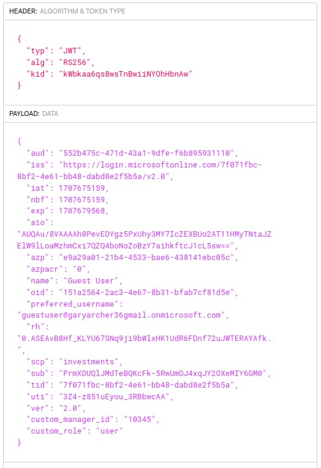

# Microsoft Entra ID OAuth Flow

Previously I explained the <a href='azure-active-directory-setup.mdx'>Microsoft Entra ID SPA and API Setup</a>. In this post I explain some differences I had to overcome to adapt this blog’s <a href='improved-spa-code-sample-overview.mdx'>Updated SPA and API</a> to Entra ID.

### 1. SPA and API

The SPA implements OpenID Connect and its lifecycle events. The API validate access tokens and uses claims-based authorization to protect its fictional data. The correct data is then rendered based on the logged in user:


### 2. OAuth Messages

If you trace <a href='basicspa-oauthworkflow.mdx'>OAuth HTTP Messages</a> for the SPA, you see that the SPA continues to use the standard authorization code flow with PKCE to initiate user logins:


The login response contains an authorization code:


Login completes when the SPA swaps the code for tokens:


The SPA uses the traditional JavaScript-only flow with <a href='user-sessions-and-token-renewal.mdx'>Iframe-Based Token Renewal</a>, so I would rather and I would rather not receive a refresh token in the token response.

### 3. ID Tokens Issued to the SPA

The <a href='id-tokens.mdx'>ID Tokens</a> blog post describes how I avoid issuing personal data to ID tokens. In Entra ID you can ensure this by omitting the *profile* scope from the client configuration. In the SPA configuration I included the *openid* scope so that the SPA receives an ID token that contains contains only protocol claims. The [oidc-client-ts](https://github.com/authts/oidc-client-ts) library implements ID token validation when it receives the token response.


### 4. Access Tokens Issued to the SPA

When I first integrated with Entra ID I ran into a problem where the access token failed validation in my API. When I viewed the JWT access token in an [online JWT viewer](https://jwt.io/), there was a *nonce* field in the JWT header:


After some research it turned out that this format of access token should only be received by Microsoft’s APIs. This access token type always fails standards-based validation for your own APIs. I needed to use the second type of access token below:

| Access Token Type | Description |
| ----------------- | ----------- |
| Microsoft APIs | These tokens contain a *nonce* field in the JWT header and are not designed for custom APIs to validate. |
| Custom APIs | Custom APIs need to receive an access token with their required scope(s) and an audience matching the registered API client. |

I therefore updated to the scope and permission settings from the previous blog post. The API then receives a normal JWT access token with the correct issuer and audience, and without a *nonce* in the JWT header. The API's JWT validation then succeeds:



The access token contains a couple of technical user identifiers. The *oid* claim is the permanent user account ID, which is the same across all Entra ID applications. The *sub* claim is issued as a unique identifier private to the client.

The access token contains the custom claims explained in the previous post to enable the API to implement authorization in a convenient way. I was unable to exclude personal data from the access token though, even if I removed all Graph permissions from the API's registered client.

### 5. SPA OpenID Connect Configuration Changes

Entra ID uses Microsoft Graph as the OpenID Connect userinfo endpoint. Yet Graph requires access tokens with a *nonce* in the JWT header, so the SPA’s access token cannot be sent to get userinfo in the standard way. In the SPA's *oidc-client-ts* configuration I set *loadUserInfo=false* and the SPA gets user info by routing the request via its API, as explained shortly.

```typescript
export class Authenticator {

    private readonly _userManager: UserManager;

    public constructor(configuration: OAuthConfiguration) {

        const settings = {

            authority: configuration.authority,
            client_id: configuration.clientId,
            redirect_uri: configuration.redirectUri,
            scope: configuration.scope,
            response_type: 'code',
            userStore: new WebStorageStateStore({ store: new InMemoryWebStorage() }),
            stateStore: new WebStorageStateStore({ store: sessionStorage }),
            silent_redirect_uri: configuration.redirectUri,
            automaticSilentRenew: false,
            post_logout_redirect_uri: configuration.postLogoutRedirectUri,
            loadUserInfo: false,
        };

        this._userManager = new UserManager(settings);
    }
}
```

### 6. Built-In v Custom Scopes

It is common in OAuth for a client to request a mix of built-in and custom scopes. Yet since the SPA gets user info via its API I configured only the *openid* built-in scope, so that the SPA receives an ID token. If a client uses a mix of built-in and custom scopes, Entra ID omits built-in scopes from the access tokens it issues.

```json
{
    "app": {
        "apiBaseUrl":             "https://api.authsamples-dev.com/api"
    },
    "oauth": {
        "authority":              "https://login.microsoftonline.com/7f071fbc-8bf2-4e61-bb48-dabd8e2f5b5a/v2.0",
        "clientId":               "e9a29a01-21b4-4533-bae6-438141ebc05c",
        "redirectUri":            "https://www.authsamples-dev.com/spa/",
        "postLogoutRedirectUri":  "https://www.authsamples-dev.com/spa/loggedout.html",
        "scope":                  "openid api://552b475c-471d-43a1-9dfe-f6b895931110/investments"
    }
}
```

### 7. Userinfo Flow

The SPA downloads personal data from the OpenID Connect userinfo endpoint. This requires a Graph access token. The [On Behalf Of Flow](https://learn.microsoft.com/en-us/entra/identity-platform/v2-oauth2-on-behalf-of-flow) swaps the SPA’s access token for a Graph access token. However, this requires a client credential, and you cannot safely store one in an SPA. Therefore, the SPA cannot use this flow directly. Instead the SPA routes its userinfo request via its API.

The SPA calls the first URL below. The API performs the token exchange request and sends the Graph access token to the second URL to get userinfo. The API returns the resulting userinfo to the SPA:

- *https://api.authsamples-dev.com/oauthuserinfo*
- *https://graph.microsoft.com/oidc/userinfo*

The API then sends a request to the Entra ID token endpoint with the following grant type to get a Graph access token. This request is based on the [RFC 7523](https://datatracker.ietf.org/doc/html/rfc7523) specification and is sometimes called a *User Assertion*:

- grant_type=urn:ietf:params:oauth:grant-type:jwt-bearer


Next the API sends the returned access token to the Graph endpoint to get userinfo and return it to the SPA, which renders the user’s name in the top right corner of the browser:


The API implements the *On Behalf Of* flow with the following Node.js code:

```typescript
private async _getGraphAccessToken(accessToken: string): Promise<string> {

    try {

        const formData = new URLSearchParams();
        formData.append('grant_type', 'urn:ietf:params:oauth:grant-type:jwt-bearer');
        formData.append('client_id', this._configuration.graphClient.clientId);
        formData.append('client_secret', this._configuration.graphClient.clientSecret);
        formData.append('assertion', accessToken);
        formData.append('scope', this._configuration.graphClient.scope);
        formData.append('requested_token_use', 'on_behalf_of');

        const options = {
            url: this._configuration.tokenEndpoint,
            method: 'POST',
            data: formData,
            headers: {
                'content-type': 'application/x-www-form-urlencoded',
                'accept': 'application/json',
            },
            httpsAgent: this._httpProxy.agent,
        };

        const response = await axios.request(options as AxiosRequestConfig) as any;
        return response.data.access_token!;

    } catch (e) {

        throw ErrorFactory.fromUserInfoTokenGrantError(e, this._configuration.tokenEndpoint);
    }
}
```

### 8. Iframe Token Renewal

The SPA uses almost identical code to the previous code sample, which used AWS Cognito as the default authorization server. The oidc-client-ts library continues to perform the security work in a portable manner, as described in these earlier blog posts:

- <a href='basicspa-codingkeypoints.mdx'>SPA 1 - Code Details</a>
- <a href='basicapi-codingkeypoints.mdx'>SPA 2 - Code Details</a>

A point of interest is that Entra ID correctly supports the traditional iframe-based silent token renewal solution for SPAs. It does so by issuing SSO cookies with the *SameSite=none* property, and correctly handles the OpenID Connect *prompt=none* request parameter.

In the SPA you can click *Expire Access Token* followed by *Reload Data* to force the API to return a 401 response. The SPA then runs an iframe redirect to refresh access tokens. Doing so avoids redirecting the whole window and impacting the user, after which the SPA receives a new access token.


This flow is no longer reliable in all browsers though. Some browsers, like Safari, may refuse to send the SSO cookie from an iframe.

### 9. Multi-Tab Browsing

Since the SPA uses in-memory token storage, opening a new tab / window, or reloading the current page, also runs a silent token renewal request on a hidden iframe. This may still work fairly well in some browsers, though there is a noticeable pause if a second or so until the SPA receives the iframe response.

### 10. Multi-Tab Logout

Entra ID supports RP-initiated logout in the standard way, so oidc-client-ts implements this and sends an end-session request. The code sample implements multi-tab logout in a similar manner to the previous code sample. This and other related behaviours for ending sessions are described in this blog’s <a href='logout.mdx'>Logout</a> page.

### 11. Extensible API Claims

The API follows this blog’s <a href='api-authorization-design.mdx'>API Authorization Behaviour</a> and uses some values for authorization that are not contained in the Entra ID access token. These are included in the *ClaimsPrincipal* object injected into the API's business logic. The earlier <a href='updated-api-coding-key-points.mdx'>API Code Details</a> blog post explained the techniques.


### 12. Code Portability

Entra ID has some vendor-specific behaviour for userinfo and access tokens which adds a little complexity. Yet with a little work I was able to port the previous SPA and API code sample so that it works for Entra ID.

### Where Are We?

I explained the types of technique you may have to use during OAuth integrations. Ideally, authorization server providers should follow OAuth standards, though many of them implement custom behaviour that makes portability non-trivial. I always aim to keep the code in my APIs and clients as standards-based as possible, to give myself the best future choices.

### Next

- I explain this blog's final SPA’s <a href='spa-back-end-for-front-end.mdx'>Backend for Frontend Setup</a>.
- For a list of all blog posts see the <a href='index.mdx'>Index Page</a>.
