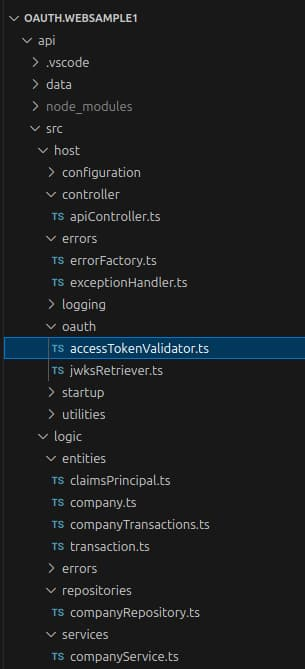

# Basic API – Code Details

The previous post explained some <a href='basicspa-codingkeypoints.mdx'>SPA Code Details</a> for the initial code sample. This post provides a similar breakdown for the API.

### Code Layout

The API uses TypeScript code and the [Node.js Express](https://expressjs.com/) HTTP. The *logic* folder contains the API's functonality, which would be the area with business value in a real API. The API's plumbing code, including its OAuth handling, is separated from its logic:

<div className='smallimage'>
    
</div>

### Dependencies

The API only uses a handful of third-party libraries, declared in its *package.json* file. The most interesting dependency is the [jose security library](https://github.com/panva/jose) that validates JWTs:

```json
{
    "dependencies": {
        "cors": "^2.8.5",
        "express": "^4.19.0",
        "fs-extra": "^11.2.0",
        "https-proxy-agent": "^7.0.2",
        "jose": "^5.6.2",
        "on-headers": "^1.0.2",
        "winston": "^3.12.0"
    }
}
```

### API Entry Point

When you run *npm start*, the *startup/app.ts* class executes, to configure the Express HTTP server and starts listening for requests:

```typescript
const logger = new ApiLogger();
try {

    const configBuffer = await fs.readFile('api.config.json');
    const configuration = JSON.parse(configBuffer.toString()) as Configuration;

    const expressApp = express();
    const httpServer = new HttpServerConfiguration(expressApp, configuration, logger);
    await httpServer.initializeApi();

    httpServer.initializeWebStaticContentHosting();
    httpServer.startListening();

} catch (e) {

    const error = ErrorFactory.fromServerError(e);
    logger.startupError(error);
}
```

The startup logic is in the *HttpServerConfiguration* class, whose main role is to express how to process API requests:

- The *get* expressions handle HTTP requests.
- The *use* expressions implement cross cutting concerns.

```typescript
public async initializeApi(): Promise<void> {

    const corsOptions = {
        origin: this._configuration.api.trustedOrigins,
        maxAge: 86400,
    };
    this._expressApp.use('/api/*', cors(corsOptions) as any);
    this._expressApp.use('/api/*', this._apiController.onWriteHeaders);

    this._expressApp.use('/api/*', this._catch(this._apiLogger.logRequest));
    this._expressApp.use('/api/*', this._catch(this._apiController.authorizationHandler));

    this._expressApp.get('/api/companies', this._catch(this._apiController.getCompanyList));
    this._expressApp.get(
        '/api/companies/:id/transactions',
        this._catch(this._apiController.getCompanyTransactions));

    this._expressApp.use('/api/*', this._apiController.onRequestNotFound);
    this._expressApp.use('/api/*', this._apiController.onException);
}
```

### API Configuration

The API uses a JSON configuration file in a similar manner to the SPA. The API configures fields it needs for JWT validation:

```json
{
    "api": {
        "port": 80,
        "trustedOrigins": [
            "http://localhost"
        ],
        "useProxy": false,
        "proxyUrl": "http://127.0.0.1:8888"
    },
    "oauth": {
        "jwksEndpoint": "https://cognito-idp.eu-west-2.amazonaws.com/eu-west-2_CuhLeqiE9/.well-known/jwks.json",
        "algorithm": "RS256",
        "issuer": "https://cognito-idp.eu-west-2.amazonaws.com/eu-west-2_CuhLeqiE9",
        "audience": ""
    }
}
```

### Web Static Content Hosting

The API also uses Express to host web static content, to make the SPA’s files available for download to the browser. In the initial code sample, this is done for the following reasons:

- Demonstrating  that a web host should require only minimal code.
- Reducing the number of parts so that the overall backend is easier to run.

```typescript
public initializeWebStaticContentHosting(): void {

    this._express.use('/spa', express.static('../spa'));
    this._express.use('/favicon.ico', 
}
```

In a real deployment you would use a separate web host component, and for SPAs this is often a content delivery network. The <a href='final-spa-overview.mdx'>Final SPA</a> switches to a dedicated web host for development and a CDN for deployed environments.

### Service Logic Classes

A mainstream way to run the API's business logic for an API request is to run a controller object, which then calls other testable business objects. In this blog's early API code samples I manually wire up an *ApiController* object with its dependencies. This blog's final APIs instead use a dependency injection framework.

```typescript
public async getCompanyList(request: Request, response: Response): Promise<void> {

    const reader = new JsonFileReader();
    const repository = new CompanyRepository(reader);
    const service = new CompanyService(repository, response.locals.claims);

    const result = await service.getCompanyList();
    ResponseWriter.writeObjectResponse(response, 200, result);
}
```

### API is Non-Blocking

The API uses *async / await* code to perform I/O. The following *CompanyRepository* class shows an example. The API can process other concurrent HTTP requests while I/O executes:

```typescript
public async getCompanyTransactions(id: number): Promise<CompanyTransactions | null> {

    const companyList = await this._jsonReader.readData<Company[]>('data/companyList.json');
    const foundCompany = companyList.find((c) => c.id === id);
    if (foundCompany) {

        const companyTransactions =
            await this._jsonReader.readData<CompanyTransactions[]>('data/companyTransactions.json');

        const foundTransactions = companyTransactions.find((ct) => ct.id === id);
        if (foundTransactions) {
            foundTransactions.company = foundCompany;
            return foundTransactions;
        }
    }

    return null;
}
```

### Authorization Middleware

Express enables you to use middleware for cross cutting concerns. The initial code samples uses a middleware object to validate JWT access token before the controller object runs.

```typescript
public async authorizationHandler(
    request: Request,
    response: Response,
    next: NextFunction): Promise<void> {

    const claims = await this._accessTokenValidator.execute(request);
    response.locals.claims = claims;
    next();
}
```

There are two main responsibilities involved in authorization in an OAuth secured API. The second of these occurs in the business logic:

| Responsibility | Description |
| -------------- | ----------- |
| Authenticate Requests | Digitally verify received JWT access tokens and return a 401 response if not valid. |
| Perform Authorization | Trust claims from the payload of the JWT and use them for authorization. |

### Authenticating Requests

The API uses an *AccessTokenValidator* class to do the work for the first of the above tasks. The security library implements OAuth token verification using the following code:

```typescript
public async execute(request: Request): Promise<ClaimsPrincipal> {

    try {

        const accessToken = this._readAccessToken(request);
        if (!accessToken) {
            throw ErrorFactory.fromMissingTokenError();
        }

        const options = {
            algorithms: [this._configuration.algorithm],
            issuer: this._configuration.issuer,
            audience: this._configuration.audience,
        };
        const result = await jwtVerify(accessToken, this._jwksRetriever.remoteJWKSet, options);

        const userId = this._getClaim(result.payload.sub, 'sub');
        const scope = this._getClaim(result.payload['scope'], 'scope');
        return new ClaimsPrincipal(userId, scope.split(' '));

    } catch (e: any) {

        if (e.code === 'ERR_JOSE_GENERIC') {
            throw ErrorFactory.fromJwksDownloadError(e);
        }

        throw ErrorFactory.fromTokenValidationError(e);
    }
}
```

The API must provide correct inputs to the library, so it is important for API developers to understand the inputs. These are summarised in a separate <a href='jwt-access-token-validation.mdx'>Access Token Validation</a> post.

### Claims Principal

Once the JWT is digitally verified, the API trusts claims returned from the library and uses them in its business logic, to authorize access to resources. I encapsulate claim values in a *ClaimsPrincipal* object:

```typescript
export class ClaimsPrincipal {

    private _subject: string;
    private _scopes: string[];

    public constructor(subject: string, scopes: string[]) {
        this._subject = subject;
        this._scopes = scopes;
    }

    public get subject(): string {
        return this._subject;
    }

    public get scopes(): string[] {
        return this._scopes;
    }
}
```

### Authorizing Requests

After the access token validator reates the claims principal it is injected into business logic classes:

```typescript
export class CompanyService {

    private readonly _repository: CompanyRepository;
    private readonly _claims: ClaimsPrincipal;

    public constructor(repository: CompanyRepository, claims: ClaimsPrincipal) {
        this._repository = repository;
        this._claims = claims;
    }
}
```

If an attempt is made to access unauthorized data, the SPA can throw a forbidden error:

```typescript
private _unauthorizedError(companyId: number): ClientError {
    return new ClientError(
        404,
        ErrorCodes.companyNotFound,
        `Company ${companyId} was not found for this user`);
}
```

### Claims Based Authorization

For the first code sample, the SPA does not implement any business authorization. Yet any real world API is liekely to need to use claims from business data in its authorization. I show how to manage this in the next code sample.

### API Logs

The initial API code sample does some basic logging, where each API request writes a structured JSON log entry represented by the following class:

```typescript
export class LogEntry {

    public readonly _utcTime: Date;
    public _path: string;
    public _method: string;
    public _statusCode: number;
    public _error: ClientError | ServerError | null;
}
```

By default this leads to lightweight output as follows:

```json
[
    {
        "utcTime": "2024-04-07T19:18:11.133Z",
        "path": "/api/companies",
        "method": "GET",
        "statusCode": 200
    }
    {
        "utcTime": "2024-04-07T19:18:11.268Z",
        "path": "/api/companies",
        "method": "GET",
        "statusCode": 200
    }
    {
        "utcTime": "2024-04-07T19:18:12.757Z",
        "path": "/api/companies/1/transactions",
        "method": "GET",
        "statusCode": 200
    }
]
```

### API Error Handling

The API code also implements solid error handling using these main classes:

| Class | Description |
| ----- | ----------- |
| ServerError | Represents a technical problem in the API. |
| ClientError | Represents a useful error response for an API client. |
| ExceptionHandler | Catches any exceptions thrown by the API. |
| ErrorFactory | Used to create exceptions to throw. |
| ErrorCodes | A list of error causes. |

An unhandled exception handler writes errors to logs and returns useful error responses to the SPA:

```typescript
public static handleError(exception: any, response: Response): ClientError {

    const handledError = ErrorFactory.fromException(exception);
    if (exception instanceof ClientError) {

        const clientError = handledError as ClientError;
        const logEntry = response.locals.logEntry as LogEntry;
        logEntry.setError(clientError);
        return clientError;

    } else {

        const serverError = handledError as ServerError;
        const logEntry = response.locals.logEntry as LogEntry;
        logEntry.setError(serverError);
        return serverError.toClientError();
    }
}
```

Errors are included in logs, where I log backend errors, such as network errors calling OAuth endpoints, with a 500 status and details about the cause, to help with fast problem resolution:

```json
{
  "utcTime": "2024-04-07T19:19:44.945Z",
  "path": "/api/companies",
  "method": "GET",
  "statusCode": 500,
  "error": {
    "statusCode": 500,
    "clientError": {
      "code": "jwks_download_error",
      "message": "Problem downloading token signing keys",
      "id": 45244,
      "area": "BasicApi",
      "utcTime": "2024-04-07T19:19:45.027Z"
    },
    "serviceError": {
      "details": {
        "code": "ERR_JOSE_GENERIC",
        "description": "Expected 200 OK from the JSON Web Key Set HTTP response"
      },
      "stack": [
        "JOSEError: Expected 200 OK from the JSON Web Key Set HTTP response",
        "at fetchJwks (file:///home/gary/dev/oauth.websample1/api/node_modules/jose/dist/node/esm/runtime/fetch_jwks.js:30:15)",
        "at process.processTicksAndRejections (node:internal/process/task_queues:95:5)",
        "at async RemoteJWKSet.reload (file:///home/gary/dev/oauth.websample1/api/node_modules/jose/dist/node/esm/jwks/remote.js:86:9)",
        "at async RemoteJWKSet.getKey (file:///home/gary/dev/oauth.websample1/api/node_modules/jose/dist/node/esm/jwks/remote.js:49:13)",
        "at async flattenedVerify (file:///home/gary/dev/oauth.websample1/api/node_modules/jose/dist/node/esm/jws/flattened/verify.js:72:15)",
        "at async compactVerify (file:///home/gary/dev/oauth.websample1/api/node_modules/jose/dist/node/esm/jws/compact/verify.js:15:22)",
        "at async jwtVerify (file:///home/gary/dev/oauth.websample1/api/node_modules/jose/dist/node/esm/jwt/verify.js:5:22)",
        "at async AccessTokenValidator.execute (file:///home/gary/dev/oauth.websample1/api/src/host/oauth/accessTokenValidator.ts:1:794)",
        "at async ApiController.authorizationHandler (file:///home/gary/dev/oauth.websample1/api/src/host/controller/apiController.ts:1:1209)"
      ]
    }
  }
}

```

### Supportability

Future posts drill much deeper into <a href='effective-api-logging.mdx'>logging</a> and <a href='error-handling-and-supportability.mdx'>error handling</a>. These are high value areas for backend systems, and you improve people productivity when you implement them in a solid end-to-end manner.

### Where Are We?

The initial API integrates with an authorization server and validates JWTs correctly. The API also does some initial work so that there is a setup for managing claims, logging and error handling.

### Next

- Next I summarise how to work with <a href='jwt-access-token-validation.mdx'>JWT Access Token Validation</a> in APIs.
- For a list of all blog posts see the <a href='index.mdx'>Index Page</a>.
