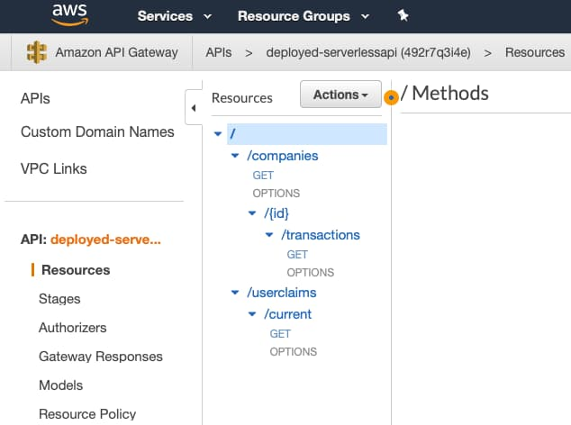

# Cloud Hosting Overview

Previously we completed our mobile theme by discussing <a href='ios-code-sample-coding-key-points.mdx'>Code Details</a> for our iOS code sample. Next we will begin a theme on modern deployment, and describe how the corresponding cloud infrastructure was created.

### URL Design

I started by <a href='oauth-infrastructure-setup.mdx'>Defining Base URLs</a>, and this blog uses a subdomain approach, to represent component separation on a small scale. Each subdomain can point to a particular cloud hosting feature, for APIs, web static content or the authorization server.

| Domain | Description |
| ------ | ----------- |
| https://www.authsamples.com | The base URL for Single Page Apps |
| https://api.authsamples.com | The API gateway base URL |
| https://login.authsamples.com | The authorization server base URL |
| https://mobile.authsamples.com | Hosts assets for mobile apps |

Each subdomain can be either a Serverless or cloud native endpoint. This blog follows a mix and match approach, depending on the cloud hosting option best meets our overall requirements.

### DNS Setup

The AWS cloud is used, which starts with registering a parent domain of *authsamples.com* using the [Route 53](https://aws.amazon.com/route53/) DNS service:

Multiple internet accessible subdomains can then be registered as *A Records* under a *Hosted Zone*:

If you have your own cloud domain and subdomains, you could follow similar steps to those described by blog posts, to create your own cloud hosting.

### Managed Internet SSL Certificates

[AWS Certificate Manager](https://aws.amazon.com/certificate-manager/) issues TLS 1.3 certificates for the domain and its subdomains, using the same wildcard certificate concept we’ve used on a local computer in earlier posts:

For this blog's online demo apps I only need to manage a single certificate, and AWS automatically renews it when it before expiry.

### Web and API Separation

The API base URL supports multiple microservices hosted behind the same API gateway:

- *https://api.authsamples.com/api1*
- *https://api.authsamples.com/api2*
- *https://api.authsamples.com/api3*

The web base URL supports hosting multiple micro-frontends for the same business area:

- *https://www.authsamples.com/spa1*
- *https://www.authsamples.com/spa2*
- *https://www.authsamples.com/spa3*

### SPA Deployment

The SPA deployment model simply involves copying built web resources to a `www.authsamples.com` S3 bucket:

I then use AWS CloudFront as a content delivery network for the bucket's static content:

CloudFront pushes web content to [many global locations](https://aws.amazon.com/cloudfront/features), to enable globally equal web performance, in an easy to manage way:

### Serverless APIs

Initial cloud API endpoints will use the [Serverless Framework](https://serverless.com/framework). This enables us to host APIs as low cost lambda functions, with minimal infrastructure to manage:

The [AWS API Gateway](https://aws.amazon.com/api-gateway/) is used to expose lambda functions to the internet as REST endpoints:

### Initial Cloud Authorization Server

Earlier in this blog we chose AWS Cognito as an initial low-cost authorization server. We will explain the AWS setup shortly:

### Cloud Connected Code Samples

Use of cloud hosting enables any reader of this blog to run this blog’s OAuth code samples. The <a href='quick-start.mdx'>Code Samples Quick Start</a> page provides details of online URLs and guest credentials for running the demo apps.

    

### Centralized API Logs

APIs will use this blog’s <a href='effective-api-logging.mdx'>Effective API Logging</a> design to write immediate log data to AWS CloudWatch. These logs could then be aggregated and queried using <a href='api-technical-support-analysis.mdx'>Technical Support Queries</a>.

### Lost Cost Initial Hosting

The AWS costs for the above setup are around 13 USD per year to register the base domain, along with a further 0.60 USD per month. This is an attractive option when getting started with cloud hosting:

### Kubernetes Hosting

The API side of the architecture can also run in a Kubernetes environment. In AWS this would be managed by spinning up an [EKS](https://docs.aws.amazon.com/whitepapers/latest/overview-deployment-options/amazon-elastic-kubernetes-service.html) cluster, that hosts this blog’s final APIs, along with any suppporting components. This is more expensive than Serverless hosting but enables richer choices, so can sometimes be a better choice on the API side of the architecture.

### Where Are We?

We have provided an overview of this blog's cloud hosting, and the following blog posts will describe some implementation details. In all cases our application code will remain portable so that we can switch hosting in future if ever needed.

### Next

- Next we will explain details of our <a href='cloud-domain-setup.mdx'>Cloud Domain Setup</a>
- For a list of all blog posts see the <a href='index.mdx'>Index Page</a>

