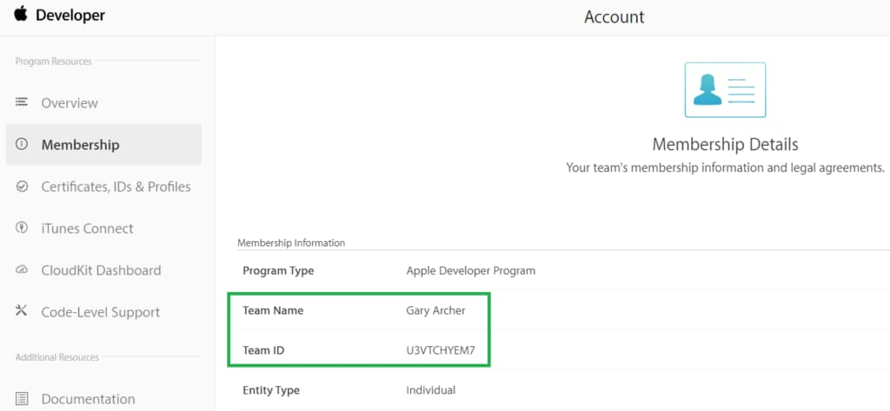
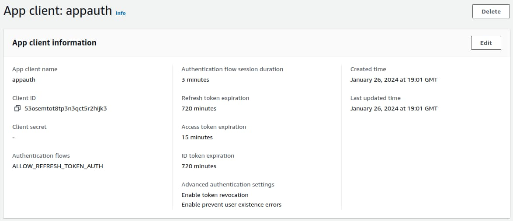
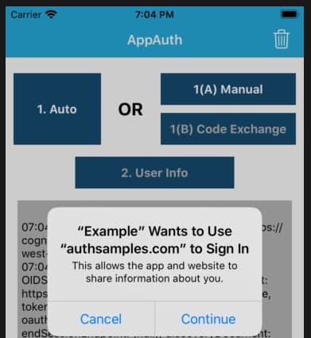

# iOS Setup and AppAuth Sample

Previously we completed our <a href='android-https-debugging.mdx'>Android HTTP Debugging Setup</a>. Next we will get a basic iOS OAuth setup working, via the AppAuth iOS code sample.

### Step 1: Sign up with Apple

I signed up for a *Personal Apple Account* so that I could get development tools and run mobile apps on real iOS devices:



### Step 2: Install Xcode

I next downloaded and installed the latest [Xcode](https://developer.apple.com/xcode/) development tool, with support for the most recent iOS operating systems and the latest version of the Swift programming language.

### Step 3: Get the AppAuth iOS Sample

Download the code sample via the following command:

```bash
git clone https://github.com/openid/AppAuth-iOS
```

From Xcode’s home screen, select *File / Open* and navigate to the *AppAuth-iOS/Examples/Example-iOS_Swift-Carthage* folder:


### Step 4: Add the AppAuth Dependency

By default the code sample uses the Carthage dependency tool, which I prefer to avoid. Therefore, I start with some cleanup, by removing the following items:

- The *Example_Extension* folder
- The *AppAuth* entries under *Frameworks*
- The *Carthage* section under *Build Phases*
- The project should then look like this:


I then add AppAuth using the Swift dependency manager, from the above screen, by providing the URL of the AppAuth iOS repo. When prompted, I add the *AppAuth* and *AppAuthCore* packages to the code sample's target:


### Step 5: Understand Mobile OAuth Client Settings

In this post we will point the AppAuth code sample to a client that I registered in this blog’s AWS Cognito authorization server:




The AppAuth settings are summarised below:

| Field | Value |
| ----- | ----- |
| Client ID | 53osemtot8tp3n3qct5r2hijk3 |
| Redirect URI | net.openid.appauthdemo:/oauth2redirect |
| Scope | openid email profile |
| Issuer URI | *https://cognito-idp.eu-west-2.amazonaws.com/eu-west-2_CuhLeqiE9* |

### Step 6: Update OAuth Client Settings

Before running the app, make the edits documented in the [Example README](https://github.com/openid/AppAuth-iOS/tree/master/Examples/Example-iOS_Swift-Carthage), to change the below settings in the *AppAuthExampleViewController.swift* module:

```swift
let kIssuer: String = "https://cognito-idp.eu-west-2.amazonaws.com/eu-west-2_CuhLeqiE9";
let kClientID: String? = "53osemtot8tp3n3qct5r2hijk3";
let kRedirectURI: String = "net.openid.appauthdemo:/oauth2redirect";
```

You must also register the *Redirect URI Scheme* in the mobile app’s *info.plist* file:


Note also the contents of the OAuth scopes array. For some providers you will need to add the *offline_access* scope in order to get a refresh token, though Cognito does not require this.

```swift
let request = OIDAuthorizationRequest(configuration: configuration,
                                      clientId: clientID,
                                      clientSecret: clientSecret,
                                      scopes: [OIDScopeOpenID, OIDScopeProfile],
                                      redirectURL: redirectURI,
                                      responseType: OIDResponseTypeCode,
                                      additionalParameters: nil)
```

### Step 7: Run the Sample App on an Emulator

We can run the app using Xcode’s build and run option in the top left of the IDE. I always first select the latest emulator version:


This renders the following view. You can click *Auto* to run an entire OpenID Connect authorization redirect. Alternatively, do it in two stages, by using *Manual*, where step 1(A) is the front channel redirect, and step 1(B) is the back channel operation to swap the authorization code for tokens:

<div className='smallimage'>
    
</div>

Next an [ASWebAuthenticationSession](https://developer.apple.com/documentation/authenticationservices/aswebauthenticationsession) window is shown, which first involves informing the user which app they are logging into:

<div className='smallimage'>
    
</div>

You can then sign in to the app using this blog’s cloud test credential:

- User: *guestuser@example.com*
- Password: *GuestPassword1*

The login is done using the system browser, which overlays the mobile view and prevents the sample app from having direct access to the password:

<div className='smallimage'>
    
</div>

After login, control returns to the mobile app, which has an ID token, an access token and a refresh token. You can then test OAuth lifecycle operations, including refreshing the access token:

<div className='smallimage'>
    
</div>

### Where Are We?

We have gained an initial understanding of how to run an OAuth-secured mobile app from Xcode. Shortly we will describe this blog's <a href='ios-code-sample-overview.mdx'>iOS Code Sample</a>, which demonstrates much more complete behaviour.

### Next

- Next we will focus on <a href='ios-https-debugging.mdx'>HTTPS Debugging on iOS</a>
- For a list of all blog posts see the <a href='index.mdx'>Index Page</a>
