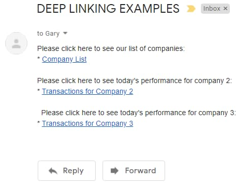

# Android Code Sample - Overview

Previously I explained an <a href='ios-https-debugging.mdx'>iOS HTTPS Debugging Setup</a> and next I summarize the behaviour of this blog's Android code sample, which is a *Single Activity App* coded in Kotlin. The app connects to <a href='cloud-hosting.mdx'>HTTPS endpoints hosted in AWS</a>, so that you only need to run the mobile app's code to get a fully integrated solution.

### Features

The following table summarises the main features of the code sample, some of which are tricky to implement:

| Feature | Description |
| ------- | ----------- |
| OpenID Connect Integration | I integrate the standards-based AppAuth libraries to implement the essential security behaviour. |
| Claimed HTTPS Schemes | The login result returns to the app over HTTPS URLs, which is the most secure option according to security guidance. |
| Secure Token Storage | The device stores tokens after login that are not accessible to other apps, so that users avoid reauthentication on every app restart. |
| Deep Linking | The app uses HTTPS deep links so that users can bookmark locations within the app. |

### Code Download

The code for the mobile app can be downloaded from [here](https://github.com/gary-archer/oauth.mobilesample.android) and I explain how to run it in the next post:


### Basic Mobile User Interface

The frontend views provide the same <a href='api-journey-client-side.mdx'>API Client Journey</a> as earlier web apps, starting with a list view:

<div className='smallimage'>
    
</div>

There is also a details view which exists primarily to demonstrate navigation and deep linking:

<div className='smallimage'>
    
</div>

### Single Activity / View Application

The mobile views have identical functionality to those in the final React SPA, where the main view is swapped out as the user navigates. This is more efficient than replacing entire activities and makes the app feel faster for users.

### Modern Frontend Technology

I develop the Android App in Kotlin and use [Jetpack Compose](https://developer.android.com/jetpack) for its views. This mobile technology choice simplifies the implementation of views, data binding and navigation.


### Security Recommendations

There are risks with mobile apps that a malicious third party could install an app that impersonates the app by using its *Client ID* and *Redirect URI*. To prevent this I follow high security recommendations to use *Claimed HTTP Scheme* redirect URIs:

- [Financial Grade APIs / Native Apps](https://openid.net/specs/openid-financial-api-part-1-ID2.html#native-apps)


Android apps implement HTTPS redirect URIs as *App Links*. Doing so prevents a fake app from receiving a login result since the attacker would not be able to make deep links for the redirect URI work for their app.

### Logins via the System Browser

Users sign in via a [Chrome Custom Tab](https://developer.chrome.com/docs/android/custom-tabs) window which overlays the app's mobile views and acts as a secure sandbox, so that the app itself never has access to the user's credentials.

<div className='smallimage'>
    
</div>

AppAuth libraries create the Chrome Custom Tab instance. The result is that multiple web and mobile apps can share cookies and passwords to improve usability:

- Single sign on can work across multiple web / mobile apps.
- Passwords can be remembered and used for multiple apps.

### Logins via Webviews

The following problems exist if you perform login redirects on a normal mobile webview, since webviews use a private browser session:

| Problem Area | Description |
| ------------ | ----------- |
| Password Autofill | This feature generally works less reliably in a webview and the user may have to type values more often. |
| Single Sign On | Cookies may not be shared with other apps and are likely to be dropped more aggressively by the private browser session. |
| Could be Blocked | Google is an example of an identity provider that [blocks logins on a mobile webview](https://auth0.com/blog/google-blocks-oauth-requests-from-embedded-browsers). |

### Login Usability

This blog's Android code sample uses Chrome Custom Tabs to provide an integrated experience with good usability. The user does not need to type their email and password on every login. After login the device stores tokens using secure operating system storage private to the app. On subsequent application restarts the first thing the user sees is the app.

### Secured Device Prerequisite

I also mitigate risks related to stolen mobile devices. The app requires the device to have a secured lock screen and the user receives the following prompt when that is not the case. The user must then set a minimum security level of *Pattern*, *PIN* or *Password*, after which the app resumes.

<div className='smallimage'>
    
</div>

### Password Autofill

On the initial login on a device or emulator the user must type an email and password. By default the Chrome Custom Tab abruptly disappears after login and the user cannot use its *Save Password* feature. I resolve this problem with a *Post Login Page* that displays after authentication but before the browser window closes.

<div className='smallimage'>
    
</div>

### Reliable Login Cancellation

The user can close the Chrome Custom Tab to cancel a login instead of successfully completing a login. The app handles this reliably and allows the user to retry:

<div className='smallimage'>
    
</div>

### Reliable Session Management

The app uses session-related buttons to *Rehearse Expiry Events* to verify that the app copes with them correctly, without user problems:

<div className='smallimage'>
    
</div>

### Navigation with Expired Tokens

The session buttons help to ensure that the app handles navigation correctly, where a new view initiates its own API requests with access tokens. Navigation may include *user authentication* or *refreshing an access token* before presenting the new view. For Android, the navigation must also account for the platform's built-in *Back Stack Navigation*.

### Logout

The app also implements <a href='logout.mdx'>Open ID Connect RP-Initiated Logout</a>, to remove the authorization server's session cookie. In a real-world app a logout capability helps to enable data access testing for multiple users with different settings or permissions.

### Deep Linking

The app supports navigation via deep linking where a user can follow an *HTTPS App Link* to activate the app at specific locations. For example, I can send myself an email that contains deep links:



A deep link could point to an unauthorized or invalid resource, as demonstrated by the last two examples below:

```markdown
// A deep link to the home page
https://mobile.authsamples.com/finalmobileapp/deeplink

// A deep link to the transactions for company 2
https://mobile.authsamples.com/finalmobileapp/deeplink/companies/2

// A deep link to an unauthorized resource
https://mobile.authsamples.com/finalmobileapp/deeplink/companies/3

// A deep link to an invalid resource
https://mobile.authsamples.com/finalmobileapp/deeplink/companies/abc
```

When the mobile app calls its API, unauthorized responses contain useful error codes to enable the mobile app to handle unauthorized access gracefully. The app detects particular error codes and navigates back to the home page, to avoid presenting an error to the user.

### Handling Redirect Responses

When integrating OAuth into a mobile app you may run into an issue where the system browser does not execute the deep link containing the authorization response. Instead, the Chrome Custom Tab runs a web request, resulting in a 404 not found error. The browser may require a user gesture before it runs a deep link, to protect against malicious automatic execution of deep links.

<div className='smallimage'>
    
</div>

### Types of OAuth Redirect

There are three scenarios where redirects use the Chrome Custom Tab window. You can rehearse the second scenario by clicking *Expire Refresh Token* and then *Reload*.

| Redirect Type | Description |
| ------------- | ----------- |
| Login | The user interactively signs in. |
| Single Sign On | The user already has a valid session cookie and signs in automatically without user actions. |
| Logout | The user's session cookie expires without user actions. |

In each case, there may need to be a user gesture before the deep link returns control to the app. In some cases, using the OpenID Connect *prompt=login* parameter on every login redirect may provide a reliable solution. In this blog I instead use a custom intermediate page, partly because, at the time of writing, AWS Cognito does not support the *prompt* parameter.

### This Blog's Intermediate Web Pages

I use the following custom *AWS Hosted Web Pages* that run after login / logout redirects.

<div className='smallimage'>
    
</div>

<div className='smallimage'>
    
</div>

### Test Cases

Chrome Custom Tab logins improve usability, but they also add some complexity due to the additional Chrome Custom Tab activity. The app needs to ensure that, when the login window is top most, the following actions do not cause errors:

| Test Case | Description |
| --------- | ----------- |
| Change Orientation | The user switches between portrait and landscape before completing a login. |
| Reactivate App | The user switches to another app and then re-runs our app from the home screen via the app's launch icon. |
| Deep Link | The user runs the app and then runs a deep link from an email. |

### Where Are We?

I have summarized the app's functionality and some reliability issues to overcome. Since the app implements OpenID Connect in a standard way, it could be updated to support many other forms of user authentication, with zero code changes.

### Next

- Next I explain <a href='basicandroidapp-execution.mdx'>How to Run the Android Code Sample</a>.
- For a list of all blog posts see the <a href='index.mdx'>Index Page</a>.
