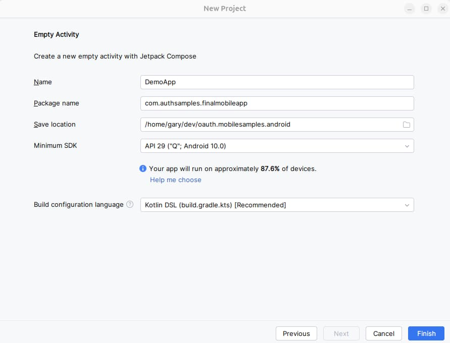

# Android Code Sample – Code Details

Previously we described our <a href='android-infrastructure-setup.mdx'>Android Infrastructure Setup</a> and we will now look at some key areas of our sample’s code. See also the <a href='api-journey-client-side.mdx'>Client Side API Journey</a> to understand the background and the requirements being met.

### Portable Code

One of this blog’s coding goals is to use the same UI classes across multiple platforms. Our Android app uses the same logical separation of responsibilities into classes as the earlier <a href='reactjs-codingkeypoints.mdx'>React SPA</a>:

<div className='smallimage'>
    
</div>

### Unobtrusive OAuth Integration

The view classes show below call our OAuth Secured API, and need to deal with *triggering login redirects* and *refreshing access tokens*. This can involve concurrency, which we will explore shortly.

<div className='smallimage'>
    
</div>

Companies will want to complete this tricky plumbing code once, then focus on business value, by growing the UI and API code.

### Project Creation

The project was initially created via the below *Empty Activity* template, after which I began developing Kotlin classes:



I then added these options to the application’s *build.gradle.kts* file, which enables views to be created using the newer *Jetpack Compose* syntax, which lead to cleaner code than older XML layout views:

```kotlin
buildFeatures {
    compose = true
}
composeOptions {
    kotlinCompilerExtensionVersion = "1.5.3"
}
```

### Main Activity Entry Point

Our single activity is specified in the manifest file as the default / launcher activity, and fulfils a similar role to our SPA’s application shell:

```xml
<activity
        android:name=".app.MainActivity"
        android:exported="true"
        android:launchMode="singleTop"
        android:configChanges="orientation|screenSize">

    <intent-filter>
        <action android:name="android.intent.action.MAIN"/>
        <category android:name="android.intent.category.LAUNCHER"/>
    </intent-filter>
</activity>
```

Our code begins in the *onCreate* override, which initialises the main view model and creates views:

```kotlin
override fun onCreate(savedInstanceState: Bundle?) {

    super.onCreate(savedInstanceState)
    (this.application as Application).setMainActivity(this)
    actionBar?.hide()

    val model: MainActivityViewModel by viewModels()
    this.model = model

    this.createViews()
    this.model.initialize(this::onLoaded)
}

private fun onLoaded() {
    this.binding.model!!.eventBus.register(this)
    this.navigateStart()
}
```

Views can be recreated at any time, whereas the main view model is only created once. When it is constructed it reads settings from the JSON configuration file embedded in the app, then creates global objects used for OAuth and API operations:

```kotlin
init {

    this.configuration = ConfigurationLoader().load(this.app.applicationContext)

    this.fetchCache = FetchCache()
    this.eventBus = EventBus.getDefault()

    this.authenticator = AuthenticatorImpl(this.configuration.oauth, this.app.applicationContext)
    this.fetchClient = FetchClient(this.configuration, this.fetchCache, this.authenticator)
    this.viewModelCoordinator = ViewModelCoordinator(this.eventBus, this.fetchCache, this.authenticator)

    this.isLoaded = false
    this.isTopMost = true
    this.isDeviceSecured = DeviceSecurity.isDeviceSecured(this.app.applicationContext)
}
```

### View Layout and Composition

The main activity’s layout creates a number of child views, including a navigation host, whose content is swapped out as the user navigates, in a similar way to the main view of an SPA:

```kotlin
private fun createViews() {

    val that = this@MainActivity
    setContent {
        ApplicationTheme {
            Column {

                TitleView(that.model.getUserInfoViewModel())

                HeaderButtonsView(
                    that.model.eventBus,
                    that::onHome,
                    that::onReloadData,
                    that::onExpireAccessToken,
                    that::onExpireRefreshToken,
                    that::onStartLogout
                )

                if (model.error.value != null) {

                    ErrorSummaryView(
                        ErrorViewModel(
                            model.error.value!!,
                            stringResource(R.string.main_error_hyperlink),
                            stringResource(R.string.main_error_dialogtitle)
                        ),
                        Modifier
                            .fillMaxWidth()
                            .wrapContentSize()
                    )
                }

                SessionView(that.model.eventBus, that.model.fetchClient.sessionId)

                val navHostController = rememberNavController()
                that.navigationHelper =
                    NavigationHelper(navHostController) { model.isDeviceSecured }
                that.navigationHelper.deepLinkBaseUrl =
                    that.model.configuration.oauth.deepLinkBaseUrl

                NavHost(navHostController, MainView.Blank) {

                    composable(MainView.Blank) {
                    }

                    composable(MainView.DeviceNotSecured) {
                        DeviceNotSecuredView(that.model.eventBus, that::openLockScreenSettings)
                    }

                    composable(MainView.Companies) {
                        CompaniesView(that.model.getCompaniesViewModel(), navigationHelper)
                    }

                    composable(
                        "${MainView.Transactions}/{id}",
                        listOf(navArgument("id") { type = NavType.StringType })
                    ) {

                        val id = it.arguments?.getString("id") ?: ""
                        TransactionsView(
                            id,
                            that.model.getTransactionsViewModel(),
                            navigationHelper
                        )
                    }

                    composable(MainView.LoginRequired) {
                        LoginRequiredView(that.model.eventBus)
                    }
                }
            }
        }
    }
}
```

### Data Binding and View Models

Data binding is used, which aims for the most readable binding code. Each non-trivial view has a view model that manages state, including that returned from APIs. When the value of mutable state changes, the view is automatically updated.

```kotlin
class CompaniesViewModel(
    private val fetchClient: FetchClient,
    val eventBus: EventBus,
    private val viewModelCoordinator: ViewModelCoordinator
) : ViewModel() {

    var companiesList: MutableState<List<Company>> = mutableStateOf(ArrayList())
    var error: MutableState<UIError?> = mutableStateOf(null)

    ...
}
```

### View Models and API Calls

The most interesting view models are those that get data from our OAuth-secured API. As is standard in UIs, this involves switching to an I/O worker thread, then switching back to the UI thread once complete:

```kotlin
fun callApi(options: ViewLoadOptions?, onComplete: () -> Unit) {

    val fetchOptions = FetchOptions(
        FetchCacheKeys.COMPANIES,
        options?.forceReload ?: false,
        options?.causeError ?: false
    )

    this.viewModelCoordinator.onMainViewModelLoading()
    this.updateError(null)

    val that = this@CompaniesViewModel
    CoroutineScope(Dispatchers.IO).launch {

        try {

            val companies = fetchClient.getCompanyList(fetchOptions)

            withContext(Dispatchers.Main) {

                if (companies != null) {
                    that.updateData(companies.toList())
                    that.viewModelCoordinator.onMainViewModelLoaded(fetchOptions.cacheKey)
                }
            }

        } catch (uiError: UIError) {

            withContext(Dispatchers.Main) {
                that.updateData(ArrayList())
                that.updateError(uiError)
                that.viewModelCoordinator.onMainViewModelLoaded(fetchOptions.cacheKey)
            }

        } finally {

            withContext(Dispatchers.Main) {
                onComplete()
            }
        }
    }
}
```

Use of [Kotlin Coroutines](https://developer.android.com/kotlin/coroutines) results in readable async await code where we write suspending functions to do the work. The code also caches API responses to prevent redundant calls when views are recreated, such as during back navigation.

### API Call Details

The *FetchClient* class acts as a service agent and uses the [okhttp library](https://github.com/square/okhttp). Each API call uses a shared method to deal with supplying OAuth access tokens and managing retries.

We implement the same OAuth client side behaviour that we have used in all of other UI code samples, by getting a new token and retrying the request once if the API returns a 401 status code. The basic API code, with caching omitted, looks like this:

```kotlin
private suspend fun <T> getDataFromApi(url: String, responseType: Class<T>, options: FetchOptions): T? {

    var accessToken = this.authenticator.getAccessToken()
    if (accessToken.isNullOrBlank()) {
        throw ErrorFactory().fromLoginRequired()
    }

    try {

        return this.callApiWithToken("GET", url, null, accessToken, responseType, options)

    } catch (e: Throwable) {

        val error = ErrorFactory().fromException(e)
        if (error.statusCode != 401) {
            throw error
        }

        accessToken = this.authenticator.synchronizedRefreshAccessToken()
        return this.callApiWithToken("GET", url, null, accessToken, responseType, options)
    }
}
```

### Authenticator Interface

The *ApiClient* uses an *Authenticator* reference and calls *getAccessToken* in order to retrieve a message credential for API calls:

```kotlin
interface Authenticator {
    suspend fun initialize()
    suspend fun getAccessToken(): String?
    suspend fun synchronizedRefreshAccessToken(): String
    fun startLogin(launchAction: (i: Intent) -> Unit)
    suspend fun finishLogin(intent: Intent)
    fun startLogout(launchAction: (i: Intent) -> Unit)
    fun finishLogout()
    fun clearLoginState()
    fun expireAccessToken()
    fun expireRefreshToken()
}
```

### Triggering Login Redirects

Our app has two views that load concurrently and fire three concurrent API requests. The main view data is retrieved and there are also two additional API requests to get user info. OAuth user info is retrieved from the authorization server and additional user attributes are retrieved from the API.

<div className='smallimage'>
    
</div>

A *ViewModelCoordinator* object is used to wait for all views to load. In the event of any view receiving a permanent 401 response from the API, a single OAuth redirect is triggered by the main activity:

```kotlin
private fun handleErrorsAfterLoad() {

    if (this.loadedCount == this.loadingCount) {

        val errors = this.getLoadErrors()

        val loginRequired = errors.find { e -> e.errorCode == ErrorCodes.loginRequired }
        if (loginRequired != null) {
            this.eventBus.post(LoginRequiredEvent())
            return
        }

        val oauthConfigurationError = errors.find { e ->
            (e.statusCode == 401 && e.errorCode == ErrorCodes.invalidToken) ||
            (e.statusCode == 403 && e.errorCode == ErrorCodes.insufficientScope)
        }

        if (oauthConfigurationError != null) {
            this.authenticator.clearLoginState()
        }
    }
}
```

The ViewModelCoordinator class also deals with invalid token errors, such as incorrect scope, claims or audience configurations. For these errors, the app clears its login state to enable retries where the OAuth configuration has been fixed. The app then receives new tokens and the user can recover.

### AppAuth Library – Login Requests

The authenticator implementation uses [AppAuth Android Classes](https://github.com/openid/AppAuth-Android) to implement standards-based OpenID Connect behaviour:

```kotlin
override fun startLogin(launchAction: (i: Intent) -> Unit) {

    try {

        val authService = AuthorizationService(this.applicationContext, this.getBrowserConfiguration())
        this.loginAuthService = authService

        val builder = AuthorizationRequest.Builder(
            this.metadata!!,
            this.configuration.clientId,
            ResponseTypeValues.CODE,
            Uri.parse(this.getLoginRedirectUri())
        )
            .setScope(this.configuration.scope)
        val request = builder.build()

        val authIntent = authService.getAuthorizationRequestIntent(request)
        launchAction(authIntent)

    } catch (ex: Throwable) {
        throw ErrorFactory().fromLoginOperationError(ex, ErrorCodes.loginRequestFailed)
    }
}
```

At runtime the properties of AppAuth objects are set based on our OAuth configuration settings. AppAuth libraries then produce outgoing authorization code flow (PKCE) request messages and then handle incoming response messages.

```json
{
  "app": {
    "apiBaseUrl":             "https://api.authsamples.com/investments"
  },
  "oauth": {
    "authority":              "https://cognito-idp.eu-west-2.amazonaws.com/eu-west-2_CuhLeqiE9",
    "clientId":               "2vshs4gidsbpnjmsprhh607ege",
    "redirectUri":            "https://www.authsamples.com/apps/finalmobileapp/postlogin.html",
    "postLogoutRedirectUri":  "https://www.authsamples.com/apps/finalmobileapp/postlogout.html",
    "scope":                  "openid profile https://api.authsamples.com/investments",
    "userInfoEndpoint":       "https://login.authsamples.com/oauth2/userInfo",
    "customLogoutEndpoint":   "https://login.authsamples.com/logout",
    "deepLinkBaseUrl":        "https://mobile.authsamples.com"
  }
}
```

### AppAuth Library – Login Responses

Our manifest file tells AppAuth’s login activity to use a claimed HTTPS scheme to receive login responses at the path provided:

```xml
<activity
    android:name="net.openid.appauth.RedirectUriReceiverActivity"
    android:exported="true">

    <intent-filter android:autoVerify="true">
        <action android:name="android.intent.action.VIEW" />
        <category android:name="android.intent.category.DEFAULT"/>
        <category android:name="android.intent.category.BROWSABLE"/>
        <data
            android:scheme="https"
            android:host="mobile.authsamples.com"
            android:path="/finalmobileapp/oauth/callback" />
    </intent-filter>
</activity>
```

Upon return from login an intermediate page runs in the Chrome custom tab window. This screen receives the authorization code in a response query parameter. JavaScript code in the web page invokes the login receiver activity when the continue button is pressed. This forwards any received query parameters, including the authorization code, to the app:

```javascript
<script>
    window.addEventListener('DOMContentLoaded', function() {
        var redirectUri = 'https://mobile.authsamples.com/finalmobileapp/oauth/callback';

        if (window.location.search) {
            redirectUri += window.location.search;
        }
        if (window.location.hash) {
            redirectUri += window.location.hash;
        }

        document.getElementById('continueButton').onclick = () => {
            window.location.href = redirectUri;
        };
    });
</script>
```

### AppAuth Library – Cancelled Logins

It is possible for users to cancel logins if they are having trouble logging in. AppAuth libraries are well designed and provide error codes that we can use to determine cancellation and other conditions:

```kotlin
override suspend fun finishLogin(intent: Intent) {

    val authorizationResponse = AuthorizationResponse.fromIntent(intent)
    val ex = AuthorizationException.fromIntent(intent)

    this.loginAuthService?.dispose()
    this.loginAuthService = null

    when {
        ex != null -> {

            if (ex.type == AuthorizationException.TYPE_GENERAL_ERROR &&
                ex.code == AuthorizationException.GeneralErrors.USER_CANCELED_AUTH_FLOW.code
            ) {

                throw ErrorFactory().fromRedirectCancelled()
            }

            throw ErrorFactory().fromLoginOperationError(ex, ErrorCodes.loginResponseFailed)
        }
        authorizationResponse != null -> {

            this.exchangeAuthorizationCode(authorizationResponse)
        }
    }
}
```

### AppAuth Library – Authorization Code Grant

After successfully receiving the login response, the authorization code flow continues by swapping the received code for tokens:

```kotlin
private suspend fun exchangeAuthorizationCode(authResponse: AuthorizationResponse) {

    return suspendCoroutine { continuation ->

        val callback =
            AuthorizationService.TokenResponseCallback { tokenResponse, ex ->

                when {
                    ex != null -> {
                        val error = ErrorFactory().fromTokenError(ex, ErrorCodes.authorizationCodeGrantFailed)
                        continuation.resumeWithException(error)
                    }

                    tokenResponse == null -> {
                        val empty = RuntimeException("Authorization code grant returned an empty response")
                        continuation.resumeWithException(empty)
                    }

                    else -> {
                        this.saveTokens(tokenResponse)
                        continuation.resume(Unit)
                    }
                }
            }

        val tokenRequest = authResponse.createTokenExchangeRequest()

        val authService = AuthorizationService(this.applicationContext)
        authService.performTokenRequest(tokenRequest, NoClientAuthentication.INSTANCE, callback)
    }
}
```

The message sent includes a *Code Verifier* used for PKCE handling, and AppAuth libraries take care of supplying this correctly.

### Secure Token Storage

After login, the app stores OAuth tokens using a *TokenStorage* object, which saves them to shared preferences. The Android system ensures that no other app can access the demo app’s tokens, so it is not necessary to encrypt the stored values.

### Application Restarts without Login

When the app starts, it loads OpenID Connect metadata and also any tokens that have been saved to Android storage. This prevents the user needing to re-authenticate on every application restart.

### AppAuth Library – Refreshing Access Tokens

AppAuth objects are also used to send a *Refresh Token Grant* message, via the *TokenRequest* class. The AppAuth error codes allow us to reliably detect the *Invalid Grant* response when the refresh token finally expires:

```kotlin
private suspend fun performRefreshTokenGrant() {

    val refreshToken = this.tokenStorage.loadTokens()?.refreshToken
    if (refreshToken.isNullOrBlank()) {
        return
    }

    this.getMetadata()

    return suspendCoroutine { continuation ->

        val callback =
            AuthorizationService.TokenResponseCallback { tokenResponse, ex ->

                when {
                    ex != null -> {

                        if (ex.type == AuthorizationException.TYPE_OAUTH_TOKEN_ERROR &&
                            ex.code == AuthorizationException.TokenRequestErrors.INVALID_GRANT.code
                        ) {
                            this.tokenStorage.removeTokens()
                            continuation.resume(Unit)
                            this.concurrencyHandler.resume()

                        } else {

                            val error = ErrorFactory().fromTokenError(ex, ErrorCodes.tokenRenewalError)
                            continuation.resumeWithException(error)
                            this.concurrencyHandler.resumeWithException(error)
                        }
                    }

                    tokenResponse == null -> {
                        val error = RuntimeException("Refresh token grant returned an empty response")
                        continuation.resumeWithException(error)
                        this.concurrencyHandler.resumeWithException(error)
                    }

                    else -> {
                        this.saveTokens(tokenResponse)
                        continuation.resume(Unit)
                        this.concurrencyHandler.resume()
                    }
                }
            }

        val tokenRequest = TokenRequest.Builder(
            this.metadata!!,
            this.configuration.clientId
        )
            .setGrantType(GrantTypeValues.REFRESH_TOKEN)
            .setRefreshToken(refreshToken)
            .build()

        val authService = AuthorizationService(this.applicationContext)
        authService.performTokenRequest(tokenRequest, callback)
    }
}
```

### Token Renewal and Concurrency

When multiple views call APIs and receive 401 responses, the token renewal call should be *synchronized* so that it only occurs once:

- Multiple views call the API and receive a 401 response
- A single token renewal message is sent to the authorization server
- Multiple views successfully call the API again with the new access token

To ensure this, our code uses a *ConcurrentActionHandler* class, so that only a single UI view does a token refresh at a time:

```kotlin
override suspend fun synchronizedRefreshAccessToken(): String {

    val refreshToken = this.tokenStorage.loadTokens()?.refreshToken
    if (!refreshToken.isNullOrBlank()) {

        this.concurrencyHandler.execute(this::performRefreshTokenGrant)

        val accessToken = this.tokenStorage.loadTokens()?.accessToken
        if (!accessToken.isNullOrBlank()) {
            return accessToken
        }
    }

    throw ErrorFactory().fromLoginRequired()
}
```

As well as being more efficient, this ensures that our code uses [refresh token rotation](https://www.rfc-editor.org/rfc/rfc6749#section-10.4) reliably, as opposed to receiving multiple refresh tokens and possibly saving one that has been invalidated.

### Logout

The app’s logout logic involves these two actions:

- Removing the refresh token from Android secure storage
- Removing the authorization server’s session cookie

The second step requires a redirect on a Chrome custom tab, since the authorization server session cookie can only be removed via the system browser. To make this work with AWS Cognito’s custom logout endpoint, the following code was used:

```kotlin
override fun startLogout(launchAction: (i: Intent) -> Unit) {

    val tokens = this.tokenStorage.loadTokens()
    val idToken = tokens?.idToken
    this.tokenStorage.removeTokens()

    try {
        if (idToken == null) {

            val message = "Logout is not possible because tokens have already been removed"
            throw IllegalStateException(message)
        }

        val logoutUrlBuilder = this.createLogoutUrlBuilder()
        val logoutUrl = logoutUrlBuilder.getEndSessionRequestUrl(
            this.metadata!!,
            this.getPostLogoutRedirectUri(),
            idToken
        )

        launchAction(this.getLogoutIntent(logoutUrl))

    } catch (ex: Throwable) {
        throw ErrorFactory().fromLogoutOperationError(ex)
    }
}
```

Logout request messages include a *Post Logout Redirect URI* that points to our *Web Hosted Post-Logout Page*. The user clicks a *Continue* button and the web page again invokes the app’s claimed HTTPS scheme, which matches the below logout receiver activity, so that control is returned to the app and logout can complete:

```xml
<activity
android:name=".plumbing.oauth.logout.LogoutRedirectUriReceiverActivity"
    android:exported="true">

    <intent-filter android:autoVerify="true">
        <action android:name="android.intent.action.VIEW" />
        <category android:name="android.intent.category.DEFAULT"/>
        <category android:name="android.intent.category.BROWSABLE"/>
        <data
            android:scheme="https"
            android:host="mobile.authsamples.com"
            android:path="/finalmobileapp/oauth/logoutcallback" />
    </intent-filter>
</activity>
```

### AppAuth Library – Error Codes

The *Error Category and Code* from the [AppAuth Errors Enumeration](https://github.com/openid/AppAuth-Android/blob/master/library/java/net/openid/appauth/AuthorizationException.java) can be useful if you need to better understand any AppAuth error codes reported by the app:

```java
/**
 * Error codes related to failed token requests.
 *
 * @see "The OAuth 2.0 Authorization Framework" (RFC 6749), Section 5.2
 * <https://tools.ietf.org/html/rfc6749#section-5.2>"
 */
public static final class TokenRequestErrors {
    // codes in this group should be between 2000-2999

    /**
     * An `invalid_request` OAuth2 error response.
     */
    public static final AuthorizationException INVALID_REQUEST =
    tokenEx(2000, "invalid_request");

    /**
     * An `invalid_client` OAuth2 error response.
     */
    public static final AuthorizationException INVALID_CLIENT =
    tokenEx(2001, "invalid_client");

    /**
     * An `invalid_grant` OAuth2 error response.
     */
    public static final AuthorizationException INVALID_GRANT =
    tokenEx(2002, "invalid_grant");
}
```

The app’s error handling is diligent about capturing these runtime details, to help with OAuth problem resolution:

<div className='smallimage'>
    
</div>

By coding in Kotlin, our Android sample requires fewest technical layers to integrate AppAuth libraries, and we have first-class access to error details.

### Deep Linking

Our Android app can also use deep linking. An additional *Forwarding Activity* is used, to control whether deep links are allowed to execute. The app ignores deep links when a Chrome custom tab window is top most:

```kotlin
private fun handleIntent(receivedIntent: Intent) {

    if (!this.app().isMainActivityTopMost()) {
        finish()
        return
    }

    receivedIntent.setClass(this, MainActivity::class.java)
    receivedIntent.addFlags(Intent.FLAG_ACTIVITY_CLEAR_TOP or Intent.FLAG_ACTIVITY_SINGLE_TOP)
    startActivity(receivedIntent)
}
```

It is possible to deep link to an unauthorized or invalid API resource, resulting in the API returning an error. Our transactions view model deals with this reliably, by processing API error codes:

```kotlin
private fun isForbiddenError(error: UIError): Boolean {

    if (error.statusCode == 404 && error.errorCode.equals(ErrorCodes.companyNotFound)) {

        return true
    } else if (error.statusCode == 400 && error.errorCode.equals(ErrorCodes.invalidCompanyId)) {

        return true
    }

    return false
}
```

### Debugging Kotlin Code

You can use the standard Android Studio debug option to step through code using commands from the *Run Menu*. This also enables us to view the state of AppAuth objects, when we need to troubleshoot OAuth code:


### Code Quality Checks

We use the [detekt static analyzer tool](https://detekt.github.io/detekt), to check some of the finer details of our Kotlin code. A *detekt.gradle* file was added to the project, after which the following command can be run:

```bash
./gradlew detekt
```

This produces warnings that help to keep the code base maintainable:


### AppAuth Libraries

This blog demonstrates mobile integration using the recommendations from RFC 8252. Doing so does not mandate use of the AppAuth libraries though. If you run into any library blocking issues, the code flow  could be implemented fairly easily in the *AuthenticatorImpl* object.

### Where Are We?

We have implemented an OpenID Connect secured Android app with no blocking issues. By using native tech a software company would now be in a good technical position:

- The app supports many possible types of user login
- The app uses modern code that is easy to change
- The app can use the latest Android native features
- The app has good reliability and error handling control

### Next

- Next we will start describing our <a href='ios-code-sample-overview.mdx'>Secured iOS App’s Behaviour</a>
- For a list of all blog posts see the <a href='index.mdx'>Index Page</a>
