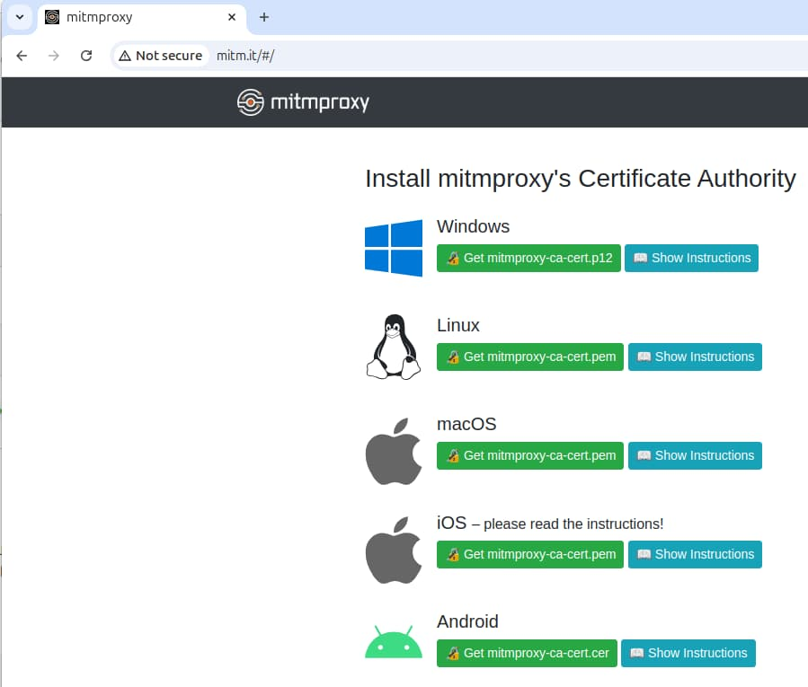

# Android HTTPS Debugging Setup

Previously I ran an initial Android setup using the <a href='android-setup.mdx'>AppAuth Android Code Sample</a>. Next I explain a way to view outgoing HTTPS mobile traffic from Android emulators and devices on a development computer, to provide a productive troubleshooting setup.

### Run an HTTP Proxy on the Host

First, I configure and run an HTTP proxy on the host computer, as the <a href='http-debugging-setup.mdx'>HTTPS Debugging</a> post explains. You must also instruct the proxy to decrypt SSL traffic. I explained how to do so for most environments in the <a href='developer-ssl-setup.mdx'>SSL Trust Configuration</a> post.

### Determine the Computer's IP Address

Connected emulators and devices share a network with the host computer, like the built-in emulator network or a WiFi network. The following commands can provide the host computer's IP v4 address. Some Android emulators may instead use a special IP address of *10.0.2.2* for the host computer.

```markdown
ifconfig
ip addr show
```

### Configure Android WiFi Proxy Settings

When running on a WiFi network, select *Settings / Network & Internet / Internet*, then choose the in-use network connection and click the pencil icon to edit it. In the following screenshot I connect a real device to a proxy running on the host computer, using the host computer's IP address:

<div className='smallimage'>
    
</div>

Android emulators may alternate connectivity between WiFi and cellular. This can cause confusion when getting an HTTP proxy working, so I usually disable *Mobile Data* and only use WiFi:

<div className='smallimage'>
    
</div>

### Android Cellular Proxy Settings

If you need to capture cellular traffic, browse to *Settings / Network & Internet / Internet* and edit the cellular network's properties. Under *Access Point Names / APNs* click the plus icon and add a new entry with the connection details. In the following screenshot I connect an emulator to a proxy running on the host computer, using the emulator's IP address for the host:

<div className='smallimage'>
    
</div>

### Understand Initial SSL Errors

If you now run the system browser or a mobile app on the Android device, SSL requests will result in trust errors:

<div className='smallimage'>
    
</div>

This is because the HTTP proxy intercepts SSL requests at runtime and replaces the root certificate authority. To fix this, configure emulators and devices to trust the HTTP proxy's root certificate.

<div className='smallimage'>
    
</div>

### Get the HTTP Proxy Root Certificate

You must deploy the certificate's root certificate authority file to the emulator or device. Most certificates, such as those that I generate for this blog using OpenSSL, use the *PEM* format and contain base64 encoded text:

```markdown
-----BEGIN CERTIFICATE-----
MIIBvjCCAWWgAwIBAgIUYjMlZDVJQ4UYrxfMzik24mJ6+JYwCgYIKoZIzj0EAwIw
NTEzMDEGA1UEAwwqRGV2ZWxvcG1lbnQgQ0EgZm9yIGF1dGhzYW1wbGVzLWs4cy1k
...
-----END CERTIFICATE-----
```

If the root CA uses this format, convert it to the *DER* format, using a command of the following form:

```bash
openssl x509 -in mitmproxy.ca.crt -out mitmproxy.ca.der -outform DER
```

### Deploy the HTTP Proxy Root Certificate

You can deploy the DER certificate to an emulator or device in various ways:

- Drag or copy the certificate into an emulator.
- Email it to the device or emulator.
- Download it over HTTP.

For the [MITM proxy root CA](https://docs.mitmproxy.org/stable/concepts-certificates/) you can just browse to a URL of *http://mitm.it* from the device or emulator and select the Android option:



Alternatively, use an HTTP server that exposes a folder on the host computer that contains the certificate file. The following command uses NGINX to share a host folder at *http://localhost* and use the NGINX *autoindex* feature to allow file browsing:

```bash
docker run -it --rm -p 80:80 -v ./fileshare:/var/lib/nginx/html:ro dceoy/nginx-autoindex
```

From a connected emulator or device, open Chrome and type the IP address of the host. Click a certificate file and save it to the device's *Downloads* folder:

<div className='smallimage'>
    
</div>

### Configure Android SSL Trust

Once deployed, the certificate file saves to the *Downloads* folder of the emulator or device. Next, navigate to *Settings / Security & privacy / Encryption & credentials / Install a certificate / CA certificate* and select the *Install Anyway* option. Navigate to the *Downloads* folder and select the certificate. The certificate will save under *Settings / Security & privacy / Encryption & credentials / User credentials*.

<div className='smallimage'>
    
</div>

### Configure SSL Trust for Mobile Apps

The Chrome Browser will now trust the root certificate but mobile apps will not, since Android has its own [trusted certificate rules](https://android-developers.googleblog.com/2016/07/changes-to-trusted-certificate.html). To overcome them, first edit the Android manifest to reference an additional [network_security_config.xml](https://developer.android.com/training/articles/security-config.html) file when running in debug mode. This authorizes the app to trust all user certificates installed on the device or emulator:

```xml
<?xml version="1.0" encoding="utf-8"?>
<network-security-config>
    <debug-overrides>
        <trust-anchors>
            <certificates src="user" />
        </trust-anchors>
    </debug-overrides>
</network-security-config>
```

### Understand Domain Name Service Lookup

During mobile development it can be useful to also run a local API. To support this with a real-world domain name I add a local DNS entry to my local computer's */etc/hosts* file:

```markdown
127.0.0.1 api.authsamples-dev.com
```

By default, connected devices and emulators will not be able to resolve this domain name. If you use an HTTP proxy however, domain name resolution for *api.authsamples-dev.com* runs on the host computer and succeeds for both emulators and connected devices.

### View OAuth and API HTTPS Traffic

On all emulators and devices you will now be able to run OAuth and API requests with your preferred domain names, and view all HTTPS message details. This includes messages not generated by your code, such as those that the AppAuth library produces:


### Where Are We?

I explained an Android HTTP debugging setup, to enable visualization of OAuth and API requests, which is an essential behaviour for productive OAuth client development.

### Next

- Next I explain an iOS OAuth Setup and run the <a href='ios-setup.mdx'>iOS AppAuth Code Sample</a>.
- For a list of all blog posts see the <a href='index.mdx'>Index Page</a>.
