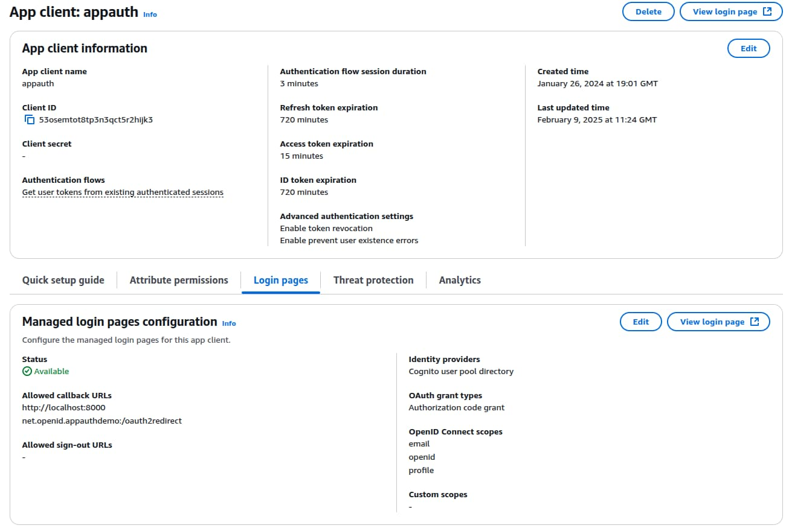

# Android Setup and AppAuth Code Sample

Previously I explained some <a href='final-desktop-app-coding-key-points.mdx'>Code Details</a> for the final desktop code sample. Next I show how to get a basic Android OAuth setup working, by running the AppAuth Android code sample.

### Step 1: Install Android Studio

First use an up to date version of [Android Studio](https://developer.android.com/studio/index.html), which installs the Android SDK to a location such as *~/Android/sdk*. Optionally, update the *PATH* environment variable to enable use of Android tools from the command line:

```bash
export PATH="$HOME/Android/Sdk/tools:$HOME/Android/Sdk/platform-tools"
```

### Step 2: Get the AppAuth Android Sample

Download the code sample with the following command. From Android Studio's home screen select *Open* and navigate to the downloaded folder:

```bash
git clone https://github.com/openid/AppAuth-Android
```

Ignore prompts to update the Gradle plugin and wait a couple of minutes for dependencies to download. You will then see two projects, for the library and the app:


### Step 3: Understand Mobile OAuth Client Settings

In this post I point the AppAuth code sample to a client that I registered in my personal instance of AWS Cognito, which you can use as this blog's default authorization server:



### Step 4: Update OAuth Application Configuration

You can update the app to the following OAuth client settings:

| Field | Value |
| ----- | ----- |
| Client ID | 53osemtot8tp3n3qct5r2hijk3 |
| Redirect URI | net.openid.appauthdemo:/oauth2redirect |
| Scope | openid email profile |
| Discovery URI | [https://cognito-idp.eu-west-2.amazonaws.com/eu-west-2_CuhLeqiE9/.well-known/openid-configuration](https://cognito-idp.eu-west-2.amazonaws.com/eu-west-2_CuhLeqiE9/.well-known/openid-configuration) |

To do so, navigate to the file at *app/res/raw/auth_config.json* and paste in the values:

```json
{
  "client_id": "53osemtot8tp3n3qct5r2hijk3",
  "redirect_uri": "net.openid.appauthdemo:/oauth2redirect",
  "end_session_redirect_uri": "net.openid.appauthdemo:/oauth2redirect",
  "authorization_scope": "openid email profile",
  "discovery_uri": "https://cognito-idp.eu-west-2.amazonaws.com/eu-west-2_CuhLeqiE9/.well-known/openid-configuration",
  "authorization_endpoint_uri": "",
  "token_endpoint_uri": "",
  "registration_endpoint_uri": "",
  "user_info_endpoint_uri": "",
  "https_required": true
}
```

Note that login redirects use a *Private URI Scheme*, with the scheme value from the app's *build.gradle* file::


### Step 5. Run the App on an Emulator

From Android Studio. navigate to *Device Manager*, then create an emulator if required. Ensure that the emulator shows the *Play Store* icon so that it has a working Google Chrome browser:


Run the app using the emulator, which results in the following display:

<div className='smallimage'>
    
</div>

Click *Start Authorization* and sign in with this blog's test user credential:

- User: *guestuser@example.com*
- Password: *GuestPassword1*

During login the system browser runs as a [Chrome Custom Tab](https://developer.chrome.com/multidevice/android/customtabs), which overlays the mobile view and the app itself cannot access the user's credentials:

<div className='smallimage'>
    
</div>

After login, control returns to the app, which displays information about OAuth tokens issued. You can also send the access token to Cognito's user info endpoint, to get name details for the test user account:

<div className='smallimage'>
    
</div>

At the time of writing, you will get an error if you try to use the *Sign Out* option when using AWS Cognito, since that authorization server requires a vendor specific logout solution.

### Where Are We?

I showed how to run an OAuth-secured mobile app from Android Studio. Shortly I will explain this blog's <a href='android-code-sample-overview.mdx'>Android Code Sample</a>, which demonstrates much more complete OAuth behaviour.

### Next

- Next I explain <a href='android-https-debugging.mdx'>Android HTTPS Tracing of OAuth Messages</a>.
- For a list of all blog posts see the <a href='index.mdx'>Index Page</a>.
