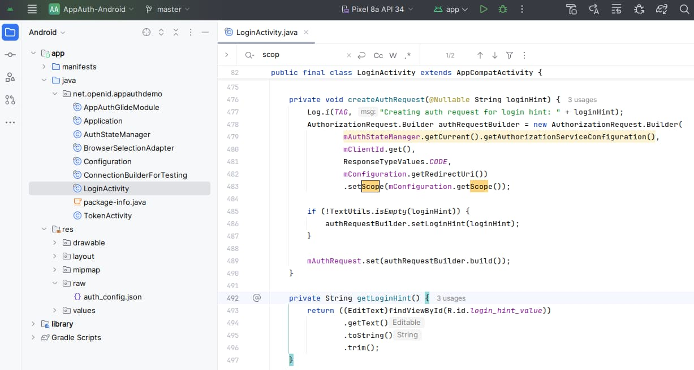
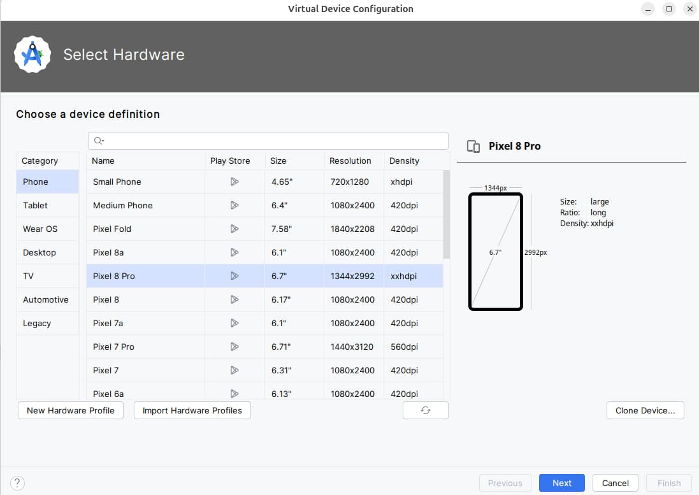

# Android Setup and AppAuth Sample

Previously we discussed <a href='final-desktop-app-coding-key-points.mdx'>Code Details</a> for the final desktop code sample. Next we will get a basic Android OAuth setup working, by running the AppAuth Android code sample.

### Step 1: Install Android Studio

First I downloaded and installed an up to date version of [Android Studio](https://developer.android.com/studio/index.html), which installs the Android SDK to a location such as *~/Android/sdk*. Also update the *PATH* environment variable to enable use of Android tools from the command line:

```bash
export PATH="$HOME/Android/Sdk/tools:$HOME/Android/Sdk/platform-tools"
```

### Step 2: Get the AppAuth Android Sample

Download the code sample via the following command. From Android Studio’s home screen select *Open* and navigate to the downloaded folder:

```bash
git clone https://github.com/openid/AppAuth-Android
```

Ignore prompts to update the Gradle plugin and wait a couple of minutes for dependencies to download. You will then see two projects, for the library and the app:



### Step 3: Understand Mobile OAuth Client Settings

In this post we will point the AppAuth code sample to a client that I registered in this blog’s AWS Cognito authorization server:


The AppAuth settings are summarised below:

| Field | Value |
| ----- | ----- |
| Client ID | 53osemtot8tp3n3qct5r2hijk3 |
| Redirect URI | net.openid.appauthdemo:/oauth2redirect |
| Scope | openid email profile |
| Discovery URI | [https://cognito-idp.eu-west-2.amazonaws.com/eu-west-2_CuhLeqiE9/.well-known/openid-configuration](https://cognito-idp.eu-west-2.amazonaws.com/eu-west-2_CuhLeqiE9/.well-known/openid-configuration) |

### Step 4: Update OAuth Application Configuration

Navigate to *app/res/raw/auth_config.json* and update the settings, pasting in the *Client ID* and *Discovery URI*:

```json
{
  "client_id": "53osemtot8tp3n3qct5r2hijk3",
  "redirect_uri": "net.openid.appauthdemo:/oauth2redirect",
  "end_session_redirect_uri": "net.openid.appauthdemo:/oauth2redirect",
  "authorization_scope": "openid email profile",
  "discovery_uri": "https://cognito-idp.eu-west-2.amazonaws.com/eu-west-2_CuhLeqiE9/.well-known/openid-configuration",
  "authorization_endpoint_uri": "",
  "token_endpoint_uri": "",
  "registration_endpoint_uri": "",
  "user_info_endpoint_uri": "",
  "https_required": true
}
```

Note that login redirects are configured to use a *Private URI Scheme*, and the scheme used is configured in the app’s *build.gradle* file::


### Step 5. Run the Sample App on an Emulator

From Android Studio. navigate to *Device Manager*, then create an emulator if required. The emulator must have the *Play Store* icon enabled, so that Google Chrome is installed:



Run the app using the emulator, which will result in this display:

<div className='smallimage'>
    
</div>

When prompted you can login with this blog’s cloud test credential:

- User: *guestuser@example.com*
- Password: *GuestPassword1*

During login the system browser is invoked as a [Chrome Custom Tab](https://developer.chrome.com/multidevice/android/customtabs), which renders the AWS Cognito login screen:

<div className='smallimage'>
    
</div>

After login you will be returned to the app, which displays information about tokens. You can also send the access token to Cognito’s User Info endpoint, to get name details for the test user account:

<div className='smallimage'>
    
</div>

To get the refresh token on some authorization servers, an additional scope called *offline_access* may need to be specified in both the OAuth client registration and the app’s JSON configuration.

At the time of writing, you will get an error if you try to use the *Sign Out* option when using AWS Cognito, since it uses a vendor specific logout solution, as described in the <a href='logout.mdx'>Logout</a> post.

### Where Are We?

We have gained an initial understanding of how to run an OAuth-secured mobile app from Android Studio. Shortly we will run this blog’s <a href='android-code-sample-overview.mdx'>Android Code Sample</a>, which demonstrates much more complete OAuth behaviour.

### Next

- Next we will demonstrate <a href='android-https-debugging.mdx'>Android HTTPS Tracing of OAuth Messages</a>
- For a list of all blog posts see the <a href='index.mdx'>Index Page</a>
