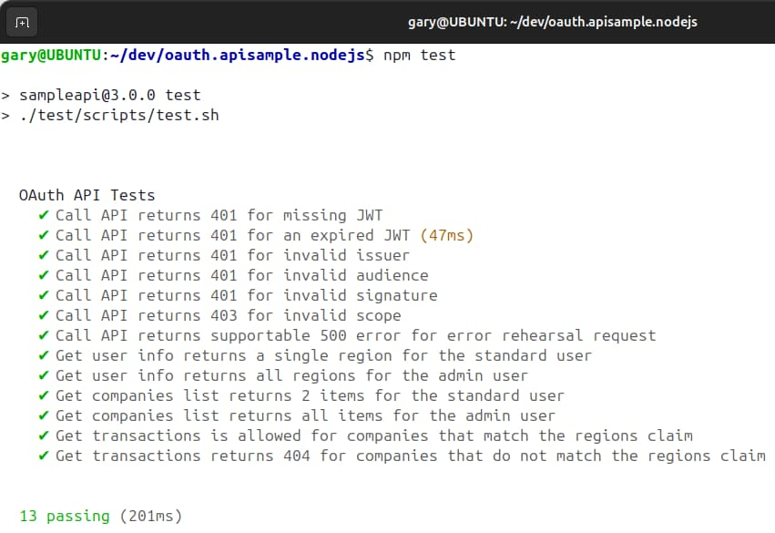

# Node.js API - Overview

Previously I explained this blog's <a href='error-handling-and-supportability.mdx'>Error Handling and Supportability</a> design. Next I summarise the main behaviours of this blog's final Node.js API. See also the <a href='api-journey-server-side.mdx'>API Journey - Server Side</a> blog post for the requirements being met.

### Final API Code Sample Overview

This blog's API has a couple of simple endpoints that return mock data for a money-based theme of investments. The API aims to be visual and serves this blog's apps, such as the <a href='how-to-run-the-react-js-spa.mdx'>Final SPA</a> below. Running both together ensures that the API is client-focused and enables you to focus on API logs that the client generates.


### API URLs

During development the API runs as a standalone component. You can use either mocha tests or a load test as the API client. These tests get user-level access tokens to call the API and verify some OAuth security use cases. The API accepts mock access tokens when you point it to a mock authorization server:

| Component | Base URL |
| --------- | -------- |
| API | *https://api.authsamples-dev.com:446* |
| Mock Authorization Server | *https://login.authsamples-dev.com:447* |

### Prerequisite 1: Domain Setup

First update your computer's hosts file to create domains for local development. Include the web domain and local backend-for-frontend domain if you run the SPA and API together:

```markdown
127.0.0.1 api.authsamples-dev.com login.authsamples-dev.com www.authsamples-dev.com bfflocal.authsamples-dev.com
```

### Prerequisite 2: Install OpenSSL

Install OpenSSL 3+ so that you can create development certificates and run the API over HTTPS.

### Prerequisite 3: Install Node.js

Download [Node.js](https://nodejs.org/en/download) for your operating system, which runs the API and also builds the SPA's JavaScript bundles.

### Prerequisite 4: Install Docker

To run API tests, or the full SPA and API solution, you use Docker utility components, so install a local engine such as [Docker Desktop](https:/www/.docker.com/products/docker-desktop).

### Step 1: Get the Code

Close the GitHub repository with the following command:

```bash
git clone https://github.com/gary-archer/oauth.apisample.nodejs
```


### Step 2: Create SSL Certificates

Run the following commands, to create some OpenSSL development certificates:

```bash
export SECRETS_FOLDER="$HOME/secrets"
mkdir "$SECRETS_FOLDER"
./certs/create.sh
```
To prevent SSL trust problems from tests or the browser you may need to <a href='developer-ssl-setup.mdx'>Configure Node.js and Browser Trust</a> for the root certificate at the following location. 

```markdown
certs/authsamples-dev.ca.crt
```

### Step 3: Run the API

Next run the API:

```bash
./start.sh
```

The Express HTTP server then listens on HTTPS port 446:


You can then navigate to the following URL in a browser without any SSL trust warnings:

```markdown
https://api.authsamples-dev.com:446/investments/companies
```


### Step 4: Run Integration Tests

To run mocha tests, you must run the API with a configuration that points to a mock authorization server. Stop the API if it is running, then re-run it via this command:

```bash
npm run testsetup
```

Then run tests with the following command:

```bash
npm test
```

This spins up a JWKS URI with an HTTPS endpoint that the Wiremock utility provides. A number of tests then make OAuth-secured API requests. These tests focus on the API's main security behaviours:



### Step 5: Run a Basic Load Test

While the API runs with a test configuration you can also run a basic load test that sends parallel API requests. This helps to ensure that the API code has no concurrency bugs:

```bash
npm run loadtest
```

The test fires batches of 5 concurrent requests at a time and also intentionally rehearses certain types of error. The expected result is 3 errors from a total of 100 requests:


The <a href='api-automated-tests.mdx'>API Automated Tests</a> post explains how tests get user level tokens without running a full authorization code flow.

### Step 6: Run a Frontend Client

You can run any of this blog's final frontend clients against the API:

- <a href='final-spa-overview.mdx'>Final SPA</a>
- <a href='final-desktop-sample-overview.mdx'>Final Desktop App</a>
- <a href='android-code-sample-overview.mdx'>Final Android App</a>
- <a href='ios-code-sample-overview.mdx'>Final iOS App</a>

To do so, follow the instructions to run the client against a local API, for example by using a *LOCALAPI* environment variable to override the default usage of a cloud API. When the frontend runs a code flow you can authenticate with this blog's test credential:

- User: *guestuser@example.com*
- Password: *GuestPassword1*

### Main Feature 1: Extensible Authorization

The API implements its security according to these two blog posts, using a JOSE library and some custom claims handling:

- <a href='jwt-access-token-validation.mdx'>JWT Access Token Validation</a>
- <a href='api-authorization-design.mdx'>API Authorization Design</a>

The overall behaviour manages OAuth security correctly while setting up the API's business logic with the authorization values it needs. These values may originate from multiple data sources and may not always be issued to tokens:

```typescript
@injectable()
export class CompanyService {

    private readonly repository: CompanyRepository;
    private readonly claims: ClaimsPrincipal;

    public constructor(
        @inject(SAMPLETYPES.CompanyRepository) repository: CompanyRepository,
        @inject(BASETYPES.ClaimsPrincipal) claims: ClaimsPrincipal) {

        this.repository = repository;
        this.claims = claims;
    }
}
```

The API uses the same OAuth integration and claims handling techniques as this blog's second code sample, explained earlier in the <a href='updated-api-coding-key-points.mdx'>Updated API Code Details</a> blog post.

### Main Feature 2: Request Logs and Audit Logs

The other main objective of the API code sample is JSON logging of API requests. Every request to the API writes a request log entry for troubleshooting purposes and an audit log entry to record the security event. The following examples show the format of log output.

```json
{
  "type": "request",
  "id": "c4939e2c-9f71-4f4b-bbca-dda287b48385",
  "utcTime": "2022-07-24T08:41:05.069Z",
  "apiName": "FinalApi",
  "operationName": "getCompanyTransactions",
  "hostName": "UBUNTU",
  "method": "GET",
  "path": "/investments/companies/2/transactions",
  "resourceId": "2",
  "clientName": "LoadTest",
  "userId": "a6b404b1-98af-41a2-8e7f-e4061dc0bf86",
  "statusCode": 200,
  "millisecondsTaken": 7,
  "correlationId": "3e4ac756-11c7-e60f-c564-ad4f203d5742",
  "sessionId": "a601559a-0c90-c899-8099-8a9f63a30be8"
}
{
  "type": "audit",
  "id": "c4939e2c-9f71-4f4b-bbca-dda287b48385",
  "utcTime": "2022-07-24T08:41:05.069Z",
  "apiName": "FinalApi",
  "operationName": "getCompanyTransactions",
  "hostName": "UBUNTU",
  "method": "GET",
  "path": "/investments/companies/2/transactions",
  "resourceId": "2",
  "clientName": "LoadTest",
  "userId": "a6b404b1-98af-41a2-8e7f-e4061dc0bf86",
  "statusCode": 200,
  "millisecondsTaken": 7,
  "correlationId": "3e4ac756-11c7-e60f-c564-ad4f203d5742",
  "sessionId": "a601559a-0c90-c899-8099-8a9f63a30be8",
  "isAuthenticated": true,
  "isAuthorized": true,
  "scope": [
    "openid",
    "profile",
    "investments"
  ],
  "claims": {
    "managerId": "10345",
    "role": "user"
  }
}
```

The API also writes text files to its *logs* folder in a bare JSON format, ready for log shipping. You can follow the <a href='log-aggregation-setup.mdx'>Log Aggregation Setup</a> to run a Docker-based deployment of the Elastic Stack. You can then run <a href='api-technical-support-analysis.mdx'>Technical Support Queries</a> against the API's logs. This would be useful in a production system, to make sense of large volumes of API requests.

### Cloud Native Deployment

The API is cloud-native and includes some Docker and Kubernetes deployment resources. A basic deployment can be run with these commands:

```bash
./deployment/docker-local/build.sh
./deployment/docker-local/deploy.sh
./deployment/docker-local/teardown.sh
```

### Where Are We?

I summarised the key productivity behaviours of this blog's final APIs. This starts with modern code setup and a clean separation of concerns that sets up business logic for future growth. Next, APIs have a unified security model that works the same for any type of API client. Finally, APIs have an early focus on reliability and measurability.

### Next

- I explain some <a href='final-nodeapi-coding-key-points.mdx'>Node.js API Code Details</a>.
- For a list of all blog posts see the <a href='index.mdx'>Index Page</a>.
