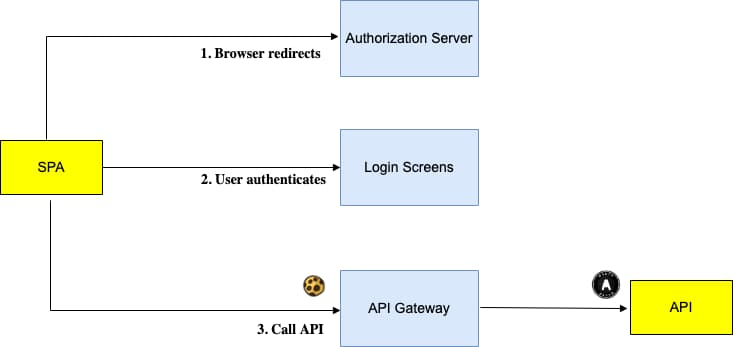
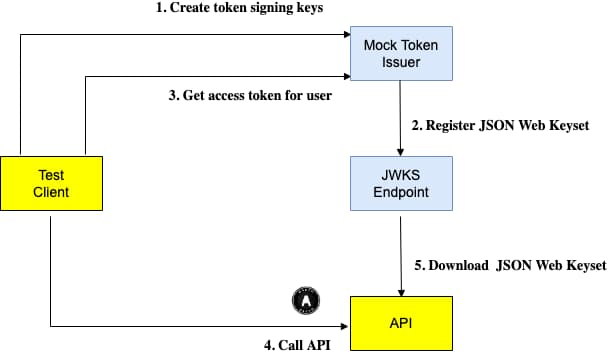
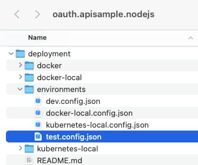
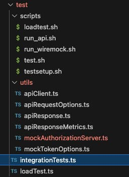
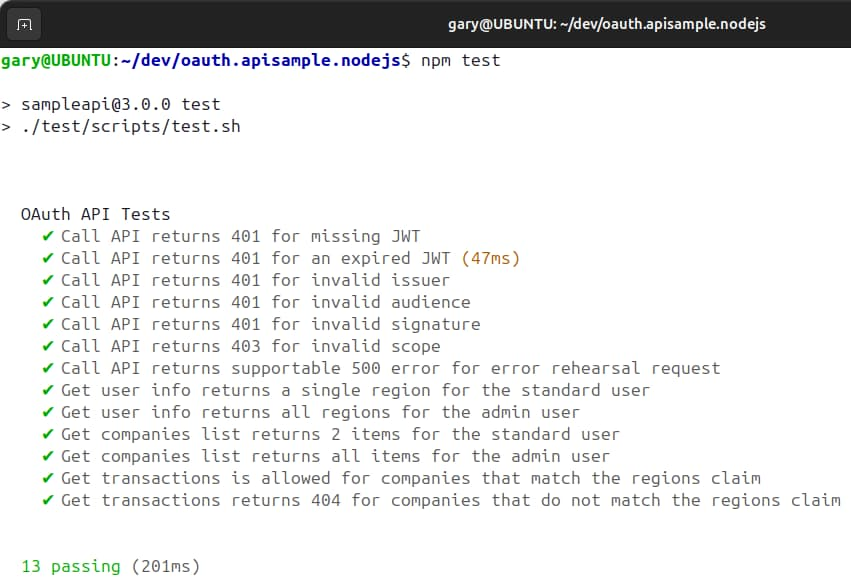
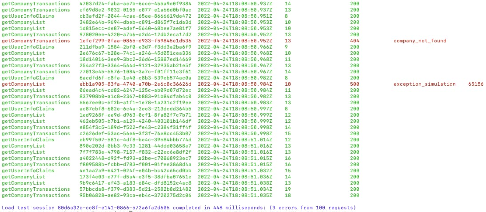

# API Automated Tests

In the previous post we described the <a href='spring-boot-api-coding-model.mdx'>Java Spring Boot API Code Details</a>. Next we will describe one way to test OAuth secured APIs, with a focus on *Developer Productivity*.

### Getting an Access Token

APIs often require user level access tokens, and it can be tricky to get one of these for automated tests. By default this requires browser redirects and for a user to interactively log in. Authentication sometimes requires multiple factors and can be difficult to automate during API development:



### Mocking OAuth Infrastructure

When your objective is to focus on API tests, it can be useful to have a test setup that instead mocks all of the above infrastructure, so that it does not get in the way of testing. In the following diagram, the API test client can quickly get an access token for any test user:



The mock token issuer is a JWT library, and the JWKS Endpoint can be a utility API or an HTTP tool such as Wiremock. The API’s security code runs identically to a real setup, and performs all of the same authentication and authorization checks, followed by the same business logic.

### Developer Testing of OAuth Secured APIs

The above is only one possible setup, and is perhaps most useful for API developers who want to write integration tests against their own code.  Each of this blog’s final APIs include both integration tests and a basic load test that use this technique:

| API Technology | Test Technology |
| -------------- | --------------- |
| <a href='api-architecture-node.mdx'>Node.js</a> | Mocha |
| <a href='net-core-code-sample-overview.mdx'>NET</a> | XUnit |
| <a href='java-spring-boot-api-overview.mdx'>Java</a> | JUnit |

This post will describe the Node.js API’s test code, though the behaviour and source code for .NET and Java is almost identical.

### API Test Settings

This test setup then becomes one of the API’s deployment scenarios, and is represented by the below environment file. Only the configuration is different for the API, and it runs the same code as in real environments:

<div className='smallimage'>
    
</div>

The primary configuration difference is that the API has been updated to use a JWKS URI that points to an instance of Wiremock, rather than a real authorization server.

```json
{
    "oauth": {
        "issuer":                        "testissuer.com",
        "audience":                      "api.authsamples.com",
        "scope":                         "investments",
        "jwksEndpoint":                  "https://login.authsamples-dev.com:447/.well-known/jwks.json",
        "userInfoEndpoint":              "https://login.authsamples-dev.com:447/oauth2/userInfo",
        "jwksCooldownDuration":          0,
        "claimsCacheTimeToLiveMinutes":  15
    }
}
```

### Integration Tests

The final API integration tests consist of a number of code and script resources, to manage setup and execution. Each test will act as an API client and make HTTPS requests with a JWT access token:

<div className='smallimage'>
    
</div>

When using the Node.js API, tests are run via the *npm run testsetup* and *npm test* commands, to execute a number of Mocha tests. In .NET and Java, slightly different commands are used, but the behaviour is the same:



### Mock Authorization Server

A mock authorization server is created at the start of a test run, then torn down once all tests have run:

```typescript
before( async () => {
    ExtraCaCerts.initialize();
    await authorizationServer.start();
});

after( async () => {
    await authorizationServer.stop();
});
```

This blog’s final APIs use the JOSE libraries from the below table for the JWT handling in their integration tests. The library issues JWT access tokens in the same standards-based way as a real authorization server does:

| API Technology | JWT Library |
| -------------- | ----------- |
| Node.js | [jose](https://github.com/panva/jose) |
| .NET | [jose-jwt](https://github.com/dvsekhvalnov/jose-jwt) |
| Java | [jose4j](https://bitbucket.org/b_c/jose4j/wiki/Home) |

First the authorization server must create a keypair, containing the private key it will use to sign tokens for the duration of the test session, as well as the public key that is formed into a JSON Web Keyset that is published over HTTP using Wiremock:

```typescript
export class MockAuthorizationServer {

    private readonly _baseUrl: string;
    private readonly _httpProxy: HttpProxy;
    private readonly _algorithm: string;
    private _jwk: GenerateKeyPairResult | null;
    private _keyId: string;

    public constructor(useProxy = false) {

        this._baseUrl = 'https://login.authsamples-dev.com:447/__admin/mappings';
        this._httpProxy = new HttpProxy(useProxy, 'http://127.0.0.1:8888');
        this._algorithm = 'ES256';
        this._jwk = null;
        this._keyId = Guid.create().toString();
    }

    public async start(): Promise {

        this._jwk = await generateKeyPair(this._algorithm);

        const jwk = await exportJWK(this._jwk.publicKey!);
        jwk.kid = this._keyId;
        jwk.alg = this._algorithm;
        const keys = {
            keys: [
                jwk,
            ],
        };
        const keysJson = JSON.stringify(keys);

        const stubbedResponse = {
            id: this._keyId,
            priority: 1,
            request: {
                method: 'GET',
                url: '/.well-known/jwks.json'
            },
            response: {
                status: 200,
                body: keysJson,
            },
        };

        await this._register(stubbedResponse);
    }

    public async stop(): Promise {
        await this._unregister(this._keyId);
    }
}
```

### Using Mock Access Tokens in Tests

This blog’s API tests cover token validation and authorization behaviour. All of these can be tested productively with the following type of syntax. Tokens for real users from the API’s data can be requested, and there is no need to deal with any OAuth client concerns:

```typescript
it ('Get transactions returns 404 for companies that do not match the regions claim', async () => {

    const jwtOptions = new MockTokenOptions();
    jwtOptions.useStandardUser();
    const accessToken = await authorizationServer.issueAccessToken(jwtOptions);

    const options = new ApiRequestOptions(accessToken);
    const response = await apiClient.getCompanyTransactions(options, 3);

    assert.strictEqual(response.statusCode, 404, 'Unexpected HTTP status code');
    assert.strictEqual(response.body.code, 'company_not_found', 'Unexpected error code');
});
```

The issuing of mock tokens is easily done using the JOSE library. Various invalid properties can be configured, to ensure that the API implements its JWT validation correctly.

```typescript
public async issueAccessToken(options: MockTokenOptions): Promise<string> {

    const now = Date.now();

    return await new SignJWT( {
            iss: options.issuer,
            aud: options.audience,
            scope: options.scope,
            sub: options.subject,
            manager_id: options.managerId,
            role: options.role,
        })
            .setProtectedHeader( { kid: this._keyId, alg: this._algorithm } )
            .setExpirationTime(options.expiryTime)
            .sign(this._jwk.privateKey);
}
```

The access token is easily viewed in an online JWT viewer. A mock access token issued by the JOSE library is shown below, where I have ensured that the *scopes* and *claims* are identical to those the API logic expects to receive:


### Basic Load Test

It is also useful to ensure early that there are no concurrency problems in APIs, when multiple requests are in flight at once for the same operations. This ensures that behaviours such as dependency injection of request scoped objects are reliable when there are multiple parallel API calls.

Therefore a basic API load test is also provided, which can be run with *npm run loadtest*. It fires 100 requests to the API by default, though this number can be increased as required. This intentionally rehearses different types of failure condition, and certain error responses are expected:



The load test is just a console application, which uses async await code to fire batches of 5 concurrent HTTP requests at a time to the API. This stays within operating system limits for in-flight requests to the same host, while ensuring that the API is continually processing multiple requests:

```typescript
private async _executeApiRequests(requests: (() => Promise<ApiResponse>)[]): Promise<void> {

    const total = requests.length;
    const batchSize = 5;
    let current = 0;

    while (current < total) {

        const requestBatch = requests.slice(current, Math.min(current + batchSize, total));
        const batchPromises = requestBatch.map((r) => this._executeApiRequest(r));

        await Promise.all(batchPromises);
        current += batchSize;
    }
}
```

The load test also sends input fields that might give a load tester best options for diagnosing issues in a more complete load test:

| Field | Description |
| ----- | ----------- |
| Session ID | An identifier to group all requests in the load test, used to ignore other entries |
| Correlation ID | An identifier for a single request, to enable slow or failed requests to be quickly looked up |
| Client Name | The name of the load test, as a mechanism to find all load test sessions |

### Analysing Load Test Results

If performance was below requirements, the load tester could capture logs, as described in the next post. Any slow or failed API queries could then be diagnosed using <a href='api-technical-support-analysis.mdx'>technical support analysis queries</a>.

### Where Are We?

We have enabled this blog’s final APIs to be productively tested as a standalone component, using mock OAuth infrastructure. The testing also verifies that the API’s error handling and logging behaviours are working as expected when the system is handling concurrent requests.

### Next

- Next we will deploy an <a href='log-aggregation-setup.mdx'>Elasticsearch Log Aggregation Setup</a>
- For a list of all blog posts see the <a href='index.mdx'>Index Page</a>
