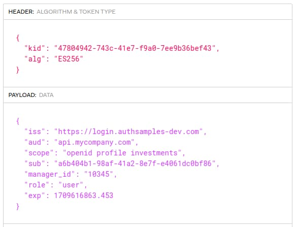

# API Automated Tests

In the previous post I described some <a href='spring-boot-api-coding-model.mdx'>Java Spring Boot API Code Details</a>. Next I explain one way to test OAuth secured APIs, with a focus on *Developer Productivity*.

### Testing with User Level Access Tokens

OAuth secured APIs typically require user level access tokens. It is not immediately obvious how to get one when you are an API developer who wants to call your own API. By default, the user must authenticate, which involves browser redirects and sometimes requires multi-factor authentication.

### Mocking OAuth Infrastructure

When your objective is to focus on API tests, it can be useful to have a test setup that instead mocks OAuth infrastructure, so that it does not get in the way of API testing. You can enable a mock setup with the following steps:

- Create an asymmetric keypair with a public and private key.
- Use a simple HTTP API that exposes the public key in a JWKS URI.
- Use the private key in tests to issue mock access tokens, with full control over the token claims.

The API's security code does not change and you just point the API to a mock JWKS URI for testing. The API continues to validate JWT access tokens, form a claims principal and implement claims based authorization.

### This Blog's OAuth Integration Tests

Each of this blog's final APIs include both integration tests and a basic load test that use the mocking technique. You can use one of the below links to run the API and its tests. This post describes the Node.js API's test code, though the behaviour and source code for .NET and Java is almost identical.

| API Technology | Test Technology |
| -------------- | --------------- |
| <a href='api-architecture-node.mdx'>Node.js</a> | Mocha |
| <a href='net-core-code-sample-overview.mdx'>NET</a> | XUnit |
| <a href='java-spring-boot-api-overview.mdx'>Java</a> | JUnit |

### API Test Configuration

The test configuration that points to a mock JWKS URI can be considered one of the environments in which the API executes. I use the following settings, with a JWKS URI that points to a local computer HTTPS URL rather than the real authorization server:

```json
{
    "oauth": {
        "issuer":                        "testissuer.com",
        "audience":                      "api.authsamples.com",
        "algorithm":                     "ES256",
        "scope":                         "investments",
        "jwksEndpoint":                  "https://login.authsamples-dev.com:447/.well-known/jwks.json",
        "userInfoEndpoint":              "https://login.authsamples-dev.com:447/oauth2/userInfo",
        "jwksCooldownDuration":          0,
        "claimsCacheTimeToLiveMinutes":  15
    }
}
```

Where possible, such as for API tests, the API receives access tokens that use the ES256 token signing algorithm, since it a modern secure option that the vast majority of JWT libraries support. When my APIs integrate with AWS Cognito, which only supports the older *RS256* algorithm at the time of writing, I configure the API to expect that algorithm instead.

### Integration Tests

The final API integration tests consist of a number of code and script resources, to manage setup and execution. Each test acts as an API client and makes HTTPS requests with a JWT access token:

<div className='smallimage'>
    
</div>

The output from tests looks similar to the following screenshot. You could give security tests one or more categories and publish test results to stakeholders to help ensure that the right security tests are written and the correct behaviour frequently verified.


### Mock Authorization Server

A mock authorization server is created at the start of a test run, then torn down once all tests have run:

```typescript
before( async () => {
    await authorizationServer.start();
});

after( async () => {
    await authorizationServer.stop();
});
```

This blog's final APIs use the JOSE libraries from the below table for the JWT handling in their integration tests. The library issues JWT access tokens in an equivalent way to a real authorization server:

| API Technology | JWT Library |
| -------------- | ----------- |
| Node.js | [jose](https://github.com/panva/jose) |
| .NET | [jose-jwt](https://github.com/dvsekhvalnov/jose-jwt) |
| Java | [jose4j](https://bitbucket.org/b_c/jose4j/wiki/Home) |

First the authorization server must create a keypair, containing the private key it will use to sign tokens for the duration of the test session, as well as the public key that is formed into a JSON Web Keyset. I use the open source [Wiremock](https://www.wiremock.io/) tool to provide HTTPS endpoints for the mock authorization server.

```typescript
export class MockAuthorizationServer {

    private readonly baseUrl: string;
    private readonly httpProxy: HttpProxy;
    private readonly algorithm: string;
    private jwk: GenerateKeyPairResult | null;
    private keyId: string;

    public constructor(useProxy = false) {

        this.baseUrl = 'https://login.authsamples-dev.com:447/__admin/mappings';
        this.httpProxy = new HttpProxy(useProxy, 'http://127.0.0.1:8888');
        this.algorithm = 'ES256';
        this.jwk = null;
        this.keyId = Guid.create().toString();
    }

    public async start(): Promise {

        this.jwk = await generateKeyPair(this.algorithm);

        const jwk = await exportJWK(this.jwk.publicKey!);
        jwk.kid = this.keyId;
        jwk.alg = this.algorithm;
        const keys = {
            keys: [
                jwk,
            ],
        };
        const keysJson = JSON.stringify(keys);

        const stubbedResponse = {
            id: this.keyId,
            priority: 1,
            request: {
                method: 'GET',
                url: '/.well-known/jwks.json'
            },
            response: {
                status: 200,
                body: keysJson,
            },
        };

        await this.register(stubbedResponse);
    }

    public async stop(): Promise {
        await this.unregister(this.keyId);
    }
}
```

### Using Mock Access Tokens in Tests

This blog's API tests cover token validation and authorization behaviour. All of these can be tested productively with the following type of syntax. Each test can request an access token with the claims it needs, including user IDs, and there is no need to deal with any OAuth client concerns:

```typescript
it ('Get transactions returns 404 for companies that do not match the regions claim', async () => {

    const jwtOptions = new MockTokenOptions();
    jwtOptions.useStandardUser();
    const accessToken = await authorizationServer.issueAccessToken(jwtOptions);

    const options = new ApiRequestOptions(accessToken);
    const response = await apiClient.getCompanyTransactions(options, 3);

    assert.strictEqual(response.statusCode, 404, 'Unexpected HTTP status code');
    assert.strictEqual(response.body.code, 'company_not_found', 'Unexpected error code');
});
```

The issuing of mock tokens is easily done using the JOSE library. Various types of invalid tokens can be tested to ensure that the API implements its JWT validation correctly.

```typescript
public async issueAccessToken(options: MockTokenOptions): Promise<string> {

    return await new SignJWT( {
            iss: options.issuer,
            aud: options.audience,
            scope: options.scope,
            sub: options.subject,
            manager_id: options.managerId,
            role: options.role,
        })
            .setProtectedHeader( { kid: this.keyId, alg: this.algorithm } )
            .setExpirationTime(options.expiryTime)
            .sign(this.jwk.privateKey);
}
```

You can view mock access tokens issued by the JOSE library in an online JWT viewer. In the following example I ensured that the token contains all of the *scopes* and *claims* that the real authorization server issues:



### Basic Load Test

It is also useful to ensure early that there are no concurrency problems in APIs, when multiple requests are in flight at once for the same operations. This ensures that behaviours such as dependency injection of request scoped objects are reliable when there are multiple parallel API calls.

Therefore this blog's final APIs include a basic API load test. The load test fires 100 requests to the API by default, though this number can be adjusted as required. The test requests rehearse various types of failure condition, and certain error responses are expected:


The load test is just a console application, which uses async await code to fire batches of 5 concurrent HTTP requests at a time to the API. This stays within operating system limits for in-flight requests to the same host, while ensuring that the API continually processes multiple requests:

```typescript
private async executeApiRequests(requests: (() => Promise<ApiResponse>)[]): Promise<void> {

    const total = requests.length;
    const batchSize = 5;
    let current = 0;

    while (current < total) {

        const requestBatch = requests.slice(current, Math.min(current + batchSize, total));
        const batchPromises = requestBatch.map((r) => this.executeApiRequest(r));

        await Promise.all(batchPromises);
        current += batchSize;
    }
}
```

### Analysing Load Test Results

Each API request in the load test also sends input fields that are logged, to provide good troubleshooting options:

| Field | Description |
| ----- | ----------- |
| Session ID | An identifier to partition all requests in the load test together, so that any log analysis can ignore other log entries. |
| Correlation ID | An identifier for a single request, to enable slow or failed requests to be quickly looked up. |
| Client Name | The name of the load test, as a mechanism to find all load test sessions. |

If a load test results in suboptimal results, the load tester could interrogate logs to understand why, using <a href='api-technical-support-analysis.mdx'>technical support analysis queries</a>.

### Where Are We?

I enabled this blog's final APIs to be productively tested as a standalone component, using mock OAuth infrastructure. The testing also verifies that the API's error handling and logging behaviours work as expected when the multiple concurrent requests are in flight.

### Next

- Next I explain how to enable an <a href='log-aggregation-setup.mdx'>OAuth Log Aggregation Setup</a>.
- For a list of all blog posts see the <a href='index.mdx'>Index Page</a>.
