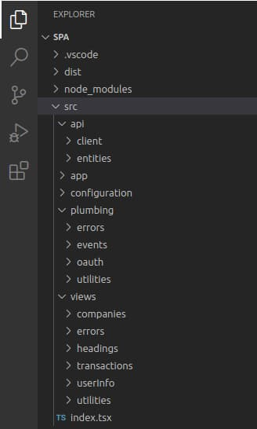

# API Journey – Client Side

Previously I summarised some backend technical behaviours in <a href='api-journey-server-side.mdx'>API Journey – Server Side</a>. Next I summarize some end-to-end technical behaviours for OAuth-secured applications, which this blog’s final frontend code samples implement in multiple technologies:

- <a href='final-spa-overview.mdx'>Final SPA</a>
- <a href='final-desktop-sample-overview.mdx'>Final Desktop App</a>
- <a href='android-code-sample-overview.mdx'>Final Android App</a>
- <a href='ios-code-sample-overview.mdx'>Final iOS App</a>

### Configuration

OAuth clients typically load their configuration at startup, to get details such as API base URLs and OAuth settings. A native app might use the following example configuration settings:

```json
{
    "app": {
        "apiBaseUrl": "https://api.authsamples.com/investments",
    },
    "oauth": {
        "authority":             "https://cognito-idp.eu-west-2.amazonaws.com/eu-west-2_qqJgVeuTn",
        "clientId":              "1h8pildfi6a4bmfv2alj3fs6va",
        "redirectUri":           "https://www.authsamples.com/apps/finaldesktopapp/postlogin.html",
        "privateSchemeName":     "x-authsamples-desktopapp",
        "scope":                 "openid profile https://api.authsamples.com/investments",
        "customLogoutEndpoint":  "https://login.authsamples.com/logout",
        "postLogoutRedirectUri": "https://www.authsamples.com/apps/finaldesktopapp/postlogout.html",
        "logoutCallbackPath":    "/logoutcallback"
    }
}
```

### Views

In most modern frontend technology stacks, the application usually starts with a main view or application shell:

```jsx
const root = ReactDOM.createRoot(document.getElementById('root') as HTMLElement);
root.render (
    <StrictMode>
        <ErrorBoundary>
            <BrowserRouter basename={BasePath.get()}>
                <App {...props} />
            </BrowserRouter>
        </ErrorBoundary>
    </StrictMode>
);
```

The shell then lays out a tree of views, some of which call APIs when they load. This results in multiple API requests that execute or are in-flight concurrently:

```jsx
<>
    <TitleView {...getTitleProps()} />
    <HeaderButtonsView {...getHeaderButtonProps()} />
    {model.error && <ErrorSummaryView {...getErrorProps()} />}
    {model.isLoaded &&
        <>
            <SessionView {...getSessionProps()} />
            <Routes>
                <Route path='/companies/:id' element={<TransactionsContainer {...getTransactionsProps()} />} />
                <Route path='/loggedout'     element={<LoginRequiredView {...getLoginRequiredProps()} />} />
                <Route path='/*'             element={<CompaniesContainer {...getCompaniesProps()} />} />
            </Routes>
        </>
    }
</>
```

### This Blog’s Example Views

This blog’s frontend code samples are fictional apps based on a theme of protecting money-based data. The business area is *investments*, where *company* and *transaction* resources are administered by some kind of *manager*. There are two users, where the first has business permissions to one region:


The second user has higher privileges, for multiple regions:


The first view displays a collection of *company* resources that APIs filter to only return authorized items for the user. The second view shows *transactions* for an individual *company*, as represented by the ID in the browser's URL. A user who changes the browser URL to an unauthorized resource is denied access:


The API uses the following user attributes and frontend views visualise the use of claims:

| User Attribute | Represents |
| -------------- | ---------- |
| Scope | The main scope in the client’s access token is called *investments* to represent a business area. |
| Manager ID | The API receives a useful business user identity in access tokens sent by the client. |
| Role | The authorization server stores a role claim for each user, with values of *admin* or *user*, and issues it to access tokens. |
| Regions | APIs use an array of allowed regions as an example of fine-grained business permissions not issued to access tokens. |
| Name | Clients download data from the OpenID Connect userinfo endpoint, then display the *given_name* and *family_name* fields. |
| Title | The title is an example product-specific user attribute which clients display in a tooltip. |

This use of claims is similar to that in any moderately complex real-world system, with some <a href='user-data.mdx'>user attributes</a> stored in the identity data and others in the business data. Clients and APIs operate on both types of user attribute, in a way that you can easily extend.

### Views, Models and Data Loading

For a React app, I use code similar to the following to load views and call APIs. The view asks its view model to fetch data from APIs, which takes place asynchronously to avoid blocking the UI thread. The view then binds to the model’s data, or renders an error when API requests fail unexpectedly:

```typescript
export function CompaniesContainer(props: CompaniesContainerProps): JSX.Element {

    const model = props.viewModel;
    model.useState();

    useEffect(() => {
        startup();
        return () => cleanup();
    }, []);

    CurrentLocation.path = useLocation().pathname;

    async function startup(): Promise<void> {
        model.eventBus.on(EventNames.ReloadData, onReload);
        await loadData();
    }

    function cleanup(): void {
        model.eventBus.detach(EventNames.ReloadData, onReload);
    }

    async function loadData(options?: ViewLoadOptions): Promise<void> {
        await model.callApi(options);
    }

    return (
        <>
            ...
        </>
    );
}
```

The view model calls a lower-level fetch client to do the work of calling the API, then updates data bound to the view, which triggers a rendering update:

```typescript
public async callApi(options?: ViewLoadOptions): Promise<void> {

    const fetchOptions = {
        cacheKey: FetchCacheKeys.Companies,
        forceReload: options?.forceReload || false,
        causeError: options?.causeError || false,
    };

    this._viewModelCoordinator.onMainViewModelLoading();
    this._updateError(null);
    this._updateCompanies([]);

    try {

        const result = await this._apiClient.getCompanyList(fetchOptions);
        if (result) {
            this._updateCompanies(result);
        }

    } catch (e: any) {

        this._updateError(ErrorFactory.fromException(e));
        this._updateCompanies([]);

    } finally {

        this._viewModelCoordinator.onMainViewModelLoaded(fetchOptions.cacheKey);
    }
}
```

### View Recreation

In modern frontend stacks like React, Android Jetpack Compose or Swift UI, views get recreated many times, but you create view models and data only once. To enforce this, React strict mode immediately re-creates each view while any async code in the *useEffect* hook executes. The idea is to force developers to write efficient clients that only send necessary APIs requests. 

I therefore cache API responses to HTTP GET requests in the frontend, in a thread safe dictionary with a URL based cache key. When an HTTP GET response exists already in the fetch cache, I therefore avoid the overhead of an API request. The caching makes the views feel fast during forward or back navigation, and also lightens the load on APIs.

```typescript
export class FetchCache {
    private readonly _requests: Record<string, FetchCacheItem> = {};
}
```

### Detecting Login Required

When frontends first make API requests, they do not have an API message credential so cannot call APIs. The fetch client throws a *login_required* error which the fetch cache stores. Multiple views could throw this error at the same time so a *ViewModelCoordinator* object waits for all views to try to load, then inspects the fetch cache. When required, it publishes an event that the main view subscribes to. The main view's handler then triggers a login redirect.

### Running a Code Flow

To get a correct access token for the user, the client must run an OpenID Connect authorization code flow, to initiate user authentication. To do the work, I aim to plug in a respected standards-based third-party library, or backend for frontend in the case of the SPA.

I wrap the use of libraries in an *Authenticator* interface that is useful to the rest of the application's code. In the event of library limitations or problems you could swap out the implementation without impacting the rest of the app. If required, it is fairly easy to write your own logic that implements a code flow and other lifecycle operations.

### Login User Experience

User logins appear slightly differently for web, desktop and mobile platforms and in all cases I only demonstrate simple password-based logins. For a web client I redirect the entire browser window.


For mobile clients an integrated browser overlays the views, which wait on the response:

<div className='smallimage'>
    
</div>

For a desktop client, the app renders a *login in progress* window, while the user signs in with a disconnected system browser:


After login, the frontend client has an API message credential and can make API requests. The final SPA transports access tokens using cookies that expire when the user closes all browser windows. Native apps instead save tokens using operating system secure storage, to avoid a re-login on every application restart.

Although I only demonstrate password logins, use of a code flow means that all of this blog's clients support <a href='federated-logins.mdx'>any form of user authentication</a> that the authorization server supports.  Changing authentication should usually require zero code changes to applications.

### Concurrent API Requests

This blog's final clients send an API request to get the current main view’s data, as well as two small API requests to get user info for the upper right view:


The user can then navigate around views to trigger further API calls, if that view’s data is not yet loaded. A forced reload of data is possible by clicking the reload button, which re-runs the 3 API requests concurrently.

### Expiry Events

At some point the access token sent to APIs expires. You can rehearse this by clicking *Expire Access Token* followed by *Reload Data*. This triggers three concurrent API requests that fail with a 401 error, followed by a single synchronized token refresh request. The client then retries all API requests with its new access token:


Any resilient client should support this behaviour, since there could be multiple reasons why APIs reject access tokens with a 401 error. When multiple views call APIs concurrently you must also synchronize token refresh to prevent race conditions with single-use refresh tokens. This blog's clients do so using a concurrency handler utility object:

```typescript
public async synchronizedRefresh(): Promise<void> {
    await this._concurrencyHandler.execute(this._performTokenRefresh);
}
```

The concurrency handler queues up promises in a thread-safe array, then only makes the actual refresh call for the first caller, then returns the same result to all callers:

```typescript
public async execute(action: () => Promise<void>): Promise<void> {

    const promise = new Promise<void>((resolve, reject) => {

        const onSuccess = () => {
            resolve();
        };

        const onError = (error: any) => {
            reject(error);
        };

        this._callbacks.push([onSuccess, onError]);
    });

    const performAction = this._callbacks.length === 1;
    if (performAction) {

        try {

            await action();

            this._callbacks.forEach((c) => {
                c[0]();
            });

        } catch (e: any) {

            this._callbacks.forEach((c) => {
                c[1](e);
            });
        }

        this._callbacks = [];
    }

    return promise;
}
```

Eventually the client's refresh token also expires. This can be simulated by clicking *Expire Refresh Token* followed by *Reload Data*. The token refresh request then returns an *invalid_grant* error code. The client then triggers another login redirect, in the same way as the initial login redirect.

### Deep Linking

All of this blog’s UIs support deep linking, to enable users to bookmark locations within the app. An example deep linking URL for each of the final clients is shown here:

| Client Type | Deep Linking URL |
| ----------- | ---------------- |
| SPA | *https://www.authsamples.com/spa/companies/2* |
| Desktop | *x-authsamples-desktopapp:/companies/2* |
| Android | *https://mobile.authsamples.com/finalmobileapp/deeplink/companies/2* |
| iOS | *https://mobile.authsamples.com/finalmobileapp/deeplink/companies/2* |

These commands initiate views which in turn initiate API requests. APIs return 401 responses if an access token expires or if the user needs to re-authenticate. In such cases this blog’s frontends always run the requested view once any OAuth work is complete, so that bookmarking works correctly for users.

### Clients and APIs are Supportable

Clients and APIs follow this blog’s approach to <a href='error-handling-and-supportability.mdx'>Error Handling and Supportability</a>. API or OAuth requests could fail, in which case the view renders an *Error Summary* link. You can rehearse API 500 errors by long-pressing the *Reload Data* button for a few seconds:


Clicking an *Error Summary* link invokes an *Error Details* dialog that provides hints to technical support staff on the cause. When API exceptions occur, clients receive an *Error ID* in the response, which references an entry in API logs. The client renders this value to help enable fast incident resolution:


The *API Session ID* shown in the browser is nothing to do with OAuth or security. Instead, it enables a technical user of the SPA to query the API logs their session generates. See the <a href='api-technical-support-analysis.mdx'>Technical Support Analysis</a> post for details.

### Clients Handle Advanced Failures

OAuth clients can experience some advanced failure scenarios that can be difficult to reason about, due to the three way relationship between the client, the  APIs it calls and the authorization server. The best way to deal with error events reliably is to rehearse them.

| Failure Scenario | Resilient Application Behaviour |
| ---------------- | ------------------------------- |
| Key Renewal | Token signing keys, or cookie encryption keys used by SPAs, are sometimes renewed in an abrupt way. This blog’s clients handle 401 API responses after which token refresh would fail with a session expired error. This causes a new login redirect and avoids user errors. |
| Redirect Loops | This blog’s apps don’t trigger an authorization redirect when APIs return permanent 401 errors. Instead, redirects only occur when there is no access token yet or if token refresh fails with a session expired error. Doing so prevents the possibility of redirect loops. |
| Invalid Tokens | OAuth configuration mistakes can result in access tokens that APIs permanently reject, even though token refresh works. The client should then present an error, but clear token state. The client can then prompt the user to run a new authorization redirect. This enables the client to get a corrected access token and avoids the user being stuck. |

### Client Responsibilities are Separated

To provide the behaviours that I articulate, this blog's API require some plumbing code. A folder structure classifies each class as *view* related or *plumbing* related. In real clients you might externalise some of the plumbing to one or more shared libraries. The goal in a real organization would be to use clean, scalable code for the valuable views and view models.

<div className='smallimage'>
    
</div>

### Developers Run a Productive Setup

This blog's client development setup enables you to run client code while pointing to remote API URLs. This includes deploying a remote backend for frontend to enable productive SPA development. You run end-to-end setups with URLs that use SSL and domain names. This best enables deployment related thinking during development.


### Where Are We?

I summarised a non-functional journey for clients, where OAuth does not create the complexity. The same intricacies would exist with any other security framework. In this blog, I deal with foundational areas as early as possible in the software pipeline, on a development computer. Doing so should improve quality and result in more predictable business delivery.

### Next

- Next I explain this blog’s <a href='effective-api-logging.mdx'>Effective API Logging</a> design.
- For a list of all blog posts see the <a href='index.mdx'>Index Page</a>.
