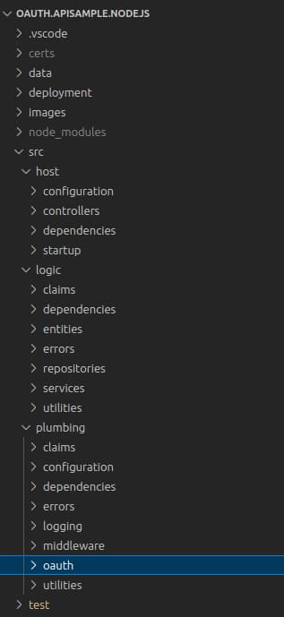

# API Journey – Server Side

Previously I summarised this blog’s <a href='api-platform-design.mdx'>API Platform Overview</a> to express some essential high-level ingredients. Next I summarise some end-to-end technical behaviors for OAuth-secured APIs, which I implemnt in this blog’s final API code samples, in multiple technology stacks:

- <a href='api-architecture-node.mdx'>Final Node.js API</a>
- <a href='net-core-code-sample-overview.mdx'>Final .NET API</a>
- <a href='java-spring-boot-api-overview.mdx'>Final Java API</a>

### Configuration

APIs start by loading their configuration, which includes OAuth settings needed to follow JWT validation best practices:

```json
{
  "oauth": {
    "issuer":                       "https://login.authsamples-dev.com",
    "audience":                     "api.authsamples.com",
    "scope":                        "investments",
    "jwksEndpoint":                 "https://login.authsamples-dev.com:447/.well-known/jwks.json",
    "claimsCacheTimeToLiveMinutes": 15
  }
}
```

### Dependencies

APIs often follow a dependency injection based model and register object instances and lifetimes when the API starts up:

```typescript
public static registerDependencies(container: Container): void {

    container.bind<UserInfoController>(SAMPLETYPES.UserInfoController)
        .to(UserInfoController).inRequestScope();
    container.bind<CompanyController>(SAMPLETYPES.CompanyController)
        .to(CompanyController).inRequestScope();

    container.bind<CompanyService>(SAMPLETYPES.CompanyService)
        .to(CompanyService).inTransientScope();
    container.bind<CompanyRepository>(SAMPLETYPES.CompanyRepository)
        .to(CompanyRepository).inTransientScope();
    container.bind<UserRepository>(SAMPLETYPES.UserRepository)
        .to(UserRepository).inTransientScope();
    container.bind<JsonFileReader>(SAMPLETYPES.JsonFileReader)
        .to(JsonFileReader).inTransientScope();
}
```

When working with small dependency graphs I use request-scoped lifetimes for HTTP-based objects like controllers, or transient lifetimes for non-HTTP objects like services. This helps to ensure that concurrent requests cannot adversely affect each other.

### Middleware

I use singleton middleware objects for tasks such as OAuth authorization, logging and exception handling:

```typescript
export class UnhandledExceptionHandler {

    public handleException(exception: any, request: Request, response: Response, next: NextFunction): void {
        ...
    }
}
```

### Entry Points

I express entry points to API operations declaratively, using the HTTP path and method:

```typescript
@controller('/companies')
export class CompanyController extends BaseHttpController {

    private readonly _service: CompanyService;

    public constructor(@inject(SAMPLETYPES.CompanyService) service: CompanyService) {
        super();
        this._service = service;
    }

    @httpGet('/:id/transactions')
    public async getCompanyTransactions(@requestParam('id') id: string): Promise<CompanyTransactions> {
        return this._service.getCompanyTransactions(id);
    }
}
```
### Async for High Throughput

Most APIs spend the vast majority of their execution time for an API request waiting on completion of asynchronous I/O events. Most commonly this involves database access or calls to an upstream API. This blog’s APIs use modern and standard *async await* code in all technologies, to avoid blocking, so that each thread can process additional API requests during the I/O completion of other requests.

### Zero Trust API Security

This blog’s API code samples receive the following format of access token, which includes custom claims for *manager_id* and *role*:

```json
{
  "iss": "https://login.authsamples-dev.com",
  "aud": "api.authsamples.com",
  "scope": "openid profile investments",
  "sub": "a6b404b1-98af-41a2-8e7f-e4061dc0bf86",
  "manager_id": "10345",
  "role": "user",
  "exp": 1715630456.455
}
```

The API validates a JWT access token on every request, after which the API trusts the token claims. The API's then implements its business authorization, using *scopes* and *claims* from the access token's payload.

```typescript
public async validateAccessToken(accessToken: string): JwtClaims {

    const options = {
        algorithms: ['RS256'],
        issuer: this._configuration.issuer,
        options.audience = this._configuration.audience;
    } as JWTVerifyOptions;

    const result = await jwtVerify(accessToken, this._jwksRetriever.remoteJWKSet, options);
    return  result.payload;
}
```

### Portable OAuth Implementation

I implement portable API security without depending on API frameworks in particualar technology stacks. Instead, I use JavaScript Object Signing and Encryption (JOSE) libraries with up-to-date options for working with JWTs and their signing keys. I believe that a library-based approach enables the best understanding and control over the important behaviors.

| Technology | JOSE Library |
| ---------- | ------------ |
| Node.js | [jose](https://github.com/panva/jose) |
| .NET | [jose-jwt](https://github.com/dvsekhvalnov/jose-jwt) |
| Java | [jose4j](https://bitbucket.org/b_c/jose4j/wiki/Home) |

### APIs Use Extensible Claims

APIs must collect values for their business authorization. This code often requires more data than just the token claims, to enforce fine-grained business permissions. There are various ways in which you could manage this requirement. In this blog I show how to extend OAuth middleware to build a useful claims object. You can read more about the approach in the <a href='api-authorization-design.mdx'>API Authorization Behaviour</a> blog post.

```typescript
export class ClaimsPrincipal {
    public jwtClaims: JWTPayload;
    public extraClaims: ExtraClaims;
}
```

This blog's APIs and clients work with the following user attributes, which are either issued to the access token or derived from token claims. Values in access tokens are JWT claims in the claims principal and my APIs consider other values to be extra claims.

| User Attribute | Represents |
| -------------- | ---------- |
| Scope | The main scope in the client’s access token is called *investments* to represent a business area. |
| Manager ID | The API receives a useful business user identity in access tokens sent by the client. |
| Role | The authorization server stores a role claim for each user, with values of *admin* or *user*, and issues it to access tokens. |
| Regions | APIs use an array of allowed regions as an example of fine-grained business permissions not issued to access tokens. |
| Name | Clients download data from the OpenID Connect userinfo endpoint, then display the *given_name* and *family_name* fields. |
| Title | The title is an example product-specific user attribute which clients display in a tooltip. |

### APIs Authorize Access to Data

I inject the claims object produced by OAuth middleware into business logic classes that need it. The example APIs authorize access to *company* and *transaction* resources. The data needed to enable correct API authorization is readily available:

```typescript
@injectable()
export class CompanyService {

    private readonly _repository: CompanyRepository;
    private readonly _claims: SampleClaimsPrincipal;

    public constructor(
        @inject(SAMPLETYPES.CompanyRepository) repository: CompanyRepository,
        @inject(BASETYPES.ClaimsPrincipal) claims: ClaimsPrincipal) {

        this._repository = repository;
        this._claims = claims as SampleClaimsPrincipal;
    }

    public async getCompanyTransactions(companyId: number): Promise<CompanyTransactions> {

        const data = await this._repository.getCompanyTransactions(companyId);

        if (!data || !this._isUserAuthorizedForCompany(data.company)) {
            throw this._unauthorizedError(companyId);
        }

        return data;
    }
}
```

The authorization logic could be written in various other ways. The claims principal is a natural request-scoped object, so there could be other ways to inject it. My personal preference is to use constructor injection.

### Testable OAuth Implementation

You should test OAuth API security frequently as part of a secure API development lifecycle. This blog’s final APIs use tests that <a href='api-automated-tests.mdx'>mock the authorization server</a>. This technique enables you to easily control access tokens when you write integration tests on a development computer. I use the same JOSE library for both API access token validation and test code that produces JWTs.

```typescript
describe('OAuth API Tests', () => {

    before( async () => {
        await authorizationServer.start();
    });

    after( async () => {
        await authorizationServer.stop();
    });
    
    it ('Call API returns 403 for invalid scope', async () => {

        const jwtOptions = new MockTokenOptions();
        jwtOptions.useStandardUser();
        jwtOptions.scope = 'openid profile';
        const accessToken = await authorizationServer.issueAccessToken(jwtOptions);

        const options = new ApiRequestOptions(accessToken);
        const response = await apiClient.getCompanyList(options);

        assert.strictEqual(response.statusCode, 403, 'Unexpected HTTP status code');
        assert.strictEqual(response.body.code, 'insufficient_scope', 'Unexpected error code');
    });
}
```

### API Returns Friendly Errors to Clients

One of the reasons why I use a JOSE library is to take finer control of OAuth error responses for clients. For most API errors I return a client-friendly object containing a *code* and *message*. When APIs serve frontend clients, I use the same response format for OAuth errors:

```json
{
  "code": "invalid_token",
  "message": "Missing, invalid or expired access token"
}
```

When there is a server error, the API returns additional information to support client error displays. This helps to enable fast problem resolution by support engineers:

```json
{
  "code": "exception_simulation",
  "message": "An unexpected exception occurred in the API",
  "id": 79072,
  "area": "FinalApi",
  "utcTime": "2022-07-24T10:28:00.438Z"
```

### API Writes Queryable Logs

I design API request logs to be easy for people to query. When there is a client error I write a log entry similar to this:

```json
{
  "id": "7af62b06-8c04-41b0-c428-de332436d52a",
  "utcTime": "2022-07-24T10:27:33.468Z",
  "apiName": "FinalApi",
  "operationName": "getCompanyTransactions",
  "hostName": "MACSTATION.local",
  "method": "GET",
  "path": "/investments/companies/2/transactions",
  "resourceId": "2",
  "clientName": "FinalSPA",
  "statusCode": 401,
  "errorCode": "invalid_token",
  "millisecondsTaken": 2,
  "correlationId": "15b030a2-c67d-01ae-7c3f-237b9a70dbba",
  "sessionId": "77136323-ec8c-dce2-147a-bc52f34cb7cd",
  "errorData": {
    "statusCode": 401,
    "clientError": {
      "code": "invalid_token",
      "message": "Missing, invalid or expired access token"
    },
    "context": "JWT verification failed : signature verification failed"
  }
}
```

When there is a server error I write a log entry that includes a unique *Error ID* to represent the exact error occurrence. This enables fast error lookup where the cause is captured by the stack trace and other details.

```json
{
  "id": "b36701c9-ddf2-d7da-df48-4dfcc918009b",
  "utcTime": "2022-07-24T10:28:00.435Z",
  "apiName": "FinalApi",
  "operationName": "getCompanyTransactions",
  "hostName": "MACSTATION.local",
  "method": "GET",
  "path": "/investments/companies/2/transactions",
  "resourceId": "2",
  "clientName": "FinalSPA",
  "userId": "a6b404b1-98af-41a2-8e7f-e4061dc0bf86",
  "statusCode": 500,
  "errorCode": "exception_simulation",
  "errorId": 79072,
  "millisecondsTaken": 9,
  "correlationId": "5f1f1bcb-79c4-00ee-a1fe-be5e4262eb75",
  "sessionId": "77136323-ec8c-dce2-147a-bc52f34cb7cd",
  "errorData": {
    "statusCode": 500,
    "clientError": {
      "code": "exception_simulation",
      "message": "An unexpected exception occurred in the API",
      "id": 79072,
      "area": "FinalApi",
      "utcTime": "2022-07-24T10:28:00.438Z"
    },
    "serviceError": {
      "details": "",
      "stack": [
        "Error: An unexpected exception occurred in the API",
        "at Function.createServerError (/Users/gary/dev/oauth.apisample.nodejs/src/plumbing/errors/errorFactory.ts:16:16)",
        "at CustomHeaderMiddleware.processHeaders (/Users/gary/dev/oauth.apisample.nodejs/src/plumbing/middleware/customHeaderMiddleware.ts:27:36)",
        "at Layer.handle [as handle_request] (/Users/gary/dev/oauth.apisample.nodejs/node_modules/express/lib/router/layer.js:95:5)",
        "at trim_prefix (/Users/gary/dev/oauth.apisample.nodejs/node_modules/express/lib/router/index.js:328:13)",
        "at /Users/gary/dev/oauth.apisample.nodejs/node_modules/express/lib/router/index.js:286:9",
        "at param (/Users/gary/dev/oauth.apisample.nodejs/node_modules/express/lib/router/index.js:365:14)",
        "at param (/Users/gary/dev/oauth.apisample.nodejs/node_modules/express/lib/router/index.js:376:14)",
        "at Function.process_params (/Users/gary/dev/oauth.apisample.nodejs/node_modules/express/lib/router/index.js:421:3)",
        "at next (/Users/gary/dev/oauth.apisample.nodejs/node_modules/express/lib/router/index.js:280:10)",
        "at ClaimsCachingAuthorizer.authorizeRequestAndGetClaims (/Users/gary/dev/oauth.apisample.nodejs/src/plumbing/security/baseAuthorizer.ts:62:13)"
      ]
    }
  }
}
```

The logs enable <a href='api-technical-support-analysis.mdx'>people-focused technical support queries</a> to measure errors or slowness. For example, you can produce a breakdown of errors by type and frequency for a time period. You can then iron out any reliability issues as part of your quality processes.

### API Responsibilities are Separated

To provide the behaviours that I articulate, this blog's API require some plumbing code. A folder structure classifies each class as *host*, *logic* or *plumbing*. In real APIs you might externalise some of the plumbing to one or more shared libraries. The goal in a real organization would be to use clean, scalable code for the valuable business logic.

<div className='smallimage'>
    
</div>

### Developers Run a Productive Setup

This blog's API development setup enables the developer to work on API code in isolation, which is the option that works best most of the time. When required, you can also run more advanced end-to-end setups with this blog's clients and APIs. When integrating with clients, this blog's API development URLs use SSL and domain names. This best enables deployment related thinking during development.


### Where Are We?

I summarised a non-functional journey for APIs, where OAuth does not create the complexity. The same intricacies would exist with any other security framework. In this blog, I deal with foundational areas as early as possible in the software pipeline, on a development computer. Doing so should improve quality and result in more predictable business delivery.

### Next

- Next I take an equivalent look at the <a href='api-journey-client-side.mdx'>API Journey – Client Side</a>.
- For a list of all blog posts see the <a href='index.mdx'>Index Page</a>.
