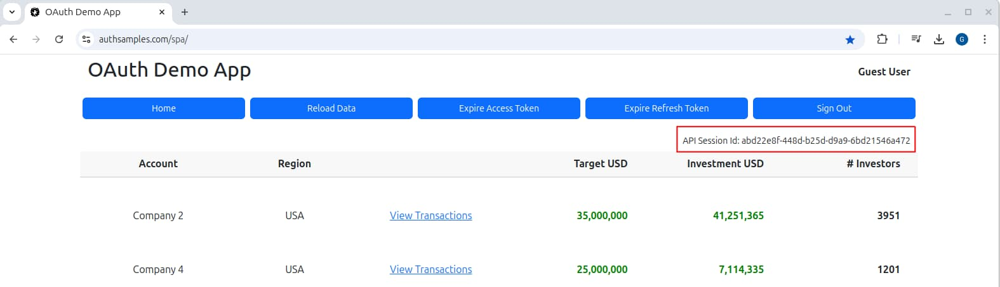

# API Technical Support Analysis

Previously I provided a <a href='log-aggregation-setup.mdx'>Log Aggregation Setup</a> to deploy tooling that enables log queries. This post shows how different technical stakeholders could then query the log aggregation system productively to support APIs. You could enable such a solution with this blog's <a href='effective-api-logging.mdx'>Effective API Logging</a> design.

If you run an API and client you can use the client to initiate multiple requests to the API, then use the Kibana system to query the API logs you generate. The main focus of this post is control over log data, so I only use the *Dev Tools* console. I consider log queries for three roles of log user: *DevOps*, *Testers* and *Developers*.


### 1. DevOps Technical Support Queries

DevOps teams need effective filtering to understand systems under load, where there may be 100,000 or more API requests per day.

### 1.1. Production Incident Drill Down

Consider an incident that occurred yesterday at 9:00pm in your time zone, reported via the following screenshot in an email. This blog's final frontend code samples enable you to simulate a user experiencing a problem due to a backend error, by long pressing the *Reload Data* button for a couple of seconds:


You can quickly look up exception details with the following format of query. This matches the *Fairly Unique Identifier* that the frontend displays. You can design this identifier to be easy for users to read, write or say.

```markdown
GET apilogs*/_search
{ 
  "query":
  {
    "match":
    {
      "errorId": 54308
    }
  }
}
```

This is a *Lucene* query whose response is zero or more documents. A DevOps user can quickly access the underlying server error details and find the cause. The important behaviour is to get to the failing code area, which is just an error simulation in the below log entry.

```json
{
    "_index": "apilogs-2022.09.26",
    "_id": "17580a1c-1631-f80f-e32e-9e237d47cbab",
    "_score": 1,
    "_source": {
    "hostName": "finalapi-544cf4b557-ntvrg",
    "resourceId": "2",
    "apiName": "FinalApi",
    "method": "GET",
    "errorCode": "exception_simulation",
    "millisecondsTaken": 4,
    "operationName": "getCompanyTransactions",
    "sessionId": "720078f3-bd50-e9f1-26d4-2b7c9e606402",
    "userId": "a6b404b1-98af-41a2-8e7f-e4061dc0bf86",
    "errorData": {
        "serviceError": {
            "stack": [
            "Error: An unexpected exception occurred in the API",
            "at Function.createServerError (/usr/api/dist/plumbing/errors/errorFactory.js:15:16)",
            "at CustomHeaderMiddleware.processHeaders (/usr/api/dist/plumbing/middleware/customHeaderMiddleware.js:22:51)",
            "at Layer.handle [as handle_request] (/usr/api/node_modules/express/lib/router/layer.js:95:5)",
            "at trim_prefix (/usr/api/node_modules/express/lib/router/index.js:328:13)",
            "at /usr/api/node_modules/express/lib/router/index.js:286:9",
            "at param (/usr/api/node_modules/express/lib/router/index.js:365:14)",
            "at param (/usr/api/node_modules/express/lib/router/index.js:376:14)",
            "at Function.process_params (/usr/api/node_modules/express/lib/router/index.js:421:3)",
            "at next (/usr/api/node_modules/express/lib/router/index.js:280:10)",
            "at ClaimsCachingAuthorizer.authorizeRequestAndGetClaims (/usr/api/dist/plumbing/security/baseAuthorizer.js:51:13)"
            ],
            "details": ""
        },
        "clientError": {
            "area": "FinalApi",
            "code": "exception_simulation",
            "utcTime": "2023-03-26T10:57:28.482Z",
            "id": 54308,
            "message": "An unexpected exception occurred in the API"
        },
        "statusCode": 500
    },
    "path": "/investments/companies/2/transactions",
    "@timestamp": "2023-03-26T10:57:28.482Z",
    "name": "total",
    "utcTime": "2023-03-26T10:57:28.482Z",
    "correlationId": "fa20ca8e-8506-c4f0-9217-1cac1a83a2c8",
    "errorId": 48649,
    "id": "17580a1c-1631-f80f-e32e-9e237d47cbab",
    "clientName": "FinalSPA",
    "statusCode": 500
}
```

I denormalise certain error fields to the top level, to enable instances or error code to be used in SQL queries:

```markdown
POST _sql?format=txt
{"query": """
SELECT
  utcTime,
  operationName,
  clientName,
  sessionId,
  statusCode,
  userId 
FROM
  "apilogs*"
WHERE
  errorCode='exception_simulation' 
AND
  utcTime between '2019-08-16T09:30:00' and '2019-08-16T10:30:00'
ORDER BY
  utcTime ASC
"""}
```

For this type of query, the output format in the Kibana frontend is a tabular list of columns that shows *how often* this type of error has occurred and for *which users*:

```markdown
|   apiName    |    operationName     |clientName|  statusCode   |     errorCode      |                userId             |
---------------+----------------------+---------------------+---------------+--------------------+------------------------------------
FinalApi      |getCompanyTransactions|FinalSPA             |500            |exception_simulation|a6b404b1-98af-41a2-8e7f-e4061dc0bf86
```

Support staff can also query *what else the user was doing* around this time, to identify usage patterns that led to the incident:

```markdown
POST _sql?format=txt 
{"query": """
SELECT
  apiName,
  method,
  path,
  clientName,
  statusCode,
  errorCode
FROM
  "apilogs*"
WHERE
  sessionId='720078f3-bd50-e9f1-26d4-2b7c9e606402'
ORDER BY
  utcTime ASC
LIMIT 100
"""}
```

This query returns results similar to the following and provides a clear picture of the user’s technical activity against APIs:

```markdown
|   apiName    |    method     |            path                      |clientName|  statusCode   |     errorCode      |
|--------------+---------------+--------------------------------------+---------------------+---------------+--------------------|
|FinalApi     |GET            |/investments/companies                |FinalSPA             |200            |null                |
|FinalApi     |GET            |/investments/userinfo                 |FinalSPA             |200            |null                |
|FinalApi     |GET            |/investments/companies/2/transactions |FinalSPA             |200            |null                |
|FinalApi     |GET            |/investments/userinfo                 |FinalSPA             |401            |invalid_token       |
|FinalApi     |GET            |/investments/companies/2/transactions |FinalSPA             |401            |invalid_token       |
|FinalApi     |GET            |/investments/companies/2/transactions |FinalSPA             |200            |null                |
|FinalApi     |GET            |/investments/userinfo                 |FinalSPA             |200            |null                |
|FinalApi     |GET            |/investments/companies/2/transactions |FinalSPA             |500            |exception_simulation|
```

This can provides powerful ways to enable DevOps staff to resolve code-level problems, and enable qualities like DevOps resolving 80% of production incidents without the need to involve a specialist developer.

### 1.2. Querying by Resource IDs

Some systems only display errors in terms of a business identifier, such as a resource ID. In some cases, these IDs are included in URL path segments:

```markdown
PUT /orders/123/items/456-789
```

When this is the case, the API logging saves the dynamic REST path segments into a *resourceId* field, and for the above URL its value would be *123/456-789*. You might use a partial match to locate the full data:

```markdown
POST _sql?format=txt
{
  "query": """SELECT * from "apilogs*" where resourceId like '%456-789%'"""
}
```

When designing APIs, avoid secure values in URL path segments. You then avoid the potential for a man-in-the-middle to change them. Instead, deliver secure values used for authorization to APIs in JWT access tokens.

### 1.3. Reporting Failure Occurrences

It can be common in software for there to be intermittent problems which people ignore, but they then re-occur at highly inconvenient times. Good logging can ensure the visibility of failures or slowness, so that you can see where you might need to improve:

```markdown
POST _sql?format=txt
{"query": """
SELECT
  clientName,
  apiName,
  operationName,
  statusCode,
  errorCode,
  COUNT(1) as frequency
FROM
  "apilogs*"
WHERE
  errorCode IS NOT NULL 
AND
  statusCode <> 401
AND
  utcTime > '2019-08-01' 
GROUP BY
  clientName,
  apiName,
  operationName,
  statusCode,
  errorCode
"""}
```

You might issue production reliability reports for APIs every two weeks. Each type of issue should be understood, and you could plan actions such as adding more log detail when needed.

```markdown
|clientName|    apiName    |    operationName     |  statusCode   |     errorCode      |   frequency   |
|---------------------+---------------+----------------------+---------------+--------------------+---------------|
|FinalSPA             |FinalApi      |getCompanyTransactions|404            |company_not_found   |6              |
|FinalSPA             |FinalApi      |getCompanyList        |500            |exception_simulation|2              |
|FinalSPA             |FinalApi      |getCompanyList        |500            |server_error        |7              |
|BasicIosApp          |FinalApi      |getCompanyTransactions|500            |file_read_error     |1              |
|BasicAndroidApp      |FinalApi      |getCompanyTransactions|400            |invalid_company_id  |1              |
|BasicDesktopApp      |FinalApi      |getUserInfo           |500            |server_error        |2              |
```

Note that some 400 errors are part of normal application flows or just indicate early errors when you get integrated. You can ignore these occurrences, whereas others might point to a bug. For example, incorrect handling of Unicode characters might cause some 400 errors.

### 2. Productive Quality Assurance

You can use technical support logs for testing, to force all errors and slowness to be visible early in the deployment pipeline.

### 2.1. Analysing your own UI Session

Our sample UIs all send a *Session ID* to the API via a custom header. This field is nothing to do with OAuth or authenticated user sessions, and is only used for log filtering:



The session ID enables testers to focus only on logs for the entries that they generate in their own user session:

```markdown
POST _sql?format=txt
{
"query": """SELECT * from "apilogs*" where sessionId='196f31be-8a28-e0d6-3247-a29a4a3d86ca'"""
}
```

### 2.2. Measuring Problems in Test Systems

You can use logs to monitor all errors that occur in test systems. Those that are part of normal application flows, such as expiry, can use error codes representing expected failures, so that you filter them out of the report.

```markdown
POST _sql?format=txt
{"query": """
SELECT
  clientName,
  apiName,
  operationName,
  statusCode,
  errorCode,
  COUNT(1) as frequency
FROM
  "apilogs*"
WHERE
  errorCode IS NOT NULL 
AND
  statusCode <> 401
AND
  utcTime > '2019-08-01' 
GROUP BY
  clientName,
  apiName,
  operationName,
  statusCode,
  errorCode
"""}
```

Other errors may need discussion. You expect occasional errors due to infrastructure, yet if they happen frequently it is a sign that something is wrong and needs further engineering work.

### 2.3. Performance Testing

Organizations sometimes use performance tests on real-world data sets before releasing a feature. The session ID sent to APIs is used in the same way for both load tests and frontend clients. To get the server side logs for the *5 slowest requests* in a load test, you might use the following type of advanced Lucene query:

```markdown
POST apilogs*/_search
{
  "query": {
    "bool": {
      "must": [
        {
        "term": {"sessionId": "cc24c3dd-9bda-7ebe-c941-062a93691e83"}
        }
      ],
      "filter": [
        {
          "range": {"utcTime": {"gte": "2019-08-01"}}
        },
        {
          "script": {"script": "doc['millisecondsTaken'].value > 500"}
        },
        {
          "term": {"operationName": "getCompanyTransactions"}
        }
      ]
    }
  },
  "sort": [
    {"millisecondsTaken": "desc"}
   ],
  "from" : 0, "size" : 5
}
```

When results identify slow requests you can drill into details of a particular request to understand why. This blog's API logs include a performance breakdown when the time taken exceeds a performance threshold. The performance breakdown might include sanitized SQL with parameters. In the following example, unexpected SQL is being run, with a missing *where* clause.

```json
{
  "performance": {
    "children": [
      {
        "name": "databaseLookup",
  	    "detail": "select * from transactions",
	    "millisecondsTaken": 9024
      }
    ],
    "name": "total",
    "millisecondsTaken": 9776
  }
}
```

### 3. Productive Development

The preferred place to find problems is at the earliest stage of the pipeline, while the code is being written. This helps to ensure good quality and saves the business money.

### 3.1. Cross Team Error Lookup

A good logging system empowers developers when there is an error with someone else’s component. Any developer in any team should be able to quickly look up the cause of the upstream error via a basic query:

```markdown
GET apilogs*/_search
{
  "query" : {
    "match" : { "errorId" : 97264 }
  }
}
```

The developer might then find a workaround or notify the API team without guesswork. This ensures a scientific approach to integration problems.

### 3.2. New Team Members

When a new person joins a development team, they can run a client to quickly learn which API endpoints are used. This enables them to quickly get up to speed on how APIs are used.

### 3.3. Concurrency Testing

Sometimes APIs are coded with concurrency bugs. This blog's final APIs include a <a href='api-automated-tests.mdx'>basic load test</a> that fires many API requests in concurrent batches and intentionally send some requests with invalid input, to rehearse API errors:


If a load test identifies any multi-threaded bugs, you can use the same query techniques to look up error details. Multi-threaded bugs in production are very serious and may be impossible to diagnose, even with good logging. The only option may be a system rollback.

### 3.4. Error Rehearsal

API developers are sometimes *on call* to help resolve production incidents. You take most of the pain out of this process when you do early rehearsal of failure scenarios. The <a href='error-handling-and-supportability.mdx'>Error Handling and Supportability</a> post explains some techniques.

Rehearsal often involves throwing exceptions temporarily, at various places in the API code, after which you check API logs and ensure that the logged details explain the cause in a clear way. Such tests should be done as a part of normal coding.

### Where Are We?

This blog's final APIs and clients have a strong focus on supportability. You get productivity benefits when your API logs enable people to zero in on particular subsets of log entries, and make sense of a large volume of API requests.

### Next

- I begin a new theme by discussing <a href='native-architecture-goals.mdx'>Native Architecture Goals</a>.
- For a list of all blog posts see the <a href='index.mdx'>Index Page</a>.
