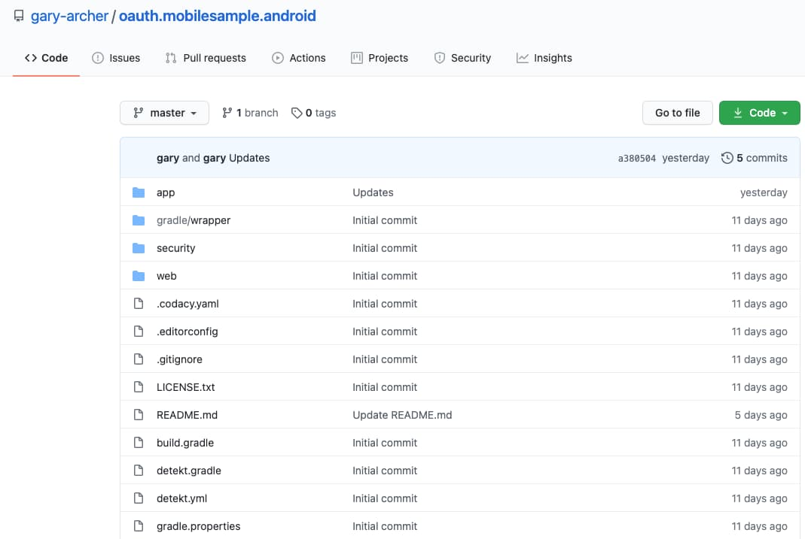
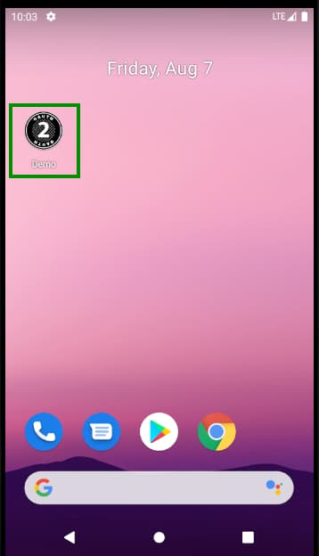
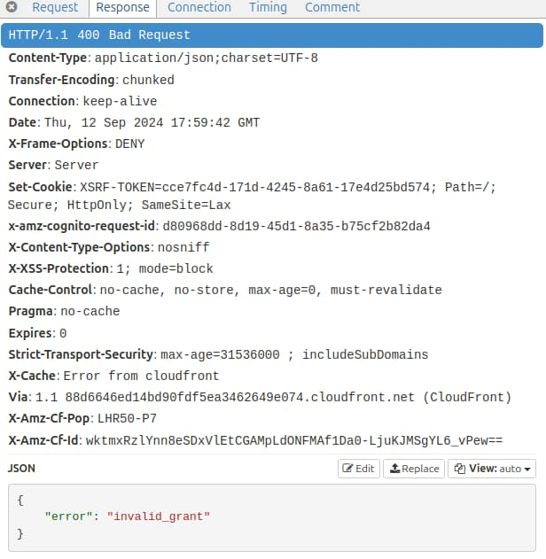

# How to Run the Android Code Sample

Previously we provided an <a href='android-code-sample-overview.mdx'>Android Code Sample Overview</a> and next we will describe how to run and test the code sample. Readers who are new to Android development may also want to browse these earlier pages:

- <a href='android-setup.mdx'>Android Setup and the AppAuth Sample</a>
- <a href='android-https-debugging.mdx'>Android HTTPS Debugging</a>

### Prerequisite: Install Android Studio

We can run our sample on macOS, Windows or Linux, but first install an up to date version of Android Studio, so that you have access to the latest Kotlin and Jetpack features.

### Step 1: Download the Code

The project is available [here](https://github.com/gary-archer/oauth.mobilesample.android), and can be downloaded / cloned to your local computer with the following command:

```bash
git clone https://github.com/gary-archer/oauth.mobilesample.android
```



### Step 2: Open the Project in Android Studio

Shortly we will describe the code, where we implement OAuth integration in an unobtrusive manner, so that Android views only need to make API calls and other classes deal with OAuth plumbing:


When the project is loaded there will be a *Gradle Sync* to download third party libraries. Ensure that this completes successfully, and also that Java 17 is configured under *Preferences / Build,Execution,Deployment / Build Tools / Gradle / Gradle JDK*:


### Step 3: Run the App on an Emulator

You can now run our demo app via the Run Icon in the Android Studio toolbar. You may then get an initial prompt to *Secure Your Device*, after which you will be able to login with the following test credential:

- User: *guestuser@example.com*
- Password: *GuestPassword1*

Next save the password when prompted, then navigate between views by clicking an item in the companies view or using the *Home* button:

<div className='smallimage'>
    
</div>

### Step 4: View Library Dependencies

View the app’s *build.gradle.kts* file to understand the our Single Activity App’s third party dependencies, which include the AppAuth Library. The app requires Android 8 (SDK 26) and above, since this simplifies some areas of the Android implementation.

```kotlin
object VERSION {
    const val kotlin_extensions = "1.12.0"
    const val compose = "1.8.0"
    const val compose_bom = "2023.09.02"
    const val compose_ui = "1.5.3"
    const val material3 = "1.1.2"
    const val navigation = "2.7.4"
    const val appauth = "0.11.1"
    const val browser = "1.6.0"
    const val okhttp = "4.11.0"
    const val gson = "2.10.1"
    const val okio = "3.4.0"
    const val eventbus = "3.3.1"
    const val detekt = "1.23.1"
}

dependencies {

    implementation("androidx.core:core-ktx:${VERSION.kotlin_extensions}")

    implementation("androidx.activity:activity-compose:${VERSION.compose}")
    implementation(platform("androidx.compose:compose-bom:${VERSION.compose_bom}"))

    implementation("androidx.navigation:navigation-ui-ktx:${VERSION.navigation}")
    implementation("androidx.navigation:navigation-compose:${VERSION.navigation}")

    implementation("androidx.compose.ui:ui:${VERSION.compose_ui}")
    implementation("androidx.compose.ui:ui-graphics:${VERSION.compose_ui}")
    implementation("androidx.compose.material3:material3:${VERSION.material3}")

    implementation ("net.openid:appauth:${VERSION.appauth}")

    implementation ("androidx.browser:browser:${VERSION.browser}")

    implementation ("com.squareup.okhttp3:okhttp:${VERSION.okhttp}")
    implementation ("com.google.code.gson:gson:${VERSION.gson}")

    implementation ("com.squareup.okio:okio:${VERSION.okio}")

    implementation ("org.greenrobot:eventbus:${VERSION.eventbus}") 
}
```

### Step 5: View the Single Activity Configuration

View the *Android Manifest File* to see the declaration of our single activity, which runs in [Single Top](https://inthecheesefactory.com/blog/understand-android-activity-launchmode/en) mode, meaning it is by default created only once, in a similar  manner to the main window in an SPA.

```xml
<activity
        android:name=".app.MainActivity"
        android:exported="true"
        android:launchMode="singleTop"
        android:configChanges="orientation|screenSize">

    <intent-filter>
        <action android:name="android.intent.action.MAIN"/>
        <category android:name="android.intent.category.LAUNCHER"/>
    </intent-filter>
</activity>
```

### Step 6: Understand Configuration Settings

When our app runs it uses the API and OAuth settings from an embedded JSON configuration file at *res/raw/mobile_config.json*:

```json
{
  "app": {
    "apiBaseUrl":             "https://api.authsamples.com/investments"
  },
  "oauth": {
    "authority":              "https://cognito-idp.eu-west-2.amazonaws.com/eu-west-2_CuhLeqiE9",
    "clientId":               "2vshs4gidsbpnjmsprhh607ege",
    "redirectUri":            "https://www.authsamples.com/apps/finalmobileapp/postlogin.html",
    "postLogoutRedirectUri":  "https://www.authsamples.com/apps/finalmobileapp/postlogout.html",
    "scope":                  "openid profile https://api.authsamples.com/investments",
    "userInfoEndpoint":       "https://login.authsamples.com/oauth2/userInfo",
    "customLogoutEndpoint":   "https://login.authsamples.com/logout",
    "deepLinkBaseUrl":        "https://mobile.authsamples.com"
  }
}
```

### Step 7: Understand Login Redirects

By using AppAuth libraries the standard *Authorization Code Flow (PKCE)* message is sent:


Our AWS Cognito authorization server accepts the request because the *Client ID*, *Redirect URI* and *Scope* of the request match those configured in a Cognito OAuth client. After user login an authorization code is returned to the app:


### Step 8: Understand Redirect Response Handling

The result of successful authorization is the following message, and note that this is sent to an internet hosted web page rather than directly to our Android app:


Two intermediate web pages are used with our Android sample, hosted at the following URLs:

- [https://www.authsamples.com/apps/finalmobileapp/postlogin.html](https://www.authsamples.com/apps/finalmobileapp/postlogin.html)
- [https://www.authsamples.com/apps/finalmobileapp/postlogout.html](https://www.authsamples.com/apps/finalmobileapp/postlogout.html)

If we use the *View Source* option in a desktop browser for one of the above URLs, we can see that they just forward query parameters from the login response using a deep linking URL:


The *Deep Linking HTTPS Scheme* for login responses is associated to the app via the below Android manifest entry, which overrides the default AppAuth behaviour of using a private URI scheme:

```xml
<activity
    android:name="net.openid.appauth.RedirectUriReceiverActivity"
    android:exported="true">

    <intent-filter android:autoVerify="true">
        <action android:name="android.intent.action.VIEW" />
        <category android:name="android.intent.category.DEFAULT"/>
        <category android:name="android.intent.category.BROWSABLE"/>
        <data
            android:scheme="https"
            android:host="mobile.authsamples.com"
            android:path="/finalmobileapp/oauth/callback" />
    </intent-filter>
</activity>
```

Note that if the intermediate page is left for a couple of minutes before the user clicks *Return to the App*, the authorization code could time out, leading to a user error. The user can always retry and recover though.

### Step 9: Understand Login Completion

Once the authorization code is received by the app, it sends an *Authorization Code Grant* request to Cognito’s token endpoint, which returns OAuth tokens in the response:


The token data is then stored in *Android Shared Preferences*, and the operating system ensures that other apps cannot access the tokens.

### Step 10: Test Login Actions

It is worth performing certain tests while the Chrome custom tab window is active, to ensure that the app does not throw exceptions or recreate views unnecessarily. The first of these is to switch away from the app and then reactivate it from its shortcut:

<div className='smallimage'>
    
</div>

Technically, when the app is invoked via a shortcut, the launcher action is used, which is a command similar to the following, and it can potentially cause the single activity to be recreated. If this occurs there should be no adverse effects on the login process.

```bash
adb shell am start -n com.authsamples.finalmobileapp/com.authsamples.finalmobileapp.app.MainActivity -a android.intent.action.MAIN -c android.intent.category.LAUNCHER
```

Similarly I would recommend changing the screen orientation half way through login and then completing the sign in.


The app’s *MainActivity* is configured with *launchMode=singleTop* and  *configChanges=orientation|screenSize*. It is therefore redrawn but not recreated when the orientation changes.

### Step 11: Test Restarting the App after Login

Restarting the app after a login will just load OAuth tokens from secure storage, and a new login is not required.

### Step 12: Test Deep Linking

While the app is running we can test deep linking on an emulator via a command such as the following. If required our app performs a login or token renewal before moving to the deep link destination:

```bash
adb shell am start -a android.intent.action.VIEW -d https://mobile.authsamples.com/finalmobileapp/deeplink/companies/2
```

Our app uses a special activity to manage *Deep Link Forwarding* in a controlled manner:

```xml
<activity
    android:name=".app.DeepLinkForwardingActivity"
    android:exported="true"
    android:launchMode="singleTask"
    android:noHistory="true">

    <intent-filter android:autoVerify="true">
        <action android:name="android.intent.action.VIEW" />
        <category android:name="android.intent.category.DEFAULT" />
        <category android:name="android.intent.category.BROWSABLE" />
        <data
            android:scheme="https"
            android:host="mobile.authsamples.com"
            android:pathPrefix="/finalmobileapp/deeplink/" />
    </intent-filter>
</activity>
```

This enables us to ignore any deep linking requests when our activity is not top most, which most commonly means a Chrome custom tab is being shown.

### Step 13: Test Access Token Expiry

We can use the *Expire Access Token* and *Reload Data* buttons to cause an invalid token to be sent to the API, resulting in a 401 response:

<div className='smallimage'>
    
</div>

After every API call the UI checks for 401 responses, and handles them by getting a new access token. The API request is then retried once with the new token, so that the user session is silently extended. Note that a mobile app is a public client and the refresh token is not protected with a client credential:


### Step 14: Test Refresh Token Expiry

We can use *Expire Refresh Token* followed by *Reload Data* to simulate the end of a user session, which might occur if a user left the app running overnight:

<div className='smallimage'>
    
</div>

On the next request for data the attempt to renew the access token will fail, and the result of the refresh token grant message will be an *Invalid Grant* response:



This will trigger a login redirect, and the user may be prompted to sign in again, but will experience no errors.

### Step 15: Test Logout

To implement logout, a *LogoutRedirectUriReceiverActivity* was added, to map the HTTPS scheme logout callback path:

```xml
<activity
    android:name=".plumbing.oauth.logout.LogoutRedirectUriReceiverActivity"
    android:exported="true">

    <intent-filter android:autoVerify="true">
        <action android:name="android.intent.action.VIEW" />
        <category android:name="android.intent.category.DEFAULT"/>
        <category android:name="android.intent.category.BROWSABLE"/>
        <data
            android:scheme="https"
            android:host="mobile.authsamples.com"
            android:path="/finalmobileapp/oauth/logoutcallback" />
    </intent-filter>
</activity>
```

AWS Cognito also uses a vendor specific logout solution and the logout request requires *client_id* and *logout_url* parameters:


When logout completes we are returned to the below post logout view within our app. In a real world app you could then test logging in as another user with different settings or permissions.

<div className='smallimage'>
    
</div>

### Step 16: Test Failure Scenarios

Our mobile app runs multiple views which could fail concurrently, so we implement the same *Error HyperLink Behaviour* as for our earlier React apps. The following examples cause errors that the UI must handle:

| Scenario | Instructions |
| -------- | ------------ |
| UI Error | Load data normally, then switch to airplane mode and click reload, to cause a connectivity exception |
| API Error | Long press the *Reload* button, which then sends a custom HTTP header to the API to rehearse an API 500 exception |

Our error display looks as follows after concurrent view failures. The user can click a hyperlink to see details, or press the Home button to retry:

<div className='smallimage'>
    
</div>

The summary view uses an Android modal dialog to display a view with error details, which would help to enable fast problem resolution:

<div className='smallimage'>
    
</div>

### Step 17: Test Back Navigation

The user can navigate backwards to return to previously loaded views. It is worth testing that this behaves correctly for your own apps, and avoid taking the user back to a login screen.

### Where Are We?

We have shown how to run this blog’s Android code sample,  and test its technical behaviour. Next we will drill into the infrastructure needed to enable the use of OAuth claimed HTTPS schemes.

### Next

- Next we will describe some required <a href='android-infrastructure-setup.mdx'>Android Mobile Infrastructure</a>
- For a list of all blog posts see the <a href='index.mdx'>Index Page</a>