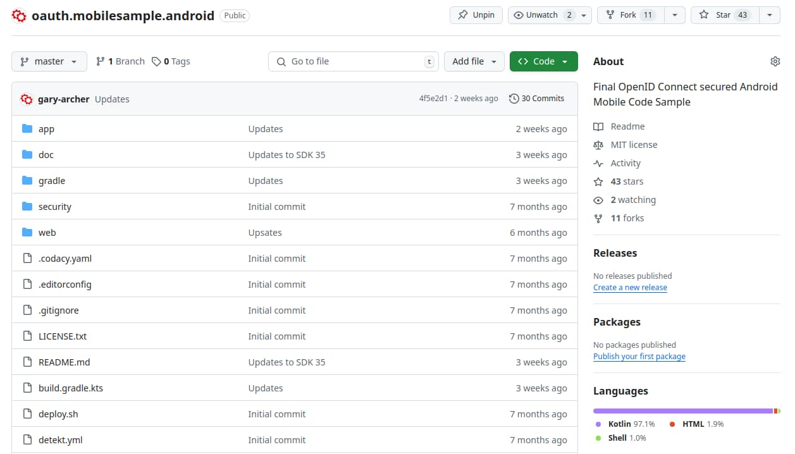
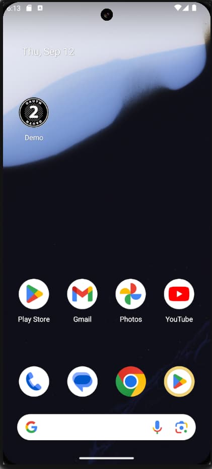

# How to Run the Android Code Sample

Previously I provided an overview of the <a href='android-code-sample-overview.mdx'>Android Code Sample</a> and next I explain how to run and test the app. See also the following pages on an initial Android setup:

- <a href='android-setup.mdx'>Android Setup and the AppAuth Sample</a>
- <a href='android-https-debugging.mdx'>Android HTTPS Debugging</a>

### Prerequisite: Install Android Studio

The code sample runs on macOS, Windows or Linux, but first install an up to date version of Android Studio, so that you have access to the latest Kotlin and Jetpack features.

### Step 1: Download the Code

The project is available [here](https://github.com/gary-archer/oauth.mobilesample.android), and you can clone it with the following command:

```bash
git clone https://github.com/gary-archer/oauth.mobilesample.android
```



### Step 2: Open the Project in Android Studio

The code implements OAuth integration in an unobtrusive manner, so that Android views only need to make API calls and other classes deal with OAuth plumbing:


When the project loads there is a *Gradle Sync* to download third party libraries. Ensure that this completes successfully. You may also need to configure Java 25 under *Settings / Build,Execution,Deployment / Build Tools / Gradle / Gradle JDK*.

### Step 3: Run the App on an Emulator

Use the *Run* icon in the Android Studio toolbar. You may receive an initial prompt to *Secure Your Device*, after which you can sign in with the following test credential:

- User: *guestuser@example.com*
- Password: *GuestPassword1*

Use the browser's password autofill prompt to save the password, then navigate between views by clicking an item in the Companies View or the *Home* button:

<div className='smallimage'>
    
</div>

### Step 4: View Library Dependencies

View the app's *libs.versions.toml* [Version Catalog File](https://docs.gradle.org/current/userguide/version_catalogs.html) to understand the Single Activity App's third party dependencies, which include the AppAuth Library. The app requires Android 10 (SDK 29) and above, since this simplifies some areas of the Android implementation.

```markdown
[versions]
application = "8.13.2"
kotlin = "2.3.0"
compose = "2.3.0"
detekt = "2.0.0-alpha.1"
core-ktx = "1.17.0"
activity-compose = "1.12.2"
compose-bom = "2025.12.01"
navigation = "2.9.6"
compose-ui = "1.10.0"
material3 = "1.4.0"
appauth = "0.11.1"
browser = "1.9.0"
okhttp = "5.3.2"
gson = "2.13.2"
okio = "3.16.4"
eventbus = "3.3.1"

[plugins]
application = { id = "com.android.application", version.ref = "application" }
kotlin = { id = "org.jetbrains.kotlin.android", version.ref = "kotlin" }
compose = { id = "org.jetbrains.kotlin.plugin.compose", version.ref = "compose" }
detekt = { id = "dev.detekt", version.ref = "detekt" }

[libraries]
androidx-core-ktx = { group = "androidx.core", name = "core-ktx", version.ref = "core-ktx" }
androidx-activity-compose = { group = "androidx.activity", name = "activity-compose", version.ref = "activity-compose" }
androidx-compose-bom = { group = "androidx.compose", name = "compose-bom", version.ref = "compose-bom" }
navigation-ui-ktx = { group = "androidx.navigation", name = "navigation-ui-ktx", version.ref = "navigation" }
navigation-compose = { group = "androidx.navigation", name = "navigation-compose", version.ref = "navigation" }
compose-ui = { group = "androidx.compose.ui", name = "ui", version.ref = "compose-ui" }
compose-ui-graphics = { group = "androidx.compose.ui", name = "ui-graphics", version.ref = "compose-ui" }
material3 = { group = "androidx.compose.material3", name = "material3", version.ref = "material3" }
appauth = { group = "net.openid", name = "appauth", version.ref = "appauth" }
browser = { group = "androidx.browser", name = "browser", version.ref = "browser" }
okhttp = { group = "com.squareup.okhttp3", name = "okhttp", version.ref = "okhttp" }
gson = { group = "com.google.code.gson", name = "gson", version.ref = "gson" }
okio = { group = "com.squareup.okio", name = "okio", version.ref = "okio" }
eventbus = { group = "org.greenrobot", name = "eventbus", version.ref = "eventbus" }
detekt-rules-ktlint-wrapper = { group = "dev.detekt", name = "detekt-rules-ktlint-wrapper", version.ref = "detekt" }
```

### Step 5: View the Single Activity Configuration

View the *Android Manifest File* to see the declaration of the single activity, which runs in [Single Top](https://inthecheesefactory.com/blog/understand-android-activity-launchmode/en) mode, meaning Android creates it only once in a similar manner to the main window in an SPA.

```xml
<activity
        android:name=".app.MainActivity"
        android:exported="true"
        android:launchMode="singleTop"
        android:configChanges="orientation|screenSize">

    <intent-filter>
        <action android:name="android.intent.action.MAIN"/>
        <category android:name="android.intent.category.LAUNCHER"/>
    </intent-filter>
</activity>
```

### Step 6: Understand Configuration Settings

When the app runs it uses API and OAuth settings from an embedded JSON configuration file, stored at the *res/raw/mobile_config.json* location within the Android Studio project:

```json
{
  "app": {
    "apiBaseUrl":             "https://api.authsamples.com/investments"
  },
  "oauth": {
    "authority":              "https://cognito-idp.eu-west-2.amazonaws.com/eu-west-2_CuhLeqiE9",
    "clientId":               "2vshs4gidsbpnjmsprhh607ege",
    "redirectUri":            "https://www.authsamples.com/apps/finalmobileapp/postlogin.html",
    "postLogoutRedirectUri":  "https://www.authsamples.com/apps/finalmobileapp/postlogout.html",
    "scope":                  "openid profile https://api.authsamples.com/investments",
    "userInfoEndpoint":       "https://login.authsamples.com/oauth2/userInfo",
    "customLogoutEndpoint":   "https://login.authsamples.com/logout",
    "deepLinkBaseUrl":        "https://mobile.authsamples.com"
  }
}
```

### Step 7: Understand Login Redirects

AppAuth libraries send a standards-based *Authorization Code Flow (PKCE)* front channel request:


The authorization server accepts the request because the *Client ID*, *Redirect URI* and *Scope* of the request match those for a registered OAuth client. In AWS Cognito I registered the following details.


### Step 8: Understand Redirect Response Handling

After user authentication the app receives an authorization response that contains an authorization code. An external web page manages the claimed HTTPS scheme redirect URI to ensure that the app reliably receives the response.


The app uses two external web pages, hosted at the following URLs:

- [https://www.authsamples.com/apps/finalmobileapp/postlogin.html](https://www.authsamples.com/apps/finalmobileapp/postlogin.html)
- [https://www.authsamples.com/apps/finalmobileapp/postlogout.html](https://www.authsamples.com/apps/finalmobileapp/postlogout.html)

If you use the *View Source* option in a desktop browser for one of the above URLs, notice that they just ensure a user gesture, then invoke a deep link to forward the response query parameters to the app:


An Android manifest entry associates the *Deep Linking HTTPS Scheme* for login responses to the app, to override the default AppAuth behaviour of a private URI scheme:

```xml
<activity
    android:name="net.openid.appauth.RedirectUriReceiverActivity"
    android:exported="true">

    <intent-filter android:autoVerify="true">
        <action android:name="android.intent.action.VIEW" />
        <category android:name="android.intent.category.DEFAULT"/>
        <category android:name="android.intent.category.BROWSABLE"/>
        <data
            android:scheme="https"
            android:host="mobile.authsamples.com"
            android:path="/finalmobileapp/oauth/callback" />
    </intent-filter>
</activity>
```

If the user leaves the app at the external page for a couple of minutes and then clicks *Return to the App*, the authorization code could time out, leading to a user error. The user can always retry and recover though.

### Step 9: Understand Login Completion

When the app receives the authorization code it sends an *Authorization Code Grant* back channel request to the authorization server's token endpoint, which returns OAuth tokens in the response:


I then store tokens in *Android Shared Preferences*, and the operating system ensures that other apps cannot access the tokens.

### Step 10: Test Login Reliability

You should perform certain tests while the Chrome Custom Tab window is active, to ensure that the app does not throw exceptions or recreate views unnecessarily. The first of these is to switch away from the app and then reactivate it from its shortcut:

<div className='smallimage'>
    
</div>

Technically, when you invoke the app's shortcut, the launcher action runs, which is a command similar to the following. Ensure that this does not recreate the Chrome Custom Tab activity and impact login reliability.

```bash
adb shell am start -n com.authsamples.finalmobileapp/com.authsamples.finalmobileapp.app.MainActivity -a android.intent.action.MAIN -c android.intent.category.LAUNCHER
```

Similarly you should be able to change the screen orientation during login without any reliability issues.


I configure the app's *MainActivity* with *launchMode=singleTop* and *configChanges=orientation|screenSize*. When the orientation changes, the Android system redraws views but does not recreate them.

### Step 11: Test Restarting the App after Login

Restarting the app after a login loads OAuth tokens from secure storage and does not require a new login while the app's refresh token remain valid. This means, the first thing the user sees is the app,  This behaviour provides a balance between usability and security.

### Step 12: Test Deep Linking

Test deep linking on an emulator with a command such as the following. If required the deep link starts the app. The app may need to perform a login or token renewal before moving to the deep link destination:

```bash
adb shell am start -a android.intent.action.VIEW -d https://mobile.authsamples.com/finalmobileapp/deeplink/companies/2
```

The app uses a special activity to manage *Deep Link Forwarding*, which ignores deep links when the Chrome Custom Tab is topmost.

```xml
<activity
    android:name=".app.DeepLinkForwardingActivity"
    android:exported="true"
    android:launchMode="singleTask"
    android:noHistory="true">

    <intent-filter android:autoVerify="true">
        <action android:name="android.intent.action.VIEW" />
        <category android:name="android.intent.category.DEFAULT" />
        <category android:name="android.intent.category.BROWSABLE" />
        <data
            android:scheme="https"
            android:host="mobile.authsamples.com"
            android:pathPrefix="/finalmobileapp/deeplink/" />
    </intent-filter>
</activity>
```

### Step 13: Test Access Token Expiry

You can use the *Expire Access Token* and *Reload Data* buttons to send an invalid access token to the API, resulting in a 401 response:

<div className='smallimage'>
    
</div>

After every API call the frontend checks for 401 responses and handles them by retrying API requests once with a new access token. The app therefore combines short-lived access tokens with a seamless user experience.


Note that a mobile app is a public client and by default it does not usually protect the refresh token with a client credential. With additional work you might be able to further protect this request, using a technical behaviour like [mobile attestation](https://approov.io/mobile-app-security/rasp/app-attestation/).

### Step 14: Test Refresh Token Expiry

You can click *Expire Refresh Token* followed by *Reload Data* to simulate the end of a user session, which might occur if a user left the app running overnight:

<div className='smallimage'>
    
</div>

After the next API request, the attempt to refresh the access token fails with a response that contains an *invalid_grant* error code:


The app interprets this as the end of its session with APIs, removes its tokens and prompts the user to reauthenticate.

### Step 15: Test Logout

To allow the user to explicitly logout I use an extra *LogoutRedirectUriReceiverActivity*. This handles requests to the post logout redirect URI, which also uses a claimed HTTPS scheme:

```xml
<activity
    android:name=".plumbing.oauth.logout.LogoutRedirectUriReceiverActivity"
    android:exported="true">

    <intent-filter android:autoVerify="true">
        <action android:name="android.intent.action.VIEW" />
        <category android:name="android.intent.category.DEFAULT"/>
        <category android:name="android.intent.category.BROWSABLE"/>
        <data
            android:scheme="https"
            android:host="mobile.authsamples.com"
            android:path="/finalmobileapp/oauth/logoutcallback" />
    </intent-filter>
</activity>
```

When AWS Cognito is the authorization server the app has to use a vendor specific logout solution, whose logout request requires *client_id* and *logout_url* parameters:


When logout completes the user returns to the app's unauthenticated view. I can then sign in with other test users who have different API permissions or application settings.

<div className='smallimage'>
    
</div>

### Step 16: Test Failure Scenarios

The mobile app runs multiple views which could fail. I implement the *Error HyperLink Behaviour* from this blog's earlier React apps and during development I rehearse the following categories of error:

| Error Category | Rehearsal Behaviour |
| -------------- | ------------------- |
| Application Error | Load data normally, then switch to airplane mode and click reload, to cause a connectivity exception. |
| API Error | Long press the *Reload* button, which then sends a custom HTTP header to the API to rehearse an API 500 exception. |

Since views call APIs concurrently there can be multiple errors. Each hyperlink is an *Error Summary View*. The user can click one to see its *Error Details View* or press the *Home* button to retry:

<div className='smallimage'>
    
</div>

The summary view invokes an Android modal dialog to display the details view. For API errors the view renders an *Error Instance ID* that correlates to API log entries, to enable fast lookup of the technical cause.

<div className='smallimage'>
    
</div>

### Step 17: Test Back Navigation

You use Android back navigation to return to previously loaded views. During development I test that this avoids actions that could lead to errors, like returning the user to a login screen.

### Where Are We?

I showed how to operate this blog's Android app to run a reliable application lifecycle. Next I say more about the infrastructure setup to enable claimed HTTPS schemes.

### Next

- Next I explain the <a href='android-infrastructure-setup.mdx'>Android Mobile Infrastructure</a>.
- For a list of all blog posts see the <a href='index.mdx'>Index Page</a>.
