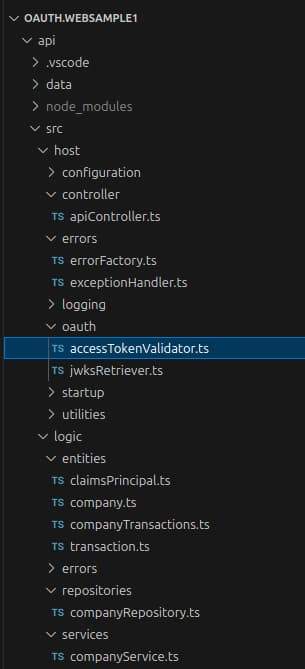

# Basic API - Code Details

The previous post explained some <a href='basicspa-codingkeypoints.mdx'>SPA Code Details</a> for the initial code sample. This post provides a similar breakdown for the API.

### Code Layout

The API uses TypeScript code and endpoints are exposed using the [Node.js Express HTTP Server](https://expressjs.com/). The *logic* folder contains the API's functonality, which would be the area with business value in a real API. The API's plumbing code, including its OAuth handling, is separated from its logic:

<div className='smallimage'>
    
</div>

### Dependencies

The API only uses a handful of third-party libraries, declared in its *package.json* file. The most interesting dependency is the [jose security library](https://github.com/panva/jose) that validates JWTs:

```json
{
  "dependencies": {
    "axios": "^1.13.2",
    "cors": "^2.8.5",
    "express": "^5.2.1",
    "https-proxy-agent": "^7.0.6",
    "jose": "^6.1.3",
    "on-headers": "^1.0.2",
    "winston": "^3.19.0"
  },
}
```

### API Entry Point

When you run *npm start*, the *startup/app.ts* class executes, to configure the Express HTTP server, which then listens for API requests:

```typescript
const logger = new ApiLogger();
try {

    const configJson = await fs.readFile('api.config.json', 'utf-8');
    const configuration = JSON.parse(configJson) as Configuration;

    const expressApp = express();
    const httpServer = new HttpServerConfiguration(expressApp, configuration, logger);
    await httpServer.initializeApi();
    await httpServer.startListening();

} catch (e) {

    const error = ErrorFactory.fromServerError(e);
    logger.startupError(error);
}
```

The startup logic is in the *HttpServerConfiguration* class, whose main role is to configure API routes:

- The *get* expressions handle API requests.
- The *use* expressions implement cross cutting concerns.

```typescript
public async initializeApi(): Promise<void> {

    const corsOptions = {
        origin: this.configuration.api.trustedOrigins,
        maxAge: 86400,
    };
    this.expressApp.use('/api/*_', cors(corsOptions) as any);
    this.expressApp.use('/api/*_', this.apiController.onWriteHeaders);

    this.expressApp.use('/api/*_', this.catch(this.apiLogger.logRequest));
    this.expressApp.use('/api/*_', this.catch(this.apiController.authorizationHandler));

    this.expressApp.get('/api/companies', this.catch(this.apiController.getCompanyList));
    this.expressApp.get(
        '/api/companies/:id/transactions',
        this.catch(this.apiController.getCompanyTransactions));

    this.expressApp.use('/api/*_', this.apiController.onRequestNotFound);
    this.expressApp.use('/api/*_', this.apiController.onException);
}
```

### API Configuration

The API uses a JSON configuration file in a similar manner to the SPA. The API configures SSL certificates and OAuth fields it needs for JWT access token validation:

```json
{
    "api": {
        "port": 446,
        "sslCertificateFileName": "../certs/authsamples-dev.ssl.p12",
        "sslCertificatePassword": "Password1",
        "trustedOrigins": [
            "https://www.authsamples-dev.com"
        ],
        "useProxy": false,
        "proxyUrl": "http://127.0.0.1:8888"
    },
    "oauth": {
        "jwksEndpoint": "https://cognito-idp.eu-west-2.amazonaws.com/eu-west-2_CuhLeqiE9/.well-known/jwks.json",
        "issuer":       "https://cognito-idp.eu-west-2.amazonaws.com/eu-west-2_CuhLeqiE9",
        "audience":     "",
        "algorithm":    "RS256"
    }
}
```

### API Hosting

In development mode, the API loads OpenSSL issued certificates and listens at *https://api.authsamples-dev.com:446*. Using real-world domain-based URLs enables me to think more about the client experience.

```typescript
public async startListening(): Promise<void> {

    const port = this.configuration.api.port;
    if (this.configuration.api.sslCertificateFileName && this.configuration.api.sslCertificatePassword) {

        const pfxFile = await fs.readFile(this.configuration.api.sslCertificateFileName);
        const sslOptions = {
            pfx: pfxFile,
            passphrase: this.configuration.api.sslCertificatePassword,
        };

        const httpsServer = https.createServer(sslOptions, this.express);
        httpsServer.listen(port, () => {
            console.log(`API is listening on HTTPS port ${port}`);
        });

    } else {

        this.express.listen(port, () => {
            console.log(`API is listening on HTTP port ${port}`);
        });
    }
}
```

In deployed mode the API would be hosted behind an API gateway that provides the domain-based URLs and SSL certificates. The API would usually listen on an HTTP internal URL that uses a low-privilege port above 1024.

### Service Logic Classes

A mainstream way to run the API's business logic for an API request is to run a controller object, which then calls other testable business objects. In this blog's early API code samples I manually wire up an *ApiController* object with its dependencies. This blog's final APIs instead use a dependency injection framework.

```typescript
public async getCompanyList(request: Request, response: Response): Promise<void> {

    const reader = new JsonFileReader();
    const repository = new CompanyRepository(reader);
    const service = new CompanyService(repository, response.locals.claims);

    const result = await service.getCompanyList();
    ResponseWriter.writeObjectResponse(response, 200, result);
}
```

### API is Non-Blocking

The API uses *async / await* code to perform I/O. The following *CompanyRepository* class shows an example. The API can process other concurrent HTTP requests while I/O executes:

```typescript
public async getCompanyTransactions(id: number): Promise<CompanyTransactions | null> {

    const companyList = await this.jsonReader.readData<Company[]>('data/companyList.json');
    const foundCompany = companyList.find((c) => c.id === id);
    if (foundCompany) {

        const companyTransactions =
            await this.jsonReader.readData<CompanyTransactions[]>('data/companyTransactions.json');

        const foundTransactions = companyTransactions.find((ct) => ct.id === id);
        if (foundTransactions) {
            foundTransactions.company = foundCompany;
            return foundTransactions;
        }
    }

    return null;
}
```

### Authorization Middleware

Express enables you to use middleware for cross cutting concerns. The initial code samples uses a middleware object to validate JWT access token before the controller object runs.

```typescript
public async authorizationHandler(
    request: Request,
    response: Response,
    next: NextFunction): Promise<void> {

    const claims = await this.accessTokenValidator.execute(request);
    response.locals.claims = claims;
    next();
}
```

There are two main responsibilities involved in authorization in an OAuth secured API. The second of these occurs in the business logic:

| Responsibility | Description |
| -------------- | ----------- |
| Authenticate Requests | Digitally verify received JWT access tokens and return a 401 response for invalid tokens. |
| Perform Authorization | Trust claims from the payload of the JWT and use them for authorization. |

### Authenticating Requests

The API uses an *AccessTokenValidator* class to do the work for the first of the above tasks. The security library implements OAuth token verification using the following code:

```typescript
public async execute(request: Request): Promise<ClaimsPrincipal> {

    try {

        const accessToken = this.readAccessToken(request);
        if (!accessToken) {
            throw ErrorFactory.fromMissingTokenError();
        }

        const options = {
            algorithms: [this.configuration.algorithm],
            issuer: this.configuration.issuer,
            audience: this.configuration.audience,
        };
        const result = await jwtVerify(accessToken, this.jwksRetriever.remoteJWKSet, options);

        const userId = this.getClaim(result.payload.sub, 'sub');
        const scope = this.getClaim(result.payload['scope'], 'scope');
        return new ClaimsPrincipal(userId, scope.split(' '));

    } catch (e: any) {

        if (e instanceof AxiosError || e.code === 'ERR_JOSE_GENERIC') {
            throw ErrorFactory.fromJwksDownloadError(e);
        }

        throw ErrorFactory.fromTokenValidationError(e);
    }
}
```

The API must provide correct inputs to the library, so it is important for API developers to understand them. I explain the details in a separate <a href='jwt-access-token-validation.mdx'>Access Token Validation</a> post.

### Claims Principal

Once the JWT is digitally verified, the API trusts claims returned from the library and uses them in its business logic, to authorize access to resources. I encapsulate claim values in a *ClaimsPrincipal* object:

```typescript
export class ClaimsPrincipal {

    private subject: string;
    private scopes: string[];

    public constructor(subject: string, scopes: string[]) {
        this.subject = subject;
        this.scopes = scopes;
    }

    public getSubject(): string {
        return this.subject;
    }

    public getScopes(): string[] {
        return this.scopes;
    }
}
```

### Authorizing Requests

After the access token validator creates the claims principal it is injected into business logic classes:

```typescript
export class CompanyService {

    private readonly repository: CompanyRepository;
    private readonly claims: ClaimsPrincipal;

    public constructor(repository: CompanyRepository, claims: ClaimsPrincipal) {
        this.repository = repository;
        this.claims = claims;
    }
}
```

If an attempt is made to access unauthorized data, the SPA can throw a forbidden error:

```typescript
private unauthorizedError(companyId: number): ClientError {
    return new ClientError(
        404,
        ErrorCodes.companyNotFound,
        `Company ${companyId} was not found for this user`);
}
```

### Claims Based Authorization

For the first code sample, the SPA does not implement any business authorization. Yet any real world API is likely to need to use both access token claims and values from business data in its authorization. I show how to manage this in the next code sample.

### API Logs

The initial API code sample does some basic logging, where each API request writes a structured JSON log entry represented by the following class:

```typescript
export class LogEntry {

    public readonly utcTime: Date;
    public path: string;
    public method: string;
    public statusCode: number;
    public error: ClientError | ServerError | null;
}
```

By default this leads to lightweight output as follows:

```json
[
    {
        "utcTime": "2024-04-07T19:18:11.133Z",
        "path": "/api/companies",
        "method": "GET",
        "statusCode": 200
    }
    {
        "utcTime": "2024-04-07T19:18:11.268Z",
        "path": "/api/companies",
        "method": "GET",
        "statusCode": 200
    }
    {
        "utcTime": "2024-04-07T19:18:12.757Z",
        "path": "/api/companies/1/transactions",
        "method": "GET",
        "statusCode": 200
    }
]
```

### API Error Handling

The API code also implements solid error handling using the following main classes:

| Class | Description |
| ----- | ----------- |
| ServerError | Represents a technical problem in the API. |
| ClientError | Represents a useful error response for an API client. |
| ExceptionHandler | Catches any exceptions thrown by the API. |
| ErrorFactory | Used to create exceptions to throw. |
| ErrorCodes | A list of error causes. |

An unhandled exception handler writes errors to logs and returns useful error responses to the SPA:

```typescript
public static handleError(exception: any, response: Response): ClientError {

    const handledError = ErrorFactory.fromException(exception);
    if (exception instanceof ClientError) {

        const clientError = handledError as ClientError;
        const logEntry = response.locals.logEntry as LogEntry;
        logEntry.setError(clientError);
        return clientError;

    } else {

        const serverError = handledError as ServerError;
        const logEntry = response.locals.logEntry as LogEntry;
        logEntry.setError(serverError);
        return serverError.toClientError();
    }
}
```

API logs include backend errors, like network errors calling OAuth endpoints, along with details about the cause, to help with fast problem resolution:

```json
{
  "utcTime": "2024-04-07T19:19:44.945Z",
  "path": "/api/companies",
  "method": "GET",
  "statusCode": 500,
  "error": {
    "statusCode": 500,
    "clientError": {
      "code": "jwks_download_error",
      "message": "Problem downloading token signing keys",
      "id": 45244,
      "area": "BasicApi",
      "utcTime": "2024-04-07T19:19:45.027Z"
    },
    "serviceError": {
      "details": {
        "code": "ERR_JOSE_GENERIC",
        "description": "Expected 200 OK from the JSON Web Key Set HTTP response"
      },
      "stack": [
        "JOSEError: Expected 200 OK from the JSON Web Key Set HTTP response",
        "at fetchJwks (file:///home/gary/dev/oauth.websample1/api/node_modules/jose/dist/node/esm/runtime/fetch_jwks.js:30:15)",
        "at process.processTicksAndRejections (node:internal/process/task_queues:95:5)",
        "at async RemoteJWKSet.reload (file:///home/gary/dev/oauth.websample1/api/node_modules/jose/dist/node/esm/jwks/remote.js:86:9)",
        "at async RemoteJWKSet.getKey (file:///home/gary/dev/oauth.websample1/api/node_modules/jose/dist/node/esm/jwks/remote.js:49:13)",
        "at async flattenedVerify (file:///home/gary/dev/oauth.websample1/api/node_modules/jose/dist/node/esm/jws/flattened/verify.js:72:15)",
        "at async compactVerify (file:///home/gary/dev/oauth.websample1/api/node_modules/jose/dist/node/esm/jws/compact/verify.js:15:22)",
        "at async jwtVerify (file:///home/gary/dev/oauth.websample1/api/node_modules/jose/dist/node/esm/jwt/verify.js:5:22)",
        "at async AccessTokenValidator.execute (file:///home/gary/dev/oauth.websample1/api/src/host/oauth/accessTokenValidator.ts:1:794)",
        "at async ApiController.authorizationHandler (file:///home/gary/dev/oauth.websample1/api/src/host/controller/apiController.ts:1:1209)"
      ]
    }
  }
}

```

### Supportability

Future posts drill much deeper into <a href='effective-api-logging.mdx'>logging</a> and <a href='error-handling-and-supportability.mdx'>error handling</a>. These are high value areas for backend systems, and you improve people productivity when you implement them in a solid end-to-end manner.

### Where Are We?

The initial API integrates with an authorization server and validates JWTs correctly. The API also does some initial work so that there is a setup for managing claims, logging and error handling.

### Next

- Next I summarise how to work with <a href='jwt-access-token-validation.mdx'>JWT Access Token Validation</a> in APIs.
- For a list of all blog posts see the <a href='index.mdx'>Index Page</a>.
