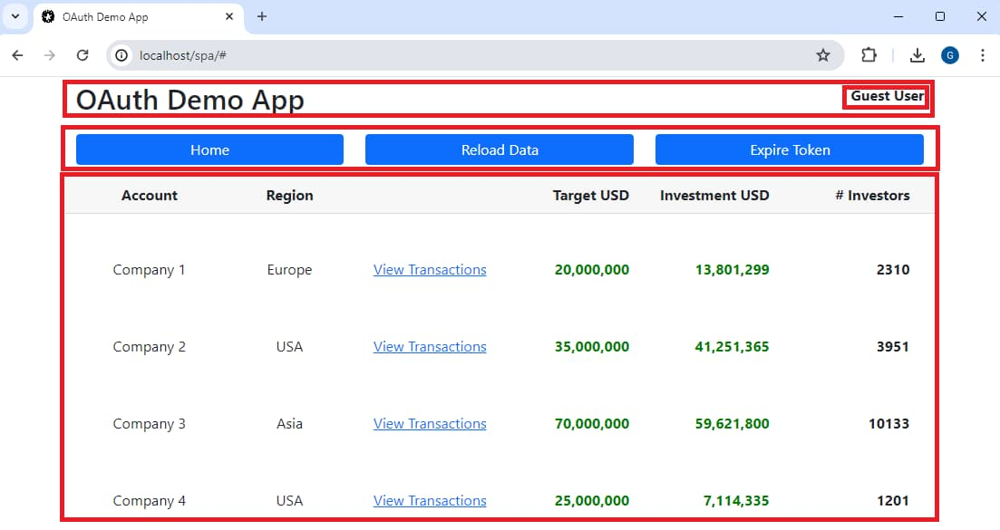

# Basic SPA - Code Details

The <a href='basicspa-oauthworkflow.mdx'>SPA and API OAuth Messages</a> post explained the initial code sample's HTTP/S messages. Next I drill into some identity-related code in the SPA.

### SPA Code

The SPA downloads the following types of static resources to the browser. In this blog I use only basic HTML and CSS, so that the main code focus for SPAs is the JavaScript logic:

| Area | Implementation Details |
| ---- | ---------------------- |
| HTML | I use a single static *index.html* page and its DOM elements are updated dynamically. |
| CSS | I use [Bootstrap](https://getbootstrap.com/docs/4.0/getting-started/introduction/) to control layout in a mobile first manner, and for most styling. |
| JavaScript | I use TypeScript code that gets compiled to JavaScript bundles when it runs in the browser. |

The SPA uses only a handful of external dependencies, expressed in its *package.json* file. The most interesting of these is the *oidc-client-ts* library, which implements OpenID Connect in JavaScript.

```json
{
    "dependencies": {
        "axios": "^1.9.0",
        "mustache": "^4.2.0",
        "oidc-client-ts": "^3.2.0"
    }
}
```

I separate the SPA's concerns into a number of TypeScript classes, and in particular I keep plumbing separated from the application's important code. In a real SPA the views and view models represent your business value:

<div className='smallimage'>
    
</div>

### SPA Views

The SPA's views consist of a number of subviews, arranged via rows and columns:



I use the [Bootstrap Grid System](https://getbootstrap.com/docs/4.0/layout/grid/) to lay out elements at runtime, and the deployed HTML is minimal:

```html
<!DOCTYPE html>
<html lang='en'>
    <head>
        <meta charset='utf-8'>
        <base href='/spa/' />
        <title>OAuth Demo App</title>

        <link rel='stylesheet' href='css/bootstrap.min.css'>
        <link rel='stylesheet' href='css/app.css'>
    </head>
    <body>
        <div id='root' class='container' />
        
        <script type='module' src='dist/vendor.bundle.js'></script>
        <script type='module' src='dist/app.bundle.js'></script>
    </body>
</html>
```

As the user navigates between screens, a *main* element within the *root* element updates to render the current location's view.

### SPA Entry Point

When the SPA's *index.html* page loads, it creates a global instance of an application class defined in the *App.ts* file, and calls its *execute* method:

```typescript
public async execute(): Promise<void> {

    try {
        window.onhashchange = this.onHashChange;

        this.initialRender();

        await this.initialiseApp();

        await this.handleLoginResponse();

        await this.loadMainView();

    } catch (e) {

        this.errorView?.report(e);
    }
}
```

### Application Startup

The startup logic downloads the SPA's configuration from the server, then creates an *OAuthClient* object that wraps usage of the oidc-client-ts library and an *ApiClient* object to encapsulate the logic for API requests:

```typescript
private async initialiseApp(): Promise<void> {

    this.configuration = await ConfigurationLoader.download('spa.config.json');

    this.oauthClient = new OAuthClient(this.configuration.oauth);

    this.apiClient = new ApiClient(this.configuration.app.apiBaseUrl, this.autheoauthClientnticator);

    this.router = new Router(this.apiClient, this.errorView);

    this.isInitialised = true;
}
```

### Security Library Configuration

The SPA configuration contains the following values, to enable the SPA to connect to the API and to perform OAuth login redirects:

```json
{
    "app": {
        "apiBaseUrl":       "http://api.authsamples-dev.com/api"
    },
    "oauth": {
        "authority":        "https://cognito-idp.eu-west-2.amazonaws.com/eu-west-2_CuhLeqiE9",
        "clientId":         "62raqvncbki418n3ckl59uf0f4",
        "redirectUri":      "http://localhost/spa",
        "scope":            "openid profile"
    }
}
```

The *OAuthClient* instance creates a *UserManager* object from the oidc-client-ts library, which does the main OAuth work:

```typescript
export class OAuthClient {

    private readonly userManager: UserManager;

    public constructor(config: OAuthConfiguration) {

        const settings = {
            authority: config.authority,
            client_id: config.clientId,
            redirect_uri: config.redirectUri,
            scope: config.scope,
            response_type: 'code',
            loadUserInfo: true,
            automaticSilentRenew: false,
            monitorSession: false,
        };

        this.userManager = new UserManager(settings);
    }
}
```

### Triggering Login Redirects

As part of the main *execute* method, a *Router* class determines the initial view based on the SPA's current URL location:

```typescript
public async loadView(): Promise<void> {

    this.errorView.clear();

    const transactionsCompany = this.getTransactionsViewId();
    if (transactionsCompany) {

        const view = new TransactionsView(this.apiClient, transactionsCompany);
        await view.load();

    } else {

        const view = new CompaniesView(this.apiClient);
        await view.load();
    }
}
```

This results in the view executing and attempting to call an API to get its data:

```typescript
public async load(): Promise<void> {

    try {

        const data = await this.apiClient.getCompanyList();
        this.renderData(data);

    } catch (e) {

        DomUtils.text('#main', '');
        throw e;
    }
}
```

The *ApiClient* asks the *OAuthClient* for an access token so that it can make the API request. If it cannot get one, the *ApiClient* triggers a login redirect. The in-flight API call is also terminated, with a *login_required* error. The SPA's error handling code does not render errors with this error code.

```typescript
private async callApi(path: string, method: Method, dataToSend?: any): Promise<any> {

    const url = `${this.apiBaseUrl}${path}`;
    let token = await this.oauthClient.getAccessToken();
    if (!token) {
        await this.oauthClient.startLogin(null);
        throw ErrorHandler.getFromLoginRequired();
    }
}
```

The initial SPA only sends a single API request at a time. This blog's final UI code samples will show a way to trigger login redirects when the frontend makes concurrent requests to APIs.

The *OAuthClient* object first stores the SPA's location in session storage and then performs a full screen redirect. In this blog, I only use full-screen redirects, since that is the most standard way to implement logins with fewest user experience issues.

```typescript
private async startLogin(): Promise<void> {

    const data = {
        hash: location.hash.length > 0 ? location.hash : '#',
    };

    try {
        await this.userManager.signinRedirect({state: data});
    } catch (e) {
        throw ErrorHandler.getFromLoginOperation(e, ErrorCodes.loginRequestFailed);
    }
}
```
### Handling Login Responses

When the login completes, the authorization server returns a response to the SPA's redirect URI. This causes the SPA's *index.html* to reload. The SPA must handle the login response as part of its application startup. If the SPA starts normally or as part of a page reload, *handleLoginResponse* is a no-op, but if it is an authorization response the current URL will have one of the following forms:

- *https://localhost/spa?code=xxx&state=yyy*
- *https://localhost/spa?error=invalid_request&state=yyy*

An SPA can either use an explicit callback path like *https://localhost/spa/callback*, or it can inspect its query parameters, as in the code sample. Either way, the SPA detects an authorization response and asks the oidc-client-ts library to process it. The code sample then performs these actions:

- Restores the location and state that was saved before the redirect.
- Removes the authorization response's query parameters from the browser history.

```typescript
public async handleLoginResponse(): Promise<void> {

    if (location.search) {

        const args = new URLSearchParams(location.search);
        const state = args.get('state');
        if (state) {

            const storedState = await this.userManager.settings.stateStore?.get(state);
            if (storedState) {

                let redirectLocation = '#';
                try {

                    const user = await this.userManager.signinRedirectCallback();
                    redirectLocation = user.state.hash;
                    this.loginTime = new Date().getTime();

                } catch (e: any) {

                    throw ErrorHandler.getFromLoginOperation(e, ErrorCodes.loginResponseFailed);

                } finally {

                    history.replaceState({}, document.title, redirectLocation);
                }
            }
        }
    }
}
```

The above code enables *deep linking*, where a user can bookmark a location like *http://localhost/spa/#company=2*, then access it in a new browser session. After signing in, the user returns to their bookmarked location.

### Rendering User Info

After login, the SPA renders the logged in user's name, and this information is stored in the *UserManager* class of the oidc-client-ts library, The *OAuthClient* retrieves the user profile using the following code:

```typescript
public async getUserInfo(): Promise<UserInfo | null> {

    const user = await this.userManager.getUser();
    if (user && user.profile) {
        if (user.profile.given_name && user.profile.family_name) {

            return {
                givenName: user.profile.given_name,
                familyName: user.profile.family_name,
            };
        }
    }

    return null;
}
```

### API Calls with Access Tokens

The SPA can now successfully get an access token from the oidc-client-ts library and call the API with it. The [axios library](https://github.com/axios/axios) is used for HTTP requests:

```typescript
private async callApiWithToken(
    url: string,
    method: Method,
    dataToSend: any,
    accessToken: string): Promise<any> {

    const response = await axios.request({
        url,
        method,
        data: dataToSend,
        headers: {
            'Authorization': `Bearer ${accessToken}`,
        },
    });

    AxiosUtils.checkJson(response.data);
    return response.data;
}
```

The API credential is a *Bearer Token*, and if an attacker can somehow intercept one they can also send it to the API. There are multiple mitigations against this threat. Start by always using least-privilege and short-lived access tokens.

### Safe Input Handling

The SPA uses the [Mustache Template Library](https://github.com/janl/mustache.js/) to bind received API data to the SPA's DOM elements. This ensures that potentially dangerous input is escaped, to prevent malicious code execution. This blog's final SPA uses React, which provides similar input protection.


```typescript
private renderData(data: CompanyTransactions): void {

    const viewModel = {
        title: `Today's Transactions for ${data.company.name}`,
        transactions: data.transactions.map((transaction) => {
            return {
                id: transaction.id,
                investorId: transaction.investorId,
                formattedAmountUsd: Number(transaction.amountUsd).toLocaleString(),
            };
        }),
    };

    const htmlTemplate =
        `<div class='card border-0'>
            <div class='card-header row fw-bold'>
                <div class='col-12 text-center mx-auto fw-bold'>
                    {{title}}
                </div>
            </div>
            <div class='row'>
                {{#transactions}}
                    <div class='col-lg-4 col-md-6 col-xs-12'>
                        <div class='card'>
                            <div class='card-body'>
                                <div class='row'>
                                    <div class='col-6'>Transaction ID</div>
                                    <div class='col-6 text-end valuecolor fw-bold'>{{id}}</div>
                                </div>
                                <div class='row'>
                                    <div class='col-6'>Investor ID</div>
                                    <div class='col-6 text-end valuecolor fw-bold'>{{investorId}}</div>
                                </div>
                                <div class='row'>
                                    <div class='col-6'>Amount USD</div>
                                    <div class='col-6 text-end moneycolor fw-bold'>{{formattedAmountUsd}}</div>
                                </div>
                            </div>
                        </div>
                    </div>
                {{/transactions}}
            </div>
        </div>`;

    const html = mustache.render(htmlTemplate, viewModel);
    DomUtils.html('#main', html);
}
```

### Navigation via Hash Change Events

The SPA performs navigation after user actions by simply setting a URL hash value, such as *#company=2*. The application class subscribes to the *window.onhashchange* and asks the router to reload the main view. Navigation actions trigger additional API requests, and eventually the SPA's access token expires. To be reliable, the SPA must handle access token expiry events.

### Reliable API Calls

Any reliable OAuth client must implement the following behaviour:

- If an API call fails with a 401 ...
- Then try to get a new access token, once only ...
- Then retry the API call, once only.

The code is structured to enable this, though the first code sample does not yet implement token refresh:

```typescript
private async callApi(path: string, method: Method, dataToSend?: any): Promise<any> {

    const url = `${this.apiBaseUrl}${path}`;

    const token = await this.oauthClient.getAccessToken();
    if (!token) {
        await this.oauthClient.startLogin(null);
        throw ErrorHandler.getFromLoginRequired();
    }

    try {

        return await this.callApiWithToken(url, method, dataToSend, token);

    } catch (e: any) {

        const error = e as UIError;
        if (error.statusCode !== 401)
            throw e;

        await this.oauthClient.startLogin(error);
        throw ErrorHandler.getFromLoginRequired();
    }
}
```

The SPA does not try to anticipate API 401 responses based on expiry times, since 401s can occur for multiple reasons. Example events that might cause 401s in some deployments are token revocation, cryptographic key renewal or load-balancing failovers.

### Preventing Redirect loops

When developing an OAuth client you should ensure that your app is not vulnerable to redirect loops, where there is a cycle of redirecting the user, getting an access token, then API calls failing with a 401 response. You can rehearse this condition if you set the issuer to an incorrect value in the API's configuration:

```json
{
    "api": {
        "port": 80,
        "trustedOrigins": [
            "http://localhost"
        ],
        "useProxy": false,
        "proxyUrl": "http://127.0.0.1:8888"
    },
    "oauth": {
        "jwksEndpoint": "https://cognito-idp.eu-west-2.amazonaws.com/eu-west-2_CuhLeqiE9/.well-known/jwks.json",
        "issuer":       "xxx",
        "audience":     "",
        "algorithm":    "RS256"
    }
}
```

The initial SPA prevents redirect loops with the following time-based check during the *startLogin* request. I show a better solution based on token refresh in future code samples.

```typescript
public async startLogin(api401Error: UIError | null): Promise<void> {

    try {

        const data = {
            hash: location.hash.length > 0 ? location.hash : '#',
        };

        if (api401Error && this.loginTime) {

            const currentTime = new Date().getTime();
            const millisecondsSinceLogin = currentTime - this.loginTime;
            if (millisecondsSinceLogin < 250) {
                throw api401Error;
            }
        }

        await this.userManager.signinRedirect({state: data});

    } catch (e: any) {

        throw ErrorHandler.getFromLoginOperation(e, ErrorCodes.loginRequestFailed);
    }
}
```

### SPA Error Handling

The SPA's code uses a number of error codes to represent possible failure causes. Some of these can be returned from the API or the authorization server:

```typescript
export class ErrorCodes {
    public static readonly loginRequired = 'login_required';
    public static readonly loginRequestFailed = 'login_request_failed';
    public static readonly loginResponseFailed = 'login_response_failed';
    public static readonly generalUIError = 'ui_error';
    public static readonly networkError = 'network_error';
    public static readonly jsonDataError = 'json_data_error';
    public static readonly responseError = 'http_response_error';
    public static readonly companyNotFound = 'company_not_found';
    public static readonly invalidCompanyId = 'invalid_company_id';
}
```

The SPA's *ErrorHandler* class translates errors into an object that contains error codes and other useful fields. When required, the SPA reads error payloads from HTTP responses, like the OAuth *error* and *error_description* fields from authorization server error responses. This blog's backend components do not return sensitive error details to the SPA, so error response data can be safely displayed.

```typescript
private static getOAuthExceptionMessage(exception: any): string {

    let oauthError = '';
    if (exception.error) {
        oauthError = exception.error;
        if (exception.error_description) {
            oauthError += ` : ${exception.error_description.replace(/\+/g, ' ')}`;
        }
    }

    if (oauthError) {
        return oauthError;
    } else {
        return ErrorHandler.getExceptionMessage(exception);
    }
}
```

OAuth introduces additional endpoints, messages and configuration settings into frontend clients, so there is plenty of scope for problems when getting integrated. I always use solid error handling code and perform early error rehearsal to improve my productivity.

### Where Are We?

I summarised the initial SPA's code, where the oidc-client-ts security library is doing the difficult security work. I extend the SPA's code in the second code sample, to complete its session management.

### Next

- I explain some <a href='basicapi-codingkeypoints.mdx'>API Code Details</a> for the first code sample.
- For a list of all blog posts see the <a href='index.mdx'>Index Page</a>.
