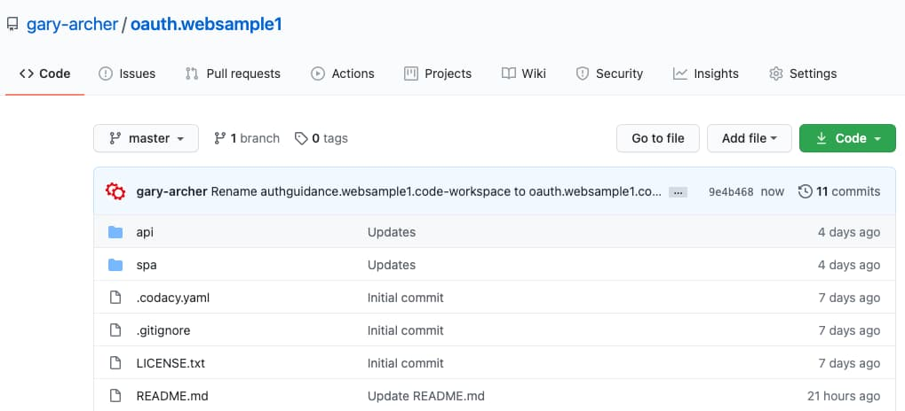
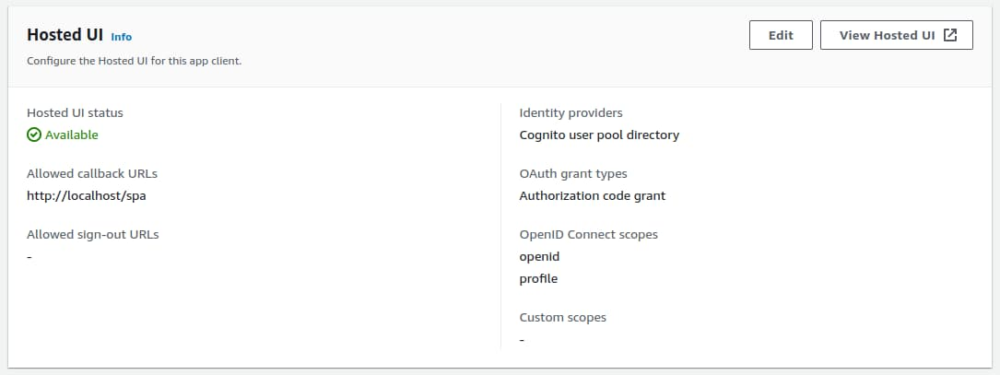
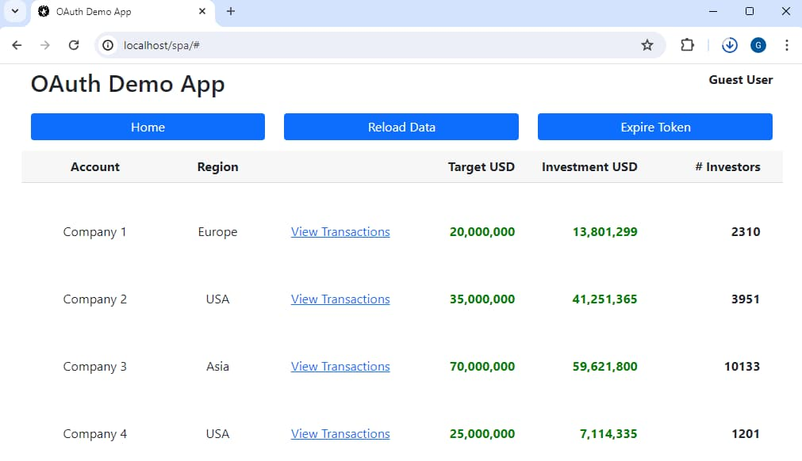
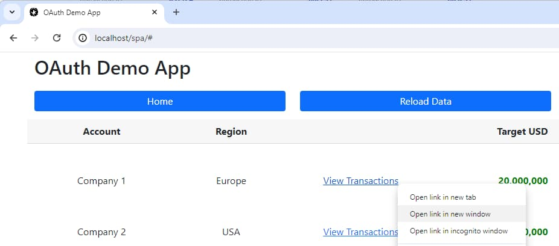

# Basic SPA – How to Run the Sample

Previously I summarised the behaviour of the initial <a href='basicspa-overview.mdx'>SPA and API Code Sample</a>. Next I show how to run it on a development computer, then visually describe the important OAuth related behaviour.

### Prerequisites

This blog’s code samples run in any Linux based terminal, and are tested on Ubuntu, Windows and macOS. On Windows it is expected that a [Git Bash](https://gitforwindows.org/) shell is used. Also ensure that an up to date version of [Node.js](https://nodejs.org/en/download/) is installed for your operating system.

### Step 1: Download Code from GitHub

Clone the code sample's GitHub repository with the following command:

```bash
git clone https://github.com/gary-archer/oauth.websample1
```



### Step 2: View Code in an IDE

I use [Visual Studio Code](https://code.visualstudio.com/) but you can use any editor to view the code layout:

<div className='smallimage'>
    
</div>

The project demonstrates a code setup to aim for. Firstly, JavaScript code runs in the browser, where the goal is a great user experience. Secondly, API code serves data to frontends. Frontend code is business focused, with less plumbing than older website solutions.

### Step 3: View Configuration

Both the SPA and API use configuration files that highlight important OAuth settings. The SPA acts as an *OAuth Client* and uses these configuration values:

```json
{
    "app": {
        "apiBaseUrl":       "http://api.authsamples-dev.com/api"
    },
    "oauth": {
        "authority":        "https://cognito-idp.eu-west-2.amazonaws.com/eu-west-2_CuhLeqiE9",
        "clientId":         "6tg0qglddpvqh74k3jbf1mmj64",
        "redirectUri":      "http://localhost/spa",
        "scope":            "openid profile"
    }
}
```

The API acts as an *OAuth Resource Server* and uses these configuration values.

```json
{
    "api": {
        "port": 80,
        "trustedOrigins": [
            "http://localhost"
        ],
        "useProxy": false,
        "proxyUrl": "http://127.0.0.1:8888"
    },
    "oauth": {
        "jwksEndpoint": "https://cognito-idp.eu-west-2.amazonaws.com/eu-west-2_CuhLeqiE9/.well-known/jwks.json",
        "algorithm": "RS256",
        "issuer": "https://cognito-idp.eu-west-2.amazonaws.com/eu-west-2_qqJgVeuTn",
        "audience": ""
    }
}
```

### Step 4: Authorization Server Setup

Both the SPA and API use endpoints from my personal AWS Cognito account, which is a low cost cloud solution. Jump ahead to these future posts for further details:

- <a href='oauth-infrastructure-setup.mdx'>OAuth Infrastructure Setup</a>
- <a href='managed-authorization-server-setup.mdx'>AWS Cognito Cloud Setup</a>

You must register OAuth clients at the authorization server, and the SPA includes the following entry:


The registered OAuth settings for the SPA include a *Client ID*, *Redirect URI* and *Scope*. The SPA uses the same values in its own configuration.



This blog’s code samples are standards-based, so you can change configurations to point to your own authorization server instead. You can then use your preferred URLs for the SPA and API.

### Step 5: User Setup

This blog uses the following main Cognito test account for SPA logins. This is not a real user and no personal data is used by this blog’s code samples:

- User: *guestuser@example.com*
- Password: *GuestPassword1*

### Step 6: Domain Setup

This blog’s code samples use DNS based URLs on a local computer, to represent a deployed architecture. Clean URLs are used, without a port number in the URL.

| Component | Base URL |
| --------- | -------- |
| SPA | http://www.authsamples-dev/spa |
| API | http://api.authsamples-dev.com/api |

To enable the DNS lookup to work on a development computer, add DNS entries to your hosts file:

```markdown
127.0.0.1 www.authsamples-dev.com api.authsamples-dev.com
```

Yet both AWS Cognito and the crypto in the oidc-client-ts library require the SPA to use a *localhost* domain name if it uses HTTP URLs. So the custom SPA domain cannot be used until this blog's second code samples, which uses HTTPS URLs.

### Step 7: Run the SPA and API

In the root folder, run the following script to spin up the system. This essentially just runs *npm install* and *npm start* for the SPA and API components:

```bash
./start.sh
```

The start script then triggers child scripts that run in other terminal windows, which requires slightly different commands depending on the host computer's platform:

```bash
if [ "$PLATFORM" == 'MACOS' ]; then

  open -a Terminal ./spa/start.sh
  open -a Terminal ./api/start.sh

elif [ "$PLATFORM" == 'WINDOWS' ]; then

  GIT_BASH="C:\Program Files\Git\git-bash.exe"
  "$GIT_BASH" -c ./spa/start.sh &
  "$GIT_BASH" -c ./api/start.sh &

elif [ "$PLATFORM" == 'LINUX' ]; then

  gnome-terminal -- ./spa/start.sh
  gnome-terminal -- ./api/start.sh
fi
```

The first child terminal builds the SPA’s JavaScript bundles:


The second terminal is for the API, which listens on port 80, and requires administrator privileges for the local computer. If another component already uses this port, stop it temporarily.


To simplify the developer setup, the API also serves the SPA’s bundle files to the browser. A real web host is used later in this blog, when the SPA is deployed to a <a href="cdn-static-content-delivery.mdx">content delivery network</a>.

### Step 8: Login to the SPA

The *start.sh* script then invokes a browser at *http://localhost/spa*, and the SPA triggers an OpenID Connect redirect when it loads, to get an OAuth access token, so that it can call the API:


Once user authentication completes, the SPA renders hard coded fictional data returned from the API. This data is secured using OAuth access tokens, and the SPA and API code use [CORS](https://developer.mozilla.org/en-US/docs/Web/HTTP/CORS), to enable cross-origin requets.



The first API call is to *http://api.authsamples-dev.com/api/companies*, and if you browse there directly you  a 401 response, since direct browsing to APIs does not send an OAuth access token:


### Step 9: Run Navigation Actions

You can click one of the *View Transactions* links to navigate to the SPA’s second view. Alternatively, you can type the following format of URL into the browser's address bar:

```markdown
http://localhost/spa/#company=2
```


Users can bookmark SPA locations. You can simulate this in a new browser tab or window. If a private browser window is used, the user is redirected to sign in again, then returned to the bookmarked screen:



### Step 10: Run a User Session

The SPA’s session management is incomplete in the initial code sample. Every time the access token expires the user has to login again. You can simulated expiry if you click *Expire Token* followed by *Reload Data*.


The initial SPA stores access tokens in session storage, so that page reloads do not redirect the browser. However, opening a new browser tab or window does a single sign-on operation, to get a new access token.

### Step 11: View Browser Traffic

Developers need to understand OAuth messages, which are sent using an HTTP language, with input and output parameter names defined in OAuth specifications. An  authorization request begins the login process, and includes a number of query string parameters:


### Step 12: View Security Library Logs

The SPA can show debug details from the oidc-client-ts library, to provide visualisation of the OAuth SPA logic. You can activate this by adding a *#log=debug* query parameter to the SPA, then viewing the browser console. The following screenshot uses Google Chrome development tools. Note that I select the *Verbose* level to show debug messages and *Preserve Log* to maintain messages before and after login redirects.


### Where Are We?

The initial code sample integrates an SPA, API and authorization server. This post explained how to run it on a development computer. 

### Next

- Next I explain some <a href='basicspa-oauthworkflow.mdx'>SPA and API OAuth Messages</a>.
- For a list of all blog posts see the <a href='index.mdx'>Index Page</a>.
