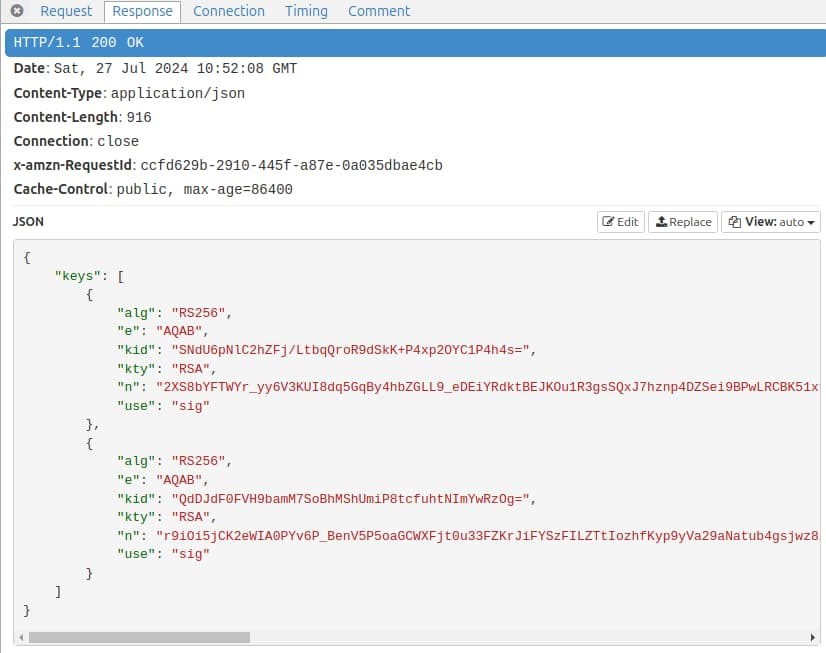

# SPA and API - OAuth Messages

In our last post I explained <a href='basicspa-execution.mdx'>How to Run the Basic SPA Sample</a>. This post takes a closer look at HTTP messages used by our SPA and API. I use these messages to provide a summary of the mainstream OAuth behaviours. Yet the main focus is the end-to-end flow within the distributed architecture, including practical behaviours like reliability.

### Development Domains

This blog provides an <a href='oauth-infrastructure-setup.mdx'>OAuth Infrastructure Setup</a> where you use the following logical domains on a development computer. This best enables early thinking about the deployment of each component.

| Component	| Base URL |
| --------- | -------- |
| SPA | *https://www.authsamples-dev.com* |
| API | *https://api.authsamples-dev.com* |
| Authorization Server | *https://login.authsamples.com* |

In this blog I use a cloud parent domain of *authsamples.com* for components that run in the AWS cloud. Components that run on a development computer use a fictional parent domain of *authsamples-dev.com*, to indicate that they are under development. OAuth flows use a mix of local and deployed components.

### Viewing OAuth Messages

Most of the time I trace HTTP/S messages using an HTTP development proxy rather than browser tools. This allows me to view traffic from both the SPA and API together. See the below post if you are new to this type of tool:

- <a href='http-debugging-setup.mdx'>HTTP Proxy Setup</a>

The first code sample runs on HTTP URLs and technical restrictions force us to use a domain name of *localhost* for the SPA. To use more architecturally meaningful URLs, this post's messages use the <a href='improved-spa-code-sample-overview.mdx'>second code sample</a>.

### Step 1. SPA Downloads its Configuration

The sample first downloads configuration settings from the server, to avoid hard coding these details in JavaScript. This includes OAuth settings, whose values are safe to download to the browser.


### Step 2. SPA Initiates an Authorization Redirect

The SPA client needs to get an access token with which to call its APIs, and needs to initiate user authentication to get one. The SPA uses the *oidc-client-ts* library to create an authorization request URL containing OpenID Connect keywords. The SPA sets its location to this URL, to cause a front channel browser redirect to Cognito’s authorization endpoint:


Authorization servers contain a registration entry for the OAuth client containing allowed settings, and only allow the request if the SPA uses the correct *Client ID*, *Redirect URI* and *Scope*. The client uses the following scope parameters to request permissions to issue to the access token once user authentication completes:

| Scope | Meaning |
| ----- | ------- |
| openid | OpenID Connect is used in addition to OAuth 2.0. |
| profile | Needed later to get the user’s name details from the OpenID Connect userinfo endpoint. |
| https://api.authsamples.com/investments | A custom scope to grant access to an area of business data. |

### Step 3. SPA Gets OpenID Connect Metadata

The first thing the security library does is make a cross origin HTTP request to get OpenID Connect metadata at the below URL. In some authorization servers you may need to explicitly enable CORS for the SPA's web origin:

- [https://cognito-idp.eu-west-2.amazonaws.com/eu-west-2_CuhLeqiE9/.well-known/openid-configuration](https://cognito-idp.eu-west-2.amazonaws.com/eu-west-2_CuhLeqiE9/.well-known/openid-configuration)

The metadata response includes details about the authorization server capabilities and its OpenID Connect endpoints:


### Step 4. User Authenticates at the Authorization Server

When the authorization server receives the request, it validates the request parameters and presents login forms. The user could authenticate in many possible ways to provide proof of their identity. In this blog I provide pre-created test users and use simple passwords to allow anyone to sign in:


In some use cases, you can configure the authorization server to present a consent screen once user authentication completes. The user then grants third-party clients the requested access token permissions. In this blog's examples, there are no third-party clients. Instead, both APIs and clients are part of the same organization. That organzation owns the data and not the user.  Therefore, I do not configure user consent.

### Step 5. An Authenticated User Session Begins

Once a login completes successfully, the authorization server issues a SSO (single sign-on) cookie to the browser. This is a third-party cookie since the authorization server runs in an unrelated domain from the SPA. In subsequent authorization requests the authorization server knows the user is already signed in when it receives this cookie, and can avoid login prompts.


There are a couple of issues with the way cookies are set:

- I like to configure the authorization server to use *session cookies* that automatically expire when the user closes all browser windows. When the SSO cookie is persistent, as for AWS Cognito, the user is only signed out of the app qwhen the user closes the browser. When the app restarts, the user performs a *Single Sign On (SSO)* and is automatically signed in. This is not the behaviour I want.

- Identity systems issue cookies that are usually always third-party from the app's viewpoint. To work in the best ways for applications, they should use the *SameSite=none* cookie property. This instructs browsers to send the cookie when the app redirects to the authorization server. I say more about the impact in the <a href='user-sessions-and-token-renewal.mdx'>Iframe-Based Token Renewal</a> blog post.

### Step 6. SPA Receives an Authorization Response

The authorization server returns an authorization response to the SPA, containing an *authorization code*. The SPA must reload to handle this login response and get tokens.


The SPA receives the response on its redirect URI. This can be a particular path, such as */callback*, or you can use the base URL of the SPA. The security library implements the response processing. It makes recommended OAuth checks like verifying that the response state parameter matches the request state parameter.

### Step 7. SPA Swaps Code for Tokens

As part of its response processing, the library makes a direct HTTPS back channel request to the authorization server’s token endpoint. This is an *authorization code grant* message, which swaps the code for tokens:


In OAuth there are multiple grant messages and this is just one of them. When possible, your OAuth clients should provide a credential before they receive tokens, but an SPA has nowhere secure to store such a credential. The SPA is therefore considered a *public client* and gets tokens in a less secure way than *confidential clients*.

The result of all grant messages is to receive tokens. I configure the authorization server to return access tokens with a short 15 minute expiry. Before accepting tokens, the security library validates the ID token to ensure that it is from the authorization server that the client trusts. 


An OAuth flow for SPAs should avoid returning refresh tokens to the browser, since it is a long-lived credential and the browser has nowhere secure to store it. Yet, at the time of writing, AWS Cognito does not allow the refresh token to be disabled.

### Step 8. Proof Key for Code Exchange is Used

PKCE is an extension to the original *authorization code flow* and involves the following additional steps:

- Client generates a runtime secret (the *code_verifier*) before issuing an authorization redirect.
- Client sends a hash of the secret (the *code_challenge*) in the authorization request.
- Client posts the code verifier in the authorization code grant request.
- Authorization server verifies that hash of the verifier matches the challenge received earlier, before issuing tokens.

This protects against some types of attack, such as a malicious party sending an intercepted authorization code to the authorization server. 

### Step 9: SPA Handles Login Errors

Authorization requests sometimes result in authorization response errors. You can simulate one if you add an invalid scope like *xxx* to the SPA's configuration:

```json
{
    "app": {
        "apiBaseUrl":             "https://api.authsamples-dev.com/api"
    },
    "oauth": {
        "provider":               "cognito",
        "authority":              "https://cognito-idp.eu-west-2.amazonaws.com/eu-west-2_CuhLeqiE9",
        "clientId":               "hje94a2jj3lgkobkh57ikenhh",
        "redirectUri":            "https://www.authsamples-dev.com/spa",
        "postLogoutRedirectUri":  "https://www.authsamples-dev.com/spa/loggedout.html",
        "scope":                  "openid profile https://api.authsamples.com/investments xxx",
        "customLogoutEndpoint":   "https://login.authsamples.com/logout"
    }
}
```

If you run a new login redirect with the invalid configuration, you receive an error authorization response that contains  *error* and *error_description* fields:


The security library reads error details and makes them available to the SPA. Since the SPA cannot recover, it presents an error display to the user, to help with problem resolution. In development mode, the SPA renders a stack trace to indicate the source location of the caught error.


The authorization server only returns errors in an authorization response when the client provides a recognised *Client ID* and *Redirect URI*. If this is not the case the authorization server renders an error page instead:


### Step 10. View Access Token Claims

After a successful user login, the SPA calls APIs with an access token. You can view access token claims if you paste the access token into an [Online JWT Viewer](https://jwt.io/). This information is only meant to be available to APIs. Some authorization servers issue this data in alternative token formats, so that clients like the SPA cannot read it.


The access token is a JWT that is digitally signed and which must be verified by APIs. The values in the payload are *claims* that you use to restrict access token privileges. After an API verifies the JWT's digital signature it can trust the claims contained in the JWT payload. The following are built-in OAuth protocol claims that the API uses:

- **sub**: A unique immutable identifier for the user.
- **iss**: The authorization server that issued the token.
- **scope**: Scopes can represent business areas.
- **exp**: The time when the token expires.

The authorization server should also issue an *audience (aud)* claim, which can be an array, to represent one or more related APIs. In larger API deployments, the *scope* and *aud* claims provide mechanisms to restrict the APIs that accept the access token. The access token also contains the following custom claims that the API can use for its business authorization. I say more about custom claims in the second code sample:

- **manager_id**: A familiar user identity that the API uses in its business data.
- **role**: A value from which APIs can derive business permissions.

### Step 11. View ID Token Claims

Because the SPA included the *openid* scope, OpenID Connect is used and the SPA receives an ID token, which informs it how and when authentication occurred. The audience claim of this token is the client ID of the SPA:


### Step 12. SPA Downloads User Info

Next the oidc-client-ts library sends the access token to the authorization server’s userinfo endpoint, to get additional details for the user. I always code apps to receive personal data from this endpoint, rather than from the ID token. The frontend uses this API response to display the user's name details.


You should be able to control the fields in the userinfo response depending on the scopes in the access token. Later in this blog I issue the *manager_id* and *role* claims to access tokens when the client uses the *investments* scope. Clients without the *investments* scope, like the initial SPA, should not have access to these claims when they get userinfo.

### Step 13. SPA Calls API with Access Token

Next the SPA calls the API and, because this is a cross domain call, the browser first triggers a pre-flight HTTP OPTIONS request:


The API response to the pre-flight request grants API access to the web origin and allows it to send the *HTTP Authorization Header*:


The API request then supplies the access token as a bearer credential in the HTTP authorization header. Any party that can intercept a valid access token can call the API in the same way:


### Step 14. API Validates Access Token

When the API receives the token it is the API’s job to validate it, which typically involves checking the following:

| Property | Expectation |
| -------- | ----------- |
| Issuer | The token is from our authorization server. |
| Audience | The token was issued for our API. |
| Digital Signature | The token has not been tampered with since issued. |
| Active | The token is valid at the current time and not expired. |

To verify the access token’s digital signature, the API must download token signing public keys from AWS Cognito. This occurs when the JOSE security library calls Cognito's JSON Web Key Set (JWKS) endpoint:



The response contains public keys in the *JSON Web Key* format, and the security library selects the one that matches the key identifier (*kid*) in the access token’s JWT header. The library then uses the public key to cryptographically verify the JWT's signature.

The API security library (or a utility that assists it) caches JSON Web Keys in-memory to avoid unnecessary lookups on subsequent API requests whose access tokens use the same key identifier.

### Step 15. API Returns Error Status Codes

If the API’s token validation fails, the API must return one of these error results:

- If the token is missing, invalid or expired, return a response with an HTTP *401* status code.
- If there was a technical problem in the API, return a response with an HTTP *500* status code.

I recommend testing these scenarios to ensure that the API returns useful error responses to the SPA. You can test the second failure scenario if you configure an invalid JWKS endpoint, like *jwks.xxx*, in the API’s configuration:

```json
{
    "api": {
        "port": 443,
        "sslCertificateFileName": "./certs/authsamples-dev.ssl.p12",
        "sslCertificatePassword": "Password1",
        "trustedOrigins": [
            "https://www.authsamples-dev.com"
        ],
        "useProxy": true,
        "proxyUrl": "http://127.0.0.1:8888"
    },
    "oauth": {
        "jwksEndpoint":                  "https://cognito-idp.eu-west-2.amazonaws.com/eu-west-2_CuhLeqiE9/.well-known/jwks.xxx",
        "userInfoEndpoint":              "https://login.authsamples.com/oauth2/userInfo",
        "issuer":                        "https://cognito-idp.eu-west-2.amazonaws.com/eu-west-2_CuhLeqiE9",
        "audience":                      "",
        "scope":                         "https://api.authsamples.com/investments",
        "claimsCacheTimeToLiveMinutes":  15
    }
}
```

The API then returns a 500 error to the UI, since the technical problem is not the fault of the client. The SPA clearly indicates this in its error display, so that troubleshooting could focus on the API:


Meanwhile,
 the API performs some basic but readable error logging. Its logged error includes the error returned to the client and the exception details that should explain the root cause of the problem. I explore API supportability in greater depth in future posts.


### Step 16. API uses Claims for Authorization

Once token validation is complete, the API can trust claims from the JWT and use them to authorize access to its business data. Typically, the most important claims are those representing the user's identity, like the *subject claim* from the access token. The API then applies its business rules to restrict resource access using techniques like those listed below: 

- Filtering collection items to those the user is entitled to access.
- Filtering response fields to those the user is entitled to access.
- Denying access if an unauthorized individual item is requested.

### Step 17. API Returns 401 when the Token Expires

The SPA continues to use the access token until it expires 15 minutes after login, or the user closes their browser. Access token expiry can be simulated by clicking *Expire Token* followed by *Reload Data*:


Of course, I cannot really change time to expire a token, so this test operation simply adds characters to the token to cause the API token validation to fail with a 401:


### Step 18. SPA Handles Access Token Expiry

The SPA code expects 401 responses and should recover with no impact on usability. In the first code sample there is no token renewal so the user is redirected to sign in again, which is not a good user experience. Due to the SSO session cookie issued earlier, a single sign-on event occurs and new tokens are issued to the SPA automatically. The SPA can then continue to call the API with its new access token.

### Trace any OAuth Flow

I explained only a partial application lifecycle and there are many other OAuth flows. Once you have a productive process for tracing HTTP requests in both browser and non-browser components, you can debug all of them in the same way.

### Where Are We?

The code sample shows how an organization can integrate an SPA and API with its authorization server. I explained a partial application lifecycle in terms of HTTP requests. This includes OAuth and API flows, and some practical aspects that include configuration management and error handling.

### Next

- I explain some <a href='basicspa-codingkeypoints.mdx'>SPA Code Details</a> for the first code sample.
- For a list of all blog posts see the <a href='index.mdx'>Index Page</a>.
