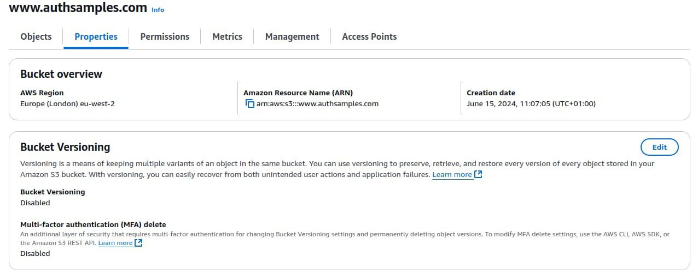

# Web Content Delivery

Previously I finalized the <a href='managed-authorization-server-setup.mdx'>Managed Authorization Server Setup</a>, using AWS Cognito. In this post I apply some finishing touches to the <a href='web-technology-setup.mdx'>Modern Web Technology Setup</a>, to complete the web architecture with deployment of static content to a content delivery network.

### Global Web Performance

In this post I demonstrate meeting performance goals from the earlier post on <a href='web-architecture-goals.mdx'>Web Architecture Goals</a>. AWS CloudFront is a content delivery network that provides optimized web hosting:


To deploy the SPA I simply upload web assets to S3 after which CloudFront distributes them to many global *Edge Locations*, so that all users receive roughly equal web performance.

### CloudFront Domains

In total I use the following domains for web content, each of which has an S3 bucket and a CloudFront distribution:

| Domain | Usage |
| ------ | ----- |
| www.authsamples.com | Serves web content for an online SPA that connects to APIs that use Serverless hosting. |
| www.authsamples-k8s.com | Serves web content for an online SPA that connects to APIs that use Kubernetes hosting. |
| mobile.authsamples.com | Serves assets used for native mobile logins and mobile deep linking. |

This post covers the details for the first domain, and the steps for other domains are equivalent. First though I briefly summarise some build related steps that help to enable a good web deployment architecture.

### Automated Deployment

In a prevouis post I explained <a href='how-to-run-the-react-js-spa.mdx'>How to Run the Final SPA</a>. To deploy to CloudFront I use the following commands, though they only work if you have access to my AWS account:

```bash
git clone https://github.com/gary-archer/oauth.websample.final
cd oauth.websample.final/deployment/cloudfront
./build.sh && ./deploy.sh
```

### SPA Release Builds

The build script for the final SPA produces a root level *dist* folder containing static content to deploy. A real build system could provide content for multiple micro frontends within the same web domain. I build the release JavaScript bundles with minification enabled. I also use the [purgecss command line tool](https://github.com/FullHuman/purgecss) to reduce the size of the Bootstrap CSS file. The following screenshot shows the final assets. I do not deploy source map files but in a real system I would save them to help diagnose production stack traces.


I produce a final *index.html* file and use cache busting timestamps for JS and CSS files, to ensure that the browser's cache never serves old files after an upgrade. I also apply [subresource integrity](https://developer.mozilla.org/en-US/docs/Web/Security/Subresource_Integrity) attributes, to bind each resource to the HTML file. This does not solve any real security problems for my web deployment, but is a personal preference, to assert the correctness of assets shipped together.

```html
<!DOCTYPE html>
<html lang='en'>
    <head>
        <meta charset='utf-8'>
        <meta name='viewport' content='width=device-width, initial-scale=1, shrink-to-fit=no'>

        <base href='/spa/' />
        <title>OAuth Demo App</title>

        <link rel='stylesheet' href='bootstrap.min.css?t=1650271813125' integrity='sha256-YvdLHPgkqJ8DVUxjjnGVlMMJtNimJ6dYkowFFvp4kKs='>
        <link rel='stylesheet' href='app.css?t=1650271813125' integrity='sha256-B7pu+gcFspulW4zXfgczVtPcEuZ81tZRFYeRciEzWro='>
    <body>
        <div id='root' class='container'></div>

        <script type='module' src='vendor.bundle.js?t=1650271813125' integrity='sha256-yLQJi00XkopJDWGmjFgY/bNE72PBzwohkjbEoOfOjY0='></script>
        <script type='module' src='react.bundle.js?t=1650271813125' integrity='sha256-hdh2E1CmilnpzH/kcBRSVEnQrt/lIKnwOG5nLgFdiNk='></script>
        <script type='module' src='app.bundle.js?t=1650271813125' integrity='sha256-tYOvvC8IVdWFcxu2lXP89v1hsVTXL0Lt4kZnOKzqguk='></script>
    </body>
</html>
```

A script called *rewriteIndexHtml.ts* produces the final HTML file while also keeping it readable. This script also removes the below line from release bundle files, to prevent production users ever seeing messages about missing source maps in the browser console:

```markdown
//# sourceMappingURL=app.bundle.js.map
```

### SPA Deployed Configuration

In development, the SPA downloads an *spa.config.json* file, whose content would depend on the domain in which the SPA runs. Use of a configuration file provides a mechanism where binaries can be built once and then promoted down a pipeline. Code never then needs changing, if for example a completely new test environment needs to be created.

```json
{
    "bffBaseUrl": "https://bff.authsamples-dev.com"
}
```


I instead hard code the production configuration, to avoid the need for configuration downloads, partly because JSON files do not have subresource integrity protection. When getting configuration, the SPA first checks its web origin and uses hard coded configuration when it runs in a production domain:

```typescript
if (location.origin.toLowerCase() === productionConfiguration.app.webOrigin.toLowerCase()) {
    return productionConfiguration;
}

return this.download();
```

### Web Content Uploads

After building static content I created an S3 bucket named after the *www.authsamples.com* subdomain:



I then activated *Static Website Hosting* and chose *index.html* as the default document:


When the *deploy.sh* script is run, it simply invokes *aws s3 cp* to copy the *dist* folder containing HTML assets up to AWS:

```markdown
upload: .package/favicon.ico to s3://www.authsamples.com/favicon.ico
upload: .package/spa/index.html to s3://www.authsamples.com/spa/index.html
upload: .package/spa/app.css to s3://www.authsamples.com/spa/app.css
upload: .package/spa/bootstrap.min.css to s3://www.authsamples.com/spa/bootstrap.min.css
upload: .package/spa/app.bundle.js to s3://www.authsamples.com/spa/app.bundle.js
upload: .package/spa/vendor.bundle.js to s3://www.authsamples.com/spa/vendor.bundle.js
upload: .package/spa/react.bundle.js to s3://www.authsamples.com/spa/react.bundle.js
```

Once the upload completes a number of files exist in the S3 bucket, where the SPA files are located in an *spa* folder. Other micro frontends could be added in parallel folders, so that the deployment allows for future growth.


The SPA uses the following default domain and serves content over plain HTTP:

- *http://www.authsamples.com.s3-website.eu-west-2.amazonaws.com*

If you try to browse to the SPA you get an access denied error, since only AWS CloudFront is granted access to the S3 bucket's content:


### Web SSL Certificates

During the <a href='cloud-domain-setup.mdx'>Cloud Domain Setup</a> post I explained how I provisioned SSL certificates for the *us-east-1* (North Virginia) region. Web downloads use the wildcard certificate for that region:


### CloudFront Distribution

Next I created a CloudFront distribution and selected the S3 bucket. I then added *www.authsamples.com* as an alternative name and assigned the certificate:


Next I edited *Origin Settings* and chose the *Create new OAC* option to create a policy that grants the CloudFront distribution access to the S3 bucket:


I then selected the *Copy Policy* option and pasted the following JSON data into the permissions for the S3 bucket:

```json
{
    "Version": "2008-10-17",
    "Id": "PolicyForCloudFrontPrivateContent",
    "Statement": [
        {
            "Sid": "AllowCloudFrontServicePrincipal",
            "Effect": "Allow",
            "Principal": {
                "Service": "cloudfront.amazonaws.com"
            },
            "Action": "s3:GetObject",
            "Resource": "arn:aws:s3:::www.authsamples.com/*",
            "Condition": {
                "StringEquals": {
                    "AWS:SourceArn": "arn:aws:cloudfront::090109105180:distribution/E1P4XPOL1PNE6Z"
                }
            }
        }
    ]
}
```

### Web External URL

After creation of the CloudFront distributions, I returned to Route 53 and added an *A Record* for the CloudFront generated URL:

<div className='smallimage'>
    
</div>

### Initial SPA Usage

The deployed SPA is then available at the following public URL. By default though, navigating to React paths results in *404 Not Found* errors. To resolve this, a small amount of *web backend code* needs to run in the CDN.

- [https://www.authsamples.com](https://www.authsamples.com)

### CDN Behaviours

There are four essential behaviours that the CDN host needs to provide, summarised in the following table:

| Behaviour | Description |
| --------- | ----------- |
| Compression | Web resources should be compressed to reduce download sizes and improve performance. |
| Security Headers | Security headers should be set to provide a security policy to the browser. |
| Performance Headers | The cache-control header should be set to prevent redundant requests from the browser to the CDN. |
| Document Serving | Serve the *index.html* and static resources like JavaScript bundles while also handling invalid paths. |

These are configured under the *Behaviors* settings of the CloudFront distribution, which can link to CloudFront policies or functions. I created a *Response Headers Policy* and activated compression and most security headers using the visual user interface:


The most interesting setting is the [Content Security Policy](https://developer.mozilla.org/en-US/docs/Web/HTTP/CSP) which protects against common threats and only allow the SPA's JavaScript to make remote calls to its web host and backend for frontend. I use settings of the following form in both CloudFront and the webpack development server that I use for development:

```markdown
default-src 'none';
script-src 'self';
connect-src 'self' https://bff.authsamples.com;
child-src 'self';
img-src 'self';
style-src 'self';
object-src 'none';
frame-ancestors 'none';
base-uri 'self';
form-action 'self'
```

The web security headers protect against certain web security vulnerabilities and also ensure a good security score on online sites such as [Mozilla Observatory](https://observatory.mozilla.org):


I implemented the final two behaviours using [CloudFront Functions](https://docs.aws.amazon.com/AmazonCloudFront/latest/DeveloperGuide/cloudfront-functions.html). The *cache-control* header is set using a *Viewer Response* function. This instructs the browser to perform local browser caching of all web static content files except the *index.html* file.

```javascript
function handler(event) {
    
    const request = event.request;
    const response = event.response;
    const headers = response.headers;

    if (request.uri.match(/^.*(\.jpg|\.ico|\.js|\.css)$/)) {
        
        headers["cache-control"] = {
            value: "public, max-age=31536000, immutable",
        };
    } else {

        headers["cache-control"] = {
            value: "no-cache, must-revalidate",
        };
    }

    return response;
}
```

Document serving uses a *Viewer Request* function with the following logic to serve the *index.html* file for all React routes, so that client side navigation works correctly in the browser. This function also handles paths outside the React app by redirecting to the web domain's default location:

```javascript
function handler(event) {
    
    const request = event.request;
    const requestUri = request.uri.toLowerCase();
    
    if (requestUri === '/favicon.ico') {
        return request;
    }

    const spaBasePath = '/spa/';
    if (!requestUri.startsWith(spaBasePath)) {

        return {
            statusCode: 302,
            statusDescription: 'Found',
            headers: {
                'location': {
                  value: spaBasePath,
                },
            },
        };
    }

    const extensions = [
        '.html',
        '.js',
        '.css'
    ];

    const knownExtension = extensions.find((ext) => {
        return requestUri.endsWith(`${ext}`);
    });

    if (!knownExtension) {
        request.uri = `${spaBasePath}index.html`;
    }
    
    return request;
}
```

I then configure the CloudFront functions against the distribution:


A key point to understand is the separation of concerns. The code that runs within the CDN only manages web concerns and never deals with data security. If the code was to call APIs it would add considerable complexity to both deployment systems and developer setups. CDNs may also impose short HTTP request timeouts and small message sizes leading to reliability problems. 

### Upgrading the SPA

When you upload changes to HTML assets they do not automatically deploy to all of the global edge locations. To prevent users from receiving old content, force edge locations to pull updated content from S3. The *deploy.sh* script does so by executing a CloudFront invalidation for all web resources. In larger deployments you could instead only invalidate modified resources.

The *index.html* file must always be invalidated. It is requested every time the browser reloads and most commonly results in a 304 response from the server. After an upgrade, users download a new *index.html* file and its cache busting timestamps trigger downloads of other static resources.

### Where Are We?

I completed this blog's SPA work by deploying its static content to ~400 global locations while also following some security and reliability best practices. Web deployments within an OAuth architecture should be technically simple and entirely separated from the API side of the architecure. You then provide good web performance to all users in an easy to manage way.

### Next

- Next I provide an overview of this blog's <a href='serverless-api-overview.mdx'>Serverless API</a>.
- For a list of all blog posts see the <a href='index.mdx'>Index Page</a>.
