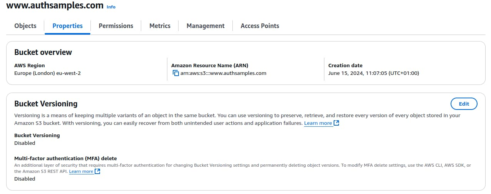
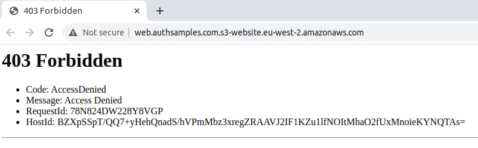
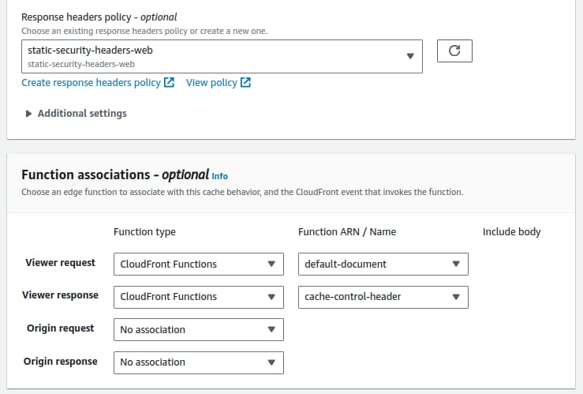

# Web Content Delivery

Previously I finalized the <a href='managed-authorization-server-setup.mdx'>Managed Authorization Server Setup</a>, using AWS Cognito. In this post I apply some finishing touches to the <a href='web-technology-setup.mdx'>Web Technology Setup</a>, to complete the web architecture with deployment of static content to a content delivery network.

### CloudFront Domains

This blog uses the following domains for web content, each of which has an S3 bucket and a CloudFront distribution. In the following sections I explain how I deploy to the *www* subdomain. The process works equivalently for the *mobile* subdomain.

| Domain | Usage |
| ------ | ----- |
| www.authsamples.com | Serves web content for an online SPA that connects to APIs that use Serverless hosting. |
| mobile.authsamples.com | Serves assets used for native mobile logins and mobile deep linking. |

### Automated Deployment

In a previous post I explained <a href='how-to-run-the-react-js-spa.mdx'>How to Run the Final SPA</a>. To deploy to CloudFront I use the following commands, and the deployment requires access to my AWS account:

```bash
git clone https://github.com/gary-archer/oauth.websample.final
cd oauth.websample.final/deployment/cloudfront
./build.sh && ./deploy.sh
```

### SPA Release Builds

The build script for the final SPA produces a *dist* folder containing minimized static content, and then produces a *.package* folder with the files to upload. The *.package* folder excludes source map files, but in a real system I would save them to help diagnose production stack traces.


The build steps also produces a final *index.html* file that references minimized assets. The randomized file names trigger new downloads after an upgrade. I also apply [subresource integrity](https://developer.mozilla.org/en-US/docs/Web/Security/Subresource_Integrity) attributes, to bind each resource to the HTML file. This may not solve any real security problems for my web deployment, but is a personal preference, to assert the correctness of assets shipped together.

```html
<!DOCTYPE html>
<html lang='en'>
    <head>
        <meta charset='utf-8'>
        <meta name="viewport" content="width=device-width, initial-scale=1">
        <base href='/spa/'>
        <title>OAuth Demo App</title>

        <link rel='stylesheet' href='app.b318e9c9.css' integrity='sha256-gWb7kP9AsUFYeBd2uc3GzT+7poOXE34bZiAEU/+wTcs='>
    </head>
    <body>
        <div id='root'></div>

        <script type='module' src='vendor.b318e9c9.bundle.js' integrity='sha256-AAi81ovJP4NRlxcudu6sdQTe/WaEGNpI/boOYB1PTVA='></script>
        <script type='module' src='react.b318e9c9.bundle.js' integrity='sha256-cHkY6uELEDHsuimGjdkwolKbvelS47XR37hg7gtyYh8='></script>
        <script type='module' src='app.b318e9c9.bundle.js' integrity='sha256-o+dX4AiFiA8KLBmb8FkGuijjkFHhQQMBIrwFtRLpFVo='></script>
    </body>
</html>
```

A Rollup custom plugin named *writeIndexHtml* handles the [writeBundle](https://rollupjs.org/plugin-development/#writebundle) event to produce the final HTML file while also keeping it readable. A separate custom plugin named *finalizeBundles* handles the [generateBundle](https://rollupjs.org/plugin-development/#generatebundle*) event to remove the below line from release bundles, to prevent production users ever seeing messages about missing source maps in the browser console.

```markdown
//# sourceMappingURL=app.bundle.js.map
```

### SPA Deployed Configuration

In development, the SPA downloads an *spa.config.json* file, whose content would depend on the domain in which the SPA runs. Use of a configuration file provides a mechanism where binaries can be built once and then promoted down a pipeline. If I needed to spin up a new environment, I could use existing bundles and a new configuration file.

```json
{
    "bffBaseUrl": "https://bff.authsamples-dev.com",
    "delegationIdClaimName": "origin_jti"
}
```


I instead hard code the production configuration, to avoid the need for configuration downloads, partly because JSON files do not have subresource integrity protection. When getting configuration, the SPA first checks its web origin and uses hard coded configuration when it runs in a production domain:

```typescript
if (location.origin.toLowerCase() === productionConfiguration.app.webOrigin.toLowerCase()) {
    return productionConfiguration;
}

return this.download();
```

### Web Content Uploads

After building static content I created an S3 bucket named after the *www.authsamples.com* subdomain:



I then activated *Static Website Hosting* and chose *index.html* as the default document:


When the *deploy.sh* script is run, it simply invokes *aws s3 cp* to copy the *dist* folder containing HTML assets up to AWS:

```markdown
Deploying files to S3 ...
upload: .package/favicon.ico to s3://www.authsamples.com/favicon.ico
upload: .package/spa/index.html to s3://www.authsamples.com/spa/index.html
upload: .package/spa/app.b318e9c9.bundle.js to s3://www.authsamples.com/spa/app.b318e9c9.bundle.js
upload: .package/spa/react.b318e9c9.bundle.js to s3://www.authsamples.com/spa/react.b318e9c9.bundle.js
upload: .package/spa/vendor.b318e9c9.bundle.js to s3://www.authsamples.com/spa/vendor.b318e9c9.bundle.js
upload: .package/spa/app.b318e9c9.css to s3://www.authsamples.com/spa/app.b318e9c9.css
```

Once the upload completes a number of files exist in the S3 bucket, where the SPA files are located in an *spa* folder. Other micro frontends could be added in parallel folders, so that the deployment allows for future growth.


### Static Content Source URL

The SPA uses the following default domain and serves content over plain HTTP:

- *http://www.authsamples.com.s3-website.eu-west-2.amazonaws.com*

If you try to browse to the SPA you get an access denied error, since only AWS CloudFront is granted access to the S3 bucket's content:



### Web SSL Certificates

During the <a href='cloud-domain-setup.mdx'>Cloud Domain Setup</a> post I explained how I provisioned SSL certificates for the *us-east-1* (North Virginia) region. Web downloads use the wildcard certificate for that region:


### CloudFront Distribution

The role of CloudFront is to distribute web assets uploaded to S3 to many global *Edge Locations*, so that all users receive roughly equal web performance. To enable that, I created a CloudFront distribution that maps to the S3 bucket. I then added *www.authsamples.com* as an alternative name and assigned the certificate:


Next I edited *Origin Settings* and chose the *Create new OAC* option to create an *Origin Access Control* policy that grants the CloudFront distribution access to the S3 bucket:


I then selected the *Copy Policy* option and pasted the following JSON data into the permissions for the S3 bucket:

```json
{
    "Version": "2008-10-17",
    "Id": "PolicyForCloudFrontPrivateContent",
    "Statement": [
        {
            "Sid": "AllowCloudFrontServicePrincipal",
            "Effect": "Allow",
            "Principal": {
                "Service": "cloudfront.amazonaws.com"
            },
            "Action": "s3:GetObject",
            "Resource": "arn:aws:s3:::www.authsamples.com/*",
            "Condition": {
                "StringEquals": {
                    "AWS:SourceArn": "arn:aws:cloudfront::090109105180:distribution/E1P4XPOL1PNE6Z"
                }
            }
        }
    ]
}
```

### Static Content Internet URL

After creation of the CloudFront distributions, I returned to Route 53 and added an *A Record* for the CloudFront generated URL:

<div className='smallimage'>
    
</div>

The deployed SPA is then available at the following public URL. By default though, navigating to React paths results in *404 Not Found* errors. To resolve this, a small amount of *web backend code* needs to run in the CDN.

- [https://www.authsamples.com](https://www.authsamples.com)

### CDN Behaviours

There are four essential behaviours that the CDN host needs to provide, summarised in the following table:

| Behaviour | Description |
| --------- | ----------- |
| Compression | Web resources should be compressed to reduce download sizes and improve performance. |
| Security Headers | Security headers should be set, in particular to provide a content security policy to the browser. |
| Performance Headers | The cache-control header should be set to prevent redundant requests from the browser to the CDN. |
| Document Serving | Serve the *index.html* and static resources like JavaScript bundles while also handling invalid paths. |

These are configured under the *Behaviors* settings of the CloudFront distribution, which can link to CloudFront policies or functions. I created a *Response Headers Policy* and activated compression and most security headers using the visual user interface:


The most interesting setting is the [Content Security Policy](https://developer.mozilla.org/en-US/docs/Web/HTTP/CSP) which protects against common threats and only allow the SPA's JavaScript to make remote calls to its web host and backend for frontend. I use settings of the following form:

```markdown
default-src 'none';
script-src 'self';
connect-src 'self' https://bff.authsamples.com;
child-src 'self';
img-src 'self';
style-src 'self';
object-src 'none';
frame-ancestors 'none';
base-uri 'self';
form-action 'self'
```

The web security headers protect against certain web security vulnerabilities and also ensure a good security score on online sites such as [Mozilla Observatory](https://observatory.mozilla.org):


I implemented the final two behaviours using [CloudFront Functions](https://docs.aws.amazon.com/AmazonCloudFront/latest/DeveloperGuide/cloudfront-functions.html). The *cache-control* header is set using a *Viewer Response* function. This instructs the browser to perform local browser caching of all web static content files except the *index.html* file.

```javascript
function handler(event) {
    
    const request = event.request;
    const response = event.response;
    const headers = response.headers;

    if (request.uri.match(/^.*(\.jpg|\.ico|\.js|\.css)$/)) {
        
        headers["cache-control"] = {
            value: "public, max-age=31536000, immutable",
        };
    } else {

        headers["cache-control"] = {
            value: "no-cache, must-revalidate",
        };
    }

    return response;
}
```

Document serving uses a *Viewer Request* function with the following logic to serve the *index.html* file for all React routes, so that client side navigation works correctly in the browser. This function also handles paths outside the React app by redirecting to the web domain's default location:

```javascript
function handler(event) {
    
    const request = event.request;
    const requestUri = request.uri.toLowerCase();
    
    if (requestUri === '/favicon.ico') {
        return request;
    }

    const spaBasePath = '/spa/';
    if (!requestUri.startsWith(spaBasePath)) {

        return {
            statusCode: 302,
            statusDescription: 'Found',
            headers: {
                'location': {
                  value: spaBasePath,
                },
            },
        };
    }

    const extensions = [
        '.html',
        '.js',
        '.css'
    ];

    const knownExtension = extensions.find((ext) => {
        return requestUri.endsWith(`${ext}`);
    });

    if (!knownExtension) {
        request.uri = `${spaBasePath}index.html`;
    }
    
    return request;
}
```

To make the Cloudfront functions active, I configured them against the CloudFront functions of the distribution:



The code that runs within the CDN only manages web concerns and never deals with data security. If the code was to call APIs it would add considerable complexity to both deployment systems and developer setups. AWS is likely to impose short HTTP request timeouts and small message sizes for API calls from Cloudfront functions, which would lead to reliability problems for web users. 

### SPA Upgrades

When you upload changes to HTML assets they do not automatically deploy to all of the global edge locations. To prevent users from receiving old content, force edge locations to pull a new index.html from the S3 origin. The *deploy.sh* script does so by executing a CloudFront invalidation, which produces output similar to the following.

```json
{
    "Location": "https://cloudfront.amazonaws.com/2020-05-31/distribution/E1P4XPOL1PNE6Z/invalidation/IC6U8II7LTCGX175JPTJOAIJ9M",
    "Invalidation": {
        "Id": "IC6U8II7LTCGX175JPTJOAIJ9M",
        "Status": "InProgress",
        "CreateTime": "2026-05-29T17:09:47.079000+00:00",
        "InvalidationBatch": {
            "Paths": {
                "Quantity": 1,
                "Items": [
                    "/spa/index.html"
                ]
            },
            "CallerReference": "cli-1780074586-879837"
        }
    }
}
```

After an upgrade, the next page request from browsers gets the new *index.html*, which references new *.css* and *.js* files that the browser does not yet have. Therefore, all new assets download resiliently.

After a number of upgrades, the S3 origin has multiple sets of bundle files, with distinct randomized names. The *deploy.sh* script therefore does some cleanup, to remove bundles older than 7 days.

```bash
CUTOFF=$(date -d '7 days ago' +%F)
aws s3 ls s3://$DOMAIN/spa --recursive \
  | awk -v cutoff="$CUTOFF" '$1 < cutoff {print $4}' \
  | xargs -I {} aws s3 rm "s3://$DOMAIN/{}"
```

### Where Are We?

I completed this blog's SPA work by deploying its static content to hundreds of global locations while also following some security and reliability best practices. Web deployments within an OAuth architecture should be technically simple and entirely separated from the API side of the architecure. You then provide good web performance to all users in an easy to manage way.

### Next

- Next I provide an overview of this blog's <a href='serverless-api-overview.mdx'>Serverless API</a>.
- For a list of all blog posts see the <a href='index.mdx'>Index Page</a>.
