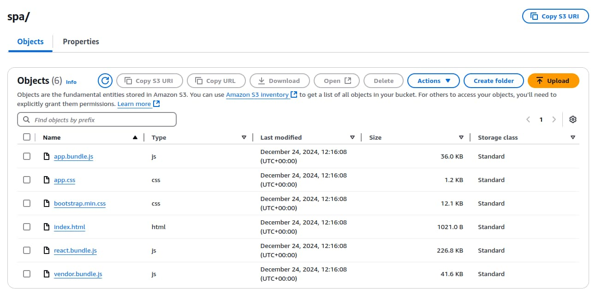
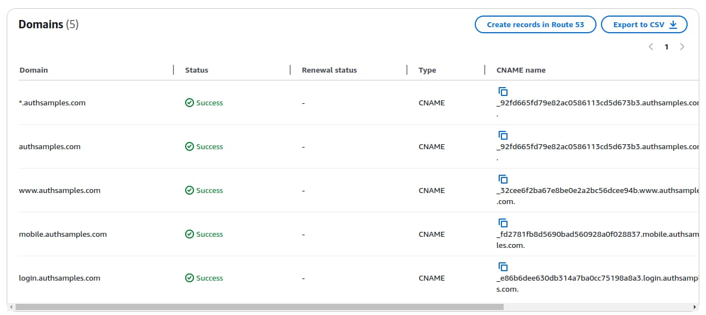
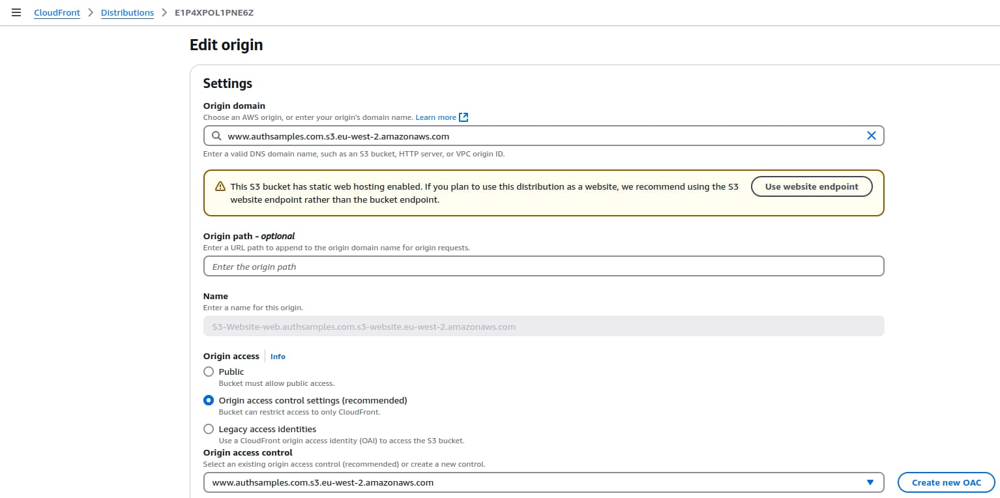
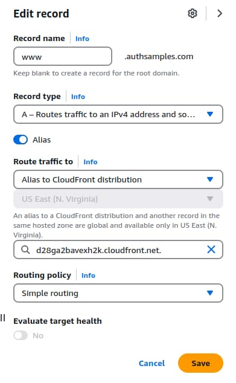
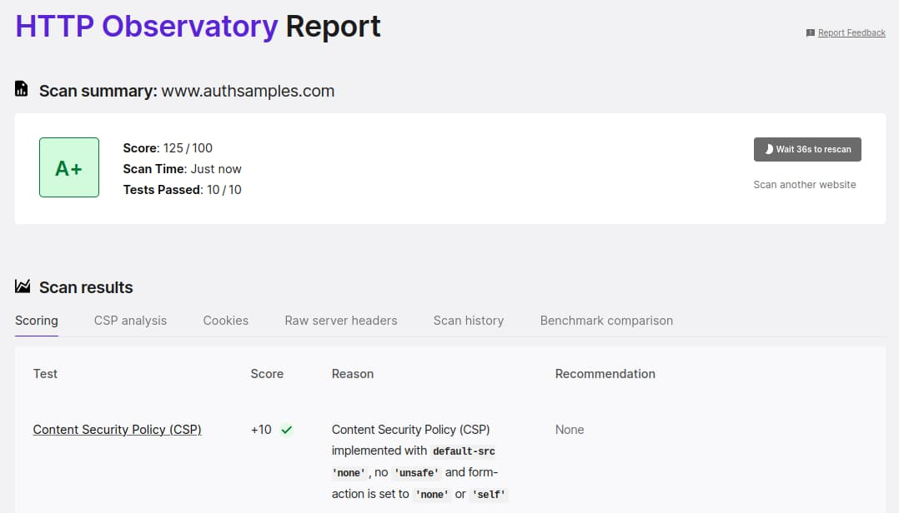

# Web Content Delivery

Previously we finalized the <a href='managed-authorization-server-setup.mdx'>Managed Authorization Server Setup</a>, using AWS Cognito. In this post we will apply finishing touches to the <a href='web-technology-setup.mdx'>Modern Web Technology Setup</a>, to complete the web architecture by deploying static content to a content delivery network.

### Global Web Performance

In this post we will meet performance requirements discussed earlier in <a href='web-architecture-goals.mdx'>Web Architecture Goals</a>. AWS CloudFront is a content delivery network that provides optimized web hosting:


To deploy the SPA we will simply upload web assets to S3, after which CloudFront will distribute them to many global *edge* locations, so that all users receive roughly equal web performance.

### CloudFront Domains

In total we will use the following domains for web content and will create S3 buckets and CloudFront distributions for each of them:

| Domain | Usage |
| ------ | ----- |
| www.authsamples.com | Serving web content for an online SPA that connects to Serverless APIs |
| www.authsamples-k8s.com | Serving web content for an online SPA that connects to Kubernetes APIs |
| mobile.authsamples.com | Assets for enabling mobile logins and deep linking |

This post covers the details for the first domain, and the steps for other domains are equivalent. First though we will briefly summarise some build related steps that help to enable a good deployment architecture.

### Automated Deployment

Details on how to run the final SPA locally were covered in <a href='how-to-run-the-react-js-spa.mdx'>this earlier post</a>. CloudFront deployment is then managed via the following commands, though this only works if you have access to my AWS account:

```bash
git clone https://github.com/gary-archer/oauth.websample.final
cd oauth.websample.final/deployment/cloudfront
./build.sh
./deploy.sh
```

### SPA Release Builds

The build script for the SPA produces a *dist* folder containing files to deploy. Release builds of webpack produce minified JavaScript bundles. This includes source map files that are not deployed but could be used to resolve production stack traces. Bootstrap CSS is also minified, using the [purgecss](https://github.com/FullHuman/purgecss) command line tool.

<div className='smallimage'>
    
</div>

A final *index.html* file is then produced, adding cache busting timestamps to asset references, to ensure that the browser’s cache never serves old files after an upgrade.

I also apply [subresource integrity](https://developer.mozilla.org/en-US/docs/Web/Security/Subresource_Integrity) attributes, to bind each resource to the HTML file. This does not solve any real security problems for my web deployment, but is a personal preference, to assert the correctness of assets shipped together.

```html
<!DOCTYPE html>
<html lang='en'>
    <head>
        <meta charset='utf-8'>
        <meta name='viewport' content='width=device-width, initial-scale=1, shrink-to-fit=no'>

        <base href='/spa/' />
        <title>OAuth Demo App</title>

        <link rel='stylesheet' href='bootstrap.min.css?t=1650271813125' integrity='sha256-YvdLHPgkqJ8DVUxjjnGVlMMJtNimJ6dYkowFFvp4kKs='>
        <link rel='stylesheet' href='app.css?t=1650271813125' integrity='sha256-B7pu+gcFspulW4zXfgczVtPcEuZ81tZRFYeRciEzWro='>
    <body>
        <div id='root' class='container'></div>

        <script type='module' src='vendor.bundle.js?t=1650271813125' integrity='sha256-yLQJi00XkopJDWGmjFgY/bNE72PBzwohkjbEoOfOjY0='></script>
        <script type='module' src='react.bundle.js?t=1650271813125' integrity='sha256-hdh2E1CmilnpzH/kcBRSVEnQrt/lIKnwOG5nLgFdiNk='></script>
        <script type='module' src='app.bundle.js?t=1650271813125' integrity='sha256-tYOvvC8IVdWFcxu2lXP89v1hsVTXL0Lt4kZnOKzqguk='></script>
    </body>
</html>
```

A script called *rewriteIndexHtml.ts* is responsible for producing the final HTML file, and ensuring that it remains readable. This script also removes the below line from release bundle files, to prevent production users ever seeing messages about missing source maps in the browser console:

```markdown
//# sourceMappingURL=app.bundle.js.map
```

### SPA Deployed Configuration

In development, the SPA downloads an *spa.config.json* file, containing the following values. These would vary depending on the stage of a company’s deployment pipeline:

```json
{
    "bffBaseUrl": "https://bff.authsamples-dev.com"
}
```

This provides a mechanism where binaries are built once then promoted down a pipeline. Code never then needs changing, if for example a completely new test environment needs to be created.

Production configurations are instead hard coded, to avoid the need for configuration downloads, and because JSON files do not have subresource integrity protection. The SPA does so by checking its web origin to see if it is running in a production domain:

```typescript
if (location.origin.toLowerCase() === productionConfiguration.app.webOrigin.toLowerCase()) {
    return productionConfiguration;
}

return this._download();
```

If so then a hard coded configuration object is used instead:

```typescript
export const productionConfiguration = {
    bffBaseUrl: 'https://bff.authsamples.com',
} as Configuration; 
```

### Web Content Uploads

Now that the app is built in the preferred way we can focus on the actual cloud deployment, which starts with creating an S3 bucket. I followed the AWS wizard and used a subdomain of `www.authsamples.com`:


I then activated *Static Website Hosting* and chose *index.html* as the default document. In this initial state, the web static content is not yet publicly accessible.


When the *deploy.sh* script is run, it simply invokes *aws s3 cp* to copy the *dist* folder containing HTML assets up to AWS:

```markdown
upload: .package/favicon.ico to s3://www.authsamples.com/favicon.ico
upload: .package/spa/app.css to s3://www.authsamples.com/spa/app.css
upload: .package/spa/index.html to s3://www.authsamples.com/spa/index.html
upload: .package/spa/bootstrap.min.css to s3://www.authsamples.com/spa/bootstrap.min.css
upload: .package/spa/app.bundle.js to s3://www.authsamples.com/spa/app.bundle.js
upload: .package/spa/react.bundle.js to s3://www.authsamples.com/spa/react.bundle.js
upload: .package/spa/vendor.bundle.js to s3://www.authsamples.com/spa/vendor.bundle.js
```

Once the upload completes a number of files exist in the S3 bucket, where the SPA files are located in an *spa* folder. Other micro-frontends could be hosted alongside these as the web architecture grows.



Our SPA’s default URL has this generated HTTP URL:

- *http://www.authsamples.com.s3-website.eu-west-2.amazonaws.com*

If we try to browse to the SPA we get an access denied error, since only AWS CloudFront will be authorized to access S3 resources directly:


### Web SSL Certificates

Next I provisioned SSL certificates for the web domain. CloudFront has a prerequisite of requiring SSL Certificates to be configured in the master *us-east-1* (North Virginia) region. So the managed certificate creation described in the domain setup needed repeating for this region:



### CloudFront Distribution

Next I created a CloudFront distribution and selected the S3 bucket:


I used the most standard and up to date options for the distribution:


I then added `www.authsamples.com` as an alternative name and assigned the certificate created earlier:


Next I selected the distribution and edited its *Origin Settings* to apply the following values. I used the *Create new OAC* option to create a policy that grants the CloudFront distribution access to the S3 bucket:



I then selected *Copy Policy* and pasted the following JSON data into the permissions for the S3 bucket:

```json
{
    "Version": "2008-10-17",
    "Id": "PolicyForCloudFrontPrivateContent",
    "Statement": [
        {
            "Sid": "AllowCloudFrontServicePrincipal",
            "Effect": "Allow",
            "Principal": {
                "Service": "cloudfront.amazonaws.com"
            },
            "Action": "s3:GetObject",
            "Resource": "arn:aws:s3:::www.authsamples.com/*",
            "Condition": {
                "StringEquals": {
                    "AWS:SourceArn": "arn:aws:cloudfront::090109105180:distribution/E1P4XPOL1PNE6Z"
                }
            }
        }
    ]
}
```

### Web External URL

Once all CloudFront distributions are created, the web assets are available over generated domain names shown in the *Origins* column:


To use the friendly domain named I returned to Route 53 and added an *A Record* for the CloudFront generated URL:



### Initial SPA Usage

The deployed SPA is then available at this cloud URL:

- [https://www.authsamples.com](https://www.authsamples.com)

By default though, navigating to React paths will lead to *404 Not Found* errors. To resolve this, a small amount of *web backend code* needs to run in the CDN as one of its behaviours.

### CDN Behaviors

There are four essential behaviours that the CDN host needs to provide, summarised in the following table:

| Behaviour | Description |
| --------- | ----------- |
| Compression | Web resources should be compressed by default to improve performance |
| Security Headers | Security headers should be set to provide a security policy to the browser |
| Performance Headers | The cache-control header should be set to prevent redundant requests from the browser to the CDN |
| Document Serving | Serve the index.html, static resources like JavaScript bundles and handle invalid paths |

These are configured under the *Behaviours* settings of the CloudFront distribution. Compression is simply a setting that you can enable. The security headers is mostly visual:


The most interesting setting is the [Content Security Policy](https://developer.mozilla.org/en-US/docs/Web/HTTP/CSP) which I set to this string to protect against common threats and to only allow the SPA’s JavaScript to make remote calls to its web host and backend for frontend:

```markdown
default-src 'none';
script-src 'self';
connect-src 'self' https://bff.authsamples.com;
child-src 'self';
img-src 'self';
style-src 'self';
object-src 'none';
frame-ancestors 'none';
base-uri 'self';
form-action 'self'
```

This protects against certain web security vulnerabilities, and also ensures a good security score on online sites such as [Mozilla Observatory](https://observatory.mozilla.org):



I implemented the final two behaviours using [CloudFront Functions](https://docs.aws.amazon.com/AmazonCloudFront/latest/DeveloperGuide/cloudfront-functions.html). The *cache-control* header is set using a *Viewer Response* function. This instructs the browser to perform local browser caching of all web static content files except  the *index.html* file.

```javascript
function handler(event) {
    
    const request = event.request;
    const response = event.response;
    const headers = response.headers;

    if (request.uri.match(/^.*(\.jpg|\.ico|\.js|\.css)$/)) {
        
        headers["cache-control"] = {
            value: "public, max-age=31536000, immutable",
        };
    } else {

        headers["cache-control"] = {
            value: "no-cache, must-revalidate",
        };
    }

    return response;
}
```

Document serving uses a *Viewer Request* function with the following logic to serve the *index.html* file for all React routes, so that React works correctly in the browser. This function also handles paths outside the React app by redirecting to the web domain’s default location:

```javascript
function handler(event) {
    
    const request = event.request;
    const requestUri = request.uri.toLowerCase();
    
    if (requestUri === '/favicon.ico') {
        return request;
    }

    const spaBasePath = '/spa/';
    if (!requestUri.startsWith(spaBasePath)) {

        return {
            statusCode: 301,
            statusDescription: 'Moved Permanently',
            headers: {
                'location': {
                  value: spaBasePath,
                },
            },
        };
    }

    const extensions = [
        '.html',
        '.js',
        '.css'
    ];

    const knownExtension = extensions.find((ext) => {
        return requestUri.endsWith(`${ext}`);
    });

    if (!knownExtension) {
        request.uri = `${spaBasePath}index.html`;
    }
    
    return request;
}
```

The code running within a CDN only manages web concerns. I avoid activities such as calling APIs, since CDNs may impose short code timeouts and small HTTP message sizes.

The behaviour settings for the final SPA are configured in the AWS console as follows, to apply the finishing touches to the SPA’s web architecture:


### Upgrading the SPA

When new HTML assets are uploaded, they are not by default deployed to all of the global edge locations, and users will receive old content. To force edge locations to pull updated content from the S3 origin, a CloudFront invalidation must be issued.

The *deploy.sh* script performs a full invalidation of all web resources on every deployment. In larger deployments you would instead only invalidate modified resources.

The *index.html* file must always be invalidated. This is requested every time the browser reloads and most commonly results in a 304 response from the server. When it is upgraded a new download is triggered, which in turn  triggers downloads of other static resources that the HTML file references.

While edge locations are being updated, the AWS Console UI shows an *In Progress* status for a few minutes:


### Where Are We?

We have implemented our SPA’s global deployment, to achieve good global performance in a low cost and easy to manage way.

### Next

- Next we will provide an overview of our <a href='serverless-api-overview.mdx'>Serverless API</a>
- For a list of all blog posts see the <a href='index.mdx'>Index Page</a>