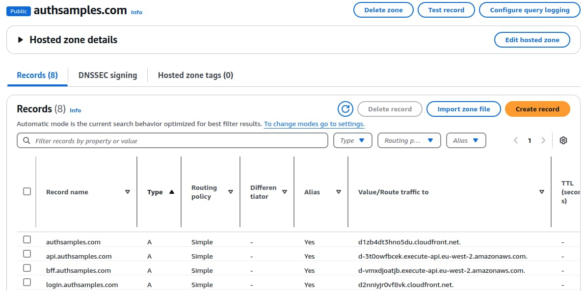
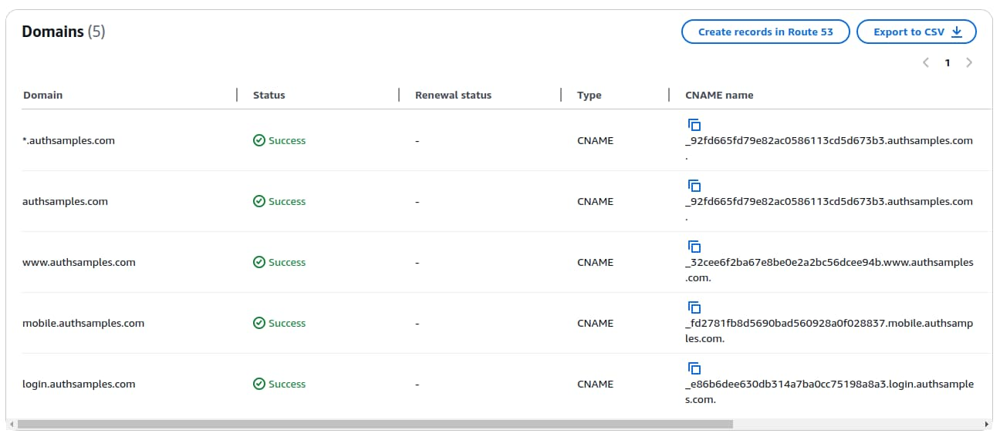
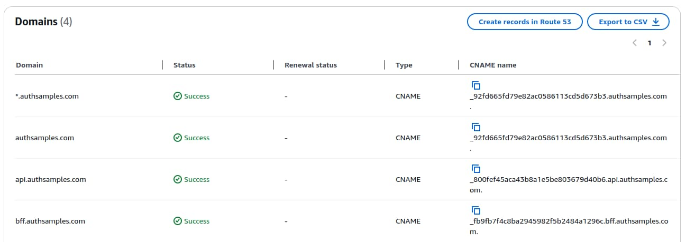
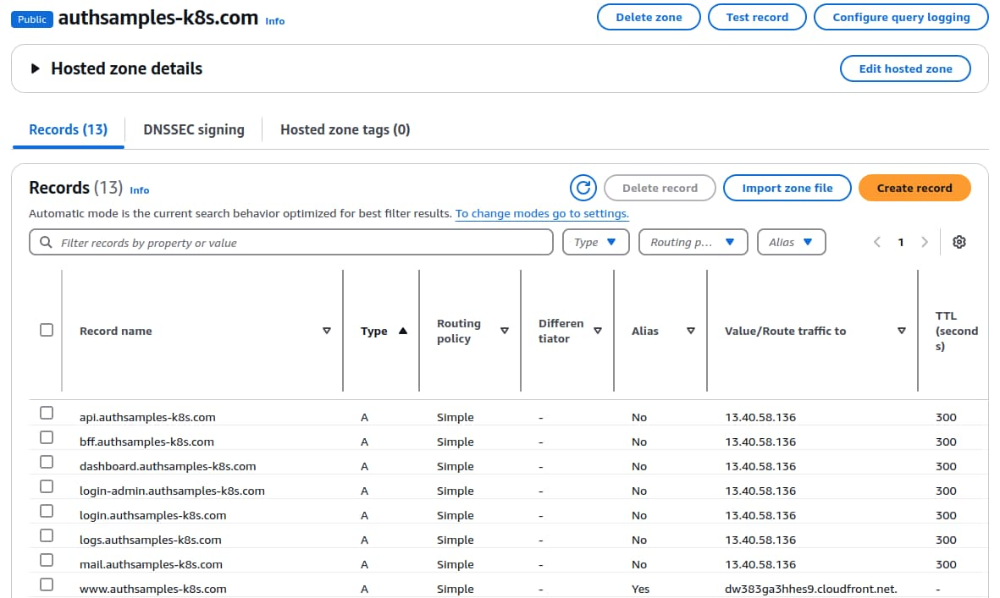

# Cloud Domain Setup

Previously I articulated some <a href='cloud-hosting.mdx'>Cloud Deployment Goals</a>. Next I show how a developer can get started with a cloud platform to deploy applications with working OAuth flows. I use AWS to expose internet base URLs for APIs, web static content and an authorization server.

### Design Domains

I first chose a domain name of *authsamples.com* on which to host OAuth related code samples. My domain design accounts for both local development URLs and cloud URLs. The cloud URLs can use serverless or cloud native hosting, to keep my options open. In total I use the following domains:

| Domain | Usef For |
| ------ | -------- |
| *authsamples.com* | The initial cloud domain that runs in AWS and uses serverless hosting for the API side of the architecture. |
| *authsamples-dev.com* | A local computer domain that I use when changing the code for my demo applications and APIs. |
| *authsamples-k8s.com* | A cloud domain that runs in AWS and uses Kubernetes hosting for the API side of the architecture. |
| *authsamples-k8s-dev.com* | A local computer domain that I use to run local end-to-end Kubernetes deployments. |

### Design Application Base URLs

Within each domain I use subdomains for the <a href='oauth-infrastructure-setup.mdx'>three main OAuth base URLs</a>. Each subdomain can point to a particular cloud hosting feature, for APIs, web static content or the authorization server. I chose the following options:

| Domain | Description |
| ------ | ----------- |
| *https://www.authsamples.com* | The base URL for web static content, using [AWS CloudFront](https://aws.amazon.com/cloudfront/). |
| *https://api.authsamples.com* | The API gateway base URL, using [AWS API Gateway](https://aws.amazon.com/api-gateway/). |
| *https://login.authsamples.com* | The authorization server base URL, using [AWS Cognito](https://aws.amazon.com/cognito/). |

The API base URL supports multiple microservices hosted behind the same API gateway:

- *https://api.authsamples.com/api1*
- *https://api.authsamples.com/api2*
- *https://api.authsamples.com/api3*

The web base URL supports hosting multiple micro-frontends for the same business area in the same web domain:

- *https://www.authsamples.com/spa1*
- *https://www.authsamples.com/spa2*
- *https://www.authsamples.com/spa3*

I also use a *https://bff.authsamples.com* domain as a backend for frontend base URL for this blog's final SPA. This uses an additional custom domain in the AWS API Gateway.

### AWS Account Setup

I first used the [AWS Sign Up](https://aws.amazon.com/free) option and selected the *Create a Free Account* option. I submitted registration details and then processed the confirmation email. Next I signed into the [AWS Management Console](https://aws.amazon.com/console/) and started administering resources under my account. I navigated to *IAM / Users* and created a user called *aws-upload*, which this blog uses use for uploading built applications to AWS. 

I then granted permissions to enable the user to upload files to AWS and made a note of the *Access Key ID* and *Secret Access Key* values. To complete the setup, I followed the [AWS CLI Installation Instructions](https://docs.aws.amazon.com/cli/latest/userguide/getting-started-install.html). I configured the CLI to populate configuration files in my local *~/.aws* directory, so that I can run *aws* commands to deploy my applications.

### Create Cloud Domains

After activating the account I used the [Route 53](https://aws.amazon.com/route53/) DNS service to create my cloud domains. Each of these costs 14 USD per year and provides low cost hosting for my hosted code samples.


Multiple internet accessible subdomains can then be registered as *A Records* under the domain's *Hosted Zone*. In the following screenshot, I first created an AWS CloudFront distribution for web content, an AWS API gateway through which clients call serverless APIs and an AWS Cognito authorization server. Each of these produce generated URLs that you can map to your own preferred URLs in Route 53.



After creating domains and A records you can contact domains at the networking level with commands such as the following:

```bash
dig api.authsamples.com
```

### Create Managed SSL Certificates

I then created a <a href='developer-ssl-setup.mdx'>wildcard certificate</a> in a similar way to those I use on a development computer. For managed services I use [AWS Certificate Manager](https://aws.amazon.com/certificate-manager/) to request a wildcard certificate, which AWS automatically renews and applies to managed components. 

AWS CloudFront and AWS Cognito both require certificates issued in the North Virginia region. I expressed each subdomain as a certificate subject alternative name and also used the *Create records in Route 53* option to enable certificate manager to verify my ownership of the domain.



AWS API Gateway requires certificates issued in the hosting region, which is London in my deployment. I therefore followed the same steps for the London region for AWS API gateway subdomains:



### Deploy Kubernetes Clusters

The API side of this blog's architecture can also run in a Kubernetes environment. In AWS I can use the [Elastic Kubernetes Service (EKS)](https://docs.aws.amazon.com/whitepapers/latest/overview-deployment-options/amazon-elastic-kubernetes-service.html) to create a managed cluster. The cloud platform provides compute, storage and networking and also does the low level Kubernetes work. I get greater control over APIs and their supporting components and can deploy the overall system to any Kubernetes host.

When you use Kubernetes hosting you can create a static IP address, called an [Elastic IP](https://docs.aws.amazon.com/AWSEC2/latest/UserGuide/elastic-ip-addresses-eip.html) in AWS. That IP address can resolve to a load balancer placed in front of a cloud native API gateweay that manages all ingress into the cluster. In Route 53 the addressability is therefore more stable, if for example I recreate the cluster. Note also that I continue to use AWS CloudFront for the web side of the architecture.



In Kubernetes you typically terminate TLS at the API gateway before routing to cloud native APIs or a cloud native authorization server. You cannot use managed certificates and it is common to use components like [cert-manager and Lets Encrypt](https://cert-manager.io/docs/tutorials/acme/nginx-ingress/) to issue and automatically renew API gateway certificates. The API gateway's controller detects changes and applies the new certificate to gateway routes that use it.

### Where Are We?

I showed how developers can create low cost HTTPS application URLs in a cloud system. To do so you follow equivalent DNS and SSL technical steps to those that this blog uses on a development computer. I use serverless building blocks to provide online code samples with low personal costs. At a real organization I would prefer cloud native building blocks that provide finer control over technical behaviours.

### Next

- Next I explain this blog's <a href='managed-authorization-server-setup.mdx'>Managed Authorization Server Setup</a>
- For a list of all blog posts see the <a href='index.mdx'>Index Page</a>

