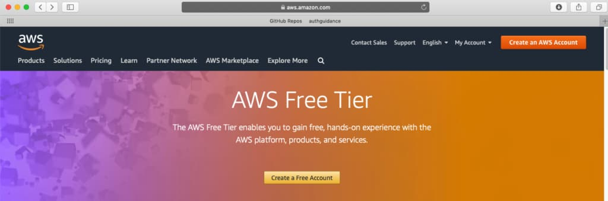
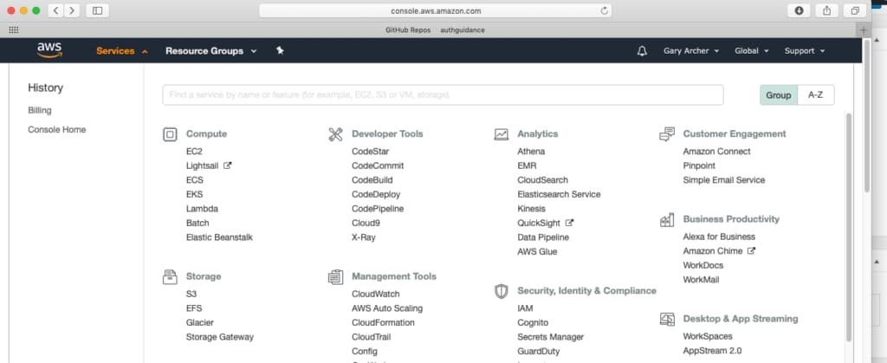
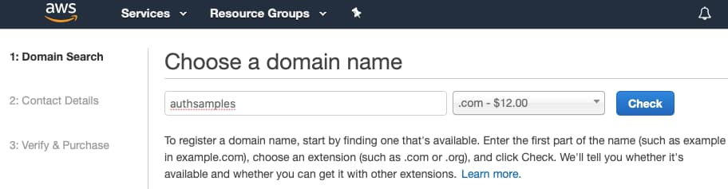
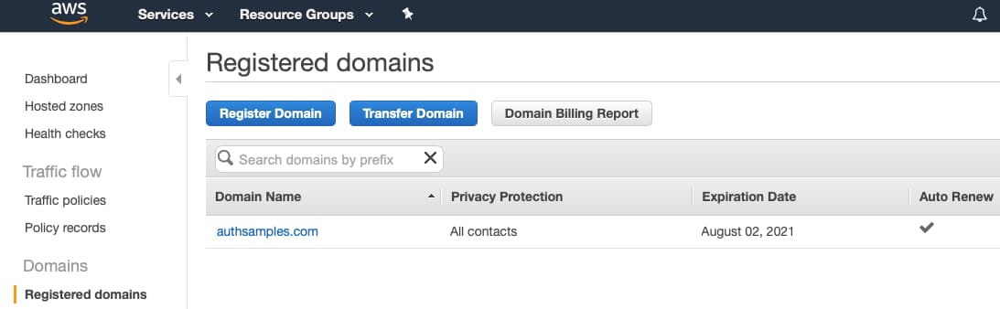
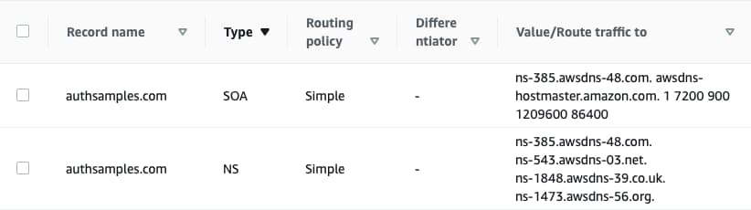
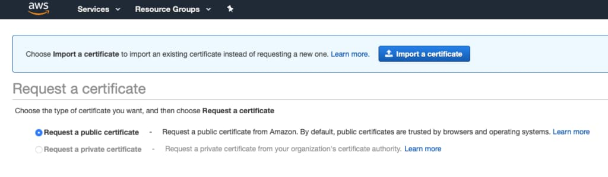
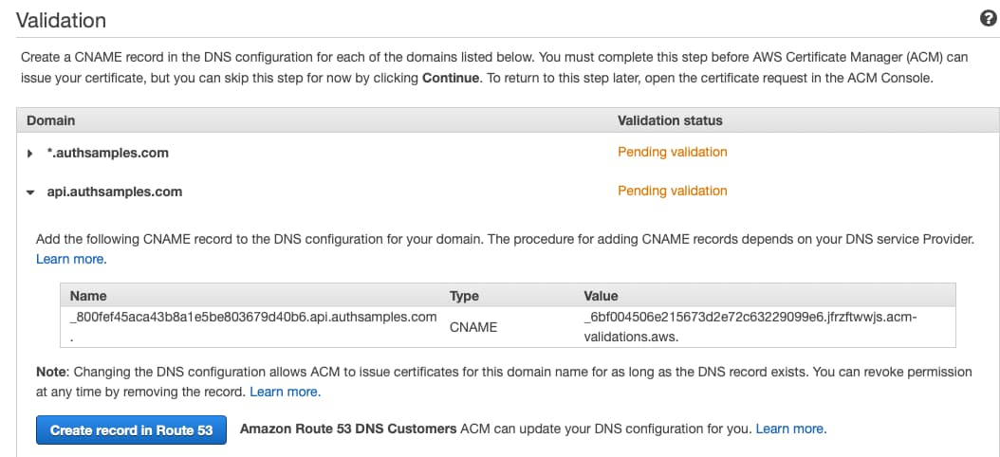
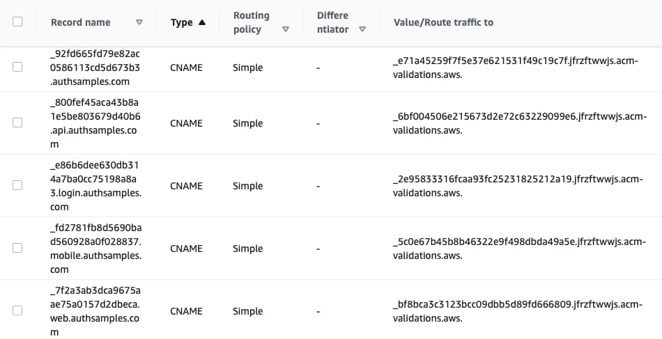
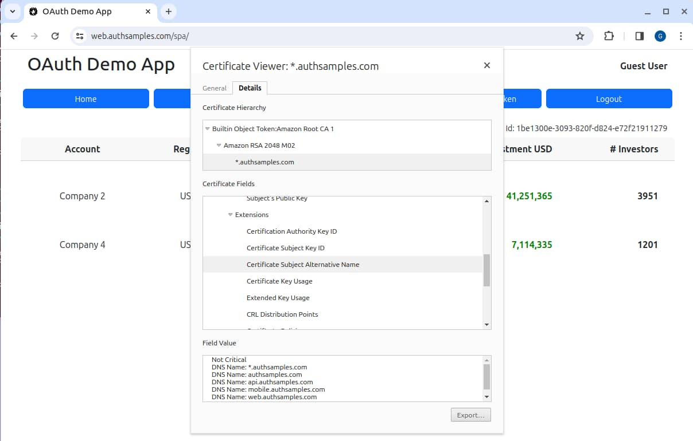
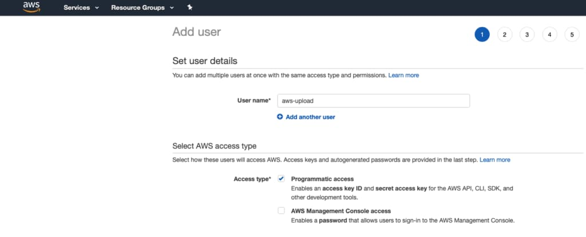

# Cloud Domain Setup

Previously we described a <a href='cloud-hosting.mdx'>Cloud Hosting Overview</a>, to summarise the overall behaviour of the cloud deployment. Next I will explain the steps I took to enable an initial *AWS Cloud Setup for Development*, including purchasing an internet domain.

### Create an AWS Developer Account

I first used the [AWS Sign Up](https://aws.amazon.com/free) option and selected the *Create Free Account* option. I submitted registration details and then processed the confirmation email.



### Log in to the AWS Console

Next I signed into the [AWS Developer Console](https://aws.amazon.com/console/) and started using features:



### Create a Custom Domain

I selected *Route 53* in the developer console and requested a domain, which of course must not already exist on the internet:



After confirmation the domain first shows up under *Pending Requests* while the DNS details are being registered. Once complete, the domain shows up under *Registered Domains*.



Under *Hosted Zones* I was able to see some initial *Name Server* and *Start of Address* networking details.



After a few minutes I could issue the following command to query DNS details:

```bash
whois authsamples.com
```

This results in technical output similar to the following:

```markdown
Domain Name: AUTHSAMPLES.COM
Registry Domain ID: 2550276719_DOMAIN_COM-VRSN
Registrar WHOIS Server: whois.registrar.amazon.com
Registrar URL: http://registrar.amazon.com
Updated Date: 2023-01-07T17:13:55Z
Creation Date: 2020-08-02T10:42:26Z
Registry Expiry Date: 2023-08-02T10:42:26Z
Registrar: Amazon Registrar, Inc.
Registrar IANA ID: 468
Registrar Abuse Contact Email: abuse@amazonaws.com
Registrar Abuse Contact Phone: +1.2067406200
Domain Status: ok https://icann.org/epp#ok
Name Server: NS-1473.AWSDNS-56.ORG
Name Server: NS-1848.AWSDNS-39.CO.UK
Name Server: NS-385.AWSDNS-48.COM
Name Server: NS-543.AWSDNS-03.NET
DNSSEC: unsigned
URL of the ICANN Whois Inaccuracy Complaint Form: https://www.icann.org/wicf/
```

### Create Sub Domains

On this blog we use custom subdomains as follows, and getting each of these working is covered in subsequent posts:

| Subdomain | Points To |
| --------- | --------- |
| login.authsamples.com | Cognito URL |
| www.authsamples.com | CloudFront URL for the SPA and other static web content |
| api.authsamples.com | API Gateway URL for APIs |
| bff.authsamples.com | API Gateway URL for the SPA's backend for frontend |
| mobile.authsamples.com | CloudFront URL for mobile deep linking assets |

### Create a Wildcard SSL Certificate

Next I visited *AWS Certificate Manager* for my London region, then selected the *Request a Public Certificate* option:



I selected the *Add another name to this certificate* option and then entered a wildcard domain, followed by the parent domain, followed by subdomains:


For each of the domain names, I selected *Create Record in Route 53*, which creates *CNAME* records needed for certification validation checks to pass:



In *Hosted Zones* in Route 53 I could then see the following details:



The certificate validation then succeeded, so that we have a single wildcard SSL certificate ready to use. Later, this blog's final SPA was able to use the SSL certificate. AWS also renews the certificate when it is close to expiry, so that there is no certificate infrastructure to manage.



### Enable AWS Uploads

From the AWS console, I navigated to *IAM / Users* and created a user called *aws-upload*, which this blog uses use for uploading assets to AWS:



I then granted permissions to enable the user to upload files to AWS and made a note of the *Access Key ID* and *Secret Access Key* values:


### Install the AWS CLI

To complete the setup, I ensured that I could automatically push built code to the above subdomains. I followed the [AWS CLI Installation Instructions](https://docs.aws.amazon.com/cli/latest/userguide/getting-started-install.html) and could then run the following command successfully:

```bash
aws --version
```

Next I configured the CLI and provided details when prompted:

```bash
aws configure
```

Results were saved to my profile directory, at *~/.aws/credentials*.

```markdown
AWS Access Key ID [****************QXLM]: 
AWS Secret Access Key [****************XLQg]: 
Default region name [eu-west-2]: 
Default output format [None]:
```

### Where Are We?

Subdomains were created to enable *Real World Internet URLs* for our demo apps, and this also prepared my local computer for uploading applications to AWS.

### Next

- Next we complete the <a href='managed-authorization-server-setup.mdx'>Cloud Authorization Server Setup</a>
- For a list of all blog posts see the <a href='index.mdx'>Index Page</a>


