# Cloud Hosting Overview

Previously we completed our mobile theme by discussing <a href='ios-code-sample-coding-key-points.mdx'>Code Details</a> for our iOS code sample. Next we will begin a theme on modern deployment, and describe how the corresponding cloud infrastructure was created.

### URL Design

I started by <a href='oauth-infrastructure-setup.mdx'>Defining Base URLs</a>, and this blog uses a subdomain approach, to represent component separation on a small scale. Each subdomain can point to a particular cloud hosting feature, for APIs, web static content or the authorization server.

| Domain | Description |
| ------ | ----------- |
| https://www.authsamples.com | The base URL for Single Page Apps |
| https://api.authsamples.com | The API gateway base URL |
| https://login.authsamples.com | The authorization server base URL |
| https://mobile.authsamples.com | Hosts assets for mobile apps |

Each subdomain can be either a Serverless or cloud native endpoint. This blog follows a mix and match approach, depending on the cloud hosting option best meets our overall requirements.

### DNS Setup

The AWS cloud is used, which starts with registering a parent domain of *authsamples.com* using the [Route 53](https://aws.amazon.com/route53/) DNS service:

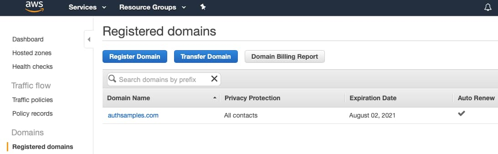

Multiple internet accessible subdomains can then be registered as *A Records* under a *Hosted Zone*:

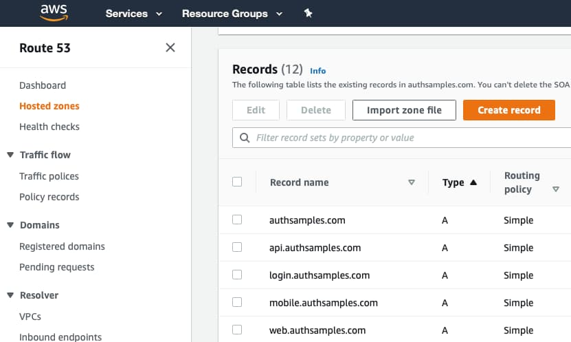

If you have your own cloud domain and subdomains, you could follow similar steps to those described by blog posts, to create your own cloud hosting.

### Managed Internet SSL Certificates

[AWS Certificate Manager](https://aws.amazon.com/certificate-manager/) issues TLS 1.3 certificates for the domain and its subdomains, using the same wildcard certificate concept we've used on a local computer in earlier posts:

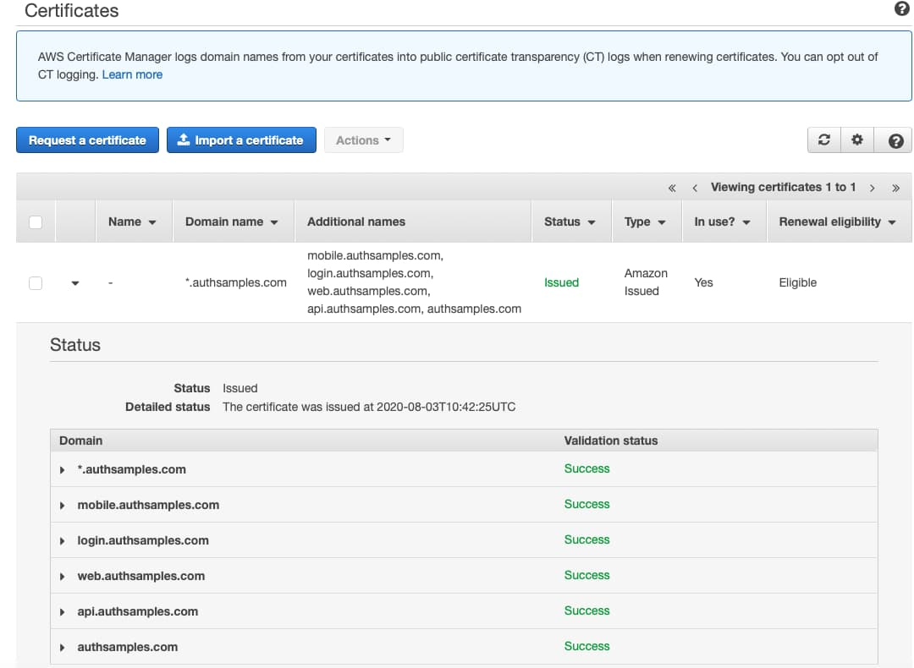

For this blog's online demo apps I only need to manage a single certificate, and AWS automatically renews it when it before expiry.

### Web and API Separation

The API base URL supports multiple microservices hosted behind the same API gateway:

- *https://api.authsamples.com/api1*
- *https://api.authsamples.com/api2*
- *https://api.authsamples.com/api3*

The web base URL supports hosting multiple micro-frontends for the same business area:

- *https://www.authsamples.com/spa1*
- *https://www.authsamples.com/spa2*
- *https://www.authsamples.com/spa3*

### SPA Deployment

The SPA deployment model simply involves copying built web resources to a `www.authsamples.com` S3 bucket:

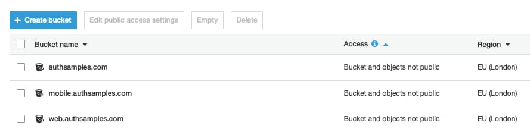

I then use AWS CloudFront as a content delivery network for the bucket's static content:

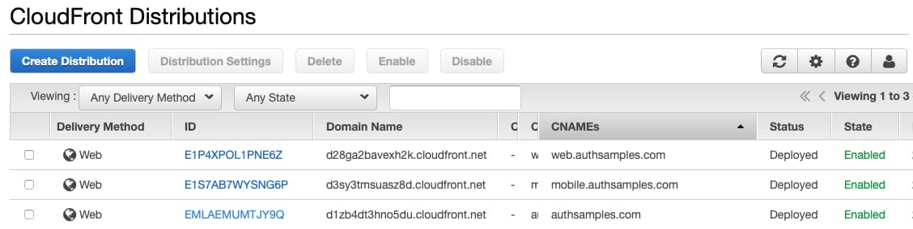

CloudFront pushes web content to [many global locations](https://aws.amazon.com/cloudfront/features), to enable globally equal web performance, in an easy to manage way:

### Serverless APIs

Initial cloud API endpoints will use the [Serverless Framework](https://serverless.com/framework). This enables us to host APIs as low cost lambda functions, with minimal infrastructure to manage:

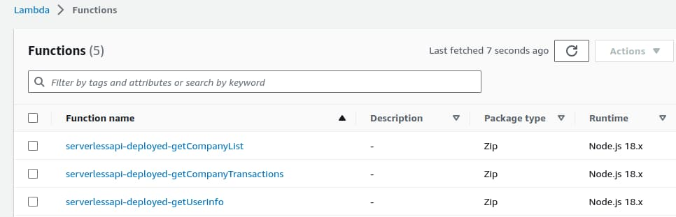

The [AWS API Gateway](https://aws.amazon.com/api-gateway/) is used to expose lambda functions to the internet as REST endpoints:

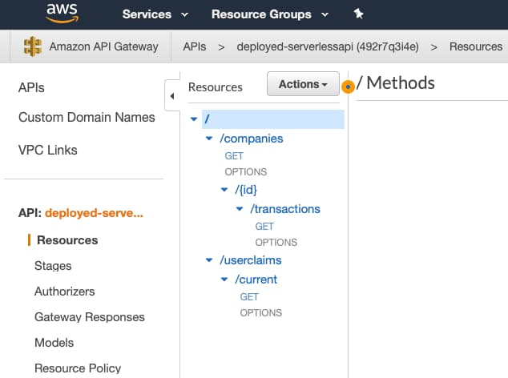

### Initial Cloud Authorization Server

Earlier in this blog we chose AWS Cognito as an initial low-cost authorization server. We will explain the AWS setup shortly:

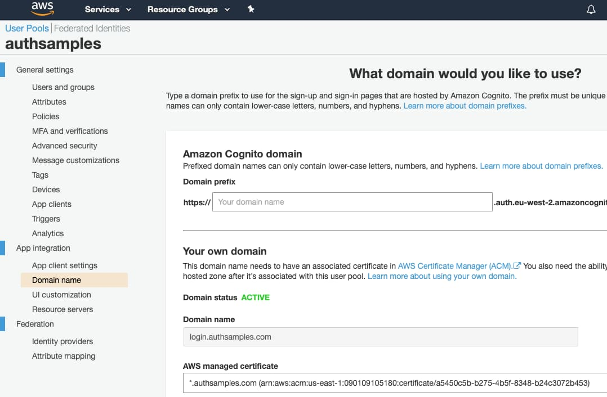

### Cloud Connected Code Samples

Use of cloud hosting enables any reader of this blog to run this blog's OAuth code samples. The <a href='quick-start.mdx'>Code Samples Quick Start</a> page provides details of online URLs and guest credentials for running the demo apps.

<div className='smallimage'>
    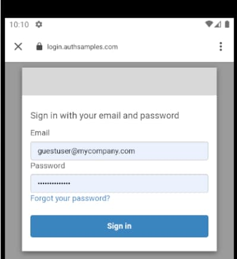
</div>

### Centralized API Logs

APIs will use this blog's <a href='effective-api-logging.mdx'>Effective API Logging</a> design to write immediate log data to AWS CloudWatch. These logs could then be aggregated and queried using <a href='api-technical-support-analysis.mdx'>Technical Support Queries</a>.

### Lost Cost Initial Hosting

The AWS costs for the above setup are around 13 USD per year to register the base domain, along with a further 0.60 USD per month. This is an attractive option when getting started with cloud hosting:

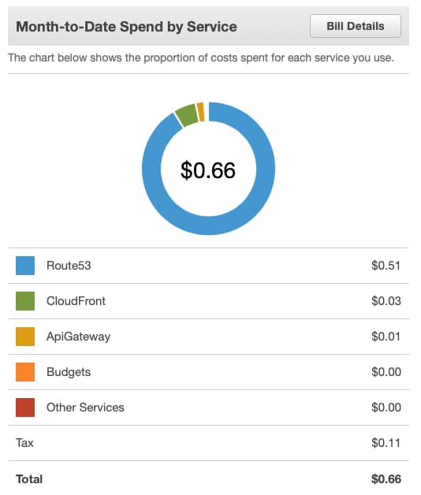

### Kubernetes Hosting

The API side of the architecture can also run in a Kubernetes environment. In AWS this would be managed by spinning up an [EKS](https://docs.aws.amazon.com/whitepapers/latest/overview-deployment-options/amazon-elastic-kubernetes-service.html) cluster, that hosts this blog's final APIs, along with any suppporting components. This is more expensive than Serverless hosting but enables richer choices, so can sometimes be a better choice on the API side of the architecture.

### Where Are We?

We have provided an overview of this blog's cloud hosting, and the following blog posts will describe some implementation details. In all cases our application code will remain portable so that we can switch hosting in future if ever needed.

### Next

- Next we will explain details of our <a href='cloud-domain-setup.mdx'>Cloud Domain Setup</a>
- For a list of all blog posts see the <a href='index.mdx'>Index Page</a>

# Cloud Domain Setup

Previously we described a <a href='cloud-hosting.mdx'>Cloud Hosting Overview</a>, to summarise the overall behaviour of the cloud deployment. Next I will explain the steps I took to enable an initial *AWS Cloud Setup for Development*, including purchasing an internet domain.

### Create an AWS Developer Account

I first used the [AWS Sign Up](https://aws.amazon.com/free) option and selected the *Create Free Account* option. I submitted registration details and then processed the confirmation email.

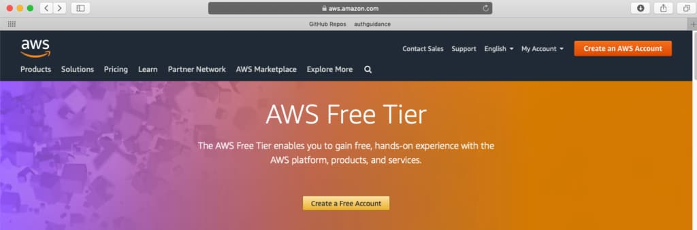

### Log in to the AWS Console

Next I signed into the [AWS Developer Console](https://aws.amazon.com/console/) and started using features:

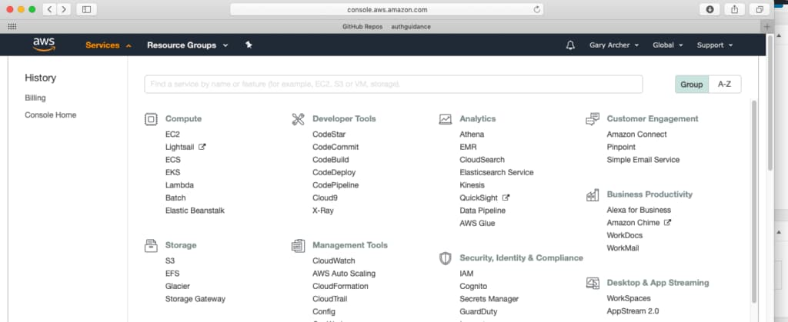

### Create a Custom Domain

I selected *Route 53* in the developer console and requested a domain, which of course must not already exist on the internet:

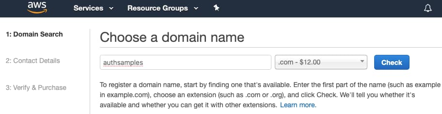

After confirmation the domain first shows up under *Pending Requests* while the DNS details are being registered. Once complete, the domain shows up under *Registered Domains*.


Under *Hosted Zones* I was able to see some initial *Name Server* and *Start of Address* networking details.

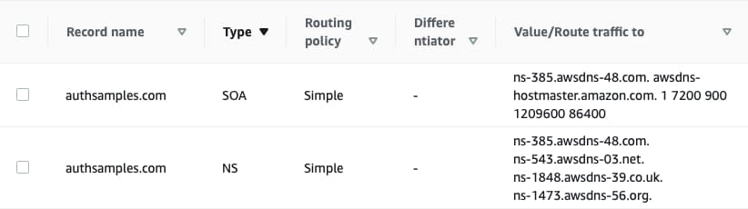

After a few minutes I could issue the following command to query DNS details:

```bash
whois authsamples.com
```

This results in technical output similar to the following:

```markdown
Domain Name: AUTHSAMPLES.COM
Registry Domain ID: 2550276719_DOMAIN_COM-VRSN
Registrar WHOIS Server: whois.registrar.amazon.com
Registrar URL: http://registrar.amazon.com
Updated Date: 2023-01-07T17:13:55Z
Creation Date: 2020-08-02T10:42:26Z
Registry Expiry Date: 2023-08-02T10:42:26Z
Registrar: Amazon Registrar, Inc.
Registrar IANA ID: 468
Registrar Abuse Contact Email: abuse@amazonaws.com
Registrar Abuse Contact Phone: +1.2067406200
Domain Status: ok https://icann.org/epp#ok
Name Server: NS-1473.AWSDNS-56.ORG
Name Server: NS-1848.AWSDNS-39.CO.UK
Name Server: NS-385.AWSDNS-48.COM
Name Server: NS-543.AWSDNS-03.NET
DNSSEC: unsigned
URL of the ICANN Whois Inaccuracy Complaint Form: https://www.icann.org/wicf/
```

### Create Sub Domains

On this blog we use custom subdomains as follows, and getting each of these working is covered in subsequent posts:

| Subdomain | Points To |
| --------- | --------- |
| login.authsamples.com | Cognito URL |
| www.authsamples.com | CloudFront URL for the SPA and other static web content |
| api.authsamples.com | API Gateway URL for APIs |
| bff.authsamples.com | API Gateway URL for the SPA's backend for frontend |
| mobile.authsamples.com | CloudFront URL for mobile deep linking assets |

### Create a Wildcard SSL Certificate

Next I visited *AWS Certificate Manager* for my London region, then selected the *Request a Public Certificate* option:

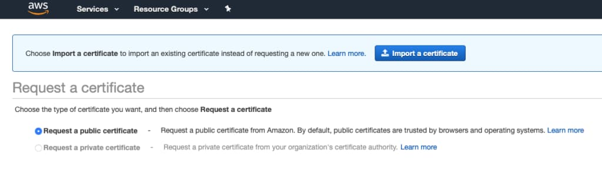

I selected the *Add another name to this certificate* option and then entered a wildcard domain, followed by the parent domain, followed by subdomains:

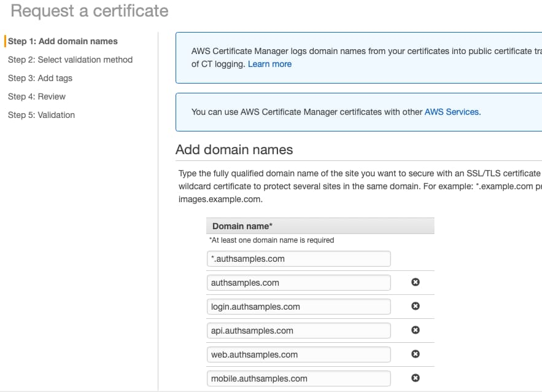

For each of the domain names, I selected *Create Record in Route 53*, which creates *CNAME* records needed for certification validation checks to pass:

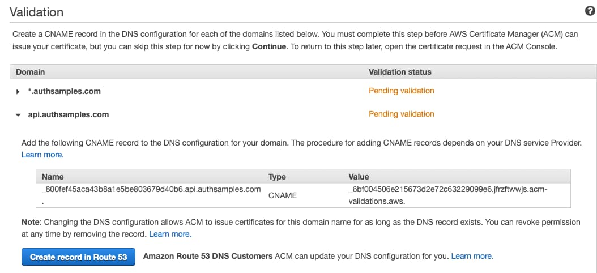

In *Hosted Zones* in Route 53 I could then see the following details:

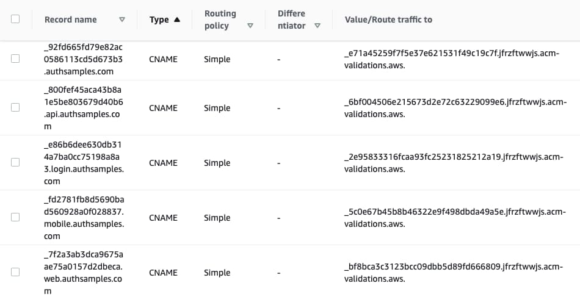

The certificate validation then succeeded, so that we have a single wildcard SSL certificate ready to use. Later, this blog's final SPA was able to use the SSL certificate. AWS also renews the certificate when it is close to expiry, so that there is no certificate infrastructure to manage.

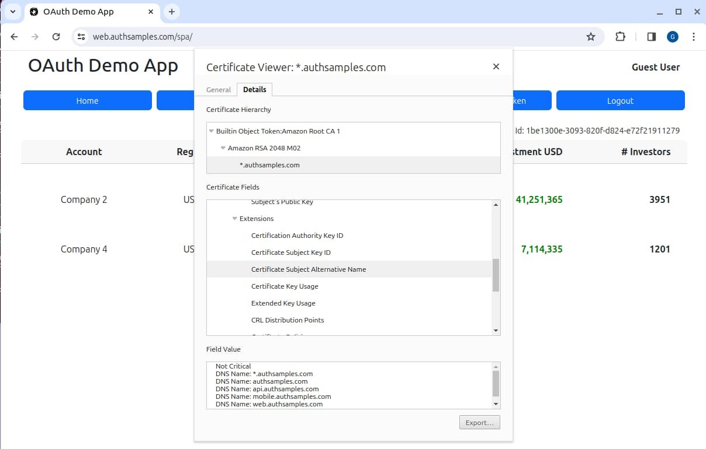

### Enable AWS Uploads

From the AWS console, I navigated to *IAM / Users* and created a user called *aws-upload*, which this blog uses use for uploading assets to AWS:

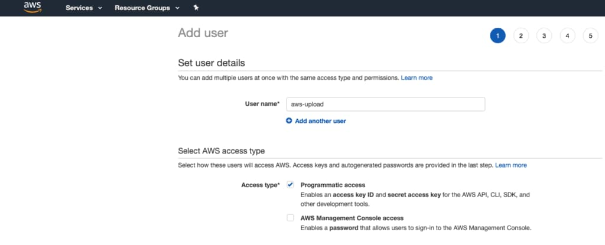

I then granted permissions to enable the user to upload files to AWS and made a note of the *Access Key ID* and *Secret Access Key* values:

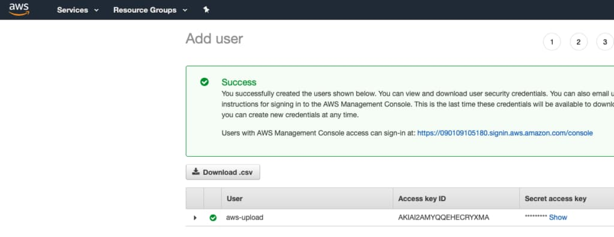

### Install the AWS CLI

To complete the setup, I ensured that I could automatically push built code to the above subdomains. I followed the [AWS CLI Installation Instructions](https://docs.aws.amazon.com/cli/latest/userguide/getting-started-install.html) and could then run the following command successfully:

```bash
aws --version
```

Next I configured the CLI and provided details when prompted:

```bash
aws configure
```

Results were saved to my profile directory, at *~/.aws/credentials*.

```markdown
AWS Access Key ID [****************QXLM]: 
AWS Secret Access Key [****************XLQg]: 
Default region name [eu-west-2]: 
Default output format [None]:
```

### Where Are We?

Subdomains were created to enable *Real World Internet URLs* for our demo apps, and this also prepared my local computer for uploading applications to AWS.

### Next

- Next we complete the <a href='managed-authorization-server-setup.mdx'>Cloud Authorization Server Setup</a>
- For a list of all blog posts see the <a href='index.mdx'>Index Page</a>


