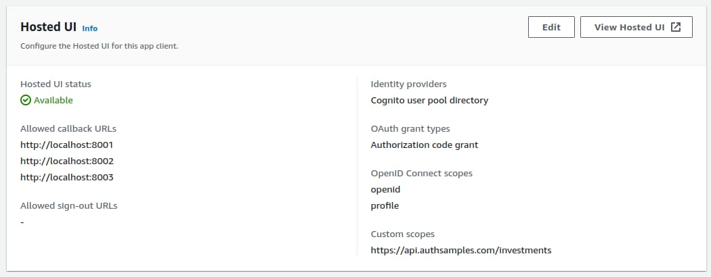

# Desktop App – How to Run the Code Sample

Previously I provided a brief <a href='desktop-apps-overview.mdx'>Desktop Code Sample Overview</a>. Next I explain how to run a more detailed desktop code sample on your local computer, which manages OAuth behaviors in a more complete way.

### Prerequisite: Install Node.js

If required, go to the [Node.js Website](https://nodejs.org/en/download/), then download and run the installer for your operating system.

### Step 1: Download Code from GitHub

Clone the code sample's GitHub repository with the following command:

```bash
git clone https://github.com/gary-archer/oauth.desktopsample1
```


### Step 2: View the Code in an IDE

The desktop app re-uses some code from this blog’s <a href='improved-spa-code-sample-overview.mdx'>second SPA</a> and has exactly the same views:

```typescript
export class CompaniesView {

    private readonly _apiClient: ApiClient;

    public constructor(apiClient: ApiClient) {
        this._apiClient = apiClient;
    }

    public async load(): Promise<void> {

        try {

            const data = await this._apiClient.getCompanyList();
            this._renderData(data);

        } catch (e) {

            DomUtils.text('#main', '');
            throw e;
        }
    }

    ...
}
```

### Step 3: Build and Run the Code

Run the following bash script to build the desktop app’s TypeScript code and then run the executable:

```bash
./start.sh
```

The desktop app loads its home page and prepares to call the API. When it does not yet have an access tokens it presents a *Sign In* button:


When you click the button, the app first indicates that a login is in progress:


The app then creates an authorization request URL and opens the default system browser at that URL. You can use this blog’s test user account to sign in:

- User: *guestuser@example.com*
- Password: *GuestPassword1*

If you did an earlier SPA login in the same browser and used the save password feature, you can use password autofill for the desktop app. After user login, the system browser renders a post-login page, rather than showing a blank page. Alternatively, you could redirect the browser to an external site if you prefer.


When login completes, the app gets OAuth tokens, stores them in memory and returns itself to the foreground. It then gets data from a <a href='serverless-api-overview.mdx'>cloud hosted OAuth-secured API</a> and renders results.

### Step 4: View OAuth Configuration

The desktop app has a JSON configuration file which includes its OAuth settings. By default the app connects to AWS endpoints, so that you only need to run the frontend locally:

```json
{
    "app": {
        "apiBaseUrl":       "https://api.authsamples.com/investments",
        "useProxy":         false,
        "proxyUrl":         "http://127.0.0.1:8888"
    },
    "oauth": {
        "authority":        "https://cognito-idp.eu-west-2.amazonaws.com/eu-west-2_CuhLeqiE9",
        "clientId":         "6o4rlsod8j6phsnuf3pdjo640u",
        "scope":            "openid profile https://api.authsamples.com/investments",
        "redirectPath":     "",
        "loopbackHostname": "localhost",
        "loopbackMinPort":  8001,
        "loopbackMaxPort":  8003,
        "postLoginPage":    "https://www.authsamples.com/apps/basicdesktopapp/postlogin.html"
    }
}
```

With this configuration the app calls the following main URLs:

| Component | URL(s) |
| --------- | ------ |
| API | *https://api.authsamples.com* |
| Authorization Server | *https://login.authsamples.com* |

Note that the JSON configuration also includes details related to running a *Loopback Web Server* on the local computer:

| Setting | Description |
| ------- | ----------- |
| Loopback Host Name | The hostname for the loopback HTTP server. |
| Loopback Port Range | Port numbers used in OAuth redirect URIs. |
| Post Login Page | Where to send the browser after a login. |

### Step 5: OAuth Client Registration

The desktop app has an OAuth client registration in AWS Cognito, with the following settings:



According to RFC 8252, it should be possible to register a redirect URI that begins with *http://127.0.0.1* and the client can then use any port at runtime. Yet some authorization servers do not support this. AWS Cognito required the *http://localhost* base URL instead of the loopback IP address, rejected a path like */callback* and I also had to register all possible redirect URI values.

### Step 6: Login Completion Page

I uploaded the login completion page to an AWS S3 Bucket and enabled an HTTPS URL using the AWS CloudFront distribution for this blog's final SPA:


### Step 7: Authorization Request

The desktop app uses the *Authorization Code Flow (PKCE)*, as is standard for native apps, and it uses the same fields in authorization redirects as other clients that use the authorization code flow.


Before issing the redirect the the desktop app runs an HTTP server within its own process. The desktop app uses a low privilege hostname that does not allow remote connections and prevents the operating system from presenting prompts to the user to allow incoming HTTP connections. It also uses a low privilege port (above 1024), to ensure that users do not require administrator privileges.

### Step 8: Authorization Code Grant

When the desktop app receives a login response it sends an authorization code grant message to swap the authorization code for OAuth tokens. The desktop app uses PKCE, which proves that the caller that starts the login is the same party ending it.


### Step 9: Test Login Re-Entrancy

A busy user could fail to complete a login and close the browser window, leaving the desktop app in a *login in progress* state. The desktop app allows the user to retry the login, by clicking the *Sign In* button again.

### Step 10: Simulate Expiry Events

You can use the desktop app's buttons to simulate expiry related events during a user session:


You can rehearse access token expiry if you click *Expire Access Token* followed by *Reload Data*. This adds characters to the access token so that the API returns a 401 response. The app then sends a *Refresh Token Grant* message to get a new access token and retries API requests. Note that a desktop app is a public client, with no client credential to protect the refresh token:


You can rehearse refresh token expiry if you click *Expire Refresh Token* followed by *Reload Data*. This adds characters to the refresh token so that the authorization server returns an *invalid_grant* response. This error code means the user needs to sign in again, so the app redirects the user to the *Login Required* view.


### Step 12: Logout

The initial desktop app implements only a basic logout, that discards its tokens and returns it to the *Login Required* view. All authorization requests use the OpenID Connect *prompt=none* parameter to force a new login. In a real organization this would enable you to login as a different test user. However, AWS Cognito does not support this parameter, so this behavior does not work as intended.

### Where Are We?

I used this blog's second SPA for the views of an OAuth-secured desktop app, which runs on all of the main operating systems. I further extend the desktop app shortly, in the final desktop code sample.

### Next

- I explain some <a href='desktop-app-coding-key-points.mdx'>Desktop App Code Details</a>.
- For a list of all blog posts see the <a href='index.mdx'>Index Page</a>.

