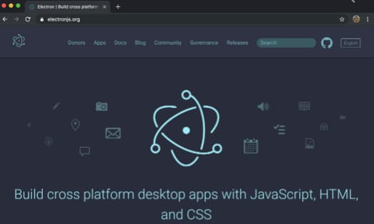
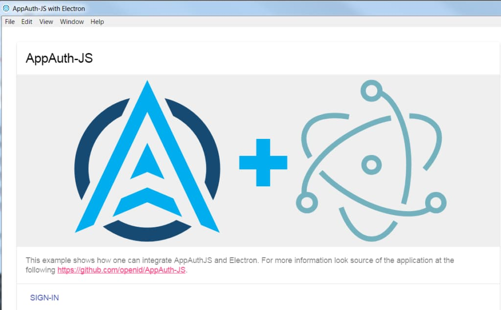
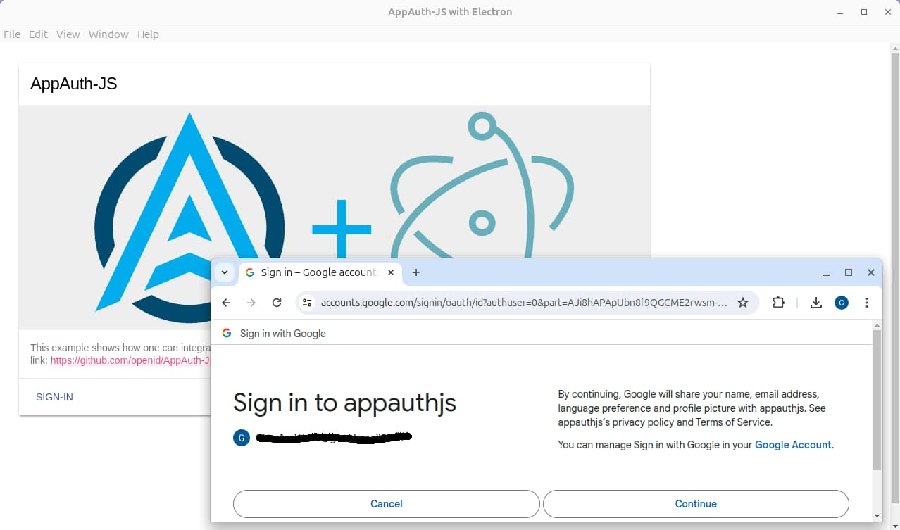
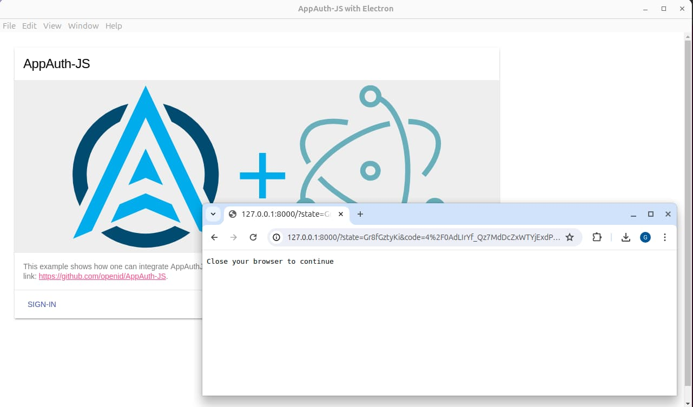

# Desktop Code Sample Overview

Previously I summarised this blog’s <a href='native-architecture-goals.mdx'>Native Architecture Goals</a>. I cover secure mobile apps in later posts. First though, I provide a couple of OpenID Connect secured desktop code samples. They connect to <a href='cloud-hosting.mdx'>HTTPS endpoints hosted in AWS</a>, so that you only need to run the desktop app's code to get a fully integrated solution.

### Features

The behaviour provided in our initial sample is summarised below:

| Feature | Description |
| ------- | ----------- |
| Cross Platform | The desktop app uses a technology stack that enables it to run on Windows, macOS and Linux. |
| Security Library Integration | A security library implements OpenID Connect logins and token handling. |
| System Browser Logins | The desktop app invokes the system browser to authenticate the user, then listens for the login response. |
| Reliability | The desktop app handles some re-entrancy scenarios when the app interacts with the system browser. |

### Desktop App Technology

The desktop app has the same theme and views as this blog's earlier SPAs:


I use [Electron](https://www.electronjs.org/), which enables you to develop desktop views with web technologies. I re-used the views from this blog's <a href='improved-spa-code-sample-overview.mdx'>Second SPA</a>:



The desktop app looks almost the same on Windows, macOS and Linux:


### Native Authorization Responses

A web client runs in a browser and has an addressable URL on which to receive login responses. Native apps need a different mechanism, and the [RFC 8252 standard](https://datatracker.ietf.org/doc/rfc8252) explains the three options that you can use. Only the first two options work for a desktop app, and I use the loopback option for this blog’s initial desktop app. The final desktop app instead uses a private URI scheme. Later, this blog’s mobile apps use claimed HTTPS schemes.

| Option | Example Redirect URI | Usable By |
| ------ | -------------------- | --------- |
| Loopback Interface | *http://127.0.0.1:8000/callback* | Desktop apps |
| Private URI Scheme | *x-authsamples-myapp:/callback* | Mobile or desktop apps |
| Claimed HTTPS Scheme | *https://mobile.authsamples.com/appname/callback* | Mobile apps |

### The AppAuth-JS Code Sample

The app uses the [AppAuth-JS Library](https://github.com/openid/AppAuth-JS) to implement the OpenID Connect authorization code flow. Before running this blog's desktop app, you can quickly run the AppAuth-JS Electron code sample. To do so, run the following commands:

```bash
git clone https://github.com/googlesamples/appauth-js-electron-sample
cd appauth-js-electron-sample
npm install
npm start
```

A minimal desktop app runs and you can click the *Sign In* option to invoke an OAuth login on the system browser:



When the *Sign In* link is clicked, the desktop app opens the system browser, using Google as the authorization server. If the user is not already signed in to the browser there is a prompt to authenticate:



The desktop app supplies a *loopback* value of *http://127.0.0.1:8000* for the OAuth redirect URI, and runs an HTTP server on this network interface and port, to listen for the response. After login, the HTTP server receives the authorization response and notifies the desktop app. The desktop app then extracts the authorization code and swaps it for tokens, after which it can call APIs. The login user experience for the desktop view is not ideal. After login there is a disconnected browser window with a blank page.



### Where Are We?

I introduced this blog's initial desktop code sample and also explained how to run a minimal code sample. Next, I show how to build and run a more intricate Electron app.

### Next

- I explain <a href='desktop-app-how-to-run-the-code-sample.mdx'>How to Run the Desktop Code Sample</a>.
- For a list of all blog posts see the <a href='index.mdx'>Index Page</a>.
