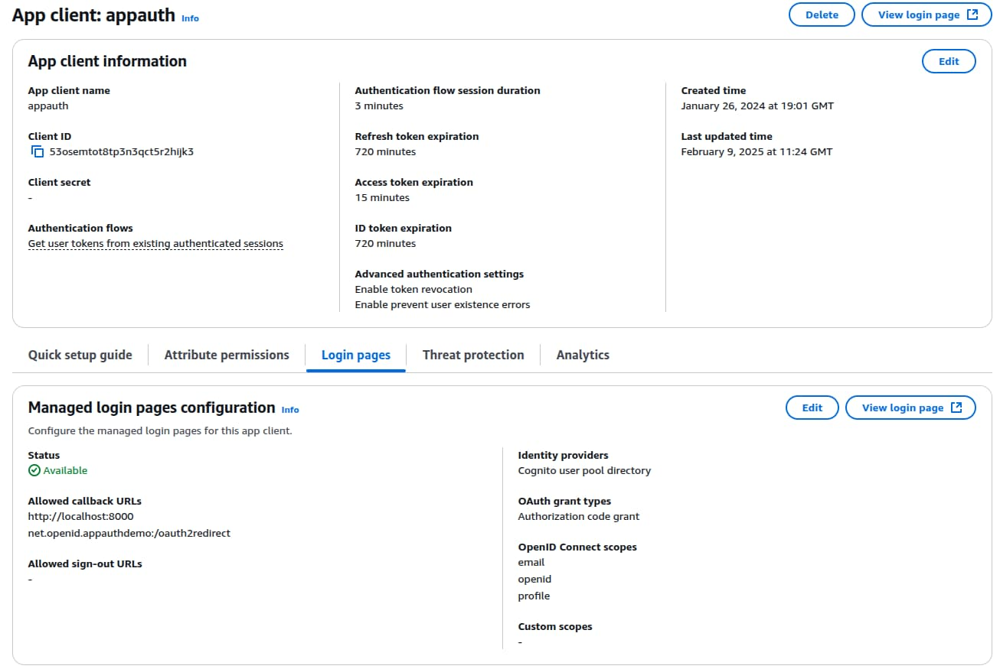

# Desktop Code Sample Overview

Previously I summarised this blog's <a href='native-architecture-goals.mdx'>Native Architecture Goals</a>. I cover secure mobile apps in later posts. First though, I provide a couple of OpenID Connect secured desktop code samples. They connect to <a href='cloud-hosting.mdx'>HTTPS endpoints hosted in AWS</a>, so that you only need to run the desktop app's code to get a fully integrated solution.

### Features

The behaviour provided in the initial sample is summarised below:

| Feature | Description |
| ------- | ----------- |
| Cross Platform | The desktop app uses a technology stack that enables it to run on Windows, macOS and Linux. |
| Security Library Integration | A security library implements OpenID Connect logins and token handling. |
| System Browser Logins | The desktop app invokes the system browser to authenticate the user, then listens for the login response. |
| Reliability | The desktop app handles some re-entrancy scenarios when the app interacts with the system browser. |

### Desktop App Technology

The desktop app has the same theme and views as this blog's earlier SPAs:


I use [Electron](https://www.electronjs.org/), which enables you to develop desktop views with web technologies. I re-used the views from this blog's <a href='improved-spa-code-sample-overview.mdx'>Second SPA</a>:


The desktop app looks almost the same on Windows, macOS and Linux:


### Native Authorization Responses

A web client runs in a browser and has an addressable URL on which to receive login responses. Native apps need a different mechanism, and the [RFC 8252](https://datatracker.ietf.org/doc/rfc8252) standard explains the three options that you can use. Only the first two options work for a desktop app, and I use the loopback option for this blog's initial desktop app. The final desktop app instead uses a private URI scheme. Later, this blog's mobile apps use claimed HTTPS schemes.

| Option | Example Redirect URI | Usable By |
| ------ | -------------------- | --------- |
| Loopback Interface | *http://127.0.0.1:8000/callback* | Desktop apps |
| Private URI Scheme | *x-authsamples-myapp:/callback* | Mobile or desktop apps |
| Claimed HTTPS Scheme | *https://mobile.authsamples.com/appname/callback* | Mobile apps |

### Loopback Interface Authorization Responses

According to RFC 8252, it should be possible to register a redirect URI that begins with *http://127.0.0.1* and the client can then use any port at runtime. Section 8.3 of RFC 8252 also explains that you should not use *localhost* in redirect URIs, since it can expose a connection outside the host computer. The use of *localhost* redirect URIs lead to usability problems where the operating systems prompts users to allow incoming connections.

### Run the Minimal AppAuth-JS Code Sample

Before running this blog's code sample you can run a minimal app that uses the [AppAuth-JS Library](https://github.com/openid/AppAuth-JS) to implement the OpenID Connect authorization code flow. First run the following commands:

```bash
git clone https://github.com/googlesamples/appauth-js-electron-sample
cd appauth-js-electron-sample
npm install
```

In this post I point the AppAuth code sample to a client that I registered in my personal instance of AWS Cognito, which you can use as this blog's default authorization server:



You can update the app to the following OAuth client settings. Note that AWS Cognito does not allow a hostname of *127.0.0.1* so you have to use a *localhost* value instead:

| Field | Value |
| ---- | ----- |
| openIdConnectUrl | *https://cognito-idp.eu-west-2.amazonaws.com/eu-west-2_CuhLeqiE9* |
| clientId | 53osemtot8tp3n3qct5r2hijk3 |
| redirectUri | *http://localhost:8000* |
| scope | openid email profile |

To do so, edit the details in the *flow.ts* module. Also, in the *app.ts* module, use *https://login.authsamples.com/oauth2/userInfo* as the userInfo URL and then replace the *updateUI* function with the following code:

```typescript
private updateUi() {
    this.handleSignIn.textContent = SIGN_OUT;
    this.fetchUserInfo.style.display = '';
    if (this.userInfo) {
        this.userName.textContent = `Welcome ${this.userInfo.given_name} ${this.userInfo.family_name}`
        this.userCard.style.display = '';
    }
}
```  

Then run *npm start* to run the minimal desktop app:


Click the *Sign In* option to invoke an OAuth login on the system browser and sign in with the following credentials:

- User: *guestuser@example.com*
- Password: *GuestPassword1*

The app opens the system browser at the authorization server and then runs an HTTP server at *http://localhost:8000* that receives the login response. The desktop app extracts the authorization code from the login response and swaps it for tokens, after which it can call APIs.


### Where Are We?

I introduced this blog's initial desktop code sample and also explained how to run a minimal code sample. Next, I show how to build and run a more intricate Electron app.

### Next

- I explain <a href='desktop-app-how-to-run-the-code-sample.mdx'>How to Run the Desktop Code Sample</a>.
- For a list of all blog posts see the <a href='index.mdx'>Index Page</a>.
