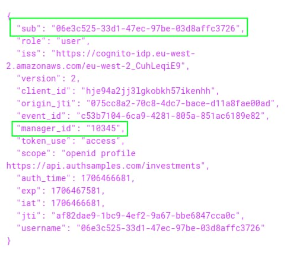

# User Authentication Behaviour

Previously I explained this blog’s <a href='api-authorization-design.mdx'>API Authorization Behaviour</a>. Next I provide a brief overview of some key points that you should understand about OAuth and user authentication.

### The OpenID Connect Code Flow

OAuth clients must never implement user authentication in code. Instead, clients run an authorization code flow to hand over authentication to the authorization server. The earlier post on <a href='basicspa-oauthworkflow.mdx'>OAuth Messages</a> explains how this works.

This enables many possible ways to login, including those listed below. Multiple authentication factors can be chained together, and the authentication complexity is externalized to the authorization server:

- Basic passwords, as used in this blog.
- Email, phone or one-time-password verification.
- Cryptography-backed options such as passkeys.
- External identity providers (social logins).
- External identity providers (business partners).
- Custom authentication using the authorization server’s extensibility.

In all cases, once authentication completes, the client receives an authorization code in the browser response. The client swaps the code for tokens, after which the client receives an access token from the authorization server and can call APIs in the correct manner.

### Federated Logins

If an application integrates directly with an external identity provider (IDP), an authorization code flow runs, but not against the authorization server (AS). This is incorrect, and limits your login options.

In addition, the client receives *foreign access tokens*, which you cannot use to secure your APIs correctly, since you cannot control the scopes and claims issued. Instead, your APIs must only ever receive access tokens issued by your authorization server.

The correct flow is shown below, where the application performs an authorization code flow against the authorization server. The authorization server then runs a second flow against the identity provider:

If the IDP uses OAuth-based logins, you configure a *federated login* using settings like these:

- Register the IDP as an authentication method in the AS and assign at least an *Issuer URI*, *Client ID*, *Client Credential* and *Scope*
- Register the AS as a client in the IDP and assign at least a *Redirect URI*, *Client ID*, *Client Credential* and *Scope*

The exact details may vary depending on particular systems, the security standards they use, and their published values for federation. When you configure a client to use an external OAuth-based identity provider, the following main steps occur:

- Client redirects to AS
- AS redirects to IDP
- User authenticates at the IDP
- IDP returns an authorization code to the AS
- AS returns its own authorization code to the client
- Client posts the AS code back to the AS to get AS tokens
- AS posts the IDP code back to the IDP to get IDP tokens
- AS validates IDPs tokens, then issues its own tokens to the client

### Consistent API User Identity

The deeper behaviour when you integrate authentication can be control over user attributes during the authentication flow. For example, you must ensure that access token claims, including user identities, remain the same when the user’s primary authentication factor changes.

You may need to use *Account Linking* to identify existing accounts from authentication user attributes. This requires you to use data storage and custom logic in your authorization server. Without the right authorization server support, there can be outcomes such as duplication of user accounts, which can damage the integrity of both your identity data and business data.

### Custom Authentication

At times you may run into custom authentication requirements. In such cases, avoid reverting to custom authentication code in your apps. Instead, understand how the authorization server implements authentication:

- The user interacts with HTML forms that run in the browser to capture proofs of the user's identity.
- The HTML forms call authorization server endpoints that verify proofs of the user's identity.

A good authorization server provides extensibility to enable you to implement custom authentication to build your own frontend forms and backend logic, as an extension to the authorization server. This should prevent you from ever running into blocking authentication issues.

### Where Are We?

I explained how OAuth should enable your users to authenticate in many possible ways. When reviewing an authorization server's authentication capabilities, look for a good variety of built-in authentication methods, strong support for working with user attributes and extensibility to enable custom authentication.

### Next

- I explain the traditional <a href='user-sessions-and-token-renewal.mdx'>Iframe Access Token Renewal</a> flow for SPAs.
- For a list of all blog posts see the <a href='index.mdx'>Index Page</a>.
