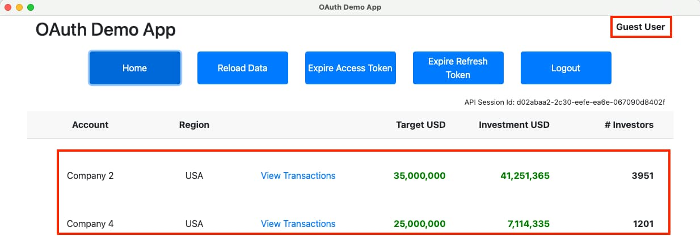

# Final Desktop App - Code Details

Previously I summarised the behaviour of the <a href='final-desktop-sample-overview.mdx'>Final Desktop Code Sample</a>. This post provides an overview of the app's code changes. See also the <a href='api-journey-client-side.mdx'>Client Side API Journey</a> to understand the background and the requirements being met.

### Code Layout

The app has a similar code layout to the initial desktop code sample. The *src* code represents the Electron main process and the Electron renderer process, along with some shared code. The *build* and *tools* folder manage Rollup builds and live reloading.

<div className='smallimage'>
    
</div>


### React Update

I updated the Electron app to use React. This mostly involved just copying in the completed views from this blog's <a href='reactjs-codingkeypoints'>Final SPA</a>:

```jsx
return (
    <>
        <TitleView {...getTitleProps()} />
        <HeaderButtonsView {...getHeaderButtonProps()} />
        {error && <ErrorSummaryView {...getErrorProps()} />}
        <>
            <SessionView {...getSessionProps()} />
            <Routes>
                <Route path='/'              element={<CompaniesView {...getCompaniesProps()} />} />
                <Route path='/companies/:id' element={<TransactionsView {...getTransactionsProps()} />} />
                <Route path='/loggedout'     element={<LoginRequiredView {...getLoginRequiredProps()} />} />
                <Route path='*'              element={<CompaniesView {...getCompaniesProps()} />} />
            </Routes>
        </>
    </>
);
```

The main difference to the React code for the final SPA is that the Electron app uses the *HashRouter*. The *renderer.tsx* source file is the entry point to the React app that starts an SPA as follows:

```jsx
const root = ReactDOM.createRoot(document.getElementById('root') as HTMLElement);
const props = {
    viewModel: new AppViewModel(),
};
root.render (
    <StrictMode>
        <ErrorBoundary>
            <HashRouter>
                <App {...props} />
            </HashRouter>
        </ErrorBoundary>
    </StrictMode>
);
```

### Rollup Builds

The final desktop app uses Rollup and build techniques summarized in the <a href='reactjs-codingkeypoints.mdx'>Final SPA - Code Details</a>. The build produces bundles for both the *main* and *renderer* sides of the desktop app. The essential parts of the configuration for the *main* build are shown below, and the *renderer* build has a similar configuration.

```typescript
const isDevelopment = process.env.BUILD === 'debug';
const outputFolder = 'dist';

const options: RollupOptions = {

    input: './src/main.ts',
    output: {
        dir: outputFolder,
        format: 'esm',
        entryFileNames: 'main.bundle.js',
    },

    external: [
        'electron',
        'electron-store',
        ...builtinModules,
        ...builtinModules.map((m) => `node:${m}`),
    ],

    plugins: [

        nodeResolve({
            preferBuiltins: true,
        }),

        commonjs(),
        json(),
        esbuild({
            tsconfig: './tsconfig-main.json',
            target: 'es2022',
        }),

        replace({
            'IS_DEBUG': JSON.stringify(isDevelopment),
            preventAssignment: true,
        }),

        copy({
            targets: [
                { src: 'desktop.config.json', dest: outputFolder },
                { src: 'src/preload.js', dest: outputFolder },
                { src: 'package.json', dest: outputFolder },
            ],
        }),

        isDevelopment ? [] : [ terser() ]
    ],
};

export default defineConfig(options);
```

### Serving Web Static Content

The main process's entry point class now serves web files to the renderer process with URLs that use the application's custom protocol scheme. The code to enable that is shown below. I only serve expected web files to minimize potential XSS threats against the file system. During development, the main process serves an additional bundle to support live reload. 

```typescript
public execute(): void {

    ...
    
    protocol.registerSchemesAsPrivileged([{
        scheme: this.configuration.app.protocolScheme,
        privileges: {
            standard: true,
            secure: true,
            supportFetchAPI: true,
            corsEnabled: true,
        },
    }]);
}

private async onReady(): Promise<void> {

    protocol.handle(this.configuration.app.protocolScheme, this.onServeWebFiles);
    this.window.loadURL(`${this.configuration.app.protocolScheme}:/index.html`);
}

private onServeWebFiles(request: Request): Promise<Response> {

    let fileName = new URL(request.url).pathname.toLowerCase();
    if (fileName.startsWith('/')) {
        fileName = fileName.slice(1);
    }

    const authorizedFiles = new Set([
        'index.html',
        'bootstrap.min.css',
        'app.css',
        'vendor.bundle.js',
        'vendor.bundle.js.map',
        'react.bundle.js',
        'react.bundle.js.map',
        'app.bundle.js',
        'app.bundle.js.map',
    ]);

    if (IS_DEBUG) {
        authorizedFiles.add('livereload.bundle.js');
    }

    if (!authorizedFiles.has(fileName)) {
        fileName = 'index.html';
    }

    const filePath = path.join(app.getAppPath(), fileName);
    const filePathUrl = pathToFileURL(filePath).toString();
    return net.fetch(filePathUrl);
}
```

### Live Reload

For the final SPA, the live reload behavior was integrated into the web static content host. For the final desktop app, the main process serves static content. When the renderer rollup build completes, it calls the */reload* endpoint of a small live reload server, which then sends a web socket notification to the renderer process, so that it can reload itself.

```typescript
import express, {Request, Response} from 'express';
import http from 'http';
import {WebSocketServer, WebSocket} from 'ws';

const port = 35729;
const app = express();

const server = http.createServer(app);
const wss = new WebSocketServer({
    server,
    path: '/reload'
});

app.get('/reload', (request: Request, response: Response) => {

    console.log('Web socket server broadcasting reload event ...');
    for (const client of wss.clients) {
        if (client.readyState === WebSocket.OPEN) {
            client.send('reload');
        }
    }
    response.sendStatus(204);
});

server.listen(port, () => {
    console.log(`Live reload server is listening on HTTP port ${port} ...`);
});
```

### Web Response Headers

The main process sets response headers when it serves static files to the Chromium browser. The main security responsibility is to set a strong content security policy, to prevent JavaScript being able to interact with malicious hosts.

```typescript
session.defaultSession.webRequest.onHeadersReceived((details, callback) => {

    let connectSrcHosts = "'self'";
    if (IS_DEBUG) {
        connectSrcHosts += ' ws://localhost:35729';
    }

    let policy = '';
    policy += "default-src 'none';";
    policy += " script-src 'self';";
    policy += " style-src 'self';";
    policy += ` connect-src ${connectSrcHosts};`;
    policy += " child-src 'self';";
    policy += " img-src 'self';";
    policy += " object-src 'none';";
    policy += " frame-ancestors 'none';";
    policy += " base-uri 'self';";
    policy += " form-action 'self'";

    const responseHeaders: Record<string, string | string[]> = {
        ...details.responseHeaders,
        'content-security-policy': policy,
    };

    if (IS_DEBUG) {
        responseHeaders['cache-control'] = 'no-cache, must-revalidate';
    } else {
        responseHeaders['cache-control'] = 'public, max-age=31536000, immutable';
    }

    callback({
        responseHeaders,
    });
});
```    

In development mode, the response headers must implement a couple of behaviors in order for live reload to work. The CSP must allow connections between the browser and the live reload server, and response headers must prevent caching of previously built browser files.

### Private URI Scheme Registration

The main process is also the entry point for deep link notifications, which use the custom protocol scheme. The app registers the scheme at application startup, which writes entries to user specific areas of the operating system:

```typescript
private async registerPrivateUriScheme(): Promise<void> {

    if (process.platform === 'win32') {

        app.setAsDefaultProtocolClient(
            this.configuration!.oauth.privateSchemeName,
            process.execPath,
            [app.getAppPath()]);

    } else {
        app.setAsDefaultProtocolClient(this.configuration!.oauth.privateSchemeName);
    }
}
```

To receive private URI scheme notifications deterministically, the desktop app restricts itself to a single running instance:

```typescript
public execute(): void {

    const primaryInstance = app.requestSingleInstanceLock();
    if (!primaryInstance) {
        app.quit();
        return;
    }
}
```

### Receiving Deep Links

When the operating system invokes a deep link, the following code runs in the *main.ts* source file:

```typescript
private handleDeepLink(deepLinkUrl: string): void {

    if (this.window) {

        if (this.window.isMinimized()) {
            this.window.restore();
        }

        this.window.focus();
    }

    this.ipcEvents.handleDeepLink(deepLinkUrl);
}
```

The main process first asks its *OAuthService* to process the deep link if it represents a login or logout response. Otherwise, the notification is a general deep link that the main process forwards to the React app:

```typescript
public handleDeepLink(deepLinkUrl: string): boolean {

    if (this.oauthService.handleDeepLink(deepLinkUrl)) {
        return true;
    }

    const url = UrlParser.tryParse(deepLinkUrl);
    if (url && url.pathname) {
        const path = url.pathname.replace(this.configuration.oauth.privateSchemeName + ':', '');
        this.window!.webContents.send(IpcEventNames.ON_DEEP_LINK, {path});
    }

    return false;
}
```

For OAuth responses, the *OAuthService* uses Node.js events to resume the flow:

```typescript
public handleDeepLink(deepLinkUrl: string): boolean {

    const url = UrlParser.tryParse(deepLinkUrl);
    if (url) {

        const args = new URLSearchParams(url.search);
        const path = url.pathname.toLowerCase();
        if (path === '/callback') {

            this.eventEmitter.emit('LOGIN_COMPLETE', args);
            return true;

        } else if (path === '/logoutcallback') {

            this.eventEmitter.emit('LOGOUT_COMPLETE', args);
            return true;
        }
    }

    return false;
}
```

The overall behaviour is similar to that of the initial desktop code sample, which resumes its flow after a response received in its loopback web server. If the user happens to click the *Sign In* button more than once, the application continues to correctly handle re-entrancy and prevent any leaked resources.

### Secure Token Storage

The desktop app uses a *TokenStorage* class that wraps the use of Electron safe storage. This object manages saving, loading and deleting tokens. The app uses encrypted text files to store tokens, with an operating system encryption key that is private to the current desktop user:

```typescript
public load(): TokenData | null {

    try {

        const encryptedBytesBase64 = this.store.get(this.key);
        if (!encryptedBytesBase64) {
            return null;
        }

        const json = safeStorage.decryptString(Buffer.from(encryptedBytesBase64, 'base64'));
        return JSON.parse(json);

    } catch (e: any) {

        return null;
    }
}
```

The OAuth processing code calls the TokenStorage class after the following events:

- When the desktop app starts, to load tokens.
- After the authorization code grant, to save tokens.
- After the refresh token grant, to update tokens.
- When the user signs out or the session expires, to remove tokens.

### Concurrent Operations

React renders the desktop app's views in a non-deterministic sequence, so the following two views can call an API in parallel:



This can lead to the following scenarios:

- One or both views could experience a technical error.
- One or both views may need to refresh an access token.
- One or both views may need to trigger a login redirect.

The desktop code sample handles these conditions with the same React code as this blog's final SPA code sample. See the <a href='reactjs-codingkeypoints.mdx'>Final SPA - Code Details</a> blog post to understand the API client logic.

### AppAuth Libraries

This blog completes this blog's desktop integration using the recommendations from RFC 8252. Doing so does not mandate use of the AppAuth libraries though. For example, if you run into a blocking issue, you could implement the code flow messages manually in the app's *OAuthServiceImpl* class.

### Where Are We?

I updated the desktop app with new features that improve usability, to complete this blog's desktop mini-theme. Next I begin coverage of OAuth for mobile apps.

### Next

- Next I explain an Android OAuth Setup and run the <a href='android-setup.mdx'>Android AppAuth Code Sample</a>.
- For a list of all blog posts see the <a href='index.mdx'>Index Page</a>.
