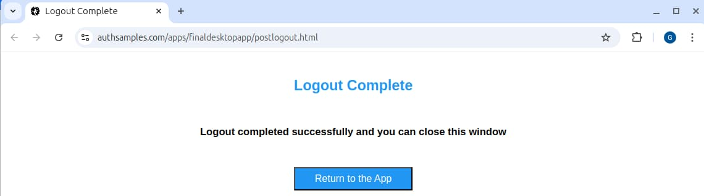
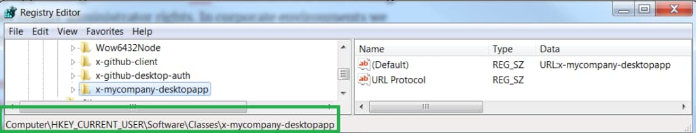
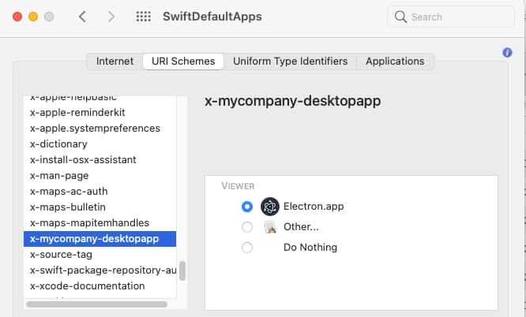
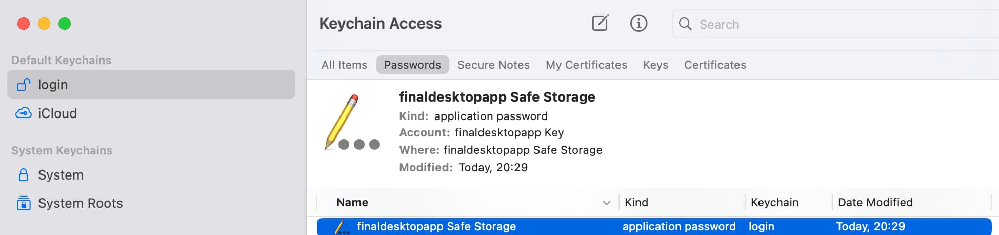
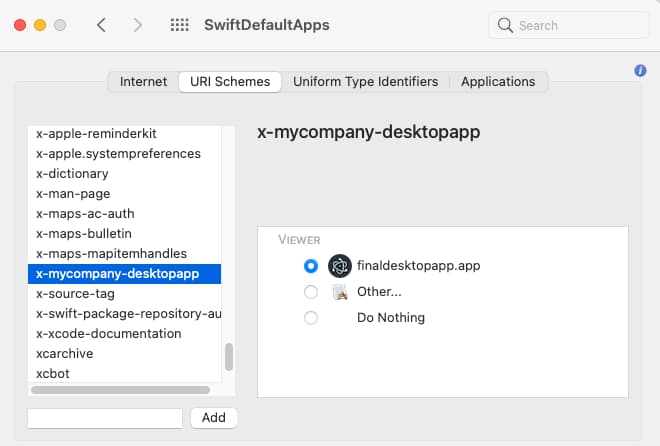
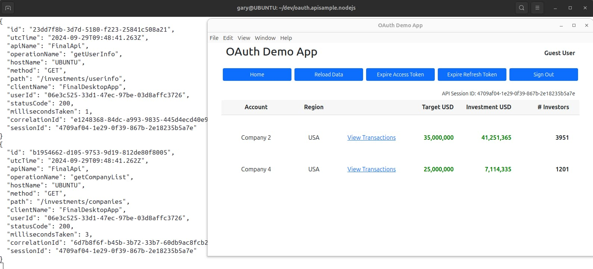

# Final Desktop App – Overview

Previously I explained some <a href='desktop-app-coding-key-points.mdx'>Code Details</a> for this blog's initial desktop app. Next I add some missing features to complete session management, harden security, and improve usability. The desktop app connects to <a href='cloud-hosting.mdx'>HTTPS endpoints hosted in AWS</a>, so that you only need to run the desktop app's code to get a fully integrated solution.

### New Features

The completed desktop code sample demonstrates these main features:

| Feature | Description |
| ------- | ----------- |
| React Update | I update from plain TypeScript to a more complete frontend technology stack. |
| Deep Linking | The app receieves login responses using private URI scheme based redirect URIs, to enable desktop deep links. |
| Secure Token Storage | I save OAuth tokens across app restarts using operating system encryption private to the app and user. |

### Code Download

Clone the code sample's GitHub repository with the following command:

```bash
git clone https://github.com/gary-archer/oauth.desktopsample.final
```


### Run the Code Sample

After cloning the sample code, run the following commands to build and run the app:

```bash
./build.sh
./run.sh
```

### Updated Login Flow

Logins continue to use the system browser:


You can use this blog’s test credential to sign in:

- User: *guestuser@example.com*
- Password: *GuestPassword1*

Once a login completes, the browser renders a completion web page:


The user clicks *Return to the App* after which the desktop app returns to the foreground. The app can then make API requests using its access token:


After login, the app stores tokens in desktop secure storage. The user can restart the app without requiring a new user login, as long as its refresh token remains valid.

### Logout

The app also implements OpenID Connect RP initiated logout, which presents a similar completion page. My main motivation for a logout solution is to be able to force a new login, for a different user account, when using AWS Cognito as the authorization server.



### OAuth Configuration Changes

The final desktop app’s configuration no longer uses HTTP ports, and now uses login and logout completion pages as redirect URIs:

```json
{
    "app": {
        "apiBaseUrl": "https://api.authsamples.com/investments",
        "useProxy": false,
        "proxyUrl": "http://127.0.0.1:8888"
    },
    "oauth": {
        "authority":             "https://cognito-idp.eu-west-2.amazonaws.com/eu-west-2_CuhLeqiE9",
        "clientId":              "5r463je7qeddssfqttaa8cpv91",
        "redirectUri":           "https://www.authsamples.com/apps/finaldesktopapp/postlogin.html",
        "postLogoutRedirectUri": "https://www.authsamples.com/apps/finaldesktopapp/postlogout.html",
        "scope":                 "openid profile https://api.authsamples.com/investments",
        "customLogoutEndpoint":  "https://login.authsamples.com/logout",
        "privateSchemeName":     "x-authsamples-desktopapp"
    }
}
```

I created a new OAuth client for the final desktop app, which uses these updated redirect URIs:


### Intermediate Web Pages

When a deep link runs after a redirect, the browser may refuse to invoke it for security reasons unless there is a user gesture. This is especially true if the redirects are entirely automatic, as for logouts or single-sign-on events. The simplest solution is to avoid logout redirects and use the OpenID Connect *prompt=none* parameter when you sign in.

However, at the time of writing, this blog's default authorization server does not support the *prompt* parameter. To provide a reliable solution, I set the app's redirect URIs to intermediate web pages, at the following URLs. These pages also improve a little on the default blank browser page that the user sees after login.

- [https://www.authsamples.com/apps/finaldesktopapp/postlogin.html](https://www.authsamples.com/apps/finaldesktopapp/postlogin.html)
- [https://www.authsamples.com/apps/finaldesktopapp/postlogout.html](https://www.authsamples.com/apps/finaldesktopapp/postlogout.html)

I deployed the HTML pages to an AWS S3 Bucket and then used this blog's final SPA's AWS CloudFront distribution to make the web pages available over HTTPS:


If you use your browser's *View Source* option you can see that the pages simply forward the login response to the app via its private URI scheme URL:


One downside of this approach is that, if the user doesn’t click the *Return to the App* button for a couple of minutes, the authorization code could time out, resulting in a user error. The user can always retry and recover though.

### Private URI Scheme Browser Prompts

Before the desktop app can receive the login response, the browser presents a prompt to ask the user to confirm the deep link. To understand its final appearance in the different browsers you can build and run a packaged version of the app:

```bash
./pack.sh
```

The [Electron Packager](https://github.com/electron/packager) then builds a binary that you could package further into an installation program:


The following screenshots show the appearance of the user prompt in the four main desktop browsers. This prompt may be a usability issue, so you may prefer loopback redirect URIs, which avoids this type of prompt when used correctly.

**Google Chrome**


**Firefox**


**Edge**


**Safari**


### Private URI Scheme Registration

The desktop app registers its scheme as a per-user setting that does not require administrator privileges. On Windows this updates registry settings under *HKEY_CURRENT_USER*:



On macOS you can use the [SwiftDefaultApps](https://github.com/Lord-Kamina/SwiftDefaultApps) tool to view the scheme and its associated app, which is also a per-user setting:



In my Linux distribution, the *Gnome Desktop System* controls custom schemes. The code sample deployment includes a *linux* subfolder that includes a *.desktop* file that registers the app:

```markdown
[Desktop Entry]
Type=Application
Name=Final Desktop App
Exec=$APP_COMMAND %U
StartupNotify=false
MimeType=x-scheme-handler/x-authsamples-desktopapp
```

### Secure Token Storage

The desktop app stores OAuth tokens in a text file. I use [Electron safeStorage](https://www.electronjs.org/docs/latest/api/safe-storage) to create an operating system encryption key private to the user and app, to avoid storing tokens in plain text. On macOS the encryption key is saved to the Keychain. On Windows and Linux the key is less visible. Windows uses the *DPAPI* subsystem, and my Ubuntu Linux system uses the *GNOME libsecret* subsystem. Further details on the underlying security are discussed in [this online thread](https://github.com/microsoft/vscode-discussions/discussions/748).



The actual tokens are stored as base64 encrypted bytes in a JSON file at one of the following locations:

| Operating System | Stored Tokens Location |
| ---------------- | ---------------------- |
| Windows | ~/AppData/Roaming/finaldesktopapp/tokens.json |
| macOS | ~/Library/Application Support/finaldesktopapp/tokens.json |
| Linux (Gnome) | ~/.config/finaldesktopapp/tokens.json |

### Deep Linking to Views

The login and logout response messages received by the app are a type of deep link notification:

- *x-authsamples-desktopapp:/callback?code=…&state=…*
- *x-authsamples-desktopapp:/logoutcallback*

In some use cases, you can use deep linking to bookmark screens. For example, you might send the user an email with a URL link. Note however that email clients may consider the private URI scheme’s prefix suspect, and block this type of deep link:

- *x-authsamples-desktopapp:/companies/2*

The easiest way to test deep linking is from a command shell, and the command varies slightly for the different operating systems:

| Operating System | Example Command |
| ---------------- | --------------- |
| Windows | start x-authsamples-desktopapp:/companies/2 |
| macOS | open x-authsamples-desktopapp:/companies/2 |
| Linux (Gnome) | xdg-open  x-authsamples-desktopapp:/companies/2 |

If the desktop app is running, this command causes it to update its current location to the *Transactions View*. Otherwise, the app is a startup deep link and the app loads at that location:


If the app has a valid access token, it moves directly to the deep linking destination screen. Otherwise, a token renewal or login runs, followed by deep linking navigation afterwards. This blog’s API authorization applies business rules that mean the default test user can only access data for the USA region. Attempts to deep link to other companies fail API authorization and return a known error code. The desktop app handles this error specially, to return the user to the initial view:


Finally, note that on macOS, startup deep links only work if you run a packaged version of the app, so that the scheme registration points to the packaged executable:



### Local API Setup

If required, you can run the desktop app against a local OAuth secured API. You can do so for one of this blog’s final APIs and following its instructions to run it locally:

- <a href='api-architecture-node.mdx'>Node.js API</a>
- <a href='net-core-code-sample-overview.mdx'>.Net Core API</a>
- <a href='java-spring-boot-api-overview.mdx'>Java Spring Boot API</a>

To connect to local APIs, update the *apiBaseUrl* value in the desktop.config.json file to the URL of a local API:

```json
{
    "app": {
        "apiBaseUrl": "https://api.authsamples-dev.com:446/investments",
        "useProxy": false,
        "proxyUrl": "http://127.0.0.1:8888"
    },
    "oauth": {
        "authority":             "https://cognito-idp.eu-west-2.amazonaws.com/eu-west-2_CuhLeqiE9",
        "clientId":              "5r463je7qeddssfqttaa8cpv91",
        "redirectUri":           "https://www.authsamples.com/apps/finaldesktopapp/postlogin.html",
        "postLogoutRedirectUri": "https://www.authsamples.com/apps/finaldesktopapp/postlogout.html",
        "scope":                 "openid profile https://api.authsamples.com/investments",
        "customLogoutEndpoint":  "https://login.authsamples.com/logout",
        "privateSchemeName":     "x-authsamples-desktopapp"
    }
}
```

When you now run the desktop app it calls the local API, and you can also focus on API behaviors, like JWT access token validation, claims-based authorization and logging:



### Where Are We?

I have updated the desktop code sample with some final features and explored desktop logins using private use URI schemes. Login usability remains unnatural, due to use of the disconnected browser.

### Next

- I explain some <a href='final-desktop-app-coding-key-points.mdx'>Code Details</a> for the final desktop app.
- For a list of all blog posts see the <a href='index.mdx'>Index Page</a>.
