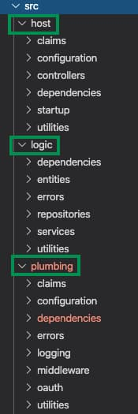
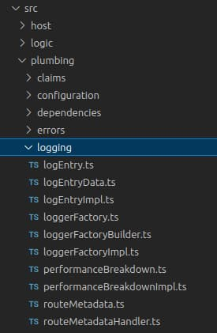
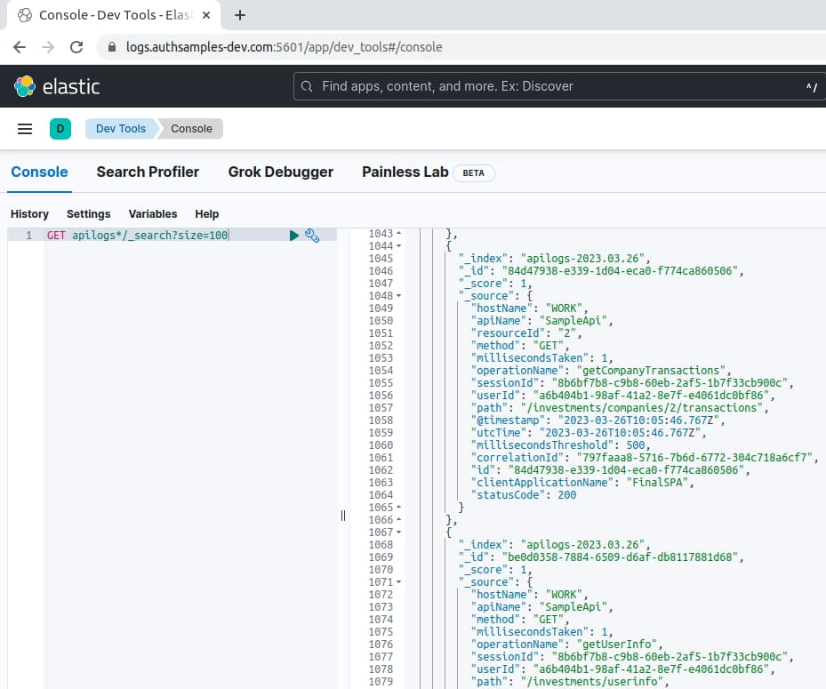

# Node.js API - Code Details

In the last post I summarised an advanced code sample that implements this blog's <a href='api-architecture-node.mdx'>API Architecture in Node.js</a>. In this post I explain some code-level details.

### Code Structure

The code for the example Node.js API consists of three main areas:

- REST Host
- Business Logic
- Plumbing

<div className='smallimage'>
    
</div>

In a real API platform, you could produce shared libraries with some of the contents of the plumbing folder. The API would then have far less code.

### Dependency Injection

The API uses [InversifyJS](https://github.com/inversify/InversifyJS) to implement dependency injection. A container manages most object creation and lifetimes, including those of the claims principal and log entry for the current request. Use of constructor injection makes it easier to understand and swap out object relationships.


### Application Startup Logic

The API's entry point is its *app.ts* file, which creates the container and then runs an *HttpServerConfiguration* object to set up the Express web server and the application's dependencies:

```typescript
const loggerFactory = LoggerFactoryBuilder.create();
const parentContainer = new Container();

try {

    const configurationBuffer = await fs.readFile('api.config.json');
    const configuration = JSON.parse(configurationBuffer.toString()) as Configuration;
    loggerFactory.configure(configuration.logging);

    const httpServer = new HttpServerConfiguration(configuration, parentContainer, loggerFactory);
    await httpServer.configure();
    httpServer.start();

} catch (e) {

    loggerFactory.logStartupError(e);
}
```

The *HttpServerConfiguration* class configures HTTP routes using the [Routing Controllers](https://github.com/typestack/routing-controllers) library:

```typescript
useContainer(new InversifyAdapter());
useExpressServer(this.expressApp, {
    defaultErrorHandler: false,
    routePrefix: apiBasePath,
    controllers: [CompanyController, UserInfoController],
});
```

This enables declarative routes for API requests, as is common in other API technology stacks:

```typescript
@Controller('/companies')
export class CompanyController {

    private readonly service: CompanyService;

    public constructor(@inject(SAMPLETYPES.CompanyService) service: CompanyService) {
        super();
        this.service = service;
    }

    @Get('')
    public async getCompanyList(): Promise<Company[]> {
        ...
    }

    @Get('/:id/transactions')
    public async getCompanyTransactions(@requestParam('id') id: string): Promise<CompanyTransactions> {

        ...
    }
}
```

Dependency injection works differently in Node.js to languages such as C# and Java, since the final JavaScript loses type information. Inversify therefore accompanies each injected type with a unique [JavaScript symbol](https://developer.mozilla.org/en-US/docs/Web/JavaScript/Reference/Global_Objects/Symbol).

### Dependency Composition

The startup logic registers dependencies, which consist of both plumbing objects and application objects:

```typescript
new BaseCompositionRoot(this.container)
    .useOAuth(this.configuration.oauth)
    .withExtraClaimsProvider(new SampleExtraClaimsProvider())
    .withLogging(this.configuration.logging, this.loggerFactory)
    .withExceptionHandler(exceptionHandler)
    .withProxyConfiguration(this.configuration.api.useProxy, this.configuration.api.proxyUrl)
    .register();

CompositionRoot.registerDependencies(this.container);
```

Inversify uses the following type of syntax to register dependencies. Some objects are singletons, others are bound to the current request and others are transient, meaning the container creates a new instance whenever it resolves the type:

```typescript
container.bind<OAuthConfiguration>(BASETYPES.OAuthConfiguration)
    .toConstantValue(this.oauthConfiguration!);
container.bind<CompanyService>(SAMPLETYPES.CompanyService)
    .to(CompanyService).inTransientScope();
```

For APIs with small dependency graphs, I reduce the likelihood of parallel requests impacting each other, by giving each request its own independent object instances.


### Middleware

As part of composing base dependencies, I create middleware classes for cross cutting concerns, and these are natural singletons:

```typescript
const childContainerMiddleware = new ChildContainerMiddleware(this.parentContainer);
const loggerMiddleware = new LoggerMiddleware(this.loggerFactory);
const authorizerMiddleware = new AuthorizerMiddleware();
const customHeaderMiddleware = new CustomHeaderMiddleware(this.configuration.logging.apiName);
const exceptionHandler = new UnhandledExceptionHandler(this.configuration.logging);
```

I summarise the role of each of the API's middleware objects in the following table:

| Middleware Class | Responsibility |
| ---------------- | -------------- |
| ChildContainerMiddleware | Create a child container per request, to store request scoped objects. |
| LoggerMiddleware | Create the log entry for the API request, then log request and response details. |
| AuthorizerMiddleware | OAuth processing, creating the claims principal for the API request, and adding identity details to logs. |
| CustomHeaderMiddleware | Enable advanced client side testing of APIs via custom headers. |
| UnhandledExceptionHandler | A central place to handle exceptions, add error details to logs, and produce the client error response. |

### Child Container Per Request

With Inversify I use a child container per request pattern to store request scoped objects. The first middleware creates a child container at the start of each HTTP request and tears it down at the end of the HTTP request. The child container can access all objects from the parent container:

```typescript
export class ChildContainerMiddleware {

    private readonly parentContainer: Container;

    public constructor(parentContainer: Container) {
        this.parentContainer = parentContainer;
    }

    public execute(request: Request, response: Response, next: NextFunction): void {

        response.locals.container = new Container({ parent: this.parentContainer });
        response.on('finish', () => {
            delete response.locals.container;
        });

        next();
    }
}
```

### Controller Resolution

The *InversifyAdapter* object uses the child container to resolve all objects when it autowires REST controllers. Inversify stores request and transient scoped objects for the current HTTP request only in the child container and not in the parent container:

```typescript
export class InversifyAdapter implements IocAdapter {

    public get<T>(someClass: ClassConstructor<T>, action?: Action): T {

        const childContainer = action?.response.locals.container as Container;
        return childContainer?.get<T>(someClass, { autobind: true });
    }
}
```

### Logging Implementation

I use a number of plumbing classes to implement API logging, whose end goal is to enable <a href='api-technical-support-analysis.mdx'>useful technical support queries by people</a>.

<div className='smallimage'>
    
</div>

The *LoggerMiddleware* creates a *LogEntry* and dynamically updates the stub object registered earlier:

```typescript
public execute(request: Request, response: Response, next: NextFunction): void {

    const logEntry = this.loggerFactory.createLogEntry();
    const container = response.locals.container as Container;
    container.bind<LogEntry>(BASETYPES.LogEntry).toConstantValue(logEntry);

    const routeMetadata = this.routeMetadataHandler.getOperationRouteInfo(request);
    logEntry.start(request, routeMetadata);

    response.on('finish', () => {
        logEntry.end(response);
        logEntry.write();
    });

    next();
}
```

The log entry does most of the logging work, such as inspecting Express request and response objects. The log entry can also be injected into business logic, which can contribute to logs. For example, the *CompanyRepository* provides performance instrumentation:

```typescript
@injectable()
export class CompanyRepository {

    private readonly jsonReader: JsonFileReader;
    private readonly logEntry: LogEntry;

    public constructor(
        @inject(SAMPLETYPES.JsonFileReader) jsonReader: JsonFileReader,
        @inject(BASETYPES.LogEntry) logEntry: LogEntry) {

        this.jsonReader = jsonReader;
        this.logEntry = logEntry;
        this.setupCallbacks();
    }

    public async getCompanyList(): Promise<Company[]> {

        return using(this.logEntry.createPerformanceBreakdown('selectCompanyListData'), async () => {
            return this.jsonReader.readData<Company[]>('data/companyList.json');
        });
    }
}
```

Logging objects write to a log file and, if you follow the <a href='log-aggregation-setup.mdx'>Log Aggregation Setup</a>, logs automatically flow to a local Elasticsearch instance. You can then query your own API activity during development:




### Authorizer Middleware

The API uses the same OAuth integration and claims handling techniques as this blog's second code sample, explained earlier in the <a href='updated-api-coding-key-points.mdx'>Updated API Code Details</a> blog post. The middleware replaces the stub claims principal object and also adds identity data to logs:

```typescript
public async execute(request: Request, response: Response, next: NextFunction): Promise<void> {

    const container = response.locals.container as Container;
    const filter =  container.get<OAuthFilter>(BASETYPES.OAuthFilter);
    const logEntry = container.get<LogEntryImpl>(BASETYPES.LogEntry);

    const claimsPrincipal = await filter.execute(request, response);
    logEntry.setIdentity(ClaimsReader.getStringClaim(claimsPrincipal.getJwt(), 'sub'));
    container.bind<ClaimsPrincipal>(BASETYPES.ClaimsPrincipal).toConstantValue(claimsPrincipal);

    next();
}
```

### Exception Handler

The API implements this blog's <a href='error-handling-and-supportability.mdx'>Error Handling and Supportability</a> design. All errors, including access token validation failures, escape to the global exception handler, which logs technical details and returns error responses to the caller:

```typescript
public execute(exception: any, request: Request, response: Response, next: NextFunction): void {

    const container = response.locals.container as Container;
    const logEntry = container.get<LogEntryImpl>(BASETYPES.LogEntry);
    const error = ErrorUtils.fromException(exception);

    let clientError: ClientError;
    if (error instanceof ServerError) {
        logEntry.setServerError(error);
        clientError = error.toClientError(this.configuration.apiName);
    } else {
        logEntry.setClientError(error);
        clientError = error;
    }

    response.setHeader('content-type', 'application/json');
    response.status(clientError.getStatusCode()).send(JSON.stringify(clientError.toResponseFormat()));
}
```

The art of good error handling is to design good error objects that contain useful fields to both callers of the API and technical support staff. Development error output has a productive and readable format that matches the rendering of production logs. Each log entry includes context like the current user, session, API and operation.

```json
{
  "id": "2b9de255-808b-10f9-cb01-79d76a851b27",
  "utcTime": "2022-12-10T13:02:46.234Z",
  "apiName": "FinalApi",
  "operationName": "getCompanyList",
  "hostName": "UBUNTU",
  "method": "GET",
  "path": "/investments/companies",
  "clientName": "FinalSPA",
  "userId": "a6b404b1-98af-41a2-8e7f-e4061dc0bf86",
  "statusCode": 500,
  "errorCode": "exception_simulation",
  "errorId": 95739,
  "millisecondsTaken": 10,
  "correlationId": "cde4cfed-c6d2-bd28-0add-fc19a97c9fb9",
  "sessionId": "89ab6a9c-12ca-35be-584b-71bb84ee1042",
  "performance": {
    "name": "total",
    "millisecondsTaken": 10,
    "children": [
      {
        "name": "validateToken",
        "millisecondsTaken": 1
      }
    ]
  },
  "errorData": {
    "statusCode": 500,
    "clientError": {
      "code": "exception_simulation",
      "message": "An unexpected exception occurred in the API",
      "id": 95739,
      "area": "FinalApi",
      "utcTime": "2022-12-10T13:02:46.237Z"
    },
    "serviceError": {
      "details": "",
      "stack": [
        "Error: An unexpected exception occurred in the API",
        "at Function.createServerError (/home/gary/dev/oauth.apisample.nodejs/src/plumbing/errors/errorFactory.ts:16:16)",
        "at CustomHeaderMiddleware.processHeaders (/home/gary/dev/oauth.apisample.nodejs/src/plumbing/middleware/customHeaderMiddleware.ts:27:36)",
        "at Layer.handle [as handle_request] (/home/gary/dev/oauth.apisample.nodejs/node_modules/express/lib/router/layer.js:95:5)",
        "at trim_prefix (/home/gary/dev/oauth.apisample.nodejs/node_modules/express/lib/router/index.js:328:13)",
        "at /home/gary/dev/oauth.apisample.nodejs/node_modules/express/lib/router/index.js:286:9",
        "at param (/home/gary/dev/oauth.apisample.nodejs/node_modules/express/lib/router/index.js:365:14)",
        "at param (/home/gary/dev/oauth.apisample.nodejs/node_modules/express/lib/router/index.js:376:14)",
        "at Function.process_params (/home/gary/dev/oauth.apisample.nodejs/node_modules/express/lib/router/index.js:421:3)",
        "at next (/home/gary/dev/oauth.apisample.nodejs/node_modules/express/lib/router/index.js:280:10)",
        "at ClaimsCachingAuthorizer.authorizeRequestAndGetClaims (/home/gary/dev/oauth.apisample.nodejs/src/plumbing/security/baseAuthorizer.ts:62:13)"
      ]
    }
  }
}
```

By default, the exception handler treats unknown errors as general exceptions and returns a 500 response. For closer control of the response, the API's logic can throw a *ServerError* or *ClientError* derived instance:

```typescript
private unauthorizedError(companyId: number): ClientError {

    throw ErrorFactory.createClientError(
        404,
        ErrorCodes.companyNotFound,
        `Company ${companyId} was not found for this user`);
}
```

### Portability

The API uses some techniques that are a little different to many online Node.js examples. However, the design is very mainstream and provides a productive code setup. The code for this blog's .NET and Java APIs is almost identical.

### Where Are We?

I implemented some non-functional requirements in Node.js without any blocking issues, and separated plumbing from other code. In a real API I could then focus on growing the business logic.

### Next

- Next I implement the same <a href='net-core-code-sample-overview.mdx'>API Architecture in .NET</a>.
- For a list of all blog posts see the <a href='index.mdx'>Index Page</a>.
