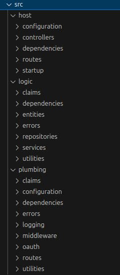

# Node.js API – Code Details

In our last post we started describing an advanced code sample that implemented our <a href='api-architecture-node.mdx'>API Architecture in Node.js</a>. We will now drill into some final implementation details.

### Code Structure

Our advanced Node.js API consists of three main areas:

- REST Host
- API Business Logic
- Common Code (plumbing)

<div className='smallimage'>
    
</div>

In a real API platform, much of the plumbing folder could be extracted into one or more shared library references and there would be far less code.

### Use of Dependency Injection

Our code has changed a fair amount since the previous API sample, and this includes use of [InversifyJS](https://github.com/inversify/InversifyJS) to manage object creation and lifetimes:


One reason to improve the dependency management is to enable the request scoped claims principal and log entry instances to be injected into business logic.

### Application Startup Logic

Our API starts by running the *app.ts* file, which creates the container and then runs an *HttpServerConfiguration* object to set up the Express web server and the application’s dependencies:

```typescript
const loggerFactory = LoggerFactoryBuilder.create();
const container = new Container();

try {

    const configurationBuffer = await fs.readFile('api.config.json');
    const configuration = JSON.parse(configurationBuffer.toString()) as Configuration;
    loggerFactory.configure(configuration.logging);

    const httpServer = new HttpServerConfiguration(configuration, container, loggerFactory);
    await httpServer.configure();
    httpServer.start();

} catch (e) {

    loggerFactory.logStartupError(e);
}
```

The *HttpServerConfiguration* class configures an *Inversify Express Server*, which is just a wrapper around the Express HTTP Server:

```typescript
attributes and set up controller autowiring
new InversifyExpressServer(this._container, null, {rootPath: '/investments/'}, this._expressApp)
    .setConfig(() => {

        this._expressApp.set('etag', false);
        base.configureMiddleware(this._expressApp);
    })
    .setErrorConfig(() => {

        base.configureExceptionHandler(this._expressApp);
    })
    .build();
```

### Dependency Composition

Our startup logic also performs [DI Composition](https://freecontent.manning.com/dependency-injection-in-net-2nd-edition-understanding-the-composition-root/), which consists of 2 types of dependency:

- Plumbing objects
- Application objects

```typescript
public async configure(): Promise<void> {

    const base = new BaseCompositionRoot(this._container)
        .useApiBasePath('/investments/')
        .useOAuth(this._configuration.oauth)
        .withExtraClaimsProvider(new SampleExtraClaimsProvider())
        .withLogging(this._configuration.logging, this._loggerFactory)
        .withProxyConfiguration(this._configuration.api.useProxy, this._configuration.api.proxyUrl)
        .register();

    CompositionRoot.registerDependencies(this._container);
}
```

The *BaseCompositionRoot* object represents initialisation of common code, which sets up these cross cutting concerns:

- API Request Logging
- API Exception Handling
- An OAuth Filter
- A Custom Claims Provider

Inversify uses the following type of syntax to register dependencies:

```typescript
private _registerBaseDependencies(): void {

    this._container.bind(BASETYPES.UnhandledExceptionHandler)
        .toConstantValue(this._exceptionHandler!);
    this._container.bind(BASETYPES.LoggerFactory)
        .toConstantValue(this._loggerFactory!);
    this._container.bind(BASETYPES.LoggingConfiguration)
        .toConstantValue(this._loggingConfiguration!);
    this._container.bind(BASETYPES.HttpProxy)
        .toConstantValue(this._httpProxy!);

    this._container.bind(BASETYPES.LogEntry)
        .toConstantValue({} as any);
}
```

### Middleware

As part of composing base dependencies, middleware classes for cross cutting concerns are also created, and these are natural singletons:

```typescript
public configureMiddleware(expressApp: Application): void {

    this._loggerMiddleware = new LoggerMiddleware(this._loggerFactory!);
    expressApp.use(`${this._apiBasePath}*`, this._loggerMiddleware.logRequest);

    this._authorizerMiddleware = new AuthorizerMiddleware();    
    expressApp.use(`${this._apiBasePath}*`, this._authorizerMiddleware!.authorize);

    const handler = new CustomHeaderMiddleware(this._loggingConfiguration!.apiName);
    expressApp.use(`${this._apiBasePath}*`, handler.processHeaders);
}
```

The role of each of the API’s middleware classes is summarised below:

| Middleware Class | Responsibility |
| ---------------- | -------------- |
| LoggerMiddleware | Manage the log entry for each API request, then log request and response details |
| AuthorizerMiddleware | OAuth processing, getting data needed for request authorization, and adding identity details to logs |
| CustomHeaderMiddleware | Allow advanced client side testing of APIs via custom headers |
| UnhandledExceptionHandler | A central place for handling exceptions, adding error details to logs, and producing the client error response |

### Controller Annotations

As is common in other API technology stacks, our final Node.js sample uses method and path annotations to manage receiving API requests, and these are provided by [Inversify Express Utils](https://github.com/inversify/inversify-express-utils).

```typescript
@controller('/companies')
export class CompanyController extends BaseHttpController {

    private readonly _service: CompanyService;

    public constructor(
        @inject(SAMPLETYPES.CompanyService) service: CompanyService) {

        super();
        this._service = service;
    }

    @httpGet('')
    public async getCompanyList(): Promise<Company[]> {
        ...
    }

    @httpGet('/:id/transactions')
    public async getCompanyTransactions(@requestParam('id') id: string): Promise<CompanyTransactions> {

        ...
    }
}
```

Note that dependency injection works differently to languages such as C# and Java, since code is compiled to JavaScript and type information is lost. Inversify deals with this by requiring injected objects to be accompanied by an identifying string key, which can be reliably coded as a constant.

### Autowiring of REST Controllers

Inversify Express Utils uses a [Container Per Request](https://structuremap.github.io/the-container/nested-containers/) pattern, to create a child container at the start of every HTTP request:


The controller and method for the incoming request are then identified based on which controller annotations the incoming request maps to. The controller class and its dependencies are then created.

### Single Threaded Code

For APIs with small dependency graphs, I like to reduce the likelihood of parallel requests  impacting each other. I do this by giving each request its own independent object instances. The API uses a request scope for REST specific objects, or a transient scope for domain logic classes:

```typescript
public static registerDependencies(container: Container): void {

    container.bind<ClaimsController>(SAMPLETYPES.ClaimsController)
        .to(ClaimsController).inRequestScope();
    container.bind<UserInfoController>(SAMPLETYPES.UserInfoController)
        .to(UserInfoController).inRequestScope();
    container.bind<CompanyController>(SAMPLETYPES.CompanyController)
        .to(CompanyController).inRequestScope();

    container.bind<CompanyService>(SAMPLETYPES.CompanyService)
        .to(CompanyService).inTransientScope();
    container.bind<CompanyRepository>(SAMPLETYPES.CompanyRepository)
        .to(CompanyRepository).inTransientScope();
    container.bind<JsonFileReader>(SAMPLETYPES.JsonFileReader)
        .to(JsonFileReader).inTransientScope();
}
```

### Logging Implementation

API logging is also implemented via plumbing code, and the end goal is to enable <a href='api-technical-support-analysis.mdx'>platform wide technical support queries by people</a>.

<div className='smallimage'>
    
</div>

The log entry is a natural request scoped object and is created in the *LoggerMiddleware*, which does most of the logging work:

```typescript
public logRequest(request: Request, response: Response, next: NextFunction): void {

    const logEntry = this._loggerFactory.createLogEntry();
    const container = ChildContainerHelper.resolve(request);
    container.bind(BASETYPES.LogEntry).toConstantValue(logEntry);

    logEntry.start(request);
    logEntry.processRoutes(request, this._routeMetadataHandler);

    response.on('finish', () => {
        logEntry.end(response);
        logEntry.write();
    });

    next();
}
```

The log entry class can also be injected into business logic, which can contribute to logs, as for the *CompanyRepository*, which provides performance instrumentation:

```typescript
@injectable()
export class CompanyRepository {

    private readonly _jsonReader: JsonFileReader;
    private readonly _logEntry: LogEntry;

    public constructor(
        @inject(SAMPLETYPES.JsonFileReader) jsonReader: JsonFileReader,
        @inject(BASETYPES.LogEntry) logEntry: LogEntry) {

        this._jsonReader = jsonReader;
        this._logEntry = logEntry;
        this._setupCallbacks();
    }

    public async getCompanyList(): Promise<Company[]> {

        return using(this._logEntry.createPerformanceBreakdown('selectCompanyListData'), async () => {

            return this._jsonReader.readData<Company[]>('data/companyList.json');
        });
    }
}
```

Logging classes write to a log file and, if the <a href='log-aggregation-setup.mdx'>Log Aggregation Setup</a> is followed, logs will automatically flow to a local Elasticsearch instance. Developers can then query API activity on their local computer:


### Error Handling Implementation

The API implements this blog’s <a href='error-handling-and-supportability.mdx'>Error Handling and Supportability</a> design. By default all errors escape to a global exception handler, whose role is to log errors and return an error response to the caller:

```typescript
public handleException(exception: any, request: Request, response: Response, next: NextFunction): void {

    const perRequestContainer = ChildContainerHelper.resolve(request);
    const logEntry = perRequestContainer.get<LogEntryImpl>(BASETYPES.LogEntry);

    const error = ErrorUtils.fromException(exception);

    let clientError;
    if (error instanceof ServerError) {
        logEntry.setServerError(error);
        clientError = error.toClientError(this._configuration.apiName);
    } else {
        logEntry.setClientError(error);
        clientError = error;
    }

    const writer = new ResponseWriter();
    writer.writeObjectResponse(response, clientError.getStatusCode(), clientError.toResponseFormat());
}
```

This is very standard, but the art of good error handling is to design good error objects that contain useful fields to both callers of the API and your technical support staff.

Error output for developers has a *productive and readable format*, and production logs will also be rendered like this, including context such as which user, session, API and operation was involved.

```json
{
  "id": "2b9de255-808b-10f9-cb01-79d76a851b27",
  "utcTime": "2022-12-10T13:02:46.234Z",
  "apiName": "FinalApi",
  "operationName": "getCompanyList",
  "hostName": "UBUNTU",
  "method": "GET",
  "path": "/investments/companies",
  "clientName": "FinalSPA",
  "userId": "a6b404b1-98af-41a2-8e7f-e4061dc0bf86",
  "statusCode": 500,
  "errorCode": "exception_simulation",
  "errorId": 95739,
  "millisecondsTaken": 10,
  "correlationId": "cde4cfed-c6d2-bd28-0add-fc19a97c9fb9",
  "sessionId": "89ab6a9c-12ca-35be-584b-71bb84ee1042",
  "performance": {
    "name": "total",
    "millisecondsTaken": 10,
    "children": [
      {
        "name": "validateToken",
        "millisecondsTaken": 1
      }
    ]
  },
  "errorData": {
    "statusCode": 500,
    "clientError": {
      "code": "exception_simulation",
      "message": "An unexpected exception occurred in the API",
      "id": 95739,
      "area": "FinalApi",
      "utcTime": "2022-12-10T13:02:46.237Z"
    },
    "serviceError": {
      "details": "",
      "stack": [
        "Error: An unexpected exception occurred in the API",
        "at Function.createServerError (/home/gary/dev/oauth.apisample.nodejs/src/plumbing/errors/errorFactory.ts:16:16)",
        "at CustomHeaderMiddleware.processHeaders (/home/gary/dev/oauth.apisample.nodejs/src/plumbing/middleware/customHeaderMiddleware.ts:27:36)",
        "at Layer.handle [as handle_request] (/home/gary/dev/oauth.apisample.nodejs/node_modules/express/lib/router/layer.js:95:5)",
        "at trim_prefix (/home/gary/dev/oauth.apisample.nodejs/node_modules/express/lib/router/index.js:328:13)",
        "at /home/gary/dev/oauth.apisample.nodejs/node_modules/express/lib/router/index.js:286:9",
        "at param (/home/gary/dev/oauth.apisample.nodejs/node_modules/express/lib/router/index.js:365:14)",
        "at param (/home/gary/dev/oauth.apisample.nodejs/node_modules/express/lib/router/index.js:376:14)",
        "at Function.process_params (/home/gary/dev/oauth.apisample.nodejs/node_modules/express/lib/router/index.js:421:3)",
        "at next (/home/gary/dev/oauth.apisample.nodejs/node_modules/express/lib/router/index.js:280:10)",
        "at ClaimsCachingAuthorizer.authorizeRequestAndGetClaims (/home/gary/dev/oauth.apisample.nodejs/src/plumbing/security/baseAuthorizer.ts:62:13)"
      ]
    }
  }
}
```

By default our exception handler treats unknown errors as general exceptions and returns a 500 response. For closer control of the response, the API’s logic can throw a *ServerError* or *ClientError* derived instance:

```typescript
private _unauthorizedError(companyId: number): ClientError {

    throw ErrorFactory.createClientError(
        404,
        ErrorCodes.companyNotFound,
        `Company ${companyId} was not found for this user`);
}
```

### Portability

The above code is mainstream and can be implemented in any technology stack. This blog’s .NET and Java APIs will be coded in an almost identical manner.

### Where Are We?

We have implemented our non functional requirements in Node.js without any blocking issues, and separated plumbing from other code. In a real API we could then focus on growing the business logic.

### Next

- Next we will implement our <a href='net-core-code-sample-overview.mdx'>API Architecture in .NET</a>
- For a list of all blog posts see the <a href='index.mdx'>Index Page</a>
