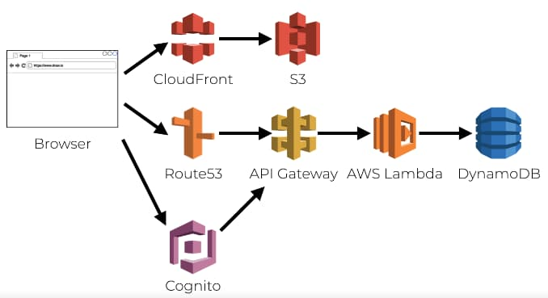
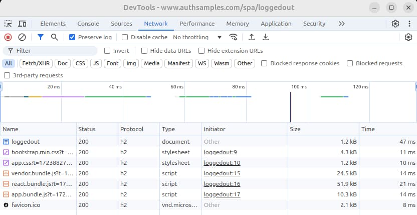

# Final SPA - Overview

Previously I explained the <a href='spa-back-end-for-front-end.mdx'>Backend for Frontend</a> setup for the final SPA, where remote API components issue cookies on behalf of the SPA. Next I summarise the updated behaviours of the completed SPA, after which I show how to run it locally.

### Code Sample Goal

The goal of the Final SPA code sample is to implement this blog's <a href='web-architecture-goals.mdx'>Web Architecture Goals</a>, to blend security with user experience and reliability. The app uses TypeScript for productive development and combines strong browser security with OAuth, to maximize login user experience choices. The app can make concurrent API requests with least privilege access tokens, and handle expiry events resiliently.

### Key Features

The final SPA completes the SPA architecture to meet all of the following requirements:

| Requirement | Description |
| ----------- | ----------- |
| Best Browser Security | The SPA calls APIs using the strongest *HttpOnly SameSite=strict* cookies, with no tokens in the browser. |
| Globally Equal Performance | Deploy the SPA to a content delivery network, so that web latency is roughly the same at any global location. |
| Pure SPA Development | Web developers run with production security but work only on modern frontends, with small code bases and usability control. |

### Cloud Hosting

I deploy the overall system of the SPA and APIs to AWS. I upload the SPA's web static content to S3, then CloudFront replicates the web resources to hundreds of global locations, without the need to manage servers or containers:



I deploy the API code sample to AWS as <a href='serverless-api-overview.mdx'>Serverless Lambda Functions</a> that the AWS API Gateway exposes to the internet. This API technology enables low cost backend hosting for this blog's demo APIs. Any reader can use the <a href='quick-start.mdx'>Cloud Samples Quick Start</a> page to run the secured SPA from its CDN. Sign in to the SPA with a test user account, then test OAuth lifecycle events via the demo app's buttons.


### Micro Frontend Design

The final SPA runs at a */spa* path. Additional paths, for other micro-frontends, could run within the same web domain, to keep the code base manageable as it grows. From a security viewpoint, any additional apps added to the web domain should be for the same business area. All apps then share each other's API cookies and also each other's cross site scripting threats.

<div className='smallimage'>
    
</div>

The SPA uses cookies issued by utility APIs but its code and web host manage only web concerns, with all cookie aspects externalized from SPA development. The resources in the *deployment* folder represent web static content hosting variations. The next post explains how to run the SPA and its development web host locally.

### Development URLs

I use the following URLs during local development and only the first of these runs on the local computer:

| Component | Base URL |
| --------- | -------- |
| SPA | *https://www.authsamples-dev.com/spa/* |
| Investments API | *https://api.authsamples.com/investments* |
| Investments API Web Route | *https://bff.authsamples-dev.com/investments* |
| OAuth Agent | *https://bff.authsamples.com-dev/oauth-agent* |
| Authorization Server | *https://login.authsamples.com* |

### OAuth Client

In AWS Cognito the deployed SPA registration points to an AWS CloudFront web origin. The SPA is upgraded to a confidential client, and its backend for frontend uses a client credential in grant requests for tokens:


A second entry exists to run the SPA during development, which has an equivalent registration except that the configured web URLs use a local development web origin.


### React Views

This blog's initial SPAs used vanilla TypeScript to demonstrate generic OAuth integration patterns that work in any SPA framework. The final SPA uses React, to enable a richer ecosystem of best practices, in areas like JSX view development and navigation. 

From an API viewpoint, the SPA now renders a tree of JSX views that result in concurrent API requests. The SPA must synchronise the triggering of both token renewal and user re-authentication when tokens expire.

```jsx
return (
    <ContainerView>
        <TitleView {...getTitleProps()} />
        <HeaderButtonsView {...getHeaderButtonProps()} />
        {error && <ErrorSummaryView {...getErrorProps()} />}
        {isLoaded &&
            <>
                <SessionView {...getSessionProps()} />
                <Routes>
                    <Route path='/companies/:id' element={<TransactionsView {...getTransactionsProps()} />} />
                    <Route path='/loggedout'     element={<LoginRequiredView {...getLoginRequiredProps()} />} />
                    <Route path='/*'             element={<CompaniesView {...getCompaniesProps()} />} />
                </Routes>
            </>
        }
    </ContainerView>
);
```

Earlier SPAs in this blog used hash-based routing. The final SPA instead uses path-based routes and React's navigation system. The SPA continues to express a */spa* base path in its *index.html* file. When the app loads, the React application reads the base path from the *index.html* file and supplies it to the React router. The React router expresses relative routes within the */spa/* base path.

### Modern Web Performance

When web hosting is suboptimal, web content must travel thousands of miles to reach the user's browser. This will never perform well, regardless of optimizations that performance teams or web developers try to implement. The final SPA uses content delivery network hosting for web content, to solve this problem in the standard way.

The time to first render in an OAuth-secured SPA is also not always understood. The final SPA's first page is a login required page that downloads initial web assets and renders quickly. All subsequent web downloads are served directly from the browser cache, until the next SPA upgrade or the user clears their browsing history.



The SPA uses CORS when it calls APIs, which is standard in any pure SPA architecture, but adds a small performance overhead. When a user first accesses an API endpoint, the browser sends preflight OPTIONS requests and then caches the CORS response for 24 hours.

### Where Are We?

I summarised the behaviour of this blog's final SPA. Development uses a modern web framework and there is an early focus on security, deployment, performance and reliability. The web architecture also scales effectively as code as the web code base grows.

### Next

- I explain <a href='how-to-run-the-react-js-spa.mdx'>How to Run the Final SPA</a>.
- For a list of all blog posts see the <a href='index.mdx'>Index Page</a>.
