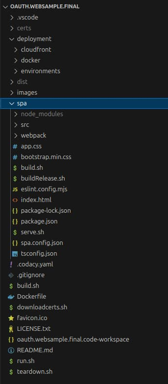

# Final SPA – Overview

Previously I explained the <Link href='/posts/spa-back-end-for-front-end'>Backend for Frontend</Link> setup for the final SPA, where remote API components issue cookies on behalf of the SPA. Next I summarise the main frontend behaviours of the completed SPA, after which I show how to run it locally.

### Key Features

The final SPA improves on the previous <Link href='/posts/improved-spa-code-sample-overview'>Updated SPA</Link>, to meet some key requirements. It is difficult to satisfy all of these at the same time:

| Requirement | Description |
| ----------- | ----------- |
| <span style={{color:'green'}}>**Best Browser Security**</span> | The SPA calls APIs using the strongest *HttpOnly SameSite=strict* cookies, with no tokens in the browser. |
| <span style={{color:'green'}}>**Globally Equal Performance**</span> | Deploy the SPA to a content delivery network, so that web latency is roughly the same at any global location. |
| <span style={{color:'green'}}>**Pure SPA Development**</span> | Web developers work productively on modern frontends, with small code bases and no security plumbing. |

### Cloud Hosting

I deploy the overall system of the SPA and APIs to AWS. I upload the SPA’s web static content to S3, then CloudFront replicates the web resources to ~400 global locations, without the need to manage servers or containers:


I deploy the API code sample to AWS as <Link href='/posts/serverless-api-overview'>Serverless Lambda Functions</Link> that the AWS API Gateway exposes to the internet. I find this API technology a little suboptimal in some areas, including performance, but it provides low cost backend hosting for this blog's demo APIs.

### Online Deployment

Any reader can run the AWS deployed version of the SPA from this blog’s <Link href='/posts/quick-start'>Cloud Samples Quick Start</Link> page. You can sign in to the SPA with a test user account, then test OAuth lifecycle events via the demo app’s buttons:


### Code Sample

The SPA code sample manages only frontend concerns. The resources in the *deployment* folder represent web static content hosting variations. The next post shows how to run the code sample locally.

<div className='smallimage'>

</div>

### Development URLs

You use the following URLs during local development and only the first of these runs on the local computer:

| Component | Base URL |
| --------- | -------- |
| <span style={{color:'green'}}>**SPA**</span> | *https://www.authsamples-dev.com/spa/* |
| <span style={{color:'green'}}>**Investments API**</span> | *https://api.authsamples.com/investments* |
| <span style={{color:'green'}}>**Investments API Web Route**</span> | *https://bff.authsamples-dev.com/investments* |
| <span style={{color:'green'}}>**OAuth Agent**</span> | *https://bff.authsamples.com-dev/oauth-agent* |
| <span style={{color:'green'}}>**Authorization Server**</span> | *https://login.authsamples.com* |

### OAuth Client

In AWS Cognito the deployed SPA registration points to an AWS CloudFront web origin. The SPA is upgraded to a confidential client, and its backend for frontend uses a client credential in grant requests for tokens:


A second entry exists to run the SPA during development, which has an equivalent registration except that the configured web URLs use a local development web origin.


### React Code

The SPA’s code now uses React as a web framework, to enable better features during coding of views. The SPA renders a tree of views which leads to concurrent API requests. The SPA must synchronise the triggering of both token renewal and user re-authentication when tokens expire.

```jsx
return (
    <>
        <TitleView {...getTitleProps()} />
        <HeaderButtonsView {...getHeaderButtonProps()} />
        {model.error && <ErrorSummaryView {...getErrorProps()} />}
        {model.isLoaded &&
            <>
                <SessionView {...getSessionProps()} />
                <Routes>
                    <Route path='/companies/:id' element={<TransactionsContainer {...getTransactionsProps()} />} />
                    <Route path='/loggedout'     element={<LoginRequiredView {...getLoginRequiredProps()} />} />
                    <Route path='/*'             element={<CompaniesContainer {...getCompaniesProps()} />} />
                </Routes>
            </>
        }
    </>
);
```

### Path Based Routing

Earlier SPAs in this blog used hash-based routing. The final SPA instead uses React’s support for path-based routes. The SPA continues to use a *base* path expressed in the index.html file:

```html
<!DOCTYPE html>
<html lang='en'>
    <head>
        <meta charset='utf-8'>
        <meta name='viewport' content='width=device-width, initial-scale=1, shrink-to-fit=no'>

        <base href='/spa/' />
        <title>OAuth Demo App</title>

        <link rel='stylesheet' href='bootstrap.min.css'>
        <link rel='stylesheet' href='app.css'>
    </head>
    <body>
        <div id='root' class='container'></div>

        <script type='module' src='vendor.bundle.js'></script>
        <script type='module' src='react.bundle.js'></script>
        <script type='module' src='app.bundle.js'></script>
    </body>
</html>
```

When the app loads, the React application reads the base path from the *index.html* file and supplies it to the React router. The app then uses relative routes within the */spa/* base path.

### Mobile First

Since the SPA is now cloud-deployed, you can access it on small mobile devices, so I made the final SPA more presentable on smaller screens:

<div className='smallimage'>

</div>

### Web Performance

The time to first render in a secured web application is not immediate and requires the following steps. The browser makes multiple static content and HTTP requests. Modern networks and the latest HTTP/2 functionality help to manage the steps efficiently:

| Step | Description |
| ---- | ----------- |
| <span style={{color:'green'}}>**Unauthenticated Access**</span> | The time to download HTML resources and run code to detect the user's authentication status. |
| <span style={{color:'green'}}>**OAuth Login**</span> | The time to redirect to the authorization server and present login screens, then return to the SPA. |
| <span style={{color:'green'}}>**Secure SPA Access**</span> | The application reload, followed by API requests to get secured data specific to the user. |

The final SPA uses the following mainstream techniques to ensure good performance:

| Aspect | Responsibilities |
| ------ | ---------------- |
| <span style={{color:'green'}}>**Content Delivery**</span> | Web latency is roughly equal for all global users, since a CDN ensures that all web downloads are fairly local. |
| <span style={{color:'green'}}>**Static Content Caching**</span> | The SPA uses cache control headers for web assets, to serve future requests from the browser cache. |
| <span style={{color:'green'}}>**API Response Caching**</span> | The SPA caches HTTP GET responses to prevent redundant API requests, such as during back navigation. |
| <span style={{color:'green'}}>**Download Sizes**</span> | As the SPA's code grows I would aim for medium-sized downloads using bundle splitting techniques and micro-frontends. |

The final SPA's has a simple initial page to display a login button. Once rendered, all future SPA operations and page reloads use HTML resources from the browser's local cache.


The SPA uses CORS when it calls APIs, which is standard in any pure SPA architecture, but adds a small performance overhead. When a user first accesses an API endpoint, the browser sends preflight OPTIONS requests and then caches the CORS response for 24 hours.

### Where Are We?

I summarised the behaviour of the final SPA's web architecture. Development uses a modern web framework and there is an early focus on security, deployment, performance and reliability. You can scale both URLs and code as the web code base grows.

### Next

- I explain <Link href='/posts/how-to-run-the-react-js-spa'>How to Run the Final SPA</Link>.
- For a list of all blog posts see the <Link href='/posts/index'>Index Page</Link>.