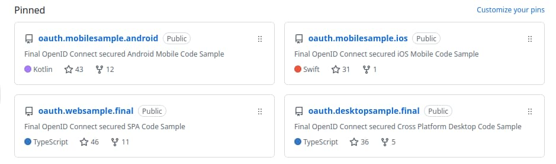

# Introduction

This blog is a getting started guide for developing APIs, browser based apps and mobile apps, using modern technology stacks. Although this may seem straightforward, end-to-end flows require technical foundations before such solutions are production-ready. The main blog focus is developer and code setups in a distributed architecture, to get the foundations right. 

### API Technical Qualities

Before most APIs and API clients can be run in production, they need a number of technical behaviors:

| Quality | Description |
| ------- | ----------- | 
| Secure | Client call APIs using message credentials containing user attributes that APIs use to protect business data. |
| Reliable | Clients and APIs handle error, expiry and concurrency conditions correctly. |
| Productive | Code is readable and cleanly separated so that people understand it and can grow the business logic. |
| Scalable | Once integrated you can extend the architecture to many APIs and clients without extra complexity. |

### The OAuth 2.0 Authorization Framework

To enable future-proof security, this blog uses OAuth 2.0 to secure APIs and clients. OAuth is a [family of specifications](https://datatracker.ietf.org/doc/html/rfc6749) for protecting data. Solutions are JSON-based and enable you to use the latest and most productive API, web and mobile technologies. A solid OAuth setup empowers developers with modern and extensible security capabilities.

Yet I have often seen people struggle to implement OAuth and realise its benefits, since it is a distributed architecture with many moving parts. An organization needs to introduce an intricate new component called the *Authorization Server* that outsources the deeper security from applications. You also need to make design choices that require insight, at both an architecture level and a code level.

### Blog Goals

I explain a setup that enables you to run secure end-to-end API and client flows. I only use basic OAuth security, but once you have the right setup and separation you are well-placed to implement more advanced use cases. In addition to OAuth integration I explain some lessons I’ve learned to enable resilient API and client journeys:

- Designing for manageability to avoid pain points.
- Coding with portability to keep future options open.
- Ensuring reliability by rehearsal of failure scenarios.
- Enabling productivity due to an investment in developer setups.

### Code Samples

This blog is code-centric where code separates technical concerns. I provide a number of [Code Samples](https://github.com/gary-archer) which I use to stay up to date with mainstream technology stacks. The code is intentionally moderately complex, with a fair amount of plumbing to deal with foundational behaviours. At a real organization, a technical goal would be a coding style that enables the valuable business logic to scale.

The samples cover a developer journey that starts with a security-first setup. Next, I use OAuth to secure APIs and clients using standards-based, portable code. During integration I rehearse error, expiry and concurrency conditions, to ensure reliability.

Any reader can run the code samples as working solutions and borrow ideas from the code. By default, I configure the example APIs and clients to use my personal cloud-hosted authorization server, or you can repoint them to your own.

### Where Are We?

I summarised blog goals and the first objective is a code sample that integrates a single page application (SPA) and API code sample with an authorization server.

### Next

- I summarise some <a href='web-architecture-goals.mdx'>Web Architecture Goals</a>.
- For a list of all blog posts see the <a href='index.mdx'>Index Page</a>.
