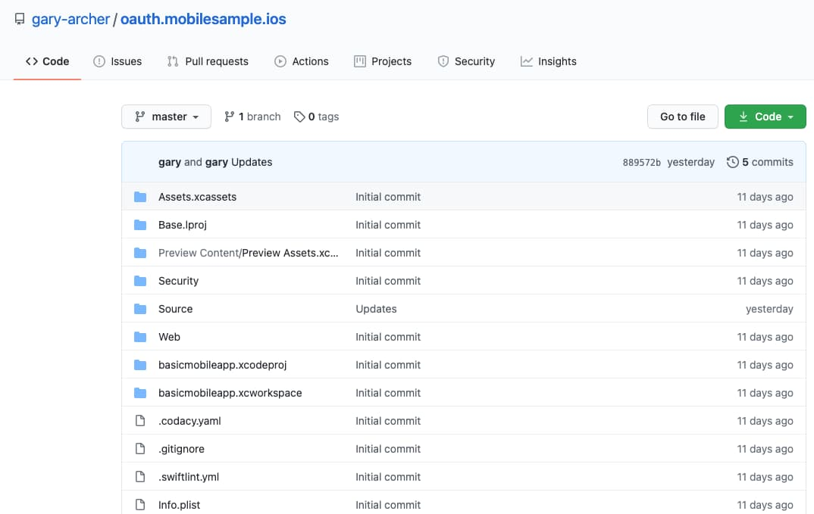

# How to Run the iOS Code Sample

Previously I provided an overview of the <a href='ios-code-sample-overview.mdx'>iOS Code Sample</a> and next I explain how to run and test the app. See also the following pages on an initial iOS setup:

- <a href='ios-setup.mdx'>iOS Setup and the AppAuth Sample</a>
- <a href='ios-https-debugging.mdx'>iOS HTTPS Debugging</a>

### Prerequisite 1: Install Xcode

Use an up to date version of Xcode on your macOS computer, so that you have access to the latest Swift and Swift UI features.

### Prerequisite 2: Install SwiftLint

The app requires this dependency as a build step that makes *code quality checks*. Download and run the PKG file for the latest version from the [SwiftLint Releases Page](https://github.com/realm/SwiftLint/releases).

### Step 1: Download the Code

The project is available [here](https://github.com/gary-archer/oauth.mobilesample.ios), and you can clone it with the following command:

```bash
git clone https://github.com/gary-archer/oauth.mobilesample.ios
```



### Step 2: Open the Project in Xcode

In Xcode the project's Swift code is located in the *Source* folder. Run the app on a simulator with your default *Signing and Capabilities* or with empty settings:


### Step 3: Understand Dependencies

I use the following external dependencies:

| Library | Usage |
| ------- | ----- |
| AppAuth | Does the work to run OAuth flows and retrieve tokens. |
| Keychain Swift | Simplifies storage of OAuth tokens in the iOS keychain. |
| SwiftUI-Tooltip | A utility to help display a tooltip containing user info. |

See the references under *Swift Package Manager*:


### Step 4: Run the App on a Simulator

Use the *Run* icon in the Xcode toolbar. You may receive an initial prompt to *Secure Your Device*, after which you can sign in with the following test credential:

- User: *guestuser@example.com*
- Password: *GuestPassword1*

Use the browser's password autofill prompt to save the password, then navigate between views by clicking an item in the Companies View or the *Home* button:

<div className='smallimage'>
    
</div>

Logins may require associated domain registration to succeed on your simulator. If registration fails you will receive the following display. See the <a href='ios-code-sample-infrastructure'>iOS Mobile Infrastructure</a> post on ways to resolve the problem.

<div className='smallimage'>
    
</div>

### Step 5: Understand Configuration Settings

When the app runs it uses API and OAuth settings from an embedded JSON configuration file named *mobile_config.json*, which you can find in the root of the project:

```json
{
  "app": {
    "apiBaseUrl":             "https://api.authsamples.com/investments"
  },
  "oauth": {
    "authority":              "https://cognito-idp.eu-west-2.amazonaws.com/eu-west-2_CuhLeqiE9",
    "clientId":               "2vshs4gidsbpnjmsprhh607ege",
    "redirectUri":            "https://www.authsamples.com/apps/finalmobileapp/postlogin.html",
    "postLogoutRedirectUri":  "https://www.authsamples.com/apps/finalmobileapp/postlogout.html",
    "scope":                  "openid profile https://api.authsamples.com/investments",
    "userInfoEndpoint":       "https://login.authsamples.com/oauth2/userInfo",
    "customLogoutEndpoint":   "https://login.authsamples.com/logout",
    "deepLinkBaseUrl":        "https://mobile.authsamples.com"
  }
}
```

### Step 6: Understand Login Redirects

AppAuth libraries send a standards-based *Authorization Code Flow (PKCE)* front channel request:


The authorization server accepts the request because the *Client ID*, *Redirect URI* and *Scope* of the request match those for a registered OAuth client. In AWS Cognito I registered the following details.


### Step 7: Understand Redirect Response Handling

After user authentication the app receives an authorization response that contains an authorization code. An external web page manages the claimed HTTPS scheme redirect URI to ensure that the app reliably receives the response.


The app uses two external web pages, hosted at the following URLs:

- [https://www.authsamples.com/apps/finalmobileapp/postlogin.html](https://www.authsamples.com/apps/finalmobileapp/postlogin.html)
- [https://www.authsamples.com/apps/finalmobileapp/postlogout.html](https://www.authsamples.com/apps/finalmobileapp/postlogout.html)

If you use the *View Source* option in a desktop browser for one of the above URLs, notice that they just ensure a user gesture, then invoke a deep link to forward the response query parameters to the app:


I registered the *https://mobile.authsamples.com* base URL as an *Associated Domain* in the *finalmobileapp.entitlements* file:

```xml
<?xml version="1.0" encoding="UTF-8"?>
<!DOCTYPE plist PUBLIC "-//Apple//DTD PLIST 1.0//EN" "http://www.apple.com/DTDs/PropertyList-1.0.dtd">
<plist version="1.0">
<dict>
	<key>com.apple.developer.associated-domains</key>
	<array>
		<string>applinks:mobile.authsamples.com?mode=developer</string>
	</array>
</dict>
</plist>
```

### Step 8: Understand Login Completion

When the app receives the authorization code it sends an *Authorization Code Grant* back channel request to the authorization server's token endpoint, which returns OAuth tokens in the response:


The app then stores tokens in *iOS keychain*, and the operating system ensures that the data is kept private to this particular mobile app.

### Step 9: Test Login Reliability

You should perform certain tests while the ASWebAuthenticationSession window is active, to ensure that the app does not throw exceptions or recreate views unnecessarily.

<div className='smallimage'>
    
</div>

 The first of these is to switch away from the app and then reactivate it from its shortcut:

<div className='smallimage'>
    
</div>

Similarly you should be able to change the screen orientation during login without any reliability issues.


### Step 10: Test Restarting the App after Login

Restarting the app after a login loads OAuth tokens from secure storage and does not require a new login, while the app's refresh token remains valid. This means, the first thing the user sees is the app. This behaviour provides a balance between usability and security.

### Step 11: Test Deep Linking

Test deep linking on a simmulator with a command such as the following. If required the deep link starts the app. The app may need to perform a login or token renewal before moving to the deep link destination:

```bash
xcrun simctl openurl booted https://mobile.authsamples.com/finalmobileapp/deeplink/companies/2
```

### Step 12: Test Access Token Expiry

You can use the *Expire Access Token* and *Reload Data* buttons to send an invalid access token to the API, resulting in a 401 response:

<div className='smallimage'>
    
</div>

After every API call the frontend checks for 401 responses and handles them by retrying API requests once with a new access token. The app therefore combines short-lived access tokens with a seamless user experience.


Note that a mobile app is a public client and by default it does not usually protect the refresh token with a client credential. With additional work you might be able to further protect this request, using a technical behaviour like [mobile attestation](https://approov.io/mobile-app-security/rasp/app-attestation/).

### Step 13: Test Refresh Token Expiry

You can click *Expire Refresh Token* followed by *Reload Data* to simulate the end of a user session, which might occur if a user left the app running overnight:

<div className='smallimage'>
    
</div>

After the next API request, the attempt to refresh the access token fails with a response that contains an *invalid_grant* error code:


The app interprets this as the end of its session with APIs, removes its tokens and prompts the user to reauthenticate.

### Step 14: Test Logout

I also allow the user to explicitly sign out. When AWS Cognito is the authorization server the app has to use a vendor specific logout solution, whose logout request requires *client_id* and *logout_url* parameters. AppAuth libraries add some other standards-based parameters. The session cookie is successfully removed though, so there is a working logout solution.


When logout completes the user returns to the app's unauthenticated view. I can then sign in with other test users who have different API permissions or application settings.

<div className='smallimage'>
    
</div>

### Step 15: Test Failure Scenarios

The mobile app runs multiple views which could fail. I implement the *Error HyperLink Behaviour* from this blog's earlier React apps and during development I rehearse the following categories of error:

| Error Category | Rehearsal Behaviour |
| -------------- | ------------------- |
| Application Error | Load data normally, then switch to airplane mode and click reload, to cause a connectivity exception. |
| API Error | Long press the *Reload* button, which then sends a custom HTTP header to the API to rehearse an API 500 exception. |

Since views call APIs concurrently there can be multiple errors. Each hyperlink is an *Error Summary View*. The user can click one to see its *Error Details View* or press the *Home* button to retry:

<div className='smallimage'>
    
</div>

The summary view invokes an iOS modal sheet to display the details view. For API errors the view renders an *Error Instance ID* that correlates to API log entries, to enable fast lookup of the technical cause.

<div className='smallimage'>
    
</div>

### Where Are We?

I showed how to operate this blog's iOS app to run a reliable application lifecycle. Next I say more about the infrastructure setup to enable claimed HTTPS schemes.

### Next

- Next I explain some required <a href='ios-code-sample-infrastructure.mdx'>iOS Mobile Infrastructure</a>.
- For a list of all blog posts see the <a href='index.mdx'>Index Page</a>.
