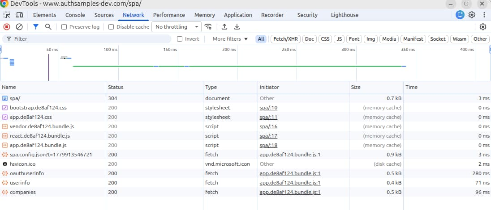

# How to Run the React SPA

Previously I provided a <a href='final-spa-overview.mdx'>Final SPA Overview</a> with the main high-level architecture behaviours. Next I show how to run the final SPA on a development computer in a couple of different configurations.

### Step 1: Download the GitHub Code

Clone the code sample's GitHub repository to your local computer with the following command:

```bash
git clone https://github.com/gary-archer/oauth.websample.final
```


### Step 2: View the Code Layout

The SPA code assets are separated into *src*, *build* and *tools* folders. The *build* folder contains rollup configuration for development and production builds. The *tools* folder runs Express as a development web server.

<div className='smallimage'>
    
</div>

The main *package.json* and *tsconfig.json* are centred on the SPA's behavior. The *build* and *tools* folders contain their own *package.json* and *tsconfig.json* files, to run small Node.js processes. For example, the *package.json* in the *build* folder contains rollup dependencies, which helps to reduce technical noise for the SPA.

```json
{
   "devDependencies": {
    "@rollup/plugin-commonjs": "^29.0.2",
    "@rollup/plugin-node-resolve": "^16.0.3",
    "@rollup/plugin-replace": "^6.0.3",
    "@rollup/plugin-terser": "^1.0.0",
    "@rollup/plugin-typescript": "^12.3.0",
    "@types/node": "^24.10.3",
    "open": "^11.0.0",
    "purgecss": "^7.0.2",
    "rollup": "^4.60.4",
    "rollup-plugin-copy": "^3.5.0",
    "tslib": "^2.8.1"
  }
}
```

Users of the React application drive behavior from strongly-typed views that use JSX syntax. Views have identical behaviour to those from this blog's <a href='basicspa-codingkeypoints.mdx'>Earlier SPA Code Samples</a>.

```jsx
export function TitleView(props: TitleViewProps): JSX.Element {

    return  (
        <div className='row'>
            <div className='col-8 my-auto'>
                <HeadingView />
            </div>
            {props.userInfo &&
                <div className='col-4 my-auto'>
                    <UserInfoView {...props.userInfo}/>
                </div>
            }
        </div>
    );
}
```

### Step 3: Configure DNS and SSL

You need to use this blog's web development domain to run the SPA as an OAuth client. To do so, add a local DNS entry in your hosts file, which exists at one of these locations:

| OS | Path |
| -- | ---- |
| Windows | c:\system32\drivers\etc\hosts |
| macOS / Linux | /etc/hosts |

Add the following entry to point the SPA's web origin to your local computer:

```markdown
127.0.0.1  localhost www.authsamples-dev.com
```

The web static content hosting uses SSL so you must create development certificates. Ensure that OpenSSL 3+ is installed and then run the following commands:

```bash
export SECRETS_FOLDER="$HOME/secrets"
mkdir "$SECRETS_FOLDER"
./certs/create.sh
```

You should then ensure that your browser trusts the root certificate at the below location, according to the <a href='developer-ssl-setup.mdx'>SSL Trust Configuration</a> post.

```markdown
certs/authsamples-dev.ca.crt
```

### Step 4: Build and Run the SPA

Open a terminal and run the following command from the root folder, to build and run the SPA's code for development:

```bash
./start.sh
```

The command uses the current terminal window to run two child processes. The first child process starts the Express HTTP server, which uses port 443 to serve static content and also to run a web socket server. When the rollup build completes, it writes bundles to the *dist* folder, then opens the default browser at *https://www.authsamples-dev.com*. The browser then downloads static content from the Express HTTP server, which serves content from the *dist* folder. 

```typescript
const server = spawn(
    'tsx',
    ['tools/developmentWebServer.ts'],
    {
        stdio: 'inherit',
        shell: process.platform === 'win32',
    }
);

const rollup = spawn(
    'rollup',
    ['--config', 'build/rollup.config.ts', '--watch'],
    {
        stdio: 'inherit',
        shell: process.platform === 'win32',
        env: {
            ...process.env,
            NODE_OPTIONS: '--import tsx',
        },
    }
);
```

Rollup runs in watch mode, and rebuilds bundles when code changes, to write updated files to the *dist* folder. It then calls the Express HTTP server's */reload* endpoint, which sends a web socket notification to the browser. The browser then runs code to reload itself, so that the SPA implements live reload during development.


These behaviors are trickier to implement in rollup than in webpack. The benefit is that rollup produces cleaner ECMAScript output. I continue to serve bundles in a technically equivalent manner for both development and release builds, as for earlier SPAs.

### Step 5: Sign In to the SPA

You will then be prompted to sign in, and can do so with this test credential:

- User: *guestuser@example.com*
- Password: *GuestPassword1*

After login, the SPA sends an HttpOnly encrypted cookie containing an AWS Cognito access token to the AWS API gateway. The OAuth Proxy decrypts the cookie and forwards the access token to lambda-based APIs. These API endpoints validate the access token and implement claims-based authorization. For authorized requests, the SPA receives and renders the API's response data:


### Step 6: View Secure Cookies

When the SPA makes API requests it sends a short-lived access token encrypted into an *HttpOnly SameSite=strict Secure* cookie. Since Cognito uses RS256 JWTs, the cookie size is around 1.5KB, which is comfortably below browser 4KB cookie size limits. You can use browser tools to view secure cookies, which are for the backend for frontend subdomain and not the web origin. The SPA does not require any cookies to download static content, and does not use cookies when the user performs navigation operations:


### Step 7: View Updated SPA Configuration

In earlier samples, the SPA performed its own OpenID Connect flow in JavaScript. This work is now done by remote token handler components, and the SPA configuration is therefore reduced primarily to a backend for frontend base URL:

```json
{
    "bffBaseUrl": "https://bff.authsamples-dev.com",
    "delegationIdClaimName": "origin_jti"
}
```

### Step 8: Run a Release Build

You can run some scripts to test a release deployment. The *build.sh* script produces JavaScript release bundles ready for deployment to a CDN. The *deploy.sh* script runs a Docker container that uses Express to serve minimized static content. The *teardown.sh* script stops the Docker container.

```bash
./deployment/docker/build.sh
./deployment/docker/deploy.sh
./deployment/docker/teardown.sh
```

After running the *build.sh* and *deploy.sh* scripts, browse to *https://www.authsamples-dev.com/spa/* and test a release deployment of the SPA. Release builds use web resource optimizations, like minification, compression and browser caching, but otherwise integrate with the browser using the same technical mechanisms as development builds.



### Local API Setup

Web developers only need to work on a single component, the SPA, and that is the preferred development setup. If required, you can also connect the SPA to an API on the local computer, though you then need to manage cookies for this routing. One way to do so is to run a local token handler. To do so, first ensure that a docker engine is installed, and also the *envsubst* tool.

### Step A: Run the API

Select one of this blog's final APIs from the below list, and follow its instructions, to run the API on port 446:

- <a href='api-architecture-node.mdx'>Node.js API</a>
- <a href='net-core-code-sample-overview.mdx'>.NET API</a>
- <a href='java-spring-boot-api-overview.mdx'>Java Spring Boot API</a>

### Step B: Update DNS

Next, add the API subdomain and local backend for frontend domain to your computer's hosts file:

```markdown
127.0.0.1  localhost www.authsamples-dev.com api.authsamples-dev.com bfflocal.authsamples-dev.com
```

### Step C: Run the SPA against a Local API

To make the SPA connect to one of this blog's final APIs, first ensure that the API is running. Then use a *LOCALAPI* parameter when running the scripts described earlier:

```bash
export SECRETS_FOLDER="$HOME/secrets"
export LOCALAPI=true
./start.sh
```

This runs some utility token handler components in a small docker compose network. You can study the deployment resources to get a feel for how this works. The SPA's configuration then routes to the API via the local backend for frontend rather than the cloud BFF:

```json
{
    "bffBaseUrl": "https://bfflocal.authsamples-dev.com:444",
    "delegationIdClaimName": "origin_jti"
}
```

### Step D: Use the SPA and API

When you now use the SPA it calls the local API rather than a cloud API. The API behaviour includes logging output that is explained in later posts, under this blog's API theme.


### Step E: Free Docker Resources

To free resources in the docker compose network, run the following command:

```bash
./teardown.sh
```

### Where Are We?

I explained how to run the final SPA code sample, which has more moving parts than earlier code samples. The SPA can be run as a single component under development with a pure SPA developer experience. The app is in control of its own OpenID Connect flow. After user logins, the SPA calls deployed API components using secure cookies.

### Next

- Next I explain some <a href='reactjs-codingkeypoints.mdx'>Final SPA Code Details</a>.
- For a list of all blog posts see the <a href='index.mdx'>Index Page</a>.
