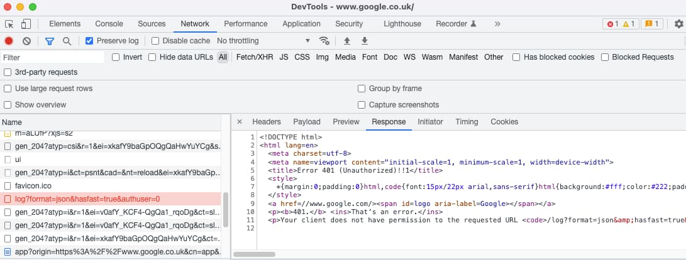
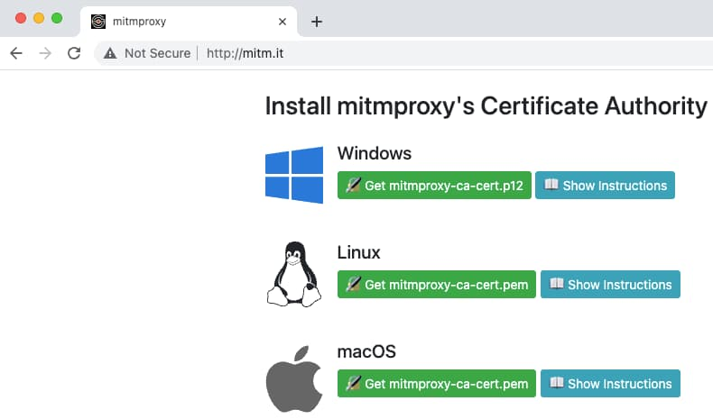
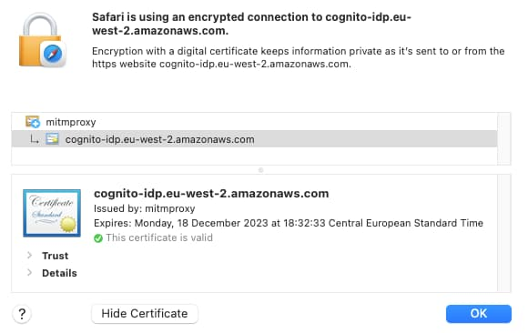
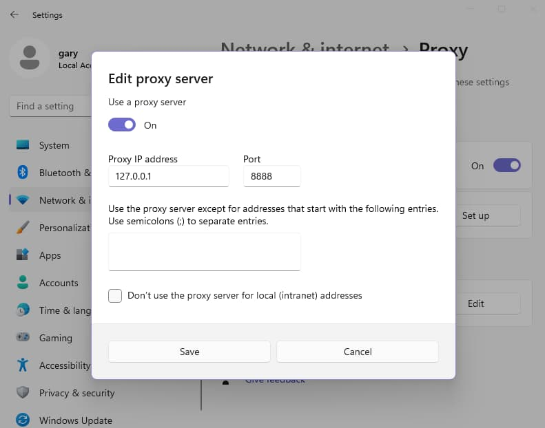
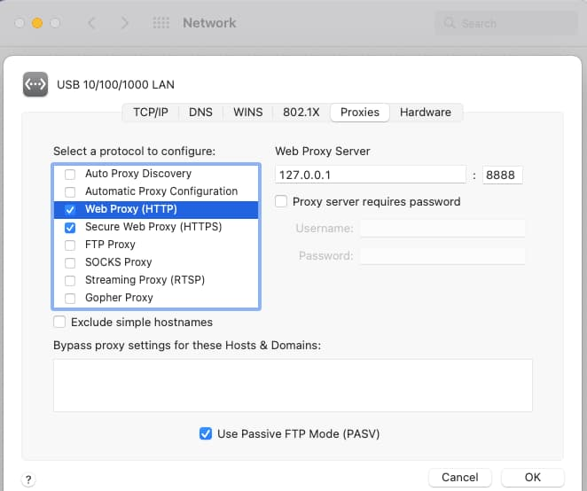
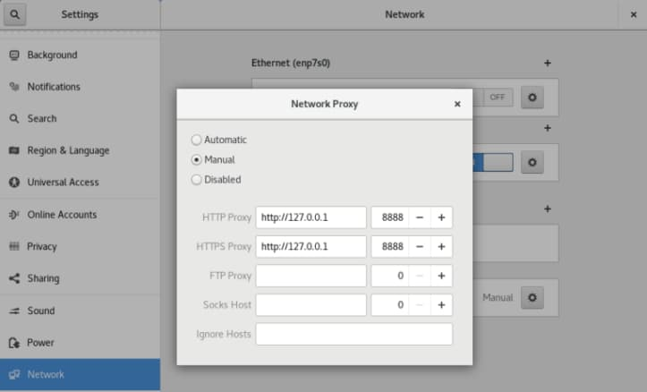
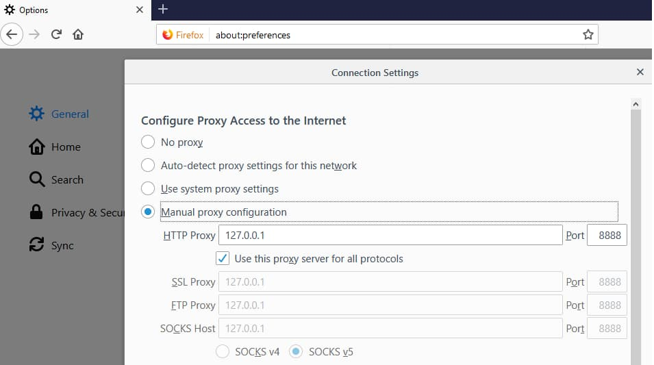
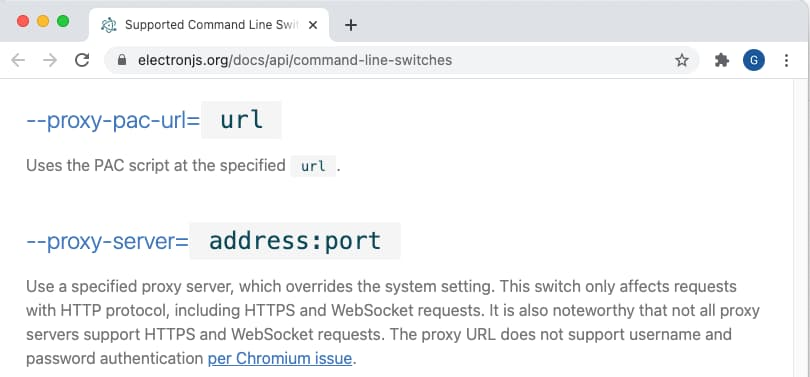

# HTTP Proxy Setup

Previously I explained this blog's <a href='web-technology-setup.mdx'>Web Technology Setup</a> for modern frontend development. Next I show how developers can visualize OAuth-related request and response messages.

### Productive Troubleshooting

To understand or troubleshoot OAuth requests, you look at the requests sent and the responses returned. The requests are often issued by a security library rather than your own code. To intercept requests I place an *HTTP Forward Proxy* in front of application components.

### Using Browser Tools

For simple use cases you can use your browser's network trace to view requests and responses:



Yet browser tools only capture a subset of the traffic you care about. They do not capture requests from non-browser components and limit you to a single browser tab. During navigation and window changes, such as when you dismiss a popup or iframe, you may lose the traffic or the browser tools may hide the response payload.

### Using an HTTP Forward Proxy

A more powerful option during development is to use an HTTP proxy tool. I therefore explain how to use the open source and cross platform *mitmproxy* tool.
By default, you can follow the [installation guides](https://docs.mitmproxy.org/stable/overview-installation/), to use the package manager for your operating system, on either Linux, Windows or macOS. You can then run the proxy, and specify a *listen port* and a *web port*.

```bash
sudo mitmweb -p 8888 --web-port 8889 --ssl-insecure
```

I use the *–ssl-insecure* option when upstream components use my own OpenSSL generated certificates. When the proxy runs you can browse to the web interface at *http://127.0.0.1:8889*, which renders traffic from both browser and non-browser components:


After running the above command, you must configure the operating system to use an HTTP proxy, with *host=127.0.0.1* and *port=8888*. A little later in this post I provide screenshots to show how to do so on Windows, macOS and Linux computers.

Next, browse to http://mitm.it and follow the instructions so that your browser trusts the HTTP proxy’s root certificate authority. You can then capture OAuth and API requests, including those sent from this blog’s code samples:



You can then browse to internet sites and capture traffic. For this blog's components, I set a filter expression of *~d authsamples|cognito* to limit the rendered traffic to those for this blog's domain names.


The initial code sample uses HTTP so has to use *localhost* URLs, due to behaviours specific to AWS Cognito and the oidc-client-ts library. Yet proxy tools typically do not capture *localhost* requests. Although you may be able to get a capture working, the most productive option is to use HTTPS URLs with real-world domain names. I use this approach for all subsequent code samples.

### Automated Setup

I use my own wrapper scripts with *mitmproxy*, so that I can consolidate usage across multiple platforms into a single place. You can clone the repo with this command:

```bash
git clone https://github.com/gary-archer/oauth.httpproxy
```

When I want to run the HTTP proxy, I execute the *start.sh* script. If required, the script installs *mitmproxy* using the following actions:

- Download binaries to a local folder and unpack them.
- Run a command to trust the *mitmproxy* root certificate.

The script then performs the following actions:

- Run the *mitmweb* process in the default browser.
- Prompt the user to activate *mitmproxy* as the system proxy.

My automation runs the following command and includes a small Python script:

```bash
./mitmweb -p 8888 --web-port 8889 --ssl-insecure --script init.py
```

The script sets a view filter to this blog's domains, which you can clear with mitmweb's *Edit Options* dialog:

```python
from mitmproxy import ctx

def load(loader):
    ctx.options.view_filter = "~d authsamples|cognito"
```

Next, I perform any environment specific configuration, explained in the following sections. I then debug HTTP/S messages for the components of interest. Finally, when I finish debugging, I run the *stop.sh* script to free resources.

### Debug the Initial SPA and API

First, edit the API configuration for this blog’s <a href='basicspa-execution.mdx'>initial SPA and API code sample</a> and set *useProxy=true*:

```json
{
    "api": {
        "port": 80,
        "trustedOrigins": [
            "http://localhost"
        ],
        "useProxy": true,
        "proxyUrl": "http://127.0.0.1:8888"
    },
    "oauth": {
        "jwksEndpoint": "https://cognito-idp.eu-west-2.amazonaws.com/eu-west-2_CuhLeqiE9/.well-known/jwks.json",
        "algorithm":    "RS256",
        "issuer":       "https://cognito-idp.eu-west-2.amazonaws.com/eu-west-2_CuhLeqiE9",
        "audience":     ""
    }
}
```

Then run the code sample with the following commands so that mitmproxy captures outgoing OAuth requests from the API. Setting *NODE_TLS_REJECT_UNAUTHORIZED* is a quick way to get the sample’s Node.js API to trust the proxy root certificate. I cover SSL trust in the next post.

```bash
export NODE_TLS_REJECT_UNAUTHORIZED=0
git clone https://github.com/gary-archer/oauth.websample1
cd oauth.websample1
./start.sh
```

After you authenticate in the SPA you see the following request from the API’s JWT library to the authorization server's JWKS URI, to download token signing public keys:


### HTTP Proxying Mechanics

The [mitmproxy docs](https://docs.mitmproxy.org/stable/concepts-howmitmproxyworks/) provide a great explanation of how HTTP proxying works. The application’s HTTP client is instructed to route via the proxy, which can chain to an existing HTTP proxy when applicable, such as those often used by corporate networks.

The proxy also performs manipulation of HTTPS traffic, by re-encrypting outgoing client traffic using its's own SSL certificate. Consider the following JWKS URI, which uses an Amazon root certificate:

- [https://cognito-idp.eu-west-2.amazonaws.com/eu-west-2_CuhLeqiE9/.well-known/jwks.json](https://cognito-idp.eu-west-2.amazonaws.com/eu-west-2_CuhLeqiE9/.well-known/jwks.json)

When the HTTP proxy is used, a browser indicates that *mitmproxy* is the issuer of the SSL certificate:



### Proxy Configuration

The tricky part of using an HTTPS proxy is knowing how to configure it across different tools and technologies, which can include all of these clients:

- Chrome / Safari Browsers
- Edge Browser
- Firefox Browser
- Electron Desktop Apps
- Node.js APIs
- .NET APIs
- Java APIs
- Kotlin Android Apps
- Swift iOS Apps
- Command Line Tools

I also explain how to configure an HTTP proxy for all of the following operating systems:

- Windows
- macOS
- Linux
- Android
- iOS

### System Proxy Configuration

On Windows computers, you configure the system proxy under *Settings / Network and Internet / Proxy/ Manual Proxy Setup*:



On macOS, the system proxy is located at *System Preferences / Network / Advanced / Proxies*:



On Linux, run the network tool for the operating system and configure equivalent settings:



### Browser Proxy Settings

Browsers usually inherit the system proxy settings, though command line overrides may exist, such as Chrome’s [–proxy-server option](https://www.linuxbabe.com/desktop-linux/configure-proxy-chromium-google-chrome-command-line). Firefox does not inherit the system settings, and instead you must set proxy details explicitly, under *Options / Network Settings*:



### Proxy Settings for Node.js APIs

In Node.js, this blog's APIs use a small [proxy-agent library](https://github.com/TooTallNate/proxy-agents). HTTP libraries such as [axios](https://github.com/axios/axios) allow you to configure an *httpAgent* or *httpsAgent* property and you use the option that corresponds to the scheme of the target URL. When connecting to HTTPS URLs I assign the value of the agent property from the following utility class:

```typescript
import HttpsProxyAgent from 'https-proxy-agent';

export class HttpProxy {

    private readonly _agent: any;

    public constructor(useProxy: boolean, proxyUrl: string) {

        if (useProxy) {
            this._agent = HttpsProxyAgent(proxyUrl);
        }
    }

    public get agent(): any {
        return this._agent;
    }
}
```

### Proxy Settings for .NET APIs

In later posts I provide an <a href='net-core-code-sample-overview.mdx'>OAuth Secured .NET API</a>. Outbound calls use a custom *HttpClientHandler* to support HTTP proxy integration:

```csharp
public sealed class HttpProxy
{
    private readonly bool isEnabled;
    private readonly string url;

    public HttpProxy(bool enabled, string proxyUrl)
    {
        this.isEnabled = enabled;
        this.url = proxyUrl;
    }

    public HttpClientHandler GetHandler()
    {
        var handler = new HttpClientHandler();
        if (this.isEnabled)
        {
            handler.Proxy = new WebProxy(this.url);
        }

        return handler;
    }
}
```

The .NET code then wires up the custom handler to the *HttpClient* class that sends HTTP/S requests:

```csharp
public async Task<IEnumerable<Claim>> GetUserInfoAsync(string accessToken)
{
    try
    {
        using (var client = new HttpClient(this.httpProxy.GetHandler()))
        {
            client.DefaultRequestHeaders.Accept.Add(new MediaTypeWithQualityHeaderValue("application/json"));
            var request = new HttpRequestMessage(HttpMethod.Get, this.configuration.ClaimsCache.UserInfoEndpoint);
            request.Headers.Authorization = new AuthenticationHeaderValue("Bearer", accessToken);
            var response = await client.SendAsync(request);

            if (!response.IsSuccessStatusCode)
            {
                var status = (int)response.StatusCode;
                var text = await response.Content.ReadAsStringAsync();
                throw ErrorUtils.FromUserInfoError(status, text, this.configuration.ClaimsCache.UserInfoEndpoint);
            }

            return ClaimsReader.UserInfoClaims(json);
        }
    }
    catch (Exception ex)
    {
        throw ErrorUtils.FromUserInfoError(ex, this.configuration.ClaimsCache.UserInfoEndpoint);
    }
}
```

### Proxy Settings for Java APIs

In later posts I provide an <a href='java-spring-boot-api-overview.mdx'>OAuth Secured Java API</a>. You can activate the proxy with standard system properties at startup, based on the API’s configuration settings. For HTTP URLs the properties use an *http* prefix, and for HTTPS URLs they use an *https* prefix:

```java
private void configureHttpDebugging(final ApiConfiguration configuration) {

    if (configuration.isUseProxy()) {
        try {

            var url = new URL(configuration.getProxyUrl());
            System.setProperty("https.proxyHost", url.getHost());
            System.setProperty("https.proxyPort", String.valueOf(url.getPort()));

        } catch (MalformedURLException ex) {

            var message = String.format("Unable to parse proxy URL %s", configuration.getProxyUrl());
            throw new IllegalStateException(message, ex);
        }
    }
}
```

### Proxy Settings for Electron Desktop Apps

In later posts I use [Electron](https://electronjs.org/) to develop <a href='desktop-apps-overview.mdx'>OAuth-Secured Cross Platform Desktop Apps</a>, where there are two code areas:

| Area | Proxy Behaviour |
| ---- | --------------- |
| Main Process | The main process follows Node.js rules if it needs to make outgoing connections. |
| Renderer Process | Uses the Chromium Browser, which by default inherits proxy settings from the system proxy. |

It is also possible to override the system proxy settings via [Electron Command Line Overrides](https://www.electronjs.org/docs/api/command-line-switches):



### Command Line Tools

I commonly use the *curl* and *openssl* tools, on Windows, macOS and Linux operating systems, to make HTTP/S requests. These command line tools look for one or both of the below environment variables, depending on the scheme of the target URL:

| Environment Variable | Used For |
| -------------------- | -------- |
| http_proxy | Browsing to HTTP URLs |
| https_proxy | Browsing to HTTPS URLs |

To use curl to connect to an HTTP URL I use commands of this form to capture traffic in an HTTP proxy:

```bash
export http_proxy=http://127.0.0.1:8888
curl -H "Authorization Bearer xxx" http://api.authsamples-dev.com/api/companies
```

To use OpenSSL to connect to an HTTPS URL I use commands of this form to capture traffic in an HTTP proxy:

```bash
export https_proxy=http://127.0.0.1:8888
openssl s_client -connect api.authsamples-dev.com:443
```

### Proxy Settings for iOS and Android

Use of HTTP proxy tools for mobile apps is more intricate, involving quirks of both simulators and devices. I explain the techniques that I use in these later posts:

- <a href='android-https-debugging.mdx'>Android HTTPS Debugging</a>
- <a href='ios-https-debugging.mdx'>iOS HTTPS Debugging</a>

### Advanced Features

An HTTP proxy tool also enables you to [modify in-flight OAuth requests and responses](https://docs.mitmproxy.org/stable/mitmproxytutorial-modifyrequests/), sometimes called *setting a breakpoint*. You do so by typing a filter expression into the *intercept* window.

In the following screenshot I use the expression *~u /token*, for a request from the SPA to the authorization server's token endpoint. I then altered the client ID and submitted the request, to simulate a misconfigured client:


This type of technique can be used to verify that your OAuth client processes OAuth *error* and *error_description* fields correctly. The sample SPA renders these details in a way that helps to enable fast problem resolution:


### Where Are We?

I showed how to use an HTTP proxy tool to capture HTTP/S messages from clients and APIs, regardless of technology. This provides good troubleshooting options during development and also promotes a solid understanding of the OAuth standards-based messages.

### Next

- I explain how to manage <a href='developer-ssl-setup.mdx'>SSL Trust Configuration</a> during development.
- For a list of all blog posts see the <a href='index.mdx'>Index Page</a>.
