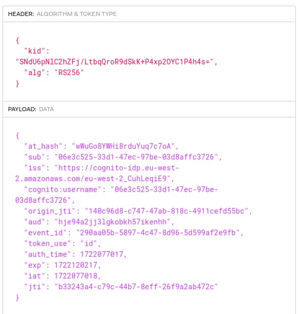

# ID Tokens

Previously I explained some <a href='logout.mdx'>Logout</a> behaviours. I finish the discussion on SPA session management by describing the role of ID tokens, which are designed to be read by clients rather than APIs.

### ID Token Role

Before OpenID Connect, SAML was often used to secure websites. After user authentication, the website received a cryptographically signed SAML assertion to represent proof of the authentication event, and to provide the authentication method(s) and authentication time. An ID token has a similar role to a SAML assertion.

### Example ID Token

This blog’s code samples use AWS Cognito as their default authorization server and use ID tokens that contain the following fields:

### Receiving ID Tokens

An earlier post explained some <a href='basicspa-oauthworkflow.mdx'>Initial OAuth Messages</a>. Clients receive an authorization code in a front channel browser response, then send in a back channel HTTPS POST to the token endpoint of the authorization server, to swap the code for tokens.

In 2021 it is recommended to avoid receiving ID tokens in browser responses, and receive all tokens on the back channel, in the authorization code grant response. You ensure this when you run an authorization code flow with *response_type=code*.

### ID Token v Access Token v Refresh Token

A SAML website would validate the assertion and then start a cookie-based application session. You can use an ID token in the same way. In OAuth and OpenID Connect though, the client also receive other tokens. The app no longer invents its own backend credential. Instead an access token contains business permissions and is sent to APIs. The refresh token represents the user session time for API requests.

|   | ID Token | Access Token | Refresh Token |
| - | -------- | ------------ | ------------- |
| Used At | Client | API | Authorization Server |
| Used For | Proof of Authentication | API Message Credential | Access Token Renewal |
| Lifetime | Expiry Not Used | Short Expiry | Long Expiry |
| Silently Renewable | No | Yes | Yes |

You must not use the ID token as an API message credential. An ID token does not contain business permissions, which you express in access tokens using scopes and claims, and which APIs use to implement their business authorization.

### ID Tokens and Privacy

OpenID Connect mandates that ID tokens have the JWT format, since they must be readable by frontend code. It is possible to include personal details such as *name* and *email* in ID tokens. I consider it safer and more correct to avoid personal data in ID tokens, which then sits around for the entire authenticated user session, so that there is more risk of leaking sensitive data.

For example, ID tokens are sometimes sent on the front-channel in logout redirects. Personal data might then end up in the browser history or server logs. Therefore, this blog's code samples instead download personal data from the OpenID Connect userinfo endpoint.

### Using ID Tokens

When ID tokens contain only proof of the authentication event, they are rarely used by applications, and of far less significance than access tokens. This blog’s frontend code samples receive an ID token and then ignore it. It is a best practice to receive an ID token however, and let your app’s security library validate it.

One of the main ways to use an ID token, is to take greater control over subsequent authorization code flows. One example is to read the *max_age* claim from the ID token, then send the *prompt=login* OpenID Connect parameter if a certain time period has passed, to force a new login.

### Where Are We?

I summarised a few points about ID tokens, which provide verifiable proof of the authentication event to clients. All modern secured frontends should receive an ID token as part of using up-to-date security.

### Next

- I explain this blog's <a href='improved-spa-code-sample-overview.mdx'>Updated SPA and API Code Sample</a>.
- For a list of all blog posts see the <a href='index.mdx'>Index Page</a>.
