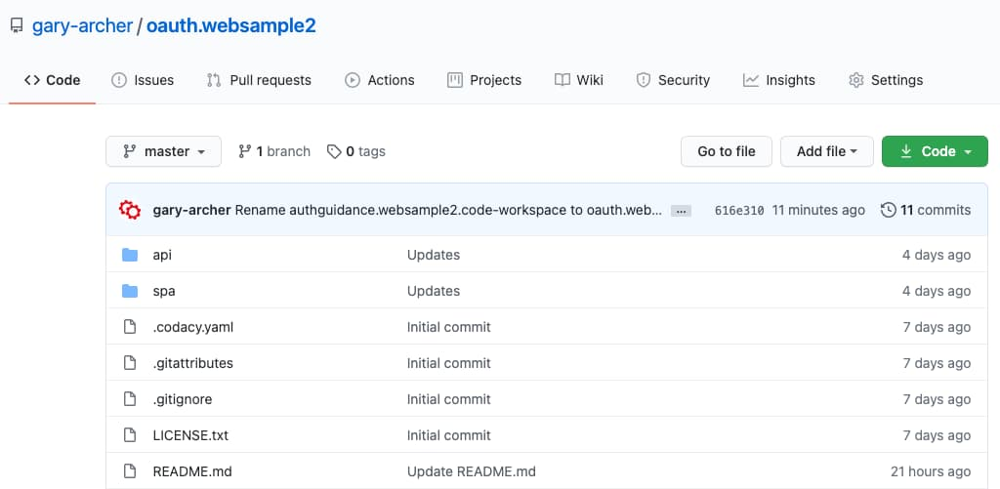
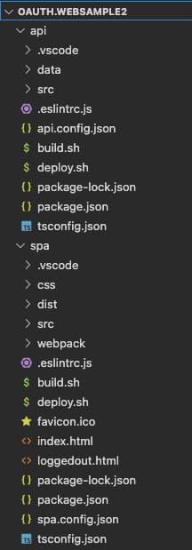
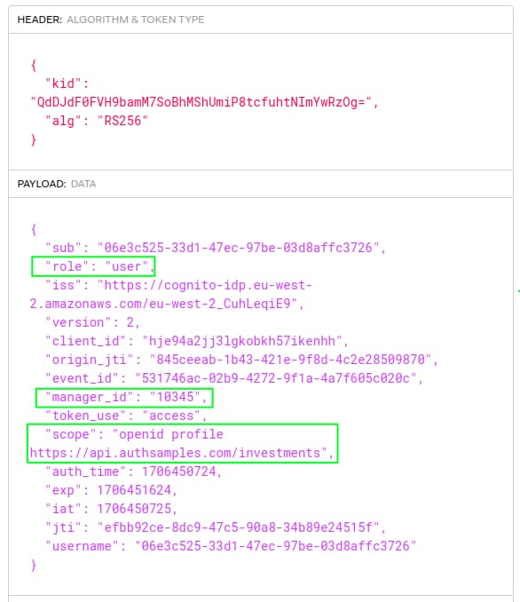
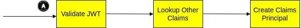

# Updated SPA and API - Overview

Previously I summarised the use of <a href='id-tokens.mdx'>ID Tokens</a> in applications. Next I explain how to complete the initial SPA and API code sample, to add the main frontend session behaviours and to add claims-based authorization to the API.

### New Features

The updated SPA and API code sample has the following additional behaviours, to implement the OpenID Connect features that the SPA needs to run a complete application lifecycle:

| Feature | Description |
| ------- | ----------- |
| Claims Based Authorization | The API provides a more complete and future-proof claims-based authorization solution. |
| In-Memory Token Storage | The SPA now stores OAuth tokens only in-memory, to improve the browser security a little. |
| Silent Token Renewal | The SPA now supports silent access token renewal using the SSO cookie. |
| Multi Tab Browsing | The token renewal solution should enable multi tab-browsing without noticeable user impact. |
| Logout | The SPA implements a basic form of logout, including logout across multiple browser tabs. |
| Real-World URLs | Both the SPA and API run on a development computer using real-world HTTPS URLs. |

### SPAs in 2021

This example SPA uses the traditional SPA solution, with a JavaScript OpenID Connect implementation. It is now considered more secure for your production apps to instead use a <a href='spa-back-end-for-front-end.mdx'>Backend for Frontend</a> approach. Before this blog integrates a BFF it explains the traditional SPA flow and the web development and deployment benefits it enables.

### Step 1. Code Download

Clone the code sample's GitHub repository with the following command:

```bash
git clone https://github.com/gary-archer/oauth.websample2
```



### Step 2. View the Code Layout

The SPA uses the same components as the initial code sample, with SPA code that runs in the browser and an API backend.

<div className='smallimage'>
    
</div>

### Step 3. View Updated Configuration

The SPA now uses more complete OAuth settings, to request a custom *investments* scope:

```json
{
    "app": {
        "apiBaseUrl":             "https://api.authsamples-dev.com:446/api"
    },
    "oauth": {
        "provider":               "cognito",
        "authority":              "https://cognito-idp.eu-west-2.amazonaws.com/eu-west-2_CuhLeqiE9",
        "clientId":               "hje94a2jj3lgkobkh57ikenhh",
        "redirectUri":            "https://www.authsamples-dev.com/spa/",
        "postLogoutRedirectUri":  "https://www.authsamples-dev.com/spa/loggedout",
        "scope":                  "openid profile email https://api.authsamples.com/api/investments",
        "customLogoutEndpoint":   "https://login.authsamples.com/logout"
    }
}
```

The API configuration is also updated, to require the *investments* scope:

```json
{
    "api": {
        "port": 446,
        "sslCertificateFileName": "../certs/authsamples-dev.ssl.p12",
        "sslCertificatePassword": "Password1",
        "trustedOrigins": [
            "https://www.authsamples-dev.com"
        ],
        "useProxy": false,
        "proxyUrl": "http://127.0.0.1:8888"
    },
    "oauth": {
        "jwksEndpoint":                  "https://cognito-idp.eu-west-2.amazonaws.com/eu-west-2_CuhLeqiE9/.well-known/jwks.json",
        "userInfoEndpoint":              "https://login.authsamples.com/oauth2/userInfo",
        "issuer":                        "https://cognito-idp.eu-west-2.amazonaws.com/eu-west-2_CuhLeqiE9",
        "audience":                      "",
        "algorithm":                     "RS256",
        "scope":                         "https://api.authsamples.com/investments",
        "claimsCacheTimeToLiveMinutes":  15
    }
}
```

### Step 4. Configure DNS and SSL

Update the hosts file on your computer to include this blog's local development domains, described in the earlier <a href='oauth-infrastructure-setup.mdx'>OAuth Infrastructure Setup</a> post:

```markdown
127.0.0.1 www.authsamples-dev.com api.authsamples-dev.com
```

The API and web static content hosting use SSL so you must create development certificates. Ensure that OpenSSL 3+ is installed and then run the following commands:

```bash
export SECRETS_FOLDER="$HOME/secrets"
mkdir "$SECRETS_FOLDER"
./certs/create.sh
```

Then ensure that your browser trusts the root certificate at the following location, as explained in the <a href='developer-ssl-setup.mdx'>SSL Trust Configuration</a> post.

```markdown
certs/authsamples-dev.ca.crt
```

### Step 5. Build and Run the SPA and API

Next, run the following script, to build the code and run the API at *https://api.authsamples-dev.com:446/api*. The SPA then continues to runs at *https://www.authsamples-dev.com/spa*.

```bash
./start.sh
```

The SPA terminal window builds JavaScript bundles and serves them using the webpack development server on port 443:


The API terminal window listens for requests from the SPA on port 446:


### Step 6. Test Logins with Multiple User Accounts

Continue to use the following AWS Cognito test account to sign in to the SPA:

- User = *guestuser@example.com*
- Password = *GuestPassword1*

You can also use a second test account with higher privileges, to see additional API data in the SPA:

- User = *guestadmin`@`example.com*
- Password = *GuestPassword1*

The updated SPA shows different data depending on the user since the API now applies claims-based authorization.

### Step 7. View Updated Access Tokens

After a login the SPA receives the following access token. This now contains an *investments* scope and custom claims for *manager_id* and *role*. The API uses these values for its authorization:



For details on how the authorization server issues these scopes and claims see the <a href='managed-authorization-server-setup.mdx'>Cloud Authorization Server Setup</a> blog post.

### Step 8. API uses Claims Based Authorization

The API's OAuth processing reads the token claims and also looks up extra values that it needs to implement its authorization. I provide further details on my design choices in the <a href='api-authorization-design.mdx'>API Authorization Behaviour</a> blog post.



The API serves hard coded JSON data, representing multiple regions:

```json
[
    {
        "id":               1,
        "name":             "Company 1",
        "region":           "Europe",
        "targetUsd":        20000000,
        "investmentUsd":    13801299,
        "noInvestors":      2310
    },
    {
        "id":               2,
        "name":             "Company 2",
        "region":           "USA",
        "targetUsd":        35000000,
        "investmentUsd":    41251365,
        "noInvestors":      3951
    }
]
```

Each user has access to data from an array of regions, and the default guest user only has access to the US region, so I cannot see items 1 and 3. Therefore the API filters those values from the results it returns to the SPA:


In the transactions view, if the user tries to access company 3 data by editing the browser URL, the SPA triggers an API request for an unauthorized resource. The API denies access and returns a 404 response with a *company_not_found* error code.


The SPA handles this *Not Found For User* API error code specially and redirects to the home page, to avoid displaying a user error.

### Step 9. SPA Downloads User Info

As for the first code sample, the SPA continues to get name details for display from the OpenID Connect userinfo endpoint:

```json
{
    "sub": "06e3c525-33d1-47ec-97be-03d8affc3726",
    "custom:manager_id": "10345",
    "email_verified": "true",
    "given_name": "Guest",
    "family_name": "User",
    "custom:role": "user",
    "email": "guestuser@example.com",
    "username": "06e3c525-33d1-47ec-97be-03d8affc3726"
}
```

The SPA also calls a user info endpoint in its own API to get secondary user attributes, which are not stored in the identity data:

```json
{
    "title":"Regional Manager",
    "regions":["USA"]
}
```

The secondary user data is then rendered in a basic tooltip:


### Step 10. Test Token Renewal

The SPA attempts to refresh in-memory access tokens silently when they expire. You can simulated this if you click *Expire Token* then *Reload Data*:


Since the SPA stores tokens in-memory, the same renewal occurs if you refresh the browser page or the user performs multi-tab browsing using one of the *View Transactions* links to open a new browser window. The following actions should then take place:

- The SPA receives a 401 response from the API.
- The SPA triggers a silent iframe token renewal redirect using the SSO cookie.
- The SPA receives a new access token without any user impact.
- The SPA retries the API call with the new access token.

### Step 11. View Token Renewal OAuth Requests

The updated code sample implements the traditional SPA token renewal flow, where the SPA attempts to send the SSO cookie to get a new access token, using the *prompt=none* query parameter:


Although the SPA's code implements the renewal flow correctly, every iframe token renewal fails, since AWS Cognito cookies do not support this flow. The user experiences an OpenID Connect redirect whenever the access token expires or the user refreshes the page. With third-party cookie deprecation, that is the expected future behavior, and I say more about it in the <a href='user-sessions-and-token-renewal.mdx'>Iframe Access Token Renewal</a> post.

### 12. Logout

The SPA also implements logout functionality. The SPA removes its own tokens, then redirects to the authorization server sending the SSO cookie. The authorization server expires the SSO cookie to end the user's session, then redirects the browser back to its *Post Logout Redirect URI*, which renders the following view:


A boolean flag is also stored in session storage after logout. Other tabs use the browser's storage events to listen for this value being set, then remove tokens from memory and move to the logged out page:


### Where Are We?

I have added missing features to the SPA and API behaviour, to improve SPA session management and to enable the API to authorize requests correctly. Overall security and token renewal still have some issues, which I resolve later, in the <a href='final-spa-overview.mdx'>Final SPA</a>.

### Next

- I explain some <a href='updated-spa-coding-key-points.mdx'>Updated SPA Code Details</a>.
- For a list of all blog posts see the <a href='index.mdx'>Index Page</a>.
