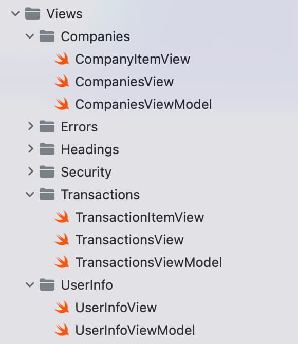
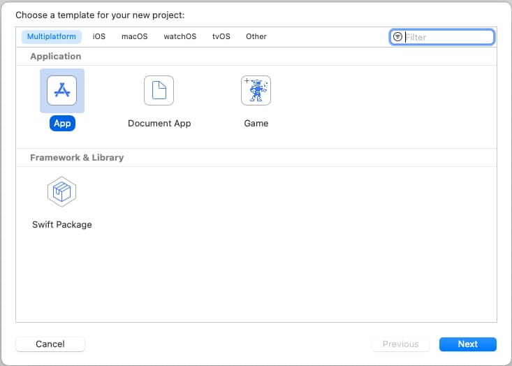

# iOS Code Sample – Code Details

Previously we described our <a href='ios-code-sample-infrastructure.mdx'>iOS Infrastructure Setup</a> and we will now look at some key areas of our sample’s code. See also the <a href='api-journey-client-side.mdx'>Client Side API Journey</a> to understand the background and the requirements being met.

### Portable Code

One of this blog’s coding goals is to use the same classes across multiple platforms. Our iOS App uses the same logical separation of responsibilities into classes as the earlier <a href='reactjs-codingkeypoints.mdx'>React SPA</a>:

<div className='smallimage'>
    
</div>

### Unobtrusive OAuth Integration

The view and view model classes below call our OAuth-secured API, and need to deal with *triggering login redirects* and *refreshing access tokens*. This can also involve concurrency, which we will explore shortly.

<div className='smallimage'>
    
</div>

Companies will want to complete the tricky plumbing code once, then focus on business value, by growing the UI and API code.

### Project Creation

The project was initially created via the below app template, after which I began developing SwiftUI Views that use Swift classes.



### App Entry Point

Our application entry point begins with the *SampleApp* class, which creates the main *AppView* along with view model objects and some environment objects that are shared among views:

```swift
import Foundation
import SwiftUI

@main
struct SampleApp: App {

    private let model: AppViewModel
    private let eventBus: EventBus
    private let orientationHandler: OrientationHandler
    private let viewRouter: ViewRouter

    init() {

        self.eventBus = EventBus()
        self.orientationHandler = OrientationHandler()

        self.model = AppViewModel(eventBus: self.eventBus)
        self.viewRouter = ViewRouter(eventBus: self.eventBus)
    }

    var body: some Scene {

        WindowGroup {
            AppView(model: self.model, viewRouter: self.viewRouter)
                .environmentObject(self.orientationHandler)
                .environmentObject(self.eventBus)
                .onOpenURL(perform: { url in

                    if self.authenticator.isOAuthResponse(responseUrl: url) {

                        self.model.resumeOAuthResponse(url: url)

                    } else {

                        self.viewRouter.handleDeepLink(url: url)
                    }
                })
                .onReceive(NotificationCenter.default.publisher(for: UIDevice.orientationDidChangeNotification)) { _ in

                    self.orientationHandler.isLandscape = UIDevice.current.orientation.isLandscape
                }
        }
    }
}
```

The *AppView* source file renders a tree of views in a similar manner to the SPA’s application view:

```swift
var body: some View {

    return VStack {

        TitleView(userInfoViewModel: self.model.getUserInfoViewModel())

        HeaderButtonsView(
            onHome: self.onHome,
            onReloadData: self.onReloadData,
            onExpireAccessToken: self.model.onExpireAccessToken,
            onExpireRefreshToken: self.model.onExpireRefreshToken,
            onLogout: self.onLogout)

        if self.model.error != nil {
            ErrorSummaryView(
            error: self.model.error!,
            hyperlinkText: "Application Problem Encountered",
            dialogTitle: "Application Error",
            padding: EdgeInsets(top: 0, leading: 0, bottom: 10, trailing: 0))
        }

        SessionView(sessionId: self.model.getSessionId())

        MainView(
            viewRouter: self.viewRouter,
            companiesViewModel: self.model.getCompaniesViewModel(),
            transactionsViewModel: self.model.getTransactionsViewModel(),
            isDeviceSecured: self.model.isDeviceSecured)

        Spacer()
    }
    .onAppear(perform: self.model.initialize)
    .onReceive(self.eventBus.loginRequiredTopic, perform: {_ in
        self.onLoginRequired()
    })
```

Views can be recreated at any time, whereas the *AppViewModel* is only created once. When it is constructed it reads settings from the JSON configuration file embedded in the app, then creates global objects used for OAuth and API operations:

```swift
init(eventBus: EventBus) {

    self.fetchCache = FetchCache()
    self.eventBus = eventBus

    self.configuration = try! ConfigurationLoader.load()
    self.authenticator = AuthenticatorImpl(configuration: self.configuration.oauth)
    self.fetchClient = try! FetchClient(configuration: self.configuration, fetchCache: self.fetchCache, authenticator: self.authenticator)
    self.viewModelCoordinator = ViewModelCoordinator(eventBus: eventBus, fetchCache: self.fetchCache, authenticator: self.authenticator)

    self.isLoaded = false
    self.isDeviceSecured = DeviceSecurity.isDeviceSecured()
    self.error = nil
}
```

### View Layout and Composition

The *MainView* is swapped out as the user navigates, in a similar way to the main area of an SPA:

```swift
var body: some View {

    return VStack {

        if self.viewRouter.currentViewType == BlankView.Type.self {

            BlankView()
                
        } else if !self.isDeviceSecured {

            DeviceNotSecuredView()

        } else if self.viewRouter.currentViewType == TransactionsView.Type.self {

            TransactionsView(model: self.transactionsViewModel, viewRouter: self.viewRouter)

        } else if self.viewRouter.currentViewType == LoginRequiredView.Type.self {

            LoginRequiredView()

        } else {

            CompaniesView(model: self.companiesViewModel, viewRouter: self.viewRouter)
        }
    }
}
```

Each main view is composed of smaller views, so for example the *CompaniesView* renders a collection of *CompanyItemView* child elements:

```swift
var body: some View {

    let deviceWidth = UIScreen.main.bounds.size.width
    return VStack {

        Text("Company List")
            .font(.headline)
            .frame(width: deviceWidth)
            .padding()
            .background(Colors.lightBlue)

        if self.model.error != nil {
            ErrorSummaryView(
                error: self.model.error!,
                hyperlinkText: "Problem Encountered in Companies View",
                dialogTitle: "Companies View Error",
                padding: EdgeInsets(top: 10, leading: 0, bottom: 0, trailing: 0))
        }

        if self.model.companies.count > 0 {
            List(self.model.companies, id: \.id) { item in
                CompanyItemView(viewRouter: self.viewRouter, company: item)
            }
            .listStyle(.plain)
        }
    }
    .onAppear(perform: self.initialLoad)
    .onReceive(self.eventBus.reloadDataTopic, perform: {data in
        self.handleReloadData(event: data)
    })
}
```

### Data Binding and View Models

We use SwiftUI data binding in a limited manner, in order to reduce code. Views that perform OAuth or API operations delegate the processing to their view model class, which then publishes results back to the view:

```swift
class CompaniesViewModel: ObservableObject {

    private let fetchClient: FetchClient
    private let viewModelCoordinator: ViewModelCoordinator

    @Published var companies = [Company]()
    @Published var error: UIError?
}
```

### Views and API Calls

The most interesting view models are those that get data from our OAuth-secured API. As is standard in UIs, this involves switching to an I/O worker thread, then switching back to the UI thread once complete:

```swift
func callApi(options: ViewLoadOptions? = nil) {

    let fetchOptions = FetchOptions(
        cacheKey: FetchCacheKeys.Companies,
        forceReload: options?.forceReload ?? false,
        causeError: options?.causeError ?? false)

    self.viewModelCoordinator.onMainViewModelLoading()
    self.error = nil

    Task {

        do {

            let companies = try await self.fetchClient.getCompanies(options: fetchOptions)
            await MainActor.run {

                if companies != nil {
                    self.companies = companies!
                }
                self.viewModelCoordinator.onMainViewModelLoaded(cacheKey: fetchOptions.cacheKey)
            }

        } catch {

            await MainActor.run {

                self.companies = [Company]()
                self.error = ErrorFactory.fromException(error: error)
                self.viewModelCoordinator.onMainViewModelLoaded(cacheKey: fetchOptions.cacheKey)
            }
        }
    }
}
```

Use of up to date Swift syntax provides readable async-await code where we write promise-based functions to do the work.

### API Call Details

The *FetchClient* class does the lower level work and uses iOS [Async URL Sessions](https://tanaschita.com/20221017-using-urlsession-with-async-await). Each API call uses a shared method to deal with supplying OAuth access tokens and managing retries.

We implement the same OAuth client side behaviour that we have used in all of other UI code samples, by getting a new token and retrying the request once if the API returns a 401 status code. The basic API code, with caching omitted, looks like this:

```swift
private func getDataFromApi(url: URL, options: FetchOptions) async throws -> Data? {

    var accessToken = authenticator.getAccessToken()
    if accessToken == nil {
        throw loginRequiredError
    }

    do {
        return try await self.callApiWithToken(
            method: "GET",
            url: url,
            jsonData: nil,
            accessToken: accessToken!,
            options: options)

    } catch {

        let error = ErrorFactory.fromException(error: error)
        if error.statusCode != 401 {
            throw error
        }

        accessToken = try await authenticator.synchronizedRefreshAccessToken()
        return try await self.callApiWithToken(
            method: "GET",
            url: url,
            jsonData: nil,
            accessToken: accessToken!,
            options: options) 
    } 
}
```

### Authenticator Interface

The ApiClient uses an *Authenticator* reference and calls *getAccessToken* in order to retrieve a message credential for API calls:

```swift
protocol Authenticator {
    func initialize() async throws
    func getAccessToken() async throws -> String
    func synchronizedRefreshAccessToken() async throws -> String
    func startLoginRedirect(viewController: UIViewController) throws
    func handleLoginResponse() async throws -> OIDAuthorizationResponse
    func finishLogin(authResponse: OIDAuthorizationResponse) async throws
    func startLogoutRedirect(viewController: UIViewController) throws
    func handleLogoutResponse() async throws -> OIDEndSessionResponse
    func isOAuthResponse(responseUrl: URL) -> Bool
    func resumeOperation(responseUrl: URL)
    func clearLoginState()
    func expireAccessToken()
    func expireRefreshToken()
}
```

### Triggering Login Redirects

Our app has two views that load concurrently and fire three concurrent API requests. The main view data is retrieved and there are also two additional API requests to get user info. OAuth user info is retrieved from the authorization server and additional user attributes are retrieved from the API.

<div className='smallimage'>
    
</div>

A *ViewModelCoordinator* object is used to wait for all views to load. In the event of any view receiving a permanent 401 response from the API, a single OAuth redirect is triggered by the main view:

```swift
private func handleErrorsAfterLoad() {

    if self.loadedCount == self.loadingCount {

        let errors = self.getLoadErrors()

        let loginRequired = errors.first { error in
                error.errorCode == ErrorCodes.loginRequired
        }
        if loginRequired != nil {
            self.eventBus.sendLoginRequiredEvent()
            return
        }

        let oauthConfigurationError = errors.first { error in
                (error.statusCode == 401 && error.errorCode == ErrorCodes.invalidToken) ||
                (error.statusCode == 403 && error.errorCode == ErrorCodes.insufficientScope)
        }

        if oauthConfigurationError != nil {
            self.authenticator.clearLoginState()
        }
    }
}
```

The ViewModelCoordinator class also deals with invalid token errors, such as incorrect scope, claims or audience configurations. For these errors, the app clears its login state to enable retries where the OAuth configuration has been fixed. The app then receives new tokens and the user can recover.

### AppAuth Library – Login Requests

Our implementation uses [AppAuth iOS Classes](https://github.com/openid/AppAuth-iOS) to implement standards-based OpenID Connect behaviour.

```swift
func startLoginRedirect(viewController: UIViewController) throws {

    do {

        let redirectUri = self.getLoginRedirectUri()
        guard let loginRedirectUri = URL(string: redirectUri) else {
            let message = "Error creating URL for : \(redirectUri)"
            throw ErrorFactory.fromMessage(message: message)
        }

        let additionalParameters = [String: String]()

        let scopesArray = self.configuration.scope.components(separatedBy: " ")
        let request = OIDAuthorizationRequest(
            configuration: self.metadata!,
            clientId: self.configuration.clientId,
            clientSecret: nil,
            scopes: scopesArray,
            redirectURL: loginRedirectUri,
            responseType: OIDResponseTypeCode,
            additionalParameters: additionalParameters)

        self.currentOAuthSession = OIDAuthorizationService.present(
            request,
            presenting: viewController,
            callback: self.loginResponseHandler.callback)

    } catch {

        self.currentOAuthSession = nil
        throw ErrorFactory.fromLoginRequestError(error: error)
    }
}
```

At runtime the properties of AppAuth objects are set based on our OAuth configuration settings:

```json
{
  "app": {
    "apiBaseUrl":             "https://api.authsamples.com/investments"
  },
  "oauth": {
    "authority":              "https://cognito-idp.eu-west-2.amazonaws.com/eu-west-2_CuhLeqiE9",
    "clientId":               "2vshs4gidsbpnjmsprhh607ege",
    "redirectUri":            "https://www.authsamples.com/apps/finalmobileapp/postlogin.html",
    "postLogoutRedirectUri":  "https://www.authsamples.com/apps/finalmobileapp/postlogout.html",
    "scope":                  "openid profile https://api.authsamples.com/investments",
    "userInfoEndpoint":       "https://login.authsamples.com/oauth2/userInfo",
    "customLogoutEndpoint":   "https://login.authsamples.com/logout",
    "deepLinkBaseUrl":        "https://mobile.authsamples.com"
  }
}
```

### AppAuth Library – Login Responses

Upon return from login we present the below *Web Hosted Post Login Page* in the system browser window. This screen receives the authorization code in a response query parameter. JavaScript code in the web page invokes the login receiver activity when the continue button is pressed. This forwards any received query parameters, including the authorization code, to the app:

```javascript
<script>
    window.addEventListener('DOMContentLoaded', function() {
        var redirectUri = 'https://mobile.authsamples.com/finalmobileapp/oauth/callback';

        if (window.location.search) {
            redirectUri += window.location.search;
        }
        if (window.location.hash) {
            redirectUri += window.location.hash;
        }

        document.getElementById('continueButton').onclick = () => {
            window.location.href = redirectUri;
        };
    });
</script>
```

For claimed HTTPS scheme based logins the response is then received as a deep link in the *SampleApp* class, then forwarded to the authenticator class, which resumes the AppAuth session:

```swift
func resumeOperation(responseUrl: URL) {

    if self.currentOAuthSession != nil {

        var resumeUrl: String = self.getResumeUrl()
        if resumeUrl != nil {
            self.currentOAuthSession!.resumeExternalUserAgentFlow(
                with: URL(string: resumeUrl!)!)
        }
    }
}
```

### AppAuth Library – Cancelled Logins

It is possible for users to quit the login attempt if they are having trouble signing in. AppAuth libraries are well designed and provide error codes that we can use to determine cancellation and other conditions:

```swift
private func isCancelledError(error: Error) -> Bool {

    let authError = error as NSError
    return self.matchesAppAuthError(
        error: error,
        domain: OIDGeneralErrorDomain,
        code: OIDErrorCode.userCanceledAuthorizationFlow.rawValue))
}
```

### AppAuth Library – Authorization Code Grant

After successfully receiving the login response, the authorization code flow continues by swapping the received code for tokens:

```swift
func finishLogin(authResponse: OIDAuthorizationResponse) async throws {

    self.currentOAuthSession = nil
    let request = authResponse.tokenExchangeRequest()

    return try await withCheckedThrowingContinuation { continuation in

        OIDAuthorizationService.perform(
            request!,
            originalAuthorizationResponse: authResponse) { tokenResponse, error in

                if error != nil {

                    let uiError = ErrorFactory.fromTokenError(
                        error: error!,
                        errorCode: ErrorCodes.authorizationCodeGrantFailed)
                    continuation.resume(throwing: uiError)
                }

                self.saveTokens(tokenResponse: tokenResponse!)
                continuation.resume()
            }
    }
}
```

The message includes a *Code Verifier* used for PKCE handling, and AppAuth libraries take care of supplying this correctly.

### Secure Token Storage

After login we store OAuth tokens in a secure manner and need to ensure that no other app can access them. This is straightforward using the [Keychain Swift](https://github.com/evgenyneu/keychain-swift) helper library:

```swift
private func saveTokenData() {

    let encoder = JSONEncoder()
    let jsonText = try? encoder.encode(self.tokenData)
    if jsonText != nil {
        keychain.set(jsonText!, forKey: self.storageKey)
    }
}
```

### Application Restarts without Login

When the app starts, it loads OpenID Connect metadata and also any tokens that have been saved to iOS storage. This prevents the user needing to re-authenticate on every application restart.

### AppAuth Library – Refreshing Access Tokens

AppAuth classes are also used to send a *Refresh Token Grant* message, via the *OIDTokenRequest* class. The AppAuth error codes allow us to reliably detect the *Invalid Grant* response when the refresh token finally expires:

```swift
private func performRefreshTokenGrant() async throws {

    let tokenData = self.tokenStorage.getTokens()

    try await self.getMetadata()

    let request = OIDTokenRequest(
        configuration: self.metadata!,
        grantType: OIDGrantTypeRefreshToken,
        authorizationCode: nil,
        redirectURL: nil,
        clientID: self.configuration.clientId,
        clientSecret: nil,
        scope: nil,
        refreshToken: tokenData!.refreshToken!,
        codeVerifier: nil,
        additionalParameters: nil)

    return try await withCheckedThrowingContinuation { continuation in

        OIDAuthorizationService.perform(request) { tokenResponse, error in

            if error != nil {

                if self.matchesAppAuthError(
                    error: error!,
                    domain: OIDOAuthTokenErrorDomain,
                    code: OIDErrorCodeOAuth.invalidGrant.rawValue) {

                    self.tokenStorage.removeTokens()
                    continuation.resume()
                    return
                }

                let uiError = ErrorFactory.fromTokenError(
                    error: error!,
                    errorCode: ErrorCodes.refreshTokenGrantFailed)
                continuation.resume(throwing: uiError)
                return
            }

            if tokenResponse == nil || tokenResponse!.accessToken == nil {
                let message = "No tokens were received in the Refresh Token Grant message"
                continuation.resume(throwing: ErrorFactory.fromMessage(message: message))
                return
            }

            self.saveTokens(tokenResponse: tokenResponse!)
            continuation.resume()
        }
    }
}
```

### Token Renewal and Concurrency

When multiple views call APIs and receive 401 responses, the token renewal call should be synchronised so that it only occurs once. If we view HTTP traffic we can see the correct behaviour:

- Initially multiple views call the API and receive a 401 response
- A single token renewal message is sent to the authorization server
- Multiple views successfully call the API again with the new access token

To ensure this, our code uses a *ConcurrentActionHandler* object, so that only a single UI view does a token refresh at a time:

```swift
func synchronizedRefreshAccessToken() async throws -> String {

    let refreshToken = self.tokenStorage.getTokens()?.refreshToken

    if refreshToken != nil {
        try await self.concurrencyHandler.execute(action: self.performRefreshTokenGrant)
    }

    let accessToken = self.tokenStorage.getTokens()?.accessToken
    if accessToken != nil {

        return accessToken!

    } else {

        throw ErrorFactory.fromLoginRequired()
    }
}
```

As well as being more efficient, this ensures that our code is ready to use [refresh token rotation](https://www.rfc-editor.org/rfc/rfc6749#section-10.4) reliably, as opposed to receiving multiple refresh tokens and possibly saving one that has been invalidated.

### Logout

We use AppAuth iOS support for End Session processing, and our logout code involves these two actions:

- Removing the refresh token from iOS secure storage
- Removing the authorization server’s session cookie

The second step requires creating an *End Session Request*. We then redirect on an ASWebAuthenticationSession window, since the session cookie can only be removed via the system browser:

```swift
func startLogoutRedirect(viewController: UIViewController) throws {

    let tokenData = self.tokenStorage.getTokens()
    if tokenData == nil || tokenData!.idToken == nil {
        return
    }

    do {

        let idToken = tokenData!.idToken!
        self.tokenStorage.removeTokens()

        let postLogoutUrl = self.getPostLogoutRedirectUri()
        guard let postLogoutRedirectUri = URL(string: postLogoutUrl) else {
            let message = "Error creating URL for : \(postLogoutUrl)"
            throw ErrorFactory.fromMessage(message: message)
        }

        let logoutManager = self.createLogoutManager()

        let metadataWithEndSessionEndpoint = try logoutManager.updateMetadata(
            metadata: self.metadata!)

        let request = logoutManager.createEndSessionRequest(
            metadata: metadataWithEndSessionEndpoint,
            idToken: idToken,
            postLogoutRedirectUri: postLogoutRedirectUri)

        let agent = OIDExternalUserAgentIOS(presenting: viewController)
        self.currentOAuthSession = OIDAuthorizationService.present(
            request,
            externalUserAgent: agent!,
            callback: self.logoutResponseHandler.callback)

    } catch {

        self.currentOAuthSession = nil
        throw ErrorFactory.fromLogoutRequestError(error: error)
    }
}
```

Logout request messages include a *Post Logout Redirect URI* that points to our *Web Hosted Post Logout Page*. When the user continues, the web page again invokes the app’s claimed HTTPS scheme, which completes the operation in the same manner as for login redirects.

### AppAuth Library – Error Codes

The *Error Domain and Code* from the [AppAuth Errors Enumeration](https://github.com/openid/AppAuth-iOS/blob/master/Source/AppAuthCore/OIDError.h) can be useful if you need to better understand any AppAuth error codes reported by the app:

```swift
/*! @brief The error codes for the @c ::OIDOAuthTokenErrorDomain error domain
    @see https://tools.ietf.org/html/rfc6749#section-5.2
 */
typedef NS_ENUM(NSInteger, OIDErrorCodeOAuthToken) {
  /*! @remarks invalid_request
      @see https://tools.ietf.org/html/rfc6749#section-5.2
   */
  OIDErrorCodeOAuthTokenInvalidRequest = OIDErrorCodeOAuthInvalidRequest,

  /*! @remarks invalid_client
      @see https://tools.ietf.org/html/rfc6749#section-5.2
   */
  OIDErrorCodeOAuthTokenInvalidClient = OIDErrorCodeOAuthInvalidClient,

  /*! @remarks invalid_grant
      @see https://tools.ietf.org/html/rfc6749#section-5.2
   */
  OIDErrorCodeOAuthTokenInvalidGrant = OIDErrorCodeOAuthInvalidGrant
};
```

The app’s error handling is diligent about capturing these runtime details, to help with OAuth problem resolution:

<div className='smallimage'>
    
</div>

By coding in Swift, our iOS sample requires fewest technical layers to integrate AppAuth libraries, and we have first class access to error details.

### Navigation

To manage navigation between views a *ViewRouter* class is used. The *MainView* class renders the currently active main view whenever the router’s published properties are updated.

```swift
class ViewRouter: ObservableObject {

    @Published var currentViewType: Any.Type = CompaniesView.Type.self
    @Published var params: [Any] = [Any]()

    private let eventBus: EventBus
    var isTopMost: Bool

    init(eventBus: EventBus) {
        self.eventBus = eventBus
        self.isTopMost = true
    }

    func changeMainView(newViewType: Any.Type, newViewParams: [Any]) {

        self.currentViewType = newViewType
        self.params = newViewParams
    }
}
```

### Deep Linking

Our iOS app also uses deep linking, as a second form of navigation. When a deep link notification matches the *deep linking subpath*, the view router parses the incoming URL and updates the main view’s location:

```swift
func handleDeepLink(url: URL) {

    if self.isTopMost {

        let oldViewType = self.currentViewType
        let result = DeepLinkHelper.handleDeepLink(url: url)
        self.changeMainView(newViewType: result.0, newViewParams: result.1)

        let isSameView = oldViewType == self.currentViewType
        if isSameView {
            self.eventBus.sendReloadMainViewEvent(causeError: false)
        }
    }
}
```

It is possible to deep link to an unauthorised or invalid API resource, resulting in the API returning a 404 error. Our transactions view model deals with this reliably, by processing API error codes:

```swift
private func isForbiddenError() -> Bool {

    if self.error != nil {

        if self.error!.statusCode == 404 && self.error!.errorCode == ErrorCodes.companyNotFound {

            return true

        } else if self.error!.statusCode == 400 && self.error!.errorCode == ErrorCodes.invalidCompanyId {

            return true
        }
    }

    return false
}
```

Finally, note that deep link messages are ignored when an OAuth redirect is in progress, and the ASWebAuthenticationSession window is top most.

### Debugging Swift Code

Since we are using Swift code, we can debug code by setting a breakpoint, and use step through commands from the *Debug Menu*. This also enables us to view the state of AppAuth objects:


### Swift Code Quality Checks

At build time we use the [SwiftLint code analyzer tool](https://github.com/realm/SwiftLint), to check some of the finer details of the Swift code, to help keep the coding style maintainable:


### AppAuth Libraries

This blog demonstrates mobile integration using the recommendations from RFC 8252. Doing so does not mandate use of the AppAuth libraries though. If you run into any library blocking issues, the code flow  could be implemented fairly easily in the *AuthenticatorImpl* class.

### Where Are We?

We have implemented an OpenID Connect secured iOS App with no blocking issues. By using native tech a software company would now be in a good technical position:

- The app supports many possible types of user login
- The app uses modern code that is easy to change
- The app can use the latest iOS native features
- The app has good reliability and error handling control

### Next

- Next we will start our final theme of <a href='cloud-hosting.mdx'>Cloud Deployment</a>
- For a list of all blog posts see the <a href='index.mdx'>Index Page</a>
