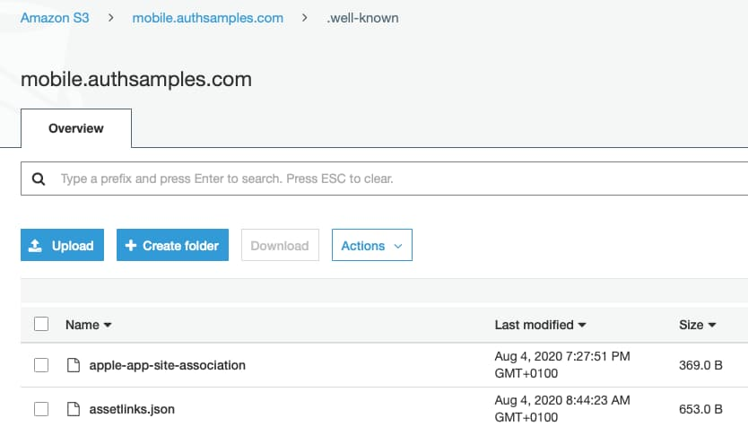
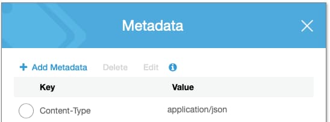

# iOS Code Sample – Infrastructure

Previously we described <a href='how-to-run-the-ios-code-sample.mdx'>How to Run the iOS Code Sample</a>, and next we will focus further on the infrastructure used by our OAuth solution.

### AWS CloudFront Domains

Our iOS sample uses 2 online domains, which we configured previously as part of our <a href='cloud-domain-setup.mdx'>Cloud Domain Setup</a>:

| Domain | Usage |
| ------ | ----- |
| mobile.authsamples.com | The domain name for mobile deep linking, which points to a Cloud location that hosts deep linking assets |
| www.authsamples.com | We use the web domain for ad-hoc hosting of HTML files, including intermediate post-login and post-logout web pages |

### Intermediate Web Page Hosting

Our web pages are first uploaded to an AWS S3 bucket:


They are then included in one of this blog’s <a href='cdn-static-content-delivery.mdx'>CloudFront Distributions</a>, so that the pages are served over an HTTPS URL:


Pages are then available at these URLs:

- [https://www.authsamples.com/apps/finalmobileapp/postlogin.html](https://www.authsamples.com/apps/finalmobileapp/postlogin.html)
- [https://www.authsamples.com/apps/finalmobileapp/postlogout.html](https://www.authsamples.com/apps/finalmobileapp/postlogout.html)

### Deep Linking Assets File

To support deep linking needed for claimed HTTPS scheme logins to work, the project includes a *security/.well-known/apple-app-site-association* document that associates our app’s *Unique ID* with its *Hosting Domain*:

```json
{
    "applinks": {
        "apps": [],
        "details": [
            {
                "appID": "U3VTCHYEM7.com.authsamples.finalmobileapp",
                "paths": [ "/finalmobileapp/*" ]
            }
        ]
    }
}
```

The deep linking domains allowed by the app are configured as *Associated Domains* in a *finalmobileapp.entitlements* file:

```xml
<?xml version="1.0" encoding="UTF-8"?>
<!DOCTYPE plist PUBLIC "-//Apple//DTD PLIST 1.0//EN" "http://www.apple.com/DTDs/PropertyList-1.0.dtd">
<plist version="1.0">
<dict>
	<key>com.apple.developer.associated-domains</key>
	<array>
		<string>applinks:mobile.authsamples.com?mode=developer</string>
	</array>
</dict>
</plist>
```

I uploaded the assets file to run at the below HTTPS URL, in a similar manner to the intermediate pages. We use a second S3 bucket and CloudFront distribution for the root domain:

- [https://mobile.authsamples.com/.well-known/apple-app-site-association](https://mobile.authsamples.com/.well-known/apple-app-site-association)

The *mobile.authsamples.com* S3 bucket has a *.well-known* folder containing the assets files for both Android and iOS:



The Apple file needs to be configured to return a content type of *application/json*, which is configured under the S3 file’s properties:



### Deep Linking Online Verification

You can verify the configuration via the following test site:

- [https://branch.io/resources/aasa-validator](https://branch.io/resources/aasa-validator)

The details for our demo app can be provided to the site as follows:


The site then shows the following validated results:


### Deep Linking Registration Process

During installation of our app you can run the macOS *Console App* from *Finder / Applications / Utilities*. Select the simulator, ensure that tracing has started, and filter output on the *mobile.authsamples.com* domain name. A successful registration results in output like this:


Yet some developers may experience errors when running the app. A failed registration results in output like this:


### Fix Deep Linking Registration Failures

The quickest way to fix deep linking registration failures and get a working app is to switch to using private URI scheme based redirect URIs. Do so by updating the *mobile_config.json* file with the following settings:

```json
{
  "app": {
    "apiBaseUrl":             "https://api.authsamples.com/investments"
  },
  "oauth": {
    "authority":              "https://cognito-idp.eu-west-2.amazonaws.com/eu-west-2_CuhLeqiE9",
    "clientId":               "2vshs4gidsbpnjmsprhh607ege",
    "redirectUri":            "com.authsamples.finalmobileapp:/callback",
    "postLogoutRedirectUri":  "com.authsamples.finalmobileapp:/logoutcallback",
    "scope":                  "openid profile https://api.authsamples.com/investments",
    "userInfoEndpoint":       "https://login.authsamples.com/oauth2/userInfo",
    "customLogoutEndpoint":   "https://login.authsamples.com/logout",
    "deepLinkBaseUrl":        "https://mobile.authsamples.com"
  }
}
```

Yet this is not really how my code sample is meant to be run. An alternative option is to host your own deep linking assets file on a development web server, by running the following script, providing your Apple Team ID:

```bash
export APPLE_TEAM_ID='U3VTCHYEM7'
./DevelopmentWebServer/run.sh
```

You can study the script to see how it creates an SSL certificate and key, registers the root certificate authority as trusted on the simulator, then runs an HTTPS web server, to serve a deep linking assets file that uses your Apple Team ID. Next, update the */etc/hosts* file on your MacBook, to alias the deep linking domain to localhost:

```markdown
127.0.0.1 mobile.authsamples.com
```

Finally, configure Xcode to use the same Apple Team ID to sign the app. Then re-run the app on the simulator:


Since we are using [mode=developer](https://developer.apple.com/documentation/bundleresources/entitlements/com_apple_developer_associated-domains) the app should now run successfully. This technique will only work for simulators, and for more complete testing you would instead need to provide your own iOS infrastructure.

### HTTP Debugging and Claimed HTTPS Schemes

During development, I proceed as follows when I want to view OAuth or API messages for the iOS app. The mobile OS re-registers universal links every time the app is redeployed from Xcode:

- Deploy the app from Xcode without running an HTTP proxy on the host MacBook
- Deep linking registration will then succeed
- Next start the HTTP proxy on the host MacBook
- Messages from the app will then be captured successfully

### Where Are We?

We have explained some infrastructure plumbing needed by our iOS code sample. Using claimed HTTPS schemes for production mobile apps requires verification between the mobile device and HTTPS endpoints.

### Next

- Next we will describe some <a href='ios-code-sample-coding-key-points.mdx'>iOS Code Details</a>
- For a list of all blog posts see the <a href='index.mdx'>Index Page</a>
