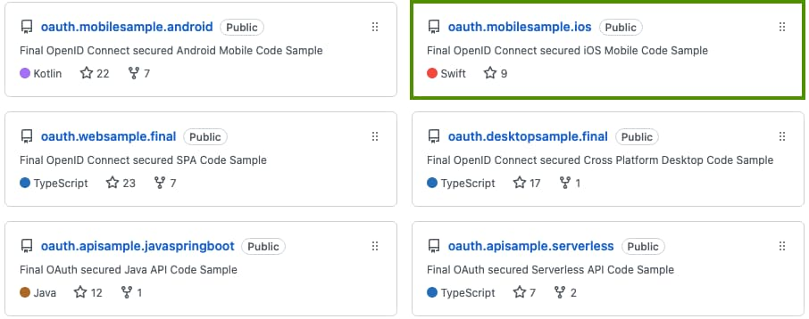
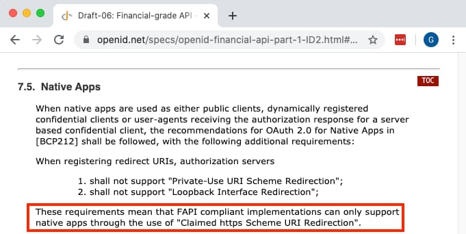
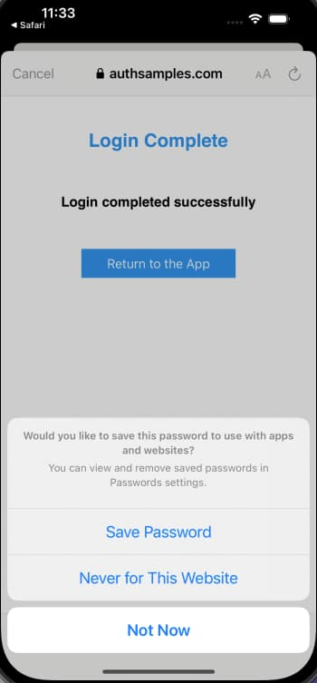
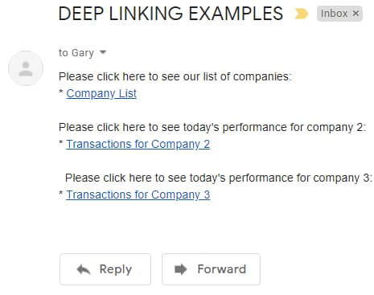

# iOS Code Sample – Overview

Previously we covered <a href='android-coding-key-points.mdx'>Android Code Details</a> for our initial mobile app. Next we will provide the same OAuth secured app for iOS, using Xcode and SwiftUI, with AppAuth libraries and a modern coding style. The app connects to <a href='cloud-hosting.mdx'>HTTPS endpoints hosted in AWS</a>, so that you only need to run the mobile app's code to get a fully integrated solution.

### Features

The following table summarises the main features of the code sample, some of which are tricky to implement:

| Feature | Description |
| ------- | ----------- |
| AppAuth Integration | We will implement the essential OpenID Connect behaviour by integrating the standard libraries |
| Claimed HTTPS Schemes | The login result is returned to the app over HTTPS URLs, which is the most secure option according to security guidance |
| Secure Token Storage | Tokens are stored securely on the device after login, so that users don’t need to authenticate on every app restart |
| Deep Linking | The app also supports HTTPS Universal Links, so that users can bookmark locations within the app |

### Code Download

The code for the mobile app can be downloaded from [here](https://github.com/gary-archer/oauth.mobilesample.ios), and we will cover full details of how to run it in the next post:



### Basic Mobile User Interface

The Mobile UI will provide the same <a href='api-journey-client-side.mdx'>API Client Journey</a> as for earlier Web UIs, with a list view as the home page:

<div className='smallimage'>
    
</div>

There will also be a details view, which exists primarily  to demonstrate navigation and deep linking:

<div className='smallimage'>
    
</div>

### Single Page iOS Application

Our mobile UI will have identical functionality to the final React SPA, where the main section of the view is swapped out as the user navigates. This is more efficient than replacing entire screens, and makes the app feel faster for users.

### Modern UI Technology

Our iOS App will be coded entirely in [Swift and SwiftUI](https://developer.apple.com/videos/play/wwdc2020/10041), for the cleanest syntax in areas such as navigation, data binding and async handling.


### Security Recommendations

There are risks with mobile apps that a malicious third party could install an app that uses our app’s *Client ID* and *Redirect URI*, so we will follow high security recommendations, to use *Claimed HTTP Schemes*:

- [Financial Grade APIs / Native Apps](https://openid.net/specs/openid-financial-api-part-1-ID2.html#native-apps)



This prevents a fake app from receiving a login result, since the attacker would not be able to make deep links work for their app.

### Logins via the System Browser

AppAuth user logins will be via an [ASWebAuthenticationSession](https://dev.to/robotsquidward/quick-guide-to-aswebauthenticationsession-api-changes-in-ios-13-4m8i) window, which first presents the below system window to inform the user which app and login domain are being signed into:

<div className='smallimage'>
    
</div>

The user is then presented with the main login window, which is external to the app and acts as a secure sandbox, so that the app itself never has access to the user’s password:

<div className='smallimage'>
    
</div>

Use of the system browser provides some useful login usability options. The result is that cookies and passwords can often be shared between apps, to improve usability:

- Single sign on can work across multiple apps
- Passwords can be remembered and re-used for multiple apps

### Logins via iOS Web Views are Problematic

The following problems exist if you perform login redirects on a normal mobile web view. This is because the result is a *Browser Session Private to the App*:

| Problem Area | Description |
| ------------ | ----------- |
| Password Autofill | This feature will generally work less reliably in a web view, resulting in a poor login experience |
| Single Sign On | Cookies will not be shared with other apps and are likely to be dropped more aggressively within your own app |
| Could be Blocked | Google is an example of an identity provider that [blocks logins on a mobile web view](https://auth0.com/blog/google-blocks-oauth-requests-from-embedded-browsers) |

### Our Sample’s Login Usability Features

Using an ASWebAuthenticationSession window will provide the best chance of password autofill working, so that the user does not need to continually remember their password. After login we will store the *OAuth Refresh Token* on the device, using secure operating system storage private to the app. This ensures that, on subsequent application restarts, the first thing the user sees is the app.

### Secured Device Prerequisite

We need to ensure that the above usability features cannot be abused if the mobile device is stolen, so we require the device to have a *Secured Lock Screen*, and the user will see the below screen if this is not the case:

<div className='smallimage'>
    
</div>

The user must then set a *passcode* or *fingerprint* in order to resume using the app. These security features are not available on iOS simulators.


### Password Autofill Details

To use password autofill it must first be enabled in system settings on the iOS device. On the initial login the user will need to type in their credentials. By default the ASWebAuthenticationSession window will immediately disappear after login and the user will be unable to use the system’s *Save Password* feature. We will resolve this problem by presenting a *Post Login Page* after authentication but before the browser window is closed.

<div className='smallimage'>
    
</div>

### Reliable Login Cancellation

Logins can be cancelled by closing the system browser instead of successfully completing a login. We will handle this reliably and allow the user to retry:

<div className='smallimage'>
    
</div>

### Reliable Session Management

The demo app also has buttons to enable *Rehearsal of Expiry Events*, in order to verify that these do not cause any user problems:

<div className='smallimage'>
    
</div>

### Navigation with Expired Tokens

The session buttons help to ensure that navigation is reliable within the app as we swap out the main view. This may include *authenticating the user* or *refreshing an access token* before presenting the view.

### Logout

The sample also implements <a href='logout.mdx'>Open ID Connect RP-Initiated Logout</a>, to remove the authorization server’s session cookie. In a real-world app a logout capability enables you to test data access for different users with different settings or permissions. One annoyance is that the ASWebAuthenticationSession indicates *Sign In* during the logout redirect, rather then *Sign Out*:

<div className='smallimage'>
    
</div>

The usual way to resolve it is to avoid the logout redirect and instead simply drop tokens. Then use the *prompt=login* OpenID Connect request parameter on the next login. At the time of writing though, AWS Cognito does not yet support the *prompt* parameter.

### Deep Linking

The app also supports navigation via deep linking, where a user can receive *HTTPS Universal Links* in an email, to activate the mobile app at specific locations:



A deep link could point to an unauthorized or invalid resource, as demonstrated by the last two examples below:

```markdown
// A deep link to the home page
https://mobile.authsamples.com/finalmobileapp/deeplink

// A deep link to the transactions for company 2
https://mobile.authsamples.com/finalmobileapp/deeplink/companies/2

// A deep link to an unauthorized resource
https://mobile.authsamples.com/finalmobileapp/deeplink/companies/3

// A deep link to an invalid resource
https://mobile.authsamples.com/finalmobileapp/deeplink/companies/abc
```

In both cases our API will deny access gracefully by returning known error codes to the mobile app, which will then navigate back to the home page, so that the user is not impacted.

### Problems Receiving Redirect Responses

A common issue when first using AppAuth libraries is that the system browser may not return the deep link containing the authorization response to the app, and fall back to processing it as a web request in the browser, typically with a 404 not found error.

<div className='smallimage'>
    
</div>

This is due to a browser security requirement that there must be a [user gesture](https://forums.developer.apple.com/forums/thread/26760) before a deep link can be processed. Invoking a deep link immediately after a redirect can be unreliable.

Therefore, when websites run on mobile devices, they often present the user with options like these when invoking the app. So when receiving the login response you may also need to present a continue button:

- Open the app
- Continue with web

### Types of OAuth Redirect

There are three scenarios where we will redirect the user on the ASWebAuthenticationSession window. Note that the second scenario can be reproduced in our code sample by clicking *Expire Refresh Token*, then clicking *Reload*.

| Redirect Type | Description |
| ------------- | ----------- |
| Login | The user is interactively prompted to login |
| Single Sign On | The user already has a valid session cookie and signs in automatically without a login screen |
| Logout | The user’s session cookie is removed, with no prompt |

In each case, there needs to be a screen before invoking the deep link. You may find using the OpenID Connect *prompt=login* parameter on every login redirect is reliable. In this blog I instead use a custom intermediate page, partly because AWS Cognito does not yet support the *prompt* parameter.

### This Blog’s Intermediate Web Pages

This blog uses the following custom *AWS Hosted Web Pages* that are returned to after login / logout redirects. A real company could present its own branded pages instead.

<div className='smallimage'>
    
</div>

<div className='smallimage'>
    
</div>

### Test Cases

ASWebAuthenticationSession based logins have usability benefits, but they also add complexity. Our code sample needs to ensure that, when the login window is top most, the following actions do not cause exceptions:

| Test Case | Description |
| --------- | ----------- |
| Change Orientation | The user switches between portrait and landscape |
| Reactivate App | The user switches to another app and then re-runs our app from the home screen via the app’s shortcut |
| Deep Link | The user selects a deep link message from an email |

### Where Are We?

We have described the desired functionality, and have described how to overcome some tricky areas. Since the app implements OpenID Connect in a standard way, it could be updated to support many other forms of user authentication, with zero code changes.

### Next

- Next we will cover <a href='how-to-run-the-ios-code-sample.mdx'>How to Run the iOS Code Sample</a>
- For a list of all blog posts see the <a href='index.mdx'>Index Page</a>
