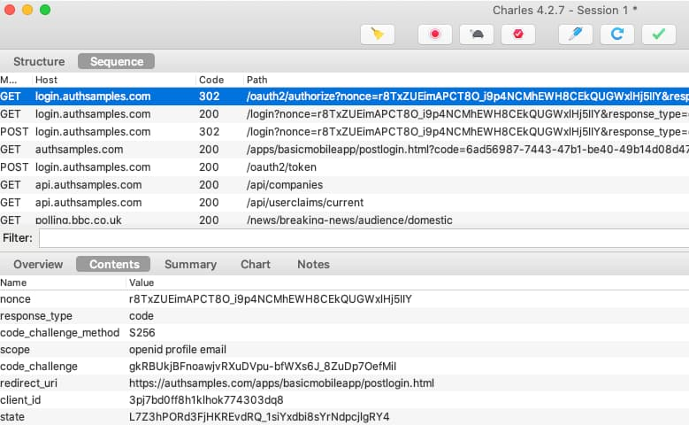

# iOS HTTPS Debugging Setup

Previously we put in place an initial iOS Setup and ran the <a href='ios-setup.mdx'>AppAuth iOS Code Sample</a>. Next I will explain a way to view HTTPS mobile traffic from iOS simulators and devices on a development computer.

### Run the HTTP Proxy on the Host

First configure and run the HTTP proxy on the host computer, as described in our earlier write up on <a href='http-debugging-setup.mdx'>HTTPS Debugging</a>. We also need to instruct the proxy to decrypt SSL traffic, as covered for other environments in the blog post on <a href='developer-ssl-setup.mdx'>SSL Trust Configuration</a>:

### Determine the Computer’s IP Address

You can find the computer's network IP v4 address in various ways, such as by running the following command:

```markdown
ifconfig | grep inet
```

### Configure iOS Simulator Proxy Settings

With iOS Simulators there are quite a few places where we cannot emulate a real device. One of these is network settings, where the simulator instead always uses the local computer’s network. An HTTP proxy running on the local computer automatically comes into effect for the app on the simulator, as long as the HTTP proxy is started before the simulator.

### Configure iOS WiFi Proxy Settings

For a real iOS device we need to first click the specific network under *Settings / Wi-Fi*. Next select the *Configure Proxy* option, then select *Manual* and enter details similar to the below screenshot:


### iOS Device Cellular Proxy Settings

If you need to capture cellular traffic you need to first select *Settings / Mobile Data / Mobile Data Options / Mobile Network*. Then add an *Access Point Name* with the same proxy host and port details.

### Understand Initial SSL Errors

If we now run the system browser or a mobile app on the iOS device, any SSL requests will result in trust errors:

<div className='smallimage'>
    
</div>

This is because the HTTP proxy is intercepting SSL requests at runtime and replacing the root certificate authority. To fix this we need to configure simulators and devices to trust the HTTP Proxy’s root certificate.

<div className='smallimage'>
    
</div>

### Deploy the HTTP Proxy Root Certificate

To resolve the trust error you must get the certificate's root certificate authority file to the simulator or device. This can be done in various ways, such as by emailing the file. For the MITM proxy root CA you can just browse to a URL of *http://mitm.it* from the device or simulator.

Yet it is useful to have a general process that will work for any root certificate. First, ensure that the certificate is in the *.pem* format. You can then make the CA file available for download by placing the resulting certificate file in a folder and then running an HTTP server that exposes its files. For example, the following command uses NGINX to share a host folder at *http://localhost*, and allows files to be browsed using the NGINX *autoindex* feature:

```bash
docker run -it --rm -p 80:80 -v ./fileshare:/var/lib/nginx/html:ro dceoy/nginx-autoindex
```

From a simulator or device you can open Safari and type the IP address of the host. Click a certificate file and, when prompted, allow the download of a configuration profile.

<div className='smallimage'>
    
</div>

### Configure iOS SSL Trust

Under *Settings / General / VPN & Device Management* there will now be a *Profile* option, and when opened you will see the root certificate:

<div className='smallimage'>
    
</div>

Select the *Install* option and follow the prompts. Finally switch to *Settings / General / About / Certificate Trust Settings* and activate the certificate:

<div className='smallimage'>
    
</div>

### Understand Domain Name Service Lookup

During mobile development it can be useful to also run a local API. To support this with a real-world domain name I add a local DNS entry on my local computer:

```markdown
127.0.0.1 api.authsamples-dev.com
```

On iOS the DNS settings from the host computer are automatically used by simulators, so domain name resolution succeeds, whether or not an HTTP proxy is running.

### View OAuth and API HTTPS Traffic

On all simulators and devices we can now view OAuth and API HTTPS messages such as those produced by the AppAuth library:



### Where Are We?

We have now completed our iOS HTTP debugging setup, and will now move on to describe this blog’s fully functional OAuth mobile samples.

### Next

- Next we will start describing our <a href='android-code-sample-overview.mdx'>Secured Android App’s Behaviour</a>
- For a list of all blog posts see the <a href='index.mdx'>Index Page</a>
