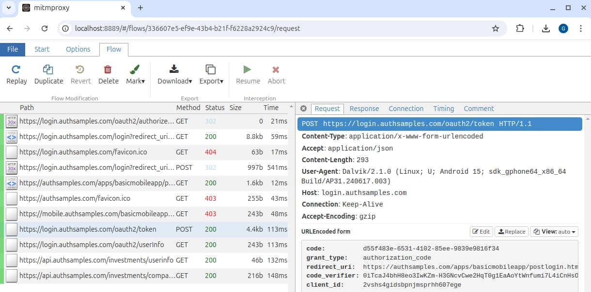

# iOS HTTPS Debugging Setup

Previously I ran an initial iOS Setup using the <a href='ios-setup.mdx'>AppAuth iOS Code Sample</a>. Next I explain a way to view outgoing HTTPS mobile traffic from iOS simulators and devices on a development computer, to provide a productive troubleshooting setup.

### Run an HTTP Proxy on the Host

First, I configure and run an HTTP proxy on the host computer, as the <a href='http-debugging-setup.mdx'>HTTPS Debugging</a> post explains. You must also instruct the proxy to decrypt SSL traffic. I explained how to do so for most environments in the <a href='developer-ssl-setup.mdx'>SSL Trust Configuration</a> post.

### Determine the Computer's IP Address

Connected simulators and devices share a network with the host computer, like the built-in simulator network or a WiFi network. The following commands can provide the host computer's IP v4 address.

```markdown
ifconfig
ip addr show
```

### Configure iOS Simulator Proxy Settings

iOS simulators do not usually have explicit proxy settings. Instead, an HTTP proxy running on the local computer automatically comes into effect for the app on the simulator, as long as you run the HTTP proxy before starting the simulator.

### Configure iOS WiFi Proxy Settings

For a real iOS device, locate the network under *Settings / Wi-Fi*. Next, select the *Configure Proxy* option and choose *Manual*, then enter the host computer's IP address and the proxy port number:


### iOS Cellular Proxy Settings

If you need to capture cellular traffic on an iOS device you instead need to configure the HTTP proxy under *Settings / Mobile Data / Mobile Data Options / Mobile Network*. Then add an *Access Point Name* with the same proxy host and port details.

### Understand Initial SSL Errors

If you now run the system browser or a mobile app on the iOS device, SSL requests will result in trust errors:

<div className='smallimage'>
    
</div>

This is because the HTTP proxy intercepts SSL requests at runtime and replaces the root certificate authority. To fix this, configure simulators and devices to trust the HTTP Proxy's root certificate.

<div className='smallimage'>
    
</div>

### Get the HTTP Proxy Root Certificate

You must deploy the certificate's root certificate authority file to the simulator or device. Most certificates, such as those that I generate for this blog using OpenSSL, use the *PEM* format that iOS requires, which consists of base64 encoded text:

```markdown
-----BEGIN CERTIFICATE-----
MIIBvjCCAWWgAwIBAgIUYjMlZDVJQ4UYrxfMzik24mJ6+JYwCgYIKoZIzj0EAwIw
NTEzMDEGA1UEAwwqRGV2ZWxvcG1lbnQgQ0EgZm9yIGF1dGhzYW1wbGVzLWs4cy1k
...
-----END CERTIFICATE-----
```

### Deploy the HTTP Proxy Root Certificate

You can deploy the PEM certificate to a simulator or device in various ways:

- Drag or copy the certificate into a simulator.
- Email it to the device or simulator.
- Download it over HTTP.

For a simulator, you can use the following format of command to copy the root certificate file to the device:

```bash
FILE_PATH="$(pwd)/mitmproxy.ca.crt"
xcrun simctl openurl booted "file://$FILE_PATH"
```

For the [MITM proxy root CA](https://docs.mitmproxy.org/stable/concepts-certificates/) you can just browse to a URL of *http://mitm.it* from the device or simulator and select the iOS option:


Alternatively, use an HTTP server that exposes a folder on the host computer that contains the certificate file. The following command uses NGINX to share a host folder at *http://localhost* and use the NGINX *autoindex* feature to allow file browsing:

```bash
docker run -it --rm -p 80:80 -v ./fileshare:/var/lib/nginx/html:ro dceoy/nginx-autoindex
```

From a connected simulator or device, open Safari and type the IP address of the host. Click a certificate file and save it to the device:

<div className='smallimage'>
    
</div>

### Configure iOS SSL Trust

Next, on the simulator or device, navigate to *Settings / General / VPN & Device Management* to find a *Profile* option. Open it and you will see the root certificate:

<div className='smallimage'>
    
</div>

Select the *Install* option and follow the prompts. Finally switch to *Settings / General / About / Certificate Trust Settings* and activate the certificate:

<div className='smallimage'>
    
</div>

### Understand Domain Name Service Lookup

During mobile development it can be useful to also run a local API. To support this with a real-world domain name I add a local DNS entry to my local computer's */etc/hosts* file:

```markdown
127.0.0.1 api.authsamples-dev.com
```

By default, simulators use DNS settings from the host computer and can resolve the domain name, but connected devices cannot. If you use an HTTP proxy however, domain name resolution for *api.authsamples-dev.com* runs on the host computer and succeeds for both simulators and connected devices.

### View OAuth and API HTTPS Traffic

On all simulators and devices you will now be able to run OAuth and API requests with your preferred domain names, and view all HTTPS message details. This includes messages not generated by your code, such as those that the AppAuth library produces:



### Where Are We?

I explained an iOS HTTP debugging setup, to enable visualization of OAuth and API requests, which is an essential behaviour for productive OAuth client development.

### Next

- Next I explain this blog's <a href='android-code-sample-overview.mdx'>Android Code Sample Behaviour</a>.
- For a list of all blog posts see the <a href='index.mdx'>Index Page</a>.
