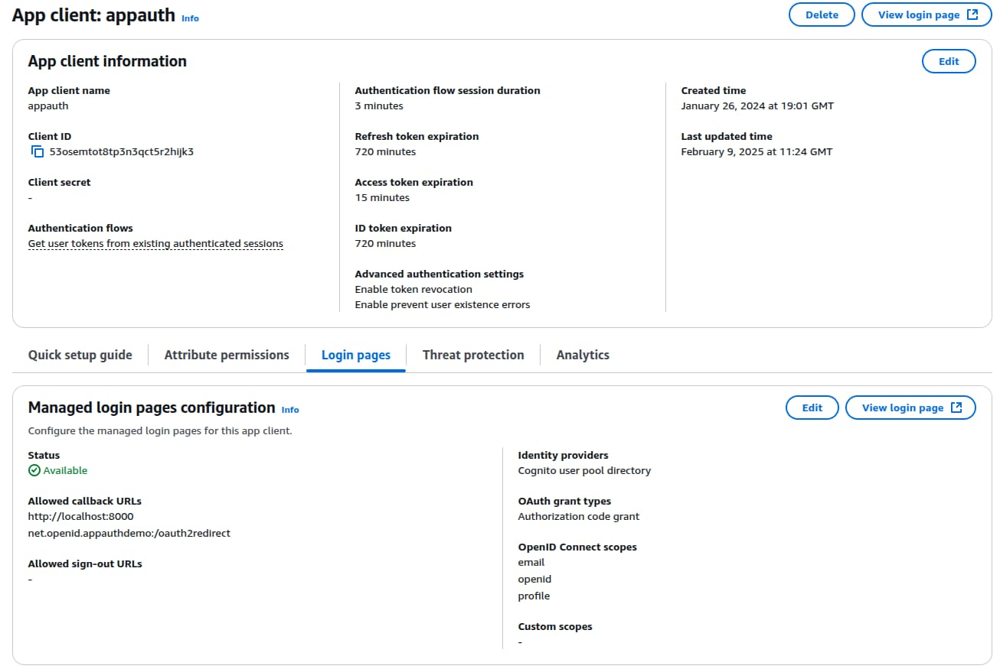

# iOS Setup and AppAuth Code Sample

Previously I explained an <a href='android-https-debugging.mdx'>Android HTTP Debugging Setup</a>. Next I show how to get a basic iOS OAuth setup working, by running the AppAuth iOS code sample.

### Step 1: Apple Setup

I first signed up for a *Personal Apple Account* so that I could get development tools and run mobile apps on real iOS devices:


I then downloaded the latest [Xcode](https://developer.apple.com/xcode/) development tool, with support for the most recent iOS operating systems and the latest version of the Swift programming language.

### Step 2: Get the AppAuth iOS Sample

Download the code sample via the following command:

```bash
git clone https://github.com/openid/AppAuth-iOS
```

From Xcode's home screen, select *File / Open* and navigate to the *AppAuth-iOS/Examples/Example-iOS_Swift-Carthage* folder:


### Step 3: Add the AppAuth Dependency

By default the code sample uses the Carthage dependency tool, which I prefer to avoid. Therefore, I start with some cleanup, by removing the following items:

- The *Example_Extension* folder.
- The *AppAuth* entries under *Frameworks*.
- The *Carthage* section under *Build Phases*.

The Xcode project should then contain the following content:


I then add AppAuth using the Swift dependency manager, from the above screen, by providing the URL of the AppAuth iOS GitHub repository. When prompted, I add the *AppAuth* and *AppAuthCore* packages to the code sample's target:


### Step 4: Understand Mobile OAuth Client Settings

In this post I point the AppAuth code sample to a client that I registered in my personal instance of AWS Cognito, which you can use as this blog's default authorization server:



### Step 5: Update OAuth Client Settings

You can update the app to the following OAuth client settings:

| Field | Value |
| ----- | ----- |
| Client ID | 53osemtot8tp3n3qct5r2hijk3 |
| Redirect URI | net.openid.appauthdemo:/oauth2redirect |
| Scope | openid email profile |
| Issuer URI | *https://cognito-idp.eu-west-2.amazonaws.com/eu-west-2_CuhLeqiE9* |

To do so, make the edits from the [Example README](https://github.com/openid/AppAuth-iOS/tree/master/Examples/Example-iOS_Swift-Carthage), to change the below settings in the *AppAuthExampleViewController.swift* module:

```swift
let kIssuer: String = "https://cognito-idp.eu-west-2.amazonaws.com/eu-west-2_CuhLeqiE9";
let kClientID: String? = "53osemtot8tp3n3qct5r2hijk3";
let kRedirectURI: String = "net.openid.appauthdemo:/oauth2redirect";
```

You must also register the *Redirect URI Scheme* in the mobile app's *info.plist* file:


### Step 6: Run the App on a Simulator

Use Xcode's build and run option in the top left of the IDE and select an up to date simulator version:


You then see the following view. Click *Auto* to run an OpenID Connect authorization flow. Alternatively, use the *Manual* option, where step 1(A) is the front channel redirect, and step 1(B) is the back channel operation to swap the authorization code for tokens:

<div className='smallimage'>
    
</div>

During the code flow an [ASWebAuthenticationSession](https://developer.apple.com/documentation/authenticationservices/aswebauthenticationsession) window informs the user of the domain requesting authentication:

<div className='smallimage'>
    
</div>

You can sign in using this blog's test user credential:

- User: *guestuser@example.com*
- Password: *GuestPassword1*

During login the system browser overlays the mobile view and the app itself cannot access the user's credentials:

<div className='smallimage'>
    
</div>

After login, control returns to the mobile app, which has an ID token, an access token and a refresh token. You can then test OAuth lifecycle operations, including access token refresh:

<div className='smallimage'>
    
</div>

### Where Are We?

I showed how to run an OAuth-secured mobile app from Xcode. Shortly I will explain this blog's <a href='ios-code-sample-overview.mdx'>iOS Code Sample</a>, which demonstrates much more complete behaviour.

### Next

- Next I explain <a href='ios-https-debugging.mdx'>iOS HTTPS Tracing of OAuth Messages</a>.
- For a list of all blog posts see the <a href='index.mdx'>Index Page</a>.
