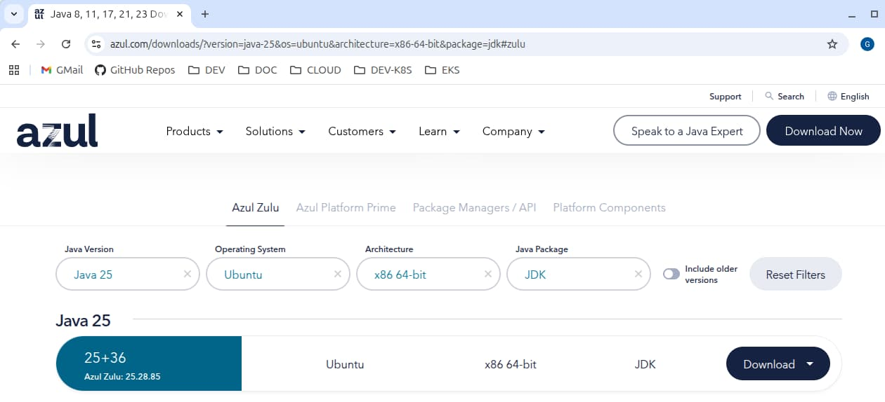
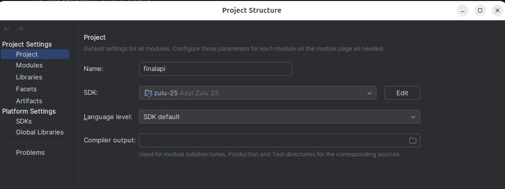

# Java API – Overview

Previously I explained the <a href='final-nodeapi-coding-key-points.mdx'>Final .NET API Code Details</a>, including some behaviours from this blog's <a href='api-journey-server-side.mdx'>API Journey - Server Side</a> blog post. Next I provide an equivalent API in Java and Spring.

### Final API Code Sample Overview

This blog's API has a couple of simple endpoints that return mock data for a money-based theme of investments. The API aims to be visual and serves this blog’s apps, such as the <a href='how-to-run-the-react-js-spa.mdx'>Final SPA</a> below. Running both together ensures that the API is client-focused and enables you to focus on API logs that the client generates.


### API URLs

During development the API runs as a standalone component. You can use either JUnit tests or a load test as the API client. These tests get user-level access tokens to call the API and verify some OAuth security use cases. The API accepts mock access tokens when you point it to a mock authorization server:

| Component | Base URL |
| --------- | -------- |
| API | *https://api.authsamples-dev.com:446* |
| Mock Authorization Server | *https://login.authsamples-dev.com:447* |

### Prerequisite 1: Domain Setup

First update your computer's hosts file to create domains for local development. Include the web domain and local backend-for-frontend domain if you run the SPA and API together:

```markdown
127.0.0.1 api.authsamples-dev.com login.authsamples-dev.com www.authsamples-dev.com bfflocal.authsamples-dev.com
```

### Prerequisite 2: Install Java

I use the latest long term support version of Java that Spring Boot supports, which is [Java 21](https://www.azul.com/downloads/?version=java-21-lts) at the time of writing. I use the open source Azul Java SDK and create a *JAVA_HOME* environment variable at a location such as */usr/lib/jvm/zulu-21-amd64*.



### Prerequisite 3: Optionally Install a Java IDE

I use the free community edition of [Intellj Idea](https://www.jetbrains.com/idea/download) for Java based development. The project structure must be uploaded to use the downloaded JDK. Also install the [Lombok plugin](https://plugins.jetbrains.com/plugin/6317-lombok) and optionally the [Checkstyle plugin](https://plugins.jetbrains.com/plugin/1065-checkstyle-idea).



When I load the project I wait for the gradle sync to complete. Then I run the *FinalApiApplication.java* source file to start listening for requests over HTTPS.

### Prerequisite 4: Optionally Install Node.js

If you want to run the SPA as well as the API, install [Node.js](https://nodejs.org/en/download) to build the SPA’s JavaScript bundles.

### Prerequisite 5: Install Docker

To run API tests, or the full SPA and API solution, you use Docker utility components, so install a local engine such as [Docker Desktop](https:/www/.docker.com/products/docker-desktop).

### Step 1: Build and Run the API

Close the GitHub repository with the following command:

```bash
git clone https://github.com/gary-archer/oauth.apisample.javaspringboot
```

Run the following command, which downloads some OpenSSL development certificates, then runs the API on HTTPS using port 446:

```bash
./start.sh
```


### Step 2: Configure SSL Trust

The API runs over SSL and when you run it for the first time it downloads some development certificates. To prevent SSL trust problems from tests or the browser you may need to <a href='developer-ssl-setup.mdx'>Configure Java and Browser Trust</a> for the root certificate at the following location. 

```markdown
certs/authsamples-dev.ca.crt
```

Use the following command to trust the root certificate that issues the API's SSL certificate:

```bash
sudo "$JAVA_HOME/bin/keytool" -import -alias authsamples.ca -cacerts -file ./certs/authsamples-dev.ca.crt -storepass changeit -noprompt
```

You can revoke trust for the root certificate later if required, using the following command:

```bash
sudo "$JAVA_HOME/bin/keytool" -delete -alias authsamples.ca -cacerts -storepass changeit -noprompt
```

### Step 3: Run Integration Tests

To run JUnit tests, the API must be pointed to a mock authorization server, so must run with a test configuration. Stop the API if it is running, then re-run it via this command:

```bash
./testsetup.sh
```

Next run tests with the following command:

```bash
./gradlew test
```

This spins up a JWKS URI with an HTTPS endpoint that the Wiremock utility provides. A number of tests then make OAuth-secured API requests. These tests focus on the API’s main security behaviours:


### Step 4: Run a Basic Load Test

While the API runs with a test configuration you can also run a basic load test that sends parallel API requests. This helps to ensure that the API code has no concurrency bugs:

```bash
./gradlew loadtest
```

The test fires batches of 5 concurrent requests at a time and also intentionally rehearses certain types of error. The expected result is 3 errors from a total of 100 requests:


The <a href='api-automated-tests.mdx'>API Automated Tests</a> post explains how tests get user level tokens without running a full authorization code flow.

### Step 5: Run the SPA Client

You can run any of this blog's final frontend clients against the API:

- <a href='final-spa-overview.mdx'>Final SPA</a>
- <a href='final-desktop-sample-overview.mdx'>Final Desktop App</a>
- <a href='android-code-sample-overview.mdx'>Final Android App</a>
- <a href='ios-code-sample-overview.mdx'>Final iOS App</a>

To run the final SPA as an API client, start in the API's folder, then run the SPA from a parallel folder:

```bash
cd ..
git clone https://github.com/gary-archer/oauth.websample.final
cd oauth.websample.final
export LOCALAPI='true'
./build.sh
./run.sh
```

The *run.sh* script invokes the default browser at *https://www.authsamples-dev.com/spa* and you can sign in using this blog’s test credential:

- User: *guestuser@example.com*
- Password: *GuestPassword1*

### Main Feature 1: Extensible Authorization

The API implements its security according to these two blog posts, using a JOSE library and some custom claims handling:

- <a href='jwt-access-token-validation.mdx'>JWT Access Token Validation</a>
- <a href='api-authorization-design.mdx'>API Authorization Design</a>

The overall behaviour manages OAuth security correctly while setting up the API’s business logic with the authorization values it needs. These values may originate from multiple data sources and may not always be issued to tokens:

```java
@Service
@Scope(value = ConfigurableBeanFactory.SCOPE_PROTOTYPE)
public class CompanyService {

    private final CompanyRepository repository;
    private final ClaimsPrincipalHolder claimsHolder;

    public CompanyService(final CompanyRepository repository, final ClaimsPrincipalHolder claimsHolder) {
        this.repository = repository;
        this.claimsHolder = claimsHolder;
    }
}
```

### Main Feature 2: Production Supportability

The other main objective of the API code sample will be JSON logging of API requests, to include useful technical support fields. Logging console output looks like this on a development computer:

```json
{
  "id" : "b8ae0e13-0752-4ce1-ac3c-692c26528855",
  "utcTime" : "2022-12-10T13:30:42.032527148Z",
  "apiName" : "FinalApi",
  "operationName" : "getCompanyTransactions",
  "hostName" : "WORK",
  "method" : "GET",
  "path" : "/investments/companies/4/transactions",
  "resourceId" : "4",
  "clientName" : "FinalSPA",
  "userId" : "a6b404b1-98af-41a2-8e7f-e4061dc0bf86",
  "statusCode" : 200,
  "millisecondsTaken" : 288,
  "correlationId" : "f17ac322-661f-1b26-aba1-8ccc3f55b62c",
  "sessionId" : "004d32bc-9755-b50e-6315-5be09f277ebe"
}
```

Meanwhile, the API also writes text files to its *logs* folder in a bare JSON format, ready for log shipping:


Optionally, you can follow the <a href='log-aggregation-setup.mdx'>Log Aggregation Setup</a> to run a Docker-based deployment of the Elastic Stack. You can then run <a href='api-technical-support-analysis.mdx'>Technical Support Queries</a> against the API's logs. This would be useful in a production system, to make sense of large volumes of API requests.

### Cloud Native Deployment

The API is cloud-native and includes some Docker and Kubernetes deployment resources. A basic deployment can be run with these commands:

```bash
./deployment/docker-local/build.sh
./deployment/docker-local/deploy.sh
./deployment/docker-local/teardown.sh
```

### Where Are We?

I summarised the key productivity behaviours of this blog's final APIs. This starts with modern code setup and a clean separation of concerns that sets up business logic for future growth. Next, APIs have a unified security model that works the same for any type of API client. Finally, APIs have an early focus on reliability.

### Next

- I explain this blog's <a href='spring-boot-api-oauth-integration.mdx'>Java API OAuth Integration</a>.
- For a list of all blog posts see the <a href='index.mdx'>Index Page</a>.
